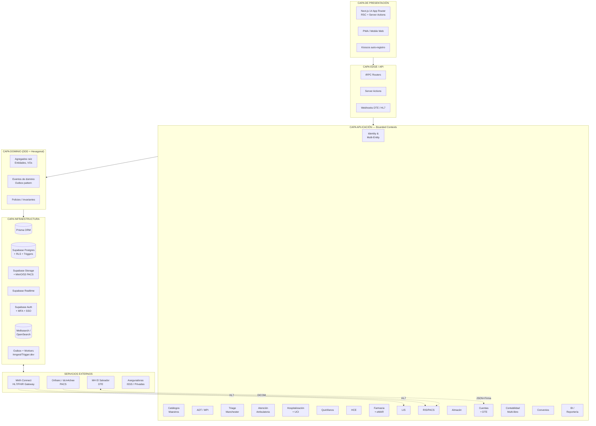
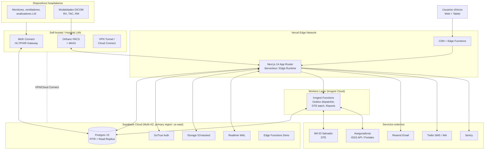
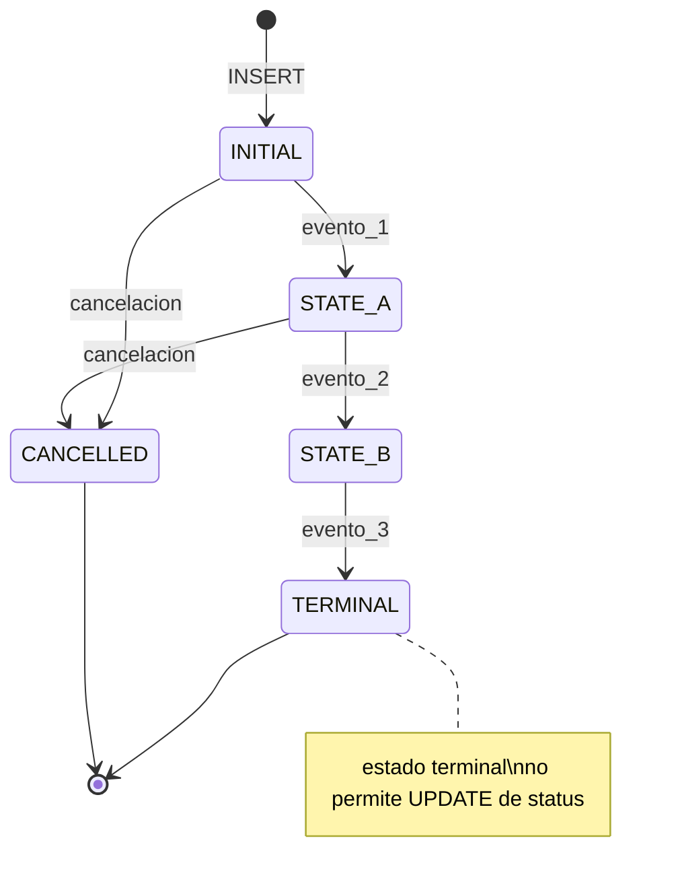
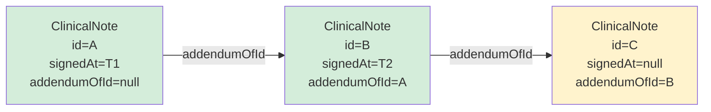

# 02 — Arquitectura de Software HIS Multipaís

**Proyecto:** HIS Multipaís — Inversiones Avante
**Autores:** @AS (Arquitecto de Software) + @AT (Arquitecto de Soluciones Cloud)
**Versión:** 1.0 — 2026-04-30
**Estado:** Blueprint técnico aprobado para Fase 0+1 del TDR
**Stack obligatorio:** Node.js + Next.js 14 (App Router, RSC, Server Actions), Prisma, Supabase (Postgres + Auth + Storage + Realtime + RLS), Tailwind + Shadcn/ui, tRPC, Zod, Lucide React. Modelado **4NF**.

> **Push-back declarado al @PO/@AE:** El stack obligatorio es excelente para el núcleo transaccional, pero **no soporta nativamente** DICOM/PACS, HL7v2/FHIR, bus de eventos empresarial, ni búsqueda full-text avanzada. Estas capacidades se resuelven con **servicios complementarios** detallados en §7. La decisión de usar Vercel como runtime web introduce restricciones de tiempo de ejecución (≤60s en serverless) que obligan a externalizar trabajos largos a workers dedicados.

---

## 1. Blueprint Técnico General

### 1.1 Vista lógica de capas y bounded contexts



### 1.2 Principios arquitectónicos

| # | Principio | Aplicación |
|---|-----------|-----------|
| 1 | **Monolito modular evolutivo** | Un único deploy Next.js, módulos aislados por carpetas y RLS; extracción a microservicios solo cuando un BC justifique escalado independiente. |
| 2 | **DDD táctico** | Agregados raíz por BC, eventos de dominio, repositorios. |
| 3 | **Hexagonal (puertos y adaptadores)** | Dominio puro (sin Prisma/Next); infraestructura inyectada. |
| 4 | **API-first interno** | tRPC end-to-end typesafe; Server Actions para mutaciones simples. |
| 5 | **Database-first multi-tenant** | RLS de Postgres como única fuente de verdad de aislamiento. |
| 6 | **Auditoría inmutable by design** | Triggers append-only; nada se borra (soft-delete + audit trail). |
| 7 | **Eventual consistency vía Outbox** | Sin bus pesado: tabla `domain_events` + worker que despacha. |

---

## 2. Estrategia Multi-Tenancy con RLS Supabase

### 2.1 Modelo elegido: **Tenant compartido + RLS por jerarquía**

Cada tabla transaccional incluye obligatoriamente:

```sql
country_id        uuid NOT NULL REFERENCES countries(id),
organization_id   uuid NOT NULL REFERENCES organizations(id),
establishment_id  uuid NOT NULL REFERENCES establishments(id),
-- (currency_id, exchange_rate_to_functional, audit fields)
```

Las políticas RLS se construyen sobre un JWT claim consolidado emitido por Supabase Auth:

```sql
-- Claim en JWT (custom_access_token_hook):
-- app_metadata.scopes = [
--   { country_id, organization_id, establishment_ids: [...], roles: [...] }
-- ]

CREATE POLICY tenant_read ON encounters
FOR SELECT TO authenticated
USING (
  organization_id = ANY(auth.organization_ids())
  AND establishment_id = ANY(auth.establishment_ids())
);

CREATE POLICY tenant_write ON encounters
FOR INSERT TO authenticated
WITH CHECK (
  organization_id = ANY(auth.organization_ids())
  AND has_role('admission_officer', establishment_id)
);
```

Funciones helper SQL (`auth.organization_ids()`, `auth.establishment_ids()`, `has_role()`) leen del JWT claim — evitan joins costosos en cada policy.

### 2.2 Comparativa: RLS compartido vs Schema-per-tenant vs DB-per-tenant

| Criterio | **RLS compartido (elegido)** | Schema-per-tenant | DB-per-tenant |
|----------|------------------------------|-------------------|---------------|
| Aislamiento | Lógico (políticas SQL) | Físico-lógico | Físico total |
| Coste op. | Bajo | Medio | Alto |
| Migraciones | Una sola | N por tenant | N por tenant |
| Consolidación holding | Trivial (queries cross-org con permisos) | Requiere FDW / vistas | Requiere ETL |
| Soporte Supabase | Nativo, optimizado | Limitado (Prisma multi-schema) | Requiere N proyectos |
| Riesgo "noisy neighbor" | Medio (mitigable con índices y particiones) | Bajo | Nulo |
| Cliente con exigencia de DB dedicada | No cubre — requiere instancia dedicada | No cubre | Cubre |
| **Veredicto MVP** | **Ganador** | Descartado | Reservado para clientes enterprise (Fase >7) |

**Mitigaciones del modelo elegido:**
- Particionamiento Postgres por `organization_id` en tablas calientes (encounters, observations, eMAR, audit_log).
- Índices compuestos `(organization_id, …)` en TODA tabla transaccional.
- Tests automáticos de RLS (`@QA`): suite que intenta cross-tenant access y debe fallar siempre.
- Función `set_tenant_context()` invocada al inicio de cada request para auditar.

---

## 3. Estructura del Monorepo

### 3.1 Decisión: **Turborepo + npm workspaces**

| Opción | Pros | Contras | Decisión |
|--------|------|---------|----------|
| **Turborepo + npm ws** | Nativo a Next/Vercel, caché remoto gratis, DX excelente, simple | Menos features que Nx | **ELEGIDO** |
| Nx | Generators potentes, plugin ecosystem | Curva de aprendizaje, mayor verbosidad, overkill para 1 app + libs | Descartado |
| npm workspaces solo | Cero dependencias extra | Sin caché de builds, sin task graph | Insuficiente |
| pnpm workspaces | Más rápido, mejor disk usage | Requiere alinear con Vercel build (soportado pero menos default) | Reservado si performance lo exige |

Justificación: el proyecto es **una sola app Next.js** con librerías compartidas y workers complementarios. Turborepo da pipeline (`build → lint → test → typecheck`) con caché incremental y se integra de forma nativa con Vercel Remote Cache.

### 3.2 Estructura de carpetas

```
his-multipais/
├── apps/
│   ├── web/                       # Next.js 14 App Router (la app principal)
│   ├── workers/                   # Workers (Inngest functions / cron jobs)
│   └── hl7-gateway/               # Express stub que envía/recibe a Mirth Connect
├── packages/
│   ├── domain/                    # Núcleo DDD puro (sin deps de framework)
│   │   ├── identity/              # Country, Organization, Establishment, User
│   │   ├── catalog/
│   │   ├── adt/                   # Patient (MPI), Encounter, Bed, Admission
│   │   ├── triage/
│   │   ├── ambulatory/
│   │   ├── inpatient/
│   │   ├── surgery/
│   │   ├── ehr/
│   │   ├── pharmacy/
│   │   ├── emar/
│   │   ├── lis/
│   │   ├── ris/
│   │   ├── inventory/
│   │   ├── billing/               # CuentaHospitalaria, DTE
│   │   ├── accounting/            # Multi-libro, asientos
│   │   ├── insurance/
│   │   └── shared/                # ValueObjects: Money, ExchangeRate, IDs, etc.
│   ├── application/               # Application services, casos de uso, ports
│   ├── infrastructure/            # Adaptadores Prisma, Supabase, MinIO, Mirth
│   ├── contracts/                 # Schemas Zod compartidos (API contracts)
│   ├── ui/                        # Shadcn components base + design system Avante
│   ├── trpc/                      # Routers tRPC + procedures
│   ├── auth/                      # Helpers JWT/session/RLS context
│   ├── audit/                     # Cliente de auditoría (write-only)
│   ├── config/                    # Configs compartidos (tsconfig, eslint, tw)
│   └── testing/                   # Fixtures, factories, RLS test helpers
├── prisma/
│   ├── schema.prisma              # Schema principal (multi-archivo desde Prisma 5)
│   ├── migrations/
│   └── seed/                      # Catálogos CIE-10, LOINC, ATC, plan SV
├── supabase/
│   ├── migrations/                # SQL policies RLS, triggers, functions
│   └── seed.sql
├── docs/                          # ESTE documento + ADRs
├── .github/workflows/
├── turbo.json
└── package.json
```

---

## 4. Estructura Next.js App Router

Route groups por bounded context para mantener la URL limpia y permitir layouts independientes:

```
apps/web/src/app/
├── (public)/
│   ├── login/
│   └── signup-pre-admission/        # Pre-admisión auto-servicio
├── (app)/                            # Layout autenticado con RLS context
│   ├── layout.tsx                    # Inicializa session + tenant context
│   ├── (admission)/
│   │   ├── mpi/[patientId]/
│   │   ├── adt/admit/
│   │   ├── adt/transfer/
│   │   ├── adt/discharge/
│   │   └── census/
│   ├── (emergency)/
│   │   ├── triage/                   # Manchester
│   │   ├── triage/[encounterId]/
│   │   └── codes/                    # Código rojo, sepsis, etc.
│   ├── (ambulatory)/
│   │   ├── schedule/
│   │   ├── consultation/[encounterId]/
│   │   └── procedures/
│   ├── (inpatient)/
│   │   ├── ward/
│   │   ├── icu/
│   │   ├── orders/
│   │   └── progress-notes/
│   ├── (surgery)/
│   │   ├── scheduling/
│   │   ├── checklist/                # OMS Cirugía Segura
│   │   └── intraop/
│   ├── (ehr)/
│   │   └── chart/[patientId]/
│   ├── (pharmacy)/
│   │   ├── cpoe/
│   │   ├── validation/
│   │   ├── dispensing/
│   │   └── controlled/
│   ├── (emar)/
│   │   └── administration/
│   ├── (lis)/
│   ├── (ris)/
│   ├── (inventory)/
│   ├── (billing)/
│   │   ├── accounts/
│   │   └── dte/
│   ├── (accounting)/
│   │   ├── journal/
│   │   ├── books/                    # Multi-libro
│   │   └── close/
│   ├── (insurance)/
│   ├── (bi)/
│   │   └── dashboards/
│   └── (admin)/
│       ├── catalogs/                 # Editor de catálogos sin código
│       ├── tenants/                  # Países, orgs, establecimientos
│       ├── security/                 # Roles, permisos, MFA, audit log
│       └── i18n/
├── api/
│   ├── trpc/[trpc]/route.ts
│   ├── webhooks/
│   │   ├── dte/route.ts              # MH El Salvador
│   │   ├── hl7/route.ts              # Mirth → HIS
│   │   └── insurer/[insurerId]/route.ts
│   └── health/route.ts
└── layout.tsx
```

**Convenciones:**
- **Server Components por defecto.** Client Components solo donde haya interactividad real (`'use client'` en hojas).
- **Server Actions** para mutaciones simples (form submit). Para flujos complejos con validación cruzada → tRPC mutations.
- **Loading/Error/NotFound files** en cada route group para mejorar UX clínica (alta carga cognitiva).
- **Streaming + Suspense** en dashboards y censo para feedback inmediato.

---

## 5. Patrón de Capas DDD + Hexagonal

### 5.1 Las cuatro capas

```
DOMAIN  ←  APPLICATION  ←  INTERFACES (tRPC / Server Actions / REST)
   ↑              ↑
   └──── INFRASTRUCTURE (Prisma, Supabase, Mirth, Orthanc, MH)
```

- **Domain:** TypeScript puro. Sin imports de Prisma, Next, React. Solo Zod (para VO validation).
- **Application:** Casos de uso. Recibe puertos por DI; orquesta agregados; emite eventos de dominio.
- **Infrastructure:** Implementa puertos. Repositorios Prisma, gateways HTTP, publicador de eventos.
- **Interfaces:** tRPC routers, Server Actions, webhooks, REST API pública.

### 5.2 Ejemplo: estructura del módulo `triage` (BC Triage Manchester)

```
packages/domain/triage/
├── src/
│   ├── aggregates/
│   │   └── triage-encounter.ts            # Agregado raíz
│   ├── entities/
│   │   ├── presenting-complaint.ts        # 52 flujogramas
│   │   ├── discriminator.ts
│   │   └── vital-signs.ts
│   ├── value-objects/
│   │   ├── triage-level.ts                # Rojo|Naranja|Amarillo|Verde|Azul
│   │   ├── max-wait-time.ts
│   │   └── glasgow-score.ts
│   ├── events/
│   │   ├── triage-assigned.event.ts
│   │   ├── retriage-required.event.ts
│   │   └── max-wait-exceeded.event.ts
│   ├── policies/
│   │   ├── auto-level-assignment.policy.ts  # Primer discriminador positivo
│   │   └── retriage-rules.policy.ts
│   ├── ports/
│   │   ├── triage-encounter.repository.ts
│   │   └── flowchart.repository.ts
│   └── index.ts                            # Barrel: solo VOs/types públicos

packages/application/src/triage/
├── perform-triage.use-case.ts
├── override-triage-level.use-case.ts
├── reassess-on-vitals-change.use-case.ts
└── handlers/
    └── on-vitals-changed.handler.ts        # React a evento del módulo HCE

packages/infrastructure/src/triage/
├── prisma-triage-encounter.repository.ts
├── supabase-realtime-publisher.ts          # Push a tablero emergencia
└── prisma-flowchart.repository.ts

apps/web/src/app/(app)/(emergency)/triage/
├── page.tsx                                # Server Component: cola de pacientes
├── new/page.tsx                            # Form de triage
├── [encounterId]/page.tsx
└── _components/
    ├── flowchart-selector.tsx              # 'use client'
    ├── discriminator-list.tsx
    └── vitals-form.tsx

packages/trpc/src/routers/triage.ts          # tRPC procedures
```

### 5.3 Ejemplo de caso de uso

```ts
// packages/application/src/triage/perform-triage.use-case.ts
export class PerformTriageUseCase {
  constructor(
    private readonly encounters: TriageEncounterRepository,
    private readonly flowcharts: FlowchartRepository,
    private readonly clock: Clock,
    private readonly bus: DomainEventPublisher,
  ) {}

  async execute(input: PerformTriageInput, ctx: TenantContext): Promise<TriageResult> {
    const flowchart = await this.flowcharts.findById(input.flowchartId, ctx);
    const encounter = TriageEncounter.create({
      patientId: input.patientId,
      vitals: VitalSigns.from(input.vitals),
      flowchart,
      discriminators: input.discriminatorsPositive,
      triagedBy: ctx.userId,
      now: this.clock.now(),
    });
    await this.encounters.save(encounter, ctx);
    await this.bus.publishAll(encounter.pullEvents());
    return { level: encounter.level, maxWait: encounter.maxWait };
  }
}
```

---

## 6. Estrategia de Auditoría Inmutable

### 6.1 Diseño

Toda escritura sensible se audita en `audit_log` (tabla **append-only**, sin `UPDATE` ni `DELETE` permitidos por RLS+revoke).

```sql
CREATE TABLE audit_log (
  id              bigserial PRIMARY KEY,
  occurred_at     timestamptz NOT NULL DEFAULT now(),
  country_id      uuid NOT NULL,
  organization_id uuid NOT NULL,
  establishment_id uuid,
  actor_user_id   uuid NOT NULL,
  actor_role      text NOT NULL,
  action          text NOT NULL,           -- INSERT | UPDATE | DELETE | READ_SENSITIVE | PRINT | EXPORT | SIGN | BREAK_GLASS
  entity          text NOT NULL,           -- e.g. 'encounter', 'prescription', 'patient'
  entity_id       uuid NOT NULL,
  before_state    jsonb,
  after_state     jsonb,
  diff            jsonb GENERATED ALWAYS AS (...) STORED,
  ip_address      inet,
  user_agent      text,
  request_id      uuid,
  justification   text,                    -- obligatorio para break-glass / corrección
  hash_chain      bytea NOT NULL           -- SHA-256(prev_hash || row) — anti-tamper
);

-- Particionado por mes (retención 10 años, compresión a partir del año 2)
CREATE TABLE audit_log_y2026m04 PARTITION OF audit_log FOR VALUES FROM ...;

-- Solo INSERT permitido — REVOKE UPDATE/DELETE incluso a service_role
REVOKE UPDATE, DELETE ON audit_log FROM PUBLIC, authenticated, service_role;
```

### 6.2 Triggers de captura

```sql
CREATE OR REPLACE FUNCTION audit_trigger() RETURNS trigger AS $$
DECLARE prev_hash bytea;
BEGIN
  SELECT hash_chain INTO prev_hash FROM audit_log
    WHERE entity = TG_TABLE_NAME ORDER BY id DESC LIMIT 1;
  INSERT INTO audit_log(... , before_state, after_state, hash_chain)
  VALUES (... ,
    CASE WHEN TG_OP IN ('UPDATE','DELETE') THEN to_jsonb(OLD) END,
    CASE WHEN TG_OP IN ('INSERT','UPDATE') THEN to_jsonb(NEW) END,
    digest(coalesce(prev_hash,'') || row_to_json(NEW)::text, 'sha256')
  );
  RETURN COALESCE(NEW, OLD);
END $$ LANGUAGE plpgsql;

-- Aplicar a TODAS las tablas críticas (encounters, prescriptions, eMAR, accounts, journal_entries, ...)
CREATE TRIGGER audit AFTER INSERT OR UPDATE OR DELETE ON encounters
  FOR EACH ROW EXECUTE FUNCTION audit_trigger();
```

### 6.3 Captura de READ sensible y exportaciones

Lo que un trigger **no puede capturar** (lecturas, impresiones, exportaciones) se audita explícitamente desde la capa de aplicación a través de `packages/audit`:

```ts
await audit.record({
  action: 'READ_SENSITIVE',
  entity: 'patient_record',
  entityId: patientId,
  reason: 'consultation',
  ctx,
});
```

### 6.4 Verificación de integridad

Job semanal que recomputa `hash_chain` y alerta a SRE si rompe (signo de tampering o corrupción).

### 6.5 Exposición al paciente

Endpoint `/me/access-log` (con MFA refuerzo): el paciente puede solicitar quién consultó su HCE — derecho ARCO + ley SV.

---

## 7. Componentes Complementarios al Stack Base

> Esto es donde se materializa el **push-back**: Supabase no resuelve estos requisitos. Aquí qué se mockea en MVP, qué se pospone, y qué opciones recomendamos.

| Capacidad TDR | Soportado por stack base | Solución recomendada | Alternativas | Decisión MVP |
|---------------|--------------------------|----------------------|--------------|--------------|
| **DICOM / PACS** (§18) | NO | **Orthanc** (open-source, REST + DICOMweb + plugins) en VM/contenedor; Supabase Storage solo para thumbnails y reports | dcm4chee, AWS HealthImaging, Google Cloud Healthcare | **Mock**: tabla `imaging_studies` con metadatos; visor stub. **Integración real Fase 4**. |
| **HL7 v2 / FHIR R4** (§28) | NO | **Mirth Connect** (NextGen Connect) como gateway; expone webhooks a Next.js, normaliza a tablas `inbound_message`/`outbound_message` | Apache Camel, HAPI FHIR, Medplum | **Mock Fase 1**: solo schema FHIR-compatible interno. **Mirth en Fase 4** para LIS y RIS. |
| **Bus de eventos** | Parcial (Supabase Realtime es pub/sub, no persistente con guarantees) | **Outbox pattern** (`domain_events` table) + worker consumidor (**Inngest** o **Trigger.dev**) | RabbitMQ, NATS, Kafka (overkill MVP) | Outbox + Inngest desde Fase 1. RabbitMQ solo si volumen lo exige (>100 eventos/s sostenidos). |
| **Motor de búsqueda full-text** (CIE-10, medicamentos, pacientes por nombre fonético) | Parcial (`pg_trgm` y `tsvector` cubren básico) | **Meilisearch** managed para búsquedas tipo-as-you-go | OpenSearch, Typesense, Algolia | `pg_trgm` MVP; Meilisearch desde Fase 2 si UX lo demanda. |
| **Object storage para documentos clínicos masivos / DICOM** | Parcial (Supabase Storage = 100GB plan medio, costo escala) | **MinIO** self-hosted o **AWS S3** directo para PACS/imágenes; Supabase Storage solo para PDFs DTE y adjuntos pequeños | Cloudflare R2, Backblaze B2 | Supabase Storage Fase 1; MinIO/S3 cuando entre RIS Fase 4. |
| **Workers / jobs largos** (cierre contable, generación DTE batch, ETL BI) | NO (Vercel serverless 60s) | **Inngest** (job queue managed, integra Next.js) | Trigger.dev, Vercel Cron + Edge, AWS Step Functions | Inngest desde Fase 1. |
| **Firma electrónica avanzada** (Ley Firma SV) | NO | Integración con PKI: **certificado de contribuyente MH** + librería `node-forge`/`xmldsig`; servicio dedicado para sellado de tiempo | Uanataca, CertiSign, AWS Signer | Servicio interno `signing-service` desde Fase 5 (junto a DTE). |
| **Notificaciones SMS / WhatsApp / Email** | Email vía Supabase básico | **Resend** (email transaccional), **Twilio** (SMS), **WhatsApp Business API** (Meta o vía Twilio) | SendGrid, AWS SES, Vonage | Resend Fase 1; Twilio + WA Business Fase 2. |
| **Realtime censo, eMAR, triage** | Sí — **Supabase Realtime** | Suficiente. Subscripciones en Server Components con channel filtering por `organization_id`. | Pusher, Ably | Supabase Realtime — válido. |
| **Autenticación SSO (SAML/OIDC), MFA, AD/LDAP** | Parcial (Supabase Auth tiene OIDC y TOTP; SAML solo en Pro+) | **Supabase Auth** + **WorkOS** o **Auth0** como bridge SAML/AD para clientes enterprise | Keycloak self-hosted, Clerk | Supabase Auth + TOTP MVP; WorkOS al primer cliente con AD. |
| **Data warehouse / BI** (§26) | NO | **Réplica lógica → ClickHouse** o **Postgres réplica solo lectura + DBT + Metabase** | BigQuery, Snowflake (caro), Cube.dev | Réplica + Metabase Fase 6. **@DA y @BID definirán el modelo dimensional.** |
| **Observabilidad** | Logs Vercel básicos | **Sentry** (errores + tracing), **Better Stack/Datadog** (logs agregados), **Vercel Analytics**, **Supabase Logs** | OpenTelemetry self-hosted | Sentry + Vercel Analytics MVP; Datadog desde Fase 5. |
| **Conexión a Hacienda DTE** | NO | **Servicio dedicado `dte-service`** (Node Express o Worker) que firma JSON, envía a MH, persiste sello, gestiona contingencia offline | Proveedores certificados (FacturaTotal, Factus.sv) | Worker propio Fase 5. Evaluar proveedor según costo/cumplimiento. |
| **Conexión a aseguradoras** (X12 270/271, 278) | NO | **Mirth Connect** (mismo del HL7) o adaptadores REST por aseguradora | MuleSoft, Apigee | Adaptador por aseguradora, empezando con ISSS Fase 5. |

---

## 8. Diagrama de Despliegue



### 8.1 Notas de despliegue

- **Región primaria:** `us-east-1` (proximidad a SV). Réplica de lectura en `us-west-2` para BI/reportes y DR.
- **PITR:** retención 30 días en Supabase Pro+; backup adicional diario a bucket S3 propio (cifrado KMS) para cumplir RPO≤15min.
- **DR:** runbook de failover documentado por @SRE; RTO≤4h objetivo. Smoke tests automáticos de DR trimestrales.
- **Mirth y Orthanc:** corren on-premise o en VM en la red del hospital, conectados a Supabase vía VPN/Cloud Connect — los datos sensibles DICOM no salen del perímetro hospitalario salvo por compartición autorizada.
- **Vercel:** Pro plan mínimo (concurrencia, isolación, Edge Config). Para 2k usuarios concurrentes evaluar Enterprise.

---

## 9. Patrones Arquitectonicos — Phase 2 Hardening

Los tres patrones que siguen emergieron de forma recurrente durante el hardening Layer 1 de los módulos Phase 2 (SQLs 25–27, PRs #23 #24 #25). Se documentan aquí como decisiones de diseño establecidas, no como ADRs nuevos (ya existen ADR-001 a ADR-015 en `docs/adr/`).

---

### 9.1 State Machine Pattern

**Problema:** los estados de agregados clínicos (InpatientAdmission, Prescription, LabOrder, EmergencyVisit, SurgeryCase, ImagingOrder) deben seguir transiciones válidas definidas por el dominio. La validación solo en el router de aplicación es insuficiente: accesos directos a la DB (migrations, scripts administrativos, jobs) pueden violar el grafo de estados.

**Decision:** toda transición de estado se valida en dos capas:
1. **Router/Use case:** función `canTransitionTo(currentStatus, newStatus)` exportada por `packages/contracts`.
2. **DB trigger BEFORE UPDATE:** replica la misma tabla de transiciones, bloqueando la operacion con `RAISE EXCEPTION USING ERRCODE = 'check_violation'` si la transición no está permitida.

**Diagrama generico:**



**Instancias en el sistema:**

| Agregado | Estados | Trigger DB | SQL |
|---|---|---|---|
| `InpatientAdmission.status` | ACTIVE → ON_LEAVE \| DISCHARGED \| TRANSFERRED_OUT | `tr_inpatient_status_transition` | `25_inpatient_hardening.sql` |
| `Prescription.status` | DRAFT → SIGNED → DISPENSED \| PARTIALLY_DISPENSED → DISPENSED | `tr_prescription_status_transition` | `26_pharmacy_hardening.sql` |
| `LabOrder.status` | DRAFT → ORDERED → COLLECTED → IN_PROCESS → RESULTED → VALIDATED | `tr_lab_order_status_transition` | `27_lis_hardening.sql` |
| `EmergencyVisit.disposition` | PENDING → DISCHARGED \| ADMITTED \| TRANSFERRED \| LWBS \| AMA \| DECEASED | pendiente PR #26 | `28_emergency_hardening.sql` |
| `SurgeryCase.status` | SCHEDULED → CONFIRMED → IN_PROGRESS → COMPLETED | hardening pendiente | — |
| `ImagingOrder.status` | ORDERED → SCHEDULED → IN_PROGRESS → ACQUIRED → REPORTED | hardening pendiente | — |
| `OutpatientAppointment.status` | SCHEDULED → CONFIRMED → CHECKED_IN → COMPLETED \| NO_SHOW | hardening pendiente | — |

**Convencion de implementacion del trigger:**

```sql
CREATE OR REPLACE FUNCTION public.fn_validate_<entity>_status_transition()
RETURNS TRIGGER LANGUAGE plpgsql AS $$
DECLARE v_allowed BOOLEAN := FALSE;
BEGIN
  IF TG_OP = 'INSERT' THEN RETURN NEW; END IF;
  IF OLD.status = NEW.status THEN RETURN NEW; END IF;
  v_allowed := (OLD.status = 'STATE_A' AND NEW.status IN ('STATE_B', 'CANCELLED'))
            OR (OLD.status = 'STATE_B' AND NEW.status IN ('TERMINAL', 'CANCELLED'));
  IF NOT v_allowed THEN
    RAISE EXCEPTION 'Transición inválida: % -> %', OLD.status, NEW.status
      USING ERRCODE = 'check_violation';
  END IF;
  RETURN NEW;
END; $$;
```

**Consecuencias:** mayor seguridad de invariantes; coste de mantenimiento al agregar estados (requiere actualizar ambas capas); idempotencia obligatoria en los SQL (`DROP TRIGGER IF EXISTS` antes del `CREATE`).

---

### 9.2 Business Rule Enforcement en DB Triggers

**Problema:** ciertas invariantes de negocio son suficientemente críticas como para que su violación a través de cualquier ruta de acceso (aplicacion, scripts, replicacion) sea inaceptable. Para estas reglas, el trigger de DB es la ultima linea de defensa.

**Decision:** se aplican CHECK constraints y triggers adicionales en tablas cuyas invariantes son criticas para seguridad clinica o integridad financiera. Los CHECK constraints son preferidos para reglas de rango/formato; los triggers son necesarios para reglas que involucran otras filas o logica condicional.

**Inventario de triggers y constraints de business rules aplicados:**

| Tabla | Regla de negocio | Mecanismo | SQL |
|---|---|---|---|
| `medication_dispense` | `quantity > 0` siempre | CHECK constraint | `26_pharmacy_hardening.sql` |
| `drug` | `strength_value > 0` | CHECK constraint | `26_pharmacy_hardening.sql` |
| `drug` | `atc_code` formato alfanumérico uppercase 1–10 chars | CHECK constraint | `26_pharmacy_hardening.sql` |
| `prescription_item` | `duration_days ∈ [1, 365]` si presente | CHECK constraint | `26_pharmacy_hardening.sql` |
| `inpatient_vitals` | `temperature_c ∈ [25.0, 45.0]`, `heart_rate ∈ [20, 250]`, `spo2 ∈ [40, 100]` | CHECK constraints | `25_inpatient_hardening.sql` |
| `inpatient_admission` | `reason` no vacío, `expected_los ∈ [1, 365]` | CHECK constraints | `25_inpatient_hardening.sql` |
| `inpatient_kardex` | `entry` no es texto vacío o whitespace | CHECK constraint | `25_inpatient_hardening.sql` |
| `lab_result` | `value_numeric ∈ [-99999, 99999]` si presente | CHECK constraint | `27_lis_hardening.sql` |
| `lab_specimen` | `barcode` no vacío | CHECK constraint | `27_lis_hardening.sql` |
| `lab_order` | `clinical_indication` no vacío si presente | CHECK constraint | `27_lis_hardening.sql` |
| `lab_reference_range` | `min_value < max_value` si ambos presentes | CHECK constraint | `27_lis_hardening.sql` |

**Convenciones:**
- Todos los constraints son idempotentes: wrapped en `DO $$ IF NOT EXISTS (SELECT 1 FROM pg_constraint WHERE conname = '...') THEN ALTER TABLE ... ADD CONSTRAINT ... END IF; $$`.
- Los nombres de constraint siguen el patron `<tabla>_<campo>_<tipo>_chk`.
- Esta capa es complementaria — no sustituye — la validacion Zod en `packages/contracts` ni la validacion del router tRPC.

---

### 9.3 Append-Only Audit Chains

**Problema:** ciertos registros clínicos deben mantener un historial de mutaciones antes de ser firmados, garantizando trazabilidad completa de cada modificacion y la identidad de quien la realizo. Una vez firmados, deben ser inmutables. Los triggers de auditoría general en `audit.AuditLog` capturan todos los cambios, pero algunos agregados necesitan adicionalmente un historial embebido para acceso rapido y evidencia forense.

**Decision:** el patron combina dos mecanismos:

1. **`audit.AuditLog` (tabla maestra append-only):** captura BEFORE/AFTER JSON en cada INSERT/UPDATE/DELETE mediante `22_audit_triggers_phase2.sql`. No puede ser modificado (REVOKE UPDATE/DELETE incluso al service_role).

2. **Historial embebido en JSONB para mutaciones pre-firma:** en agregados donde el usuario puede editar antes de firmar, se mantiene una columna `editHistory JSONB[]` (o similar) que acumula snapshots de edicion hasta la firma. Esto permite al auditor ver la evolucion de la nota sin consultar `audit.AuditLog` completo.

**Aplicaciones en el sistema:**

| Modelo | Patron aplicado | Descripcion |
|---|---|---|
| `ClinicalNote` | Addendum chain via `addendumOfId` | Notas firmadas son inmutables; correcciones crean un nuevo registro hijo encadenado. `signatureHash` sella la nota. |
| `InpatientKardex` | Entries son append-only por diseño | Cada kardex es una nueva entrada, nunca se modifica la anterior. La secuencia temporal es el historial. |
| `LabResult` | Inmutabilidad post-validacion | Una vez `validatedAt IS NOT NULL`, el resultado no debe ser modificado. El trigger de state machine LIS bloquea retrocesos desde VALIDATED. |
| `ImagingReport` | Inmutabilidad post-firma | `signedAt IS NOT NULL` implica reporte sellado. `amendedAt` registra la enmienda; la enmienda crea un nuevo reporte, no modifica el original. |
| `Prescription` | `signedHash` sella la prescripcion | Una vez en status SIGNED, el hash registra el contenido firmado. El state machine trigger bloquea retroceso a DRAFT. |

**Diagrama del patron ClinicalNote (addendum chain):**



> Verde = firmado (inmutable). Amarillo = borrador (editable).

**Consecuencias:** la inmutabilidad post-firma requiere un trigger de bloqueo de UPDATE en cada tabla afectada (hardening pendiente para ClinicalNote e ImagingReport). El patron de addendum-chain requiere que el UI siempre presente la cadena ordenada por `addendumOfId` → id, no por `createdAt` puro.

---

## 10. ADRs Clave

| # | Decisión | Estado | Justificación corta | Trade-off aceptado |
|---|----------|--------|---------------------|--------------------|
| ADR-001 | **Monolito modular evolutivo** sobre microservicios | Aceptado | Velocidad de equipo, transacciones cross-BC simples, costo bajo | Refactor obligatorio si BC requiere escalado independiente |
| ADR-002 | **RLS multi-tenant compartido** | Aceptado | Postgres-native, simple, consolidación holding trivial | Tests automáticos de aislamiento mandatorios |
| ADR-003 | **Turborepo + npm workspaces** | Aceptado | DX nativo Next/Vercel, caché remoto | Menor que Nx en generators |
| ADR-004 | **Prisma como ORM principal** + SQL crudo solo para policies, triggers, queries analíticas | Aceptado | Typesafe, migraciones, Supabase compatible | Prisma no orquesta RLS — RLS vive en migraciones SQL aparte |
| ADR-005 | **tRPC para API interno; REST/OpenAPI solo para API pública** | Aceptado | Type-safety end-to-end, no codegen | Cliente externo no consume tRPC directamente |
| ADR-006 | **Supabase Auth + custom JWT claims** para tenant context | Aceptado | Integración nativa con RLS | Limitación: SSO SAML solo en plan Pro+ |
| ADR-007 | **Outbox pattern + Inngest** en lugar de Kafka/RabbitMQ | Aceptado | Garantías exactly-once, simplicidad ops | No soporta >5k eventos/s sostenido sin upgrade |
| ADR-008 | **Mirth Connect** como gateway HL7/FHIR (no nativo en Node) | Aceptado | Herramienta estándar de industria, open-source | Componente Java extra a operar |
| ADR-009 | **Orthanc** como PACS, no construir DICOM nativo | Aceptado | DICOMweb + plugins, BSD license | Operación adicional; no es Node |
| ADR-010 | **DTE service propio** (Node) firmando con cert MH | Aceptado | Control total, independencia de proveedor | Mantenimiento normativo a cargo del equipo |
| ADR-011 | **Auditoría con triggers + hash chain** | Aceptado | Inmutabilidad probada, anti-tamper | Costo de escritura adicional ~10%; particionamiento obligatorio |
| ADR-012 | **4NF estricta** en modelado | Aceptado | TDR lo exige; coherencia multi-libro y multi-moneda | Más joins; mitigado con vistas materializadas para BI |
| ADR-013 | **Server Components por defecto + Server Actions para mutaciones simples** | Aceptado | Menos JS al cliente, mejor LCP en estaciones clínicas viejas | Curva DX inicial |
| ADR-014 | **Zod como única fuente de validación** en boundary entrada/salida | Aceptado | Reuso entre tRPC, Server Actions, dominio | Duplicación con tipos Prisma — mitigado con generadores |
| ADR-015 | **Bitcoin (Ley SV)** soportado vía conversor a USD en momento de transacción, no como ledger nativo | Aceptado | Cumplimiento sin complejidad innecesaria | Si se deroga la ley, eliminación trivial |

---

## 11. Lo Que Sigue

- @SRE: traduce este blueprint a IaC (Terraform Vercel + Supabase + Inngest + Sentry) — `docs/04_infraestructura.md`.
- @DBA: schema Prisma completo y políticas RLS — `docs/04_modelo_datos.md`.
- @Dev + @AS: implementar BC `identity` + `adt` + `triage` como vertical slice MVP.
- @QA: suite de tests RLS y de invariantes de dominio; cobertura de state machine transitions para todos los agregados Phase 2.
- @Dev: aplicar hardening pendiente (§10 §13 §14 §16 §18 §19 §20 §21 §22 §25) usando el mismo patron documentado en §9.1–9.3 de este documento.
- @PO: validar el alcance Fase 1 contra blueprints en `03_blueprints_modulos.md`.
