# 04 — Modelo de Datos HIS Multi-país (MVP fundacional)

**Autor:** @DBA — Inversiones Avante
**Stack:** PostgreSQL 15+ (Supabase) · Prisma ORM · Postgres RLS · Triggers de auditoría
**Alcance del MVP fundacional:** TDR §5, §6, §7, §8, §9.

> Este documento describe el modelo lógico-físico del HIS, justifica las
> decisiones de **4NF estricto** y presenta el modelo conceptual de los 30
> módulos del TDR como guía para extensiones futuras.

---

## 1. Modelo Conceptual ER de Alto Nivel — 30 Módulos

El siguiente diagrama es **conceptual** (no físico): muestra los grandes
agregados de información del TDR y sus dependencias. El MVP implementado en
`schema.prisma` cubre los bloques sombreados (Multi-entidad, Seguridad,
Catálogos, MPI/ADT, Triage). Los demás bloques quedan como guía de extensión.

```mermaid
erDiagram
    %% =============== Multi-entidad (§5) ==================
    COUNTRY              ||--o{ ORGANIZATION         : agrupa
    ORGANIZATION         ||--o{ ESTABLISHMENT        : opera
    ORGANIZATION         ||--o{ LEDGER               : lleva
    COUNTRY              ||--o{ COUNTRY_CURRENCY     : usa
    CURRENCY             ||--o{ COUNTRY_CURRENCY     : se_usa_en
    CURRENCY             ||--o{ EXCHANGE_RATE        : cotiza

    %% =============== Seguridad (§6) ======================
    USER                 ||--o{ USER_ORG_ROLE        : asume
    ORGANIZATION         ||--o{ USER_ORG_ROLE        : delega
    ROLE                 ||--o{ USER_ORG_ROLE        : agrupa
    ROLE                 ||--o{ ROLE_PERMISSION      : concede
    PERMISSION           ||--o{ ROLE_PERMISSION      : pertenece
    USER                 ||--o{ AUDIT_LOG            : ejecuta

    %% =============== Catálogos maestros (§7) =============
    COUNTRY              ||--o{ IDENTIFIER_TYPE      : define
    CODE_SYSTEM          ||--o{ CLINICAL_CONCEPT     : provee
    CLINICAL_CONCEPT     ||--o{ CLINICAL_CONCEPT_MAP : se_mapea
    MEDICAL_SPECIALTY    ||--o{ SERVICE_UNIT         : ejerce_en

    %% =============== MPI / ADT (§8) ======================
    PATIENT              ||--o{ PATIENT_IDENTIFIER   : identificado_por
    PATIENT              ||--o{ PATIENT_ADDRESS      : reside
    PATIENT              ||--o{ PATIENT_ALLERGY      : presenta
    PATIENT              ||--o{ ENCOUNTER            : visita
    ENCOUNTER            ||--o{ BED_ASSIGNMENT       : ocupa
    ENCOUNTER            ||--o{ ENCOUNTER_TRANSFER   : se_traslada

    %% =============== Triage Manchester (§9) ==============
    TRIAGE_FLOWCHART     ||--o{ TRIAGE_DISCRIMINATOR : contiene
    TRIAGE_LEVEL         ||--o{ TRIAGE_DISCRIMINATOR : asigna
    TRIAGE_EVALUATION    ||--o{ TRIAGE_VITAL_SIGN    : registra
    TRIAGE_EVALUATION    ||--o{ TRIAGE_DISC_HIT      : evalúa
    ENCOUNTER            ||--o{ TRIAGE_EVALUATION    : se_clasifica

    %% =============== Atención (§10–§14) ==================
    ENCOUNTER            ||--o{ AMBULATORY_VISIT     : §10
    ENCOUNTER            ||--o{ HOSPITALIZATION      : §11
    ENCOUNTER            ||--o{ EMERGENCY_VISIT      : §12
    ENCOUNTER            ||--o{ SURGERY              : §13
    PATIENT              ||--o{ EHR_DOCUMENT         : §14_HCE
    EHR_DOCUMENT         ||--o{ EHR_DOC_VERSION      : §14.4
    EHR_DOCUMENT         ||--o{ EHR_SIGNATURE        : §14.3

    %% =============== Farmacia / eMAR (§15–§16) ===========
    ENCOUNTER            ||--o{ PRESCRIPTION         : §15
    PRESCRIPTION         ||--o{ DISPENSE             : §15.5
    PRESCRIPTION         ||--o{ EMAR_ADMIN           : §16
    DRUG_PRODUCT         ||--o{ PRESCRIPTION         : referenciado
    DRUG_PRODUCT         ||--o{ DRUG_INTERACTION     : §15.10
    DRUG_PRODUCT         ||--o{ DRUG_INVENTORY       : §15.8

    %% =============== LIS / RIS (§17–§18) =================
    ENCOUNTER            ||--o{ LAB_ORDER            : §17
    LAB_ORDER            ||--o{ LAB_RESULT           : §17.6
    ENCOUNTER            ||--o{ IMAGING_ORDER        : §18
    IMAGING_ORDER        ||--o{ IMAGING_STUDY        : §18.3
    IMAGING_STUDY        ||--o{ IMAGING_REPORT       : §18.4

    %% =============== Insumos / Servicios (§19–§22) =======
    WAREHOUSE            ||--o{ STOCK_ITEM           : §19
    STOCK_ITEM           ||--o{ STOCK_MOVEMENT       : §19.3
    ENCOUNTER            ||--o{ SERVICE_USAGE        : §20
    ENCOUNTER            ||--o{ RESPIRATORY_THERAPY  : §21
    ENCOUNTER            ||--o{ NUTRITION_ORDER      : §22

    %% =============== Cuentas / Facturación (§23) =========
    ENCOUNTER            ||--o{ HOSPITAL_ACCOUNT     : §23.1
    HOSPITAL_ACCOUNT     ||--o{ ACCOUNT_CHARGE       : §23.2
    HOSPITAL_ACCOUNT     ||--o{ INVOICE_DTE          : §23.5
    INVOICE_DTE          ||--o{ PAYMENT              : §23.7

    %% =============== Contabilidad multi-libro (§24) ======
    LEDGER               ||--o{ JOURNAL_ENTRY        : §24.2
    JOURNAL_ENTRY        ||--o{ JOURNAL_LINE         : §24.2
    HOSPITAL_ACCOUNT     ||--o{ JOURNAL_ENTRY        : genera
    LEDGER               ||--o{ COST_CENTER          : §24.4
    LEDGER               ||--o{ FIXED_ASSET          : §24.6
    LEDGER               ||--o{ BUDGET               : §24.9

    %% =============== Convenios (§25) =====================
    ORGANIZATION         ||--o{ INSURER_AGREEMENT    : §25
    INSURER_AGREEMENT    ||--o{ TARIFF_PLAN          : §25
    INSURER_AGREEMENT    ||--o{ COVERAGE_VALIDATION  : §25.2

    %% =============== BI / Reportería (§26) ===============
    ENCOUNTER            ||--o{ KPI_FACT             : §26.3

    %% =============== Tropicalización SV (§27) ============
    COUNTRY              ||--o{ MINSAL_REPORT        : §27.7
    INVOICE_DTE          ||--o{ DTE_TRANSMISSION     : §27.6

    %% =============== Integraciones / NFR (§28–§29) =======
    ORGANIZATION         ||--o{ INTEGRATION_ENDPOINT : §28
    INTEGRATION_ENDPOINT ||--o{ HL7_FHIR_MESSAGE     : §28.1
```

> El MVP entrega los modelos de los bloques §5–§9. Los bloques §10–§28
> aparecen como agregados conceptuales para dimensionar el alcance global.

---

## 2. Justificación 4NF — Descomposiciones aplicadas

La **Cuarta Forma Normal** elimina dependencias multivaluadas no triviales
(MVDs). Cuando una entidad tiene **dos o más atributos multivaluados
independientes**, cada uno debe ir a su propia tabla.

### 2.1 Caso 1: Paciente — multivalores independientes

El TDR §8.1 exige capturar para cada paciente:

- N **identificadores oficiales** (DUI, NIT, pasaporte…)
- N **etnias** (puede tener pertenencia múltiple)
- N **idiomas** hablados
- N **religiones / cultos**
- N **alergias** conocidas
- N **direcciones**, N **teléfonos**, N **emails**, N **contactos de emergencia**

Estos son MVDs **mutuamente independientes**: la etnia de un paciente no
condiciona el idioma que habla ni la religión que profesa.

**Si los pusiéramos juntos** en una tabla `PatientDemographicMulti(patientId,
ethnicity, language, religion)` se generaría una explosión cartesiana
(3 etnias × 2 idiomas × 1 religión = 6 filas, todas redundantes).

**Decisión 4NF aplicada → 7 tablas binarias separadas:**
`PatientIdentifier`, `PatientEthnicity`, `PatientLanguage`,
`PatientReligion`, `PatientAllergy`, `PatientAddress`, `PatientPhone`,
`PatientEmail`, `PatientEmergencyContact`.

### 2.2 Caso 2: Usuario — credenciales y identidades federadas

TDR §6.1 admite **PASSWORD + TOTP + SAML + OIDC + LDAP** simultáneos.
Credenciales locales (hash, expiración) son independientes de identidades
federadas (issuer, subject).

**Decisión 4NF →** `UserCredential` (auth local con hash) y
`UserExternalIdentity` (SSO) separadas. Una tabla única
`UserAuthMethod(method, hash, issuer, subject)` violaría 4NF al unir dos
MVDs sin relación.

### 2.3 Caso 3: Encuentro — asignaciones de cama y traslados

Un encuentro hospitalario tiene un historial de **camas ocupadas** y un
historial de **traslados de servicio**. Son ortogonales: una cama puede
liberarse sin traslado de servicio (alta del piso) y un traslado puede no
cambiar la cama (cambio de tipo de cuidado in situ).

**Decisión 4NF →** `BedAssignment` y `EncounterTransfer` independientes.

### 2.4 Caso 4: Triage — signos vitales y discriminadores

Una `TriageEvaluation` tiene N **mediciones de signos vitales** y N
**hits de discriminador**. Independientes: una FC alta no implica un
discriminador específico positivo; ambos se registran en paralelo.

**Decisión 4NF →** `TriageVitalSign` y `TriageDiscriminatorHit` por
separado, ambas referenciando la evaluación.

### 2.5 Caso 5: Conceptos clínicos y mapeos cruzados

CIE-10, CIE-11, SNOMED CT, LOINC, CIAP-2 son sistemas distintos. Un
diagnóstico puede tener N representaciones equivalentes.

**Decisión 4NF →** `CodeSystem` (catálogo de sistemas) +
`ClinicalConcept` (concepto único por sistema) + `ClinicalConceptMap`
(mapeo n:m con tipo de equivalencia). Evita columnas
`icd10_code, icd11_code, snomed_code, …` repetidas (que serían MVD
codificados como columnas paralelas).

### 2.6 Caso 6: País ↔ Moneda

Un país puede tener N monedas válidas (USD + BTC + SVC en SV) y una
moneda puede aplicar a N países. Atributos `isLegalTender` e
`isFunctional` viven en la **relación**, no en las entidades.

**Decisión 4NF →** `CountryCurrency` con clave compuesta.

---

## 3. Reglas Estructurales (TDR §5.5)

| Regla | Implementación |
|-------|----------------|
| `country_id, organization_id, establishment_id` en transaccionales | Presente en `Encounter`, `TriageEvaluation`. Heredado vía Patient en sus hijas. |
| `created_at/by, updated_at/by` | Presente en transaccionales. `User` referenciado por UUID en columnas opcionales para evitar FK pesadas en lookup. |
| Catálogos con `valid_from/to, version` | Aplicado a `IdentifierType`, `Gender`, `Religion`, `Ethnicity`, `Language`, `Occupation`, `EducationLevel`, `MaritalStatus`, `BiologicalSex`, `PatientType`, `PatientCategory`, `AgeBand`, `MedicalSpecialty`, `ClinicalConcept`, `TriageLevel`, `TriageFlowchart`, `TriageDiscriminator`, `GeoDivision`. |
| Auditoría append-only | `audit.AuditLog` con trigger `fn_audit_log_immutable` que bloquea UPDATE/DELETE/TRUNCATE. |
| Multi-moneda | `Encounter.currencyId + exchangeRateToFunc`. `Organization.functionalCurrency, reportingCurrency`. `ExchangeRate` historiada. |
| Multi-libro | `Ledger` por organización con `kind` y `currencyId`. La generación de asientos paralelos es responsabilidad del módulo §24 (fuera de MVP). |
| RLS por `organization_id` | `01_rls_policies.sql` con helpers `current_org_id()`, `is_break_glass()` y políticas explícitas. |
| Soft delete en HCE | `Patient.deletedAt + deletedBy`, RLS restrictiva oculta filas borradas, trigger `fn_block_hard_delete_patient` impide DELETE físico. |
| Validaciones DUI/NIT/NIE | Funciones SQL `validate_dui`, `validate_nit`, `validate_nie` + trigger `fn_validate_patient_identifier`. |

---

## 4. Diccionario de Datos Resumido (MVP)

### 4.1 Multi-entidad (§5)

| Tabla | Propósito | Claves notables |
|-------|-----------|-----------------|
| `Country` | País raíz multi-país. | `isoAlpha3 UQ`. |
| `GeoDivision` | División política recursiva. | `(countryId, code, level, validFrom) UQ`. |
| `Holiday` | Feriados nacionales/locales. | `(countryId, geoDivisionId, date, name) UQ`. |
| `Currency` | Catálogo global de monedas. | `isoCode UQ`. |
| `CountryCurrency` | n:m país↔moneda. | PK compuesta. |
| `ExchangeRate` | Tasas históricas multi-tipo. | `(from,to,rateType,validFrom) UQ`. |
| `Organization` | Tenant principal. | `(countryId, taxId) UQ`. |
| `Establishment` | Sede física MINSAL. | `(orgId, code) UQ`. |
| `Ledger` | Libro contable paralelo. | `(orgId, code) UQ`. |

### 4.2 Seguridad (§6)

| Tabla | Propósito |
|-------|-----------|
| `User` | Identidad humana. |
| `UserCredential` | Credenciales locales (hash). |
| `UserExternalIdentity` | SSO (SAML/OIDC/LDAP). |
| `Session` | Sesiones activas. |
| `Role` / `Permission` / `RolePermission` | RBAC. |
| `UserOrganizationRole` | Asignación n:m con ABAC tenant. |
| `audit.AuditLog` | Append-only, schema separado. |

### 4.3 Catálogos (§7)

Personas: `IdentifierType`, `Gender`, `BiologicalSex`, `MaritalStatus`,
`Ethnicity`, `EducationLevel`, `Occupation`, `Religion`, `Language`.
Clínicos: `PatientType`, `PatientCategory`, `AgeBand`, `MedicalSpecialty`,
`ServiceUnit`, `CodeSystem`, `ClinicalConcept`, `ClinicalConceptMap`.

### 4.4 MPI / ADT (§8)

`Patient`, `PatientIdentifier`, `PatientAddress`, `PatientPhone`,
`PatientEmail`, `PatientEmergencyContact`, `PatientEthnicity`,
`PatientReligion`, `PatientLanguage`, `PatientAllergy`,
`PatientConsent`, `PatientMerge`, `Bed`, `Encounter`, `BedAssignment`,
`EncounterTransfer`.

### 4.5 Triage Manchester (§9)

`TriageLevel`, `TriageFlowchart`, `TriageDiscriminator`,
`TriageFlowchartVitalSign`, `TriageEvaluation`, `TriageVitalSign`,
`TriageDiscriminatorHit`.

---

## 5. Índices Especiales Recomendados

| Tabla | Índice | Razón |
|-------|--------|-------|
| `Patient(lastName, firstName)` | B-tree compuesto | búsqueda determinista en MPI. |
| `Patient(birthDate)` | B-tree | filtro por edad y rango. |
| `Patient` lastName/firstName | **GIN trigram** (`pg_trgm`) | búsqueda fuzzy en deduplicación MPI (TDR §8.1). Crear como `CREATE INDEX ... USING gin (... gin_trgm_ops)`. |
| `PatientIdentifier(identifierTypeId, value)` UQ | B-tree | unicidad de DUI/NIT por tipo. |
| `Encounter(organizationId, admittedAt)` | B-tree compuesto | tablero ADT (§8.6). |
| `TriageEvaluation(assignedLevelId, startedAt)` | B-tree | KPIs por nivel (§9.4). |
| `TriageEvaluation(organizationId, startedAt)` | B-tree | métricas puerta-triage. |
| `Bed(status)` | B-tree parcial donde status IN ('FREE','OCCUPIED') | mapa de camas en tiempo real. |
| `audit.AuditLog(entity, entityId)` | B-tree | trazabilidad por entidad. |
| `audit.AuditLog(userId, occurredAt)` y `(organizationId, occurredAt)` | BRIN sobre `occurredAt` cuando crezca >100M filas. |
| `ClinicalConcept(codeSystemId, code)` UQ | B-tree | búsqueda por código. |
| `ClinicalConcept(display)` | **GIN trigram** | búsqueda por término en CIE/SNOMED. |

> Las extensiones declaradas en `schema.prisma`: `pgcrypto`, `citext`,
> `uuid-ossp`, `pg_trgm`. Los índices GIN trigram se crean por migración SQL
> dedicada (no soportados nativamente por Prisma) — ver pendientes.

---

## 6. RLS y Auditoría

### 6.1 RLS (`01_rls_policies.sql`)

- Helper `current_org_id()` lee `request.jwt.claims.org_id` (Supabase).
- Tablas con `organizationId`: aislamiento directo.
- Tablas hijas (PatientIdentifier, BedAssignment, TriageVitalSign…):
  policies por EXISTS sobre el padre.
- Soft-delete: policy RESTRICTIVE oculta `deletedAt IS NOT NULL` salvo
  break-glass.
- `service_role` requiere `BYPASSRLS` para jobs administrativos.

### 6.2 Auditoría (`02_audit_triggers.sql`)

- Función `audit.fn_audit_row()` aplicada a 35 tablas sensibles.
- `audit.AuditLog` append-only por trigger `fn_audit_log_immutable`.
- Justificación obligatoria en break-glass via
  `current_setting('app.justification')`.
- HCE (Patient) no permite DELETE físico.

### 6.3 Validaciones SV (`03_validations_sv.sql`)

- `validate_dui(text)` — módulo 10 ponderado (RNPN).
- `validate_nit(text)` — módulo 11 sobre 14 dígitos (Hacienda).
- `validate_nie(text)` — estructural; delega a NIT cuando es 14 dígitos.
- Trigger `fn_validate_patient_identifier` aplica según `kind`.

---

## 7. Pendientes / Backlog (MVP)

> Los pendientes de la sección original (índices GIN, particionamiento, vistas materializadas, seed, etc.) aplican a la capa Phase 0+1 y se mantienen sin cambio. La siguiente sección extiende el modelo al conjunto completo de tablas Phase 2.

---

## 8. Modelos Phase 2 (43 tablas)

Los 14 módulos de Phase 2 corresponden a los TDR §10 §11 §12 §13 §14 §15 §16 §17 §18 §19 §20 §21 §22 §25. Los nombres de modelo en esta sección son exactamente los que aparecen en `packages/database/prisma/schema.prisma` (verificado).

### 8.1 Inventario de tablas por bounded context

| Bounded context | Modelos (nombres Prisma exactos) | Cuenta |
|---|---|---|
| **outpatient** (§10) | `OutpatientAppointment`, `OutpatientConsultation` | 2 |
| **inpatient** (§11) | `InpatientAdmission`, `InpatientVitals`, `InpatientKardex`, `InpatientCarePlan` | 4 |
| **emergency** (§12) | `EmergencyVisit`, `EmergencyNote` | 2 |
| **surgery** (§13) | `OperatingRoom`, `SurgeryCase` | 2 |
| **ehr** (§14) | `ClinicalNote`, `ClinicalNoteAttachment`, `EncounterDiagnosis`, `Vaccine`, `PatientVaccination`, `DeathCertificate` | 6 |
| **pharmacy** (§15) | `Drug`, `Prescription`, `PrescriptionItem`, `MedicationDispense` | 4 |
| **emar** (§16) | `MedicationAdministration` | 1 |
| **lis** (§17) | `LabPanel`, `LabTest`, `LabOrder`, `LabOrderItem`, `LabSpecimen`, `LabResult` | 6 |
| **imaging** (§18) | `ImagingModality`, `ImagingOrder`, `ImagingReport` | 3 |
| **inventory** (§19) | `StockItem`, `StockLot`, `StockMovement` | 3 |
| **equipment** (§20) | `BiomedicalEquipment`, `PmSchedule`, `CalibrationLog` | 3 |
| **respiratory** (§21) | `RespiratoryOrder`, `VentilatorSession`, `MedicalGasUsage` | 3 |
| **nutrition** (§22) | `DietPlan`, `NutritionAssessment`, `NutritionOrder` | 3 |
| **insurance** (§25) | `Insurer`, `InsurancePlan`, `PatientCoverage`, `AuthorizationRequest` | 4 |
| | **Total Phase 2** | **46** |

> Nota: el conteo factual del schema es 46. La cifra "43 tablas" del encargo de tarea era estimada; la cifra correcta derivada del schema.prisma es 46.

---

### 8.2 Diagramas ER conceptuales por bounded context

#### 8.2.1 Outpatient (§10)

```mermaid
erDiagram
    Encounter ||--o{ OutpatientAppointment : programa
    OutpatientAppointment ||--o{ OutpatientConsultation : genera
    Encounter ||--|| OutpatientConsultation : 1_a_1
    OutpatientAppointment {
        uuid id PK
        uuid organizationId
        uuid patientId
        uuid providerId
        AppointmentStatus status
        datetime scheduledAt
    }
    OutpatientConsultation {
        uuid id PK
        uuid encounterId UK
        uuid appointmentId
        text subjective
        text assessment
        text plan
        datetime signedAt
    }
```

#### 8.2.2 Inpatient (§11)

```mermaid
erDiagram
    Encounter ||--|| InpatientAdmission : 1_a_1
    InpatientAdmission ||--o{ InpatientVitals : registra
    InpatientAdmission ||--o{ InpatientKardex : documenta
    InpatientAdmission ||--o{ InpatientCarePlan : planifica
    InpatientAdmission {
        uuid id PK
        uuid encounterId UK
        uuid patientId
        uuid attendingId
        InpatientStatus status
        int expectedLos
    }
    InpatientVitals {
        uuid id PK
        uuid admissionId
        decimal temperatureC
        int heartRate
        int spo2
        datetime recordedAt
    }
    InpatientKardex {
        uuid id PK
        uuid admissionId
        text entry
        varchar shift
        varchar category
    }
    InpatientCarePlan {
        uuid id PK
        uuid admissionId
        CarePlanStatus status
        text goal
        text interventions
    }
```

#### 8.2.3 Emergency (§12)

```mermaid
erDiagram
    Encounter ||--|| EmergencyVisit : 1_a_1
    EmergencyVisit ||--o{ EmergencyNote : contiene
    EmergencyVisit {
        uuid id PK
        uuid encounterId UK
        uuid patientId
        EmergencyDisposition disposition
        EmergencyArrivalMode arrivalMode
        varchar chiefComplaint
    }
    EmergencyNote {
        uuid id PK
        uuid visitId
        varchar category
        text body
        datetime recordedAt
    }
```

#### 8.2.4 Surgery (§13)

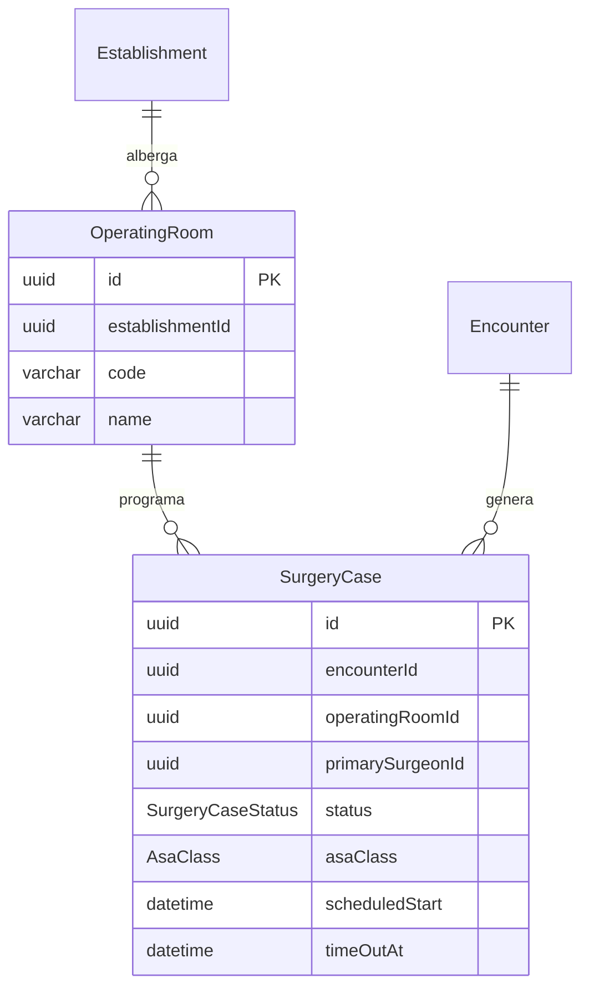

#### 8.2.5 EHR — Historia Clinica Electronica (§14)

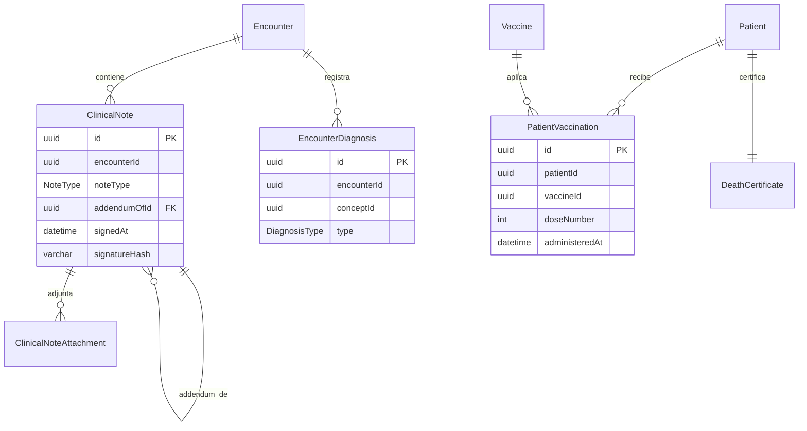

#### 8.2.6 Pharmacy (§15)

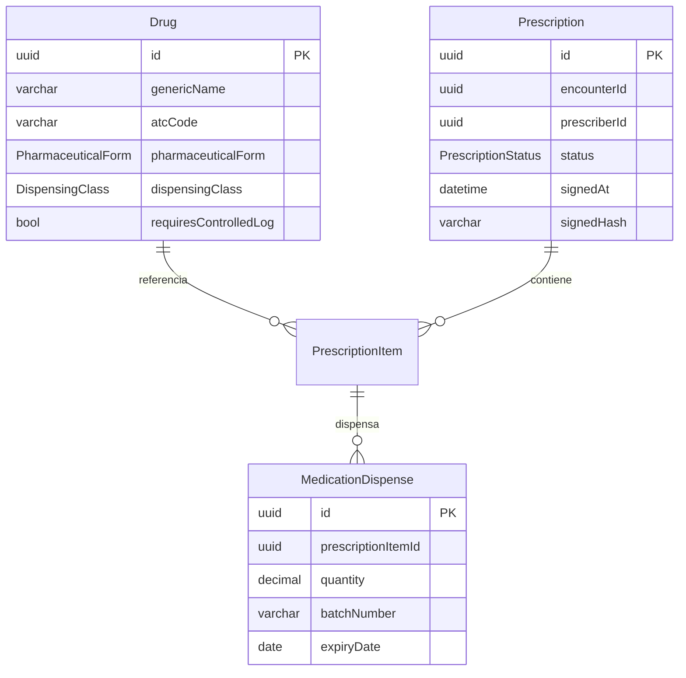

#### 8.2.7 eMAR (§16)

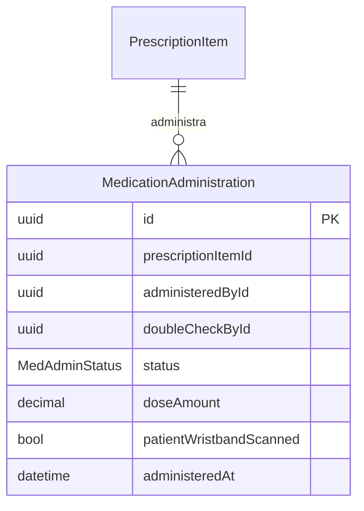

#### 8.2.8 LIS — Laboratorio (§17)

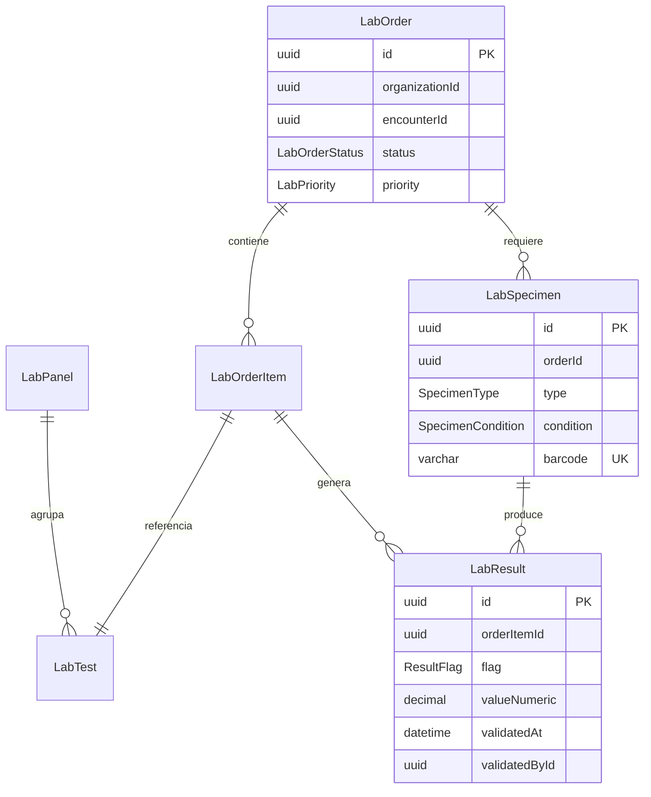

#### 8.2.9 Imaging — RIS/PACS (§18)

```mermaid
erDiagram
    Establishment ||--o{ ImagingModality : registra
    ImagingModality ||--o{ ImagingOrder : atiende
    Encounter ||--o{ ImagingOrder : genera
    ImagingOrder ||--|| ImagingReport : 1_a_1
    ImagingOrder {
        uuid id PK
        uuid encounterId
        ImagingModalityType modalityType
        ImagingOrderStatus status
        varchar accessionNumber
    }
    ImagingReport {
        uuid id PK
        uuid orderId UK
        uuid radiologistId
        text findings
        text impression
        datetime signedAt
    }
```

#### 8.2.10 Inventory — Almacen (§19)

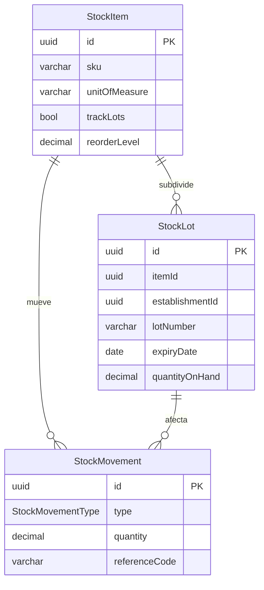

#### 8.2.11 Equipment — Equipos biomedicos (§20)

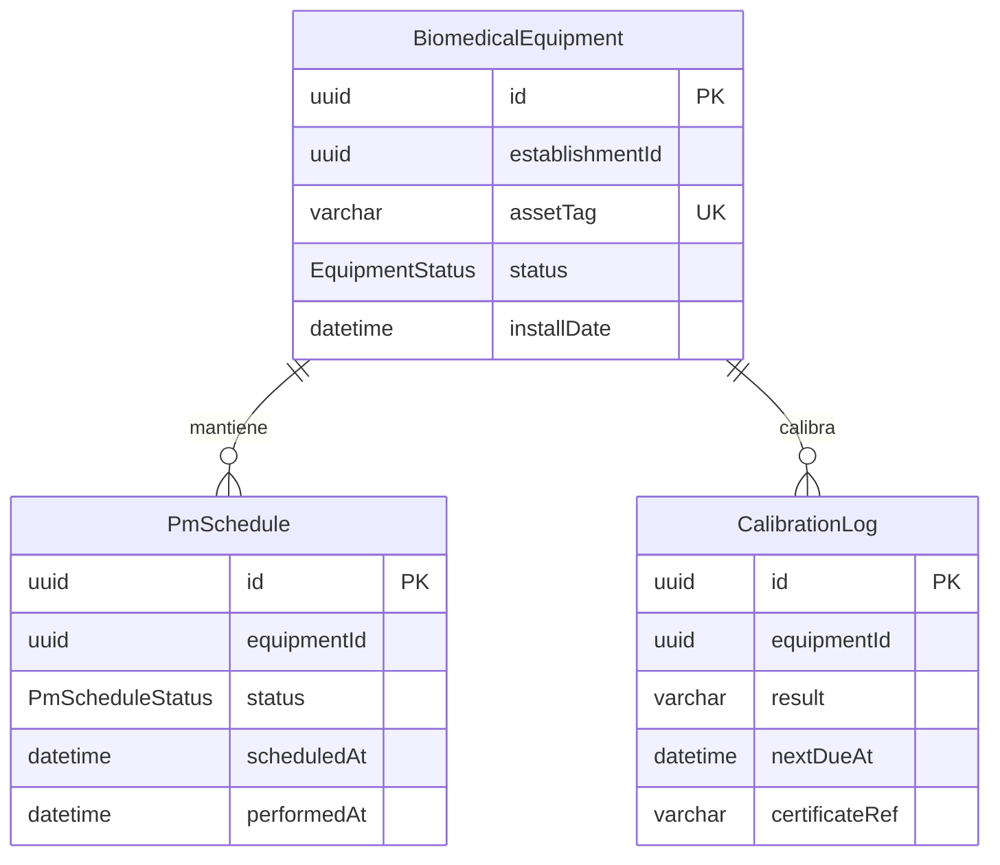

#### 8.2.12 Respiratory — Terapia respiratoria (§21)

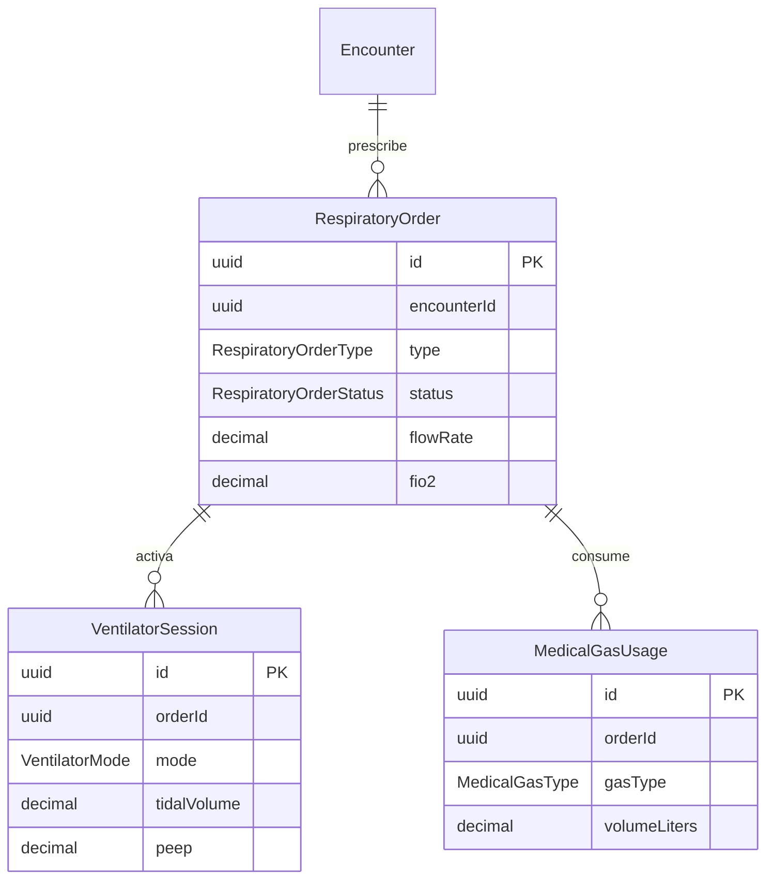

#### 8.2.13 Nutrition — Nutricion clinica (§22)

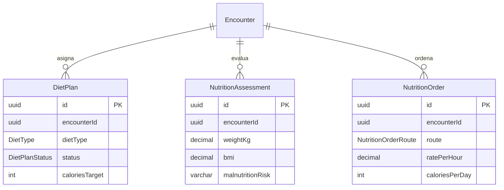

#### 8.2.14 Insurance — Convenios y aseguradoras (§25)

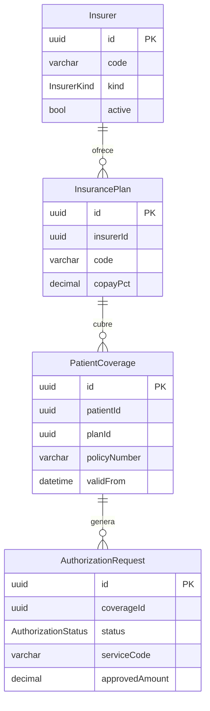

---

### 8.3 Tablas criticas con audit triggers y RLS Phase 2

Referencia: `packages/database/sql/22_audit_triggers_phase2.sql` (triggers) y SQLs `08`–`21` (RLS por bounded context).

| Bounded context | Tablas con audit trigger | Tablas con RLS habilitada |
|---|---|---|
| **outpatient** | `OutpatientAppointment`, `OutpatientConsultation` | ambas |
| **inpatient** | `InpatientAdmission`, `InpatientVitals`, `InpatientKardex`, `InpatientCarePlan` | todas |
| **emergency** | `EmergencyVisit`, `EmergencyNote` | ambas |
| **surgery** | `OperatingRoom`, `SurgeryCase` | `SurgeryCase` |
| **ehr** | `ClinicalNote`, `ClinicalNoteAttachment`, `EncounterDiagnosis`, `Vaccine`, `PatientVaccination`, `DeathCertificate` | `ClinicalNote`, `EncounterDiagnosis`, `PatientVaccination`, `DeathCertificate` |
| **pharmacy** | `Drug`, `Prescription`, `PrescriptionItem`, `MedicationDispense` | `Prescription`, `PrescriptionItem`, `MedicationDispense` |
| **emar** | `MedicationAdministration` | `MedicationAdministration` |
| **lis** | `LabPanel`, `LabTest`, `LabOrder`, `LabOrderItem`, `LabSpecimen`, `LabResult` | `LabOrder`, `LabOrderItem`, `LabSpecimen`, `LabResult` |
| **imaging** | `ImagingModality`, `ImagingOrder`, `ImagingReport` | `ImagingOrder`, `ImagingReport` |
| **inventory** | `StockItem`, `StockLot`, `StockMovement` | `StockLot`, `StockMovement` |
| **equipment** | `BiomedicalEquipment`, `PmSchedule`, `CalibrationLog` | `BiomedicalEquipment`, `PmSchedule` |
| **respiratory** | `RespiratoryOrder`, `VentilatorSession`, `MedicalGasUsage` | `RespiratoryOrder` |
| **nutrition** | `DietPlan`, `NutritionAssessment`, `NutritionOrder` | todas |
| **insurance** | `Insurer`, `InsurancePlan`, `PatientCoverage`, `AuthorizationRequest` | `PatientCoverage`, `AuthorizationRequest` |

Adicionalmente, `InpatientAdmission` y `Prescription` tienen triggers de state machine (SQL 25/26) que validan transiciones de status a nivel de DB como defensa en profundidad. `LabOrder` tiene el mismo patron (SQL 27). Ver §3 de `docs/02_arquitectura_software.md` para el patron generico.

1. **Índices GIN trigram** sobre `Patient(lastName, firstName)`,
   `ClinicalConcept(display)` — emitir migración SQL post-Prisma.
2. **Particionamiento** de `audit.AuditLog` por mes (cuando supere 50M
   filas) y de `Encounter` por año.
3. **Materialized views** para tablero de camas y KPIs de triage
   (`mv_bed_map`, `mv_triage_door_to_eval`).
4. **Seed obligatorio**: `Country(SLV)`, `Currency(USD/SVC/BTC)`,
   `IdentifierType(DUI/NIT/NIE/PASSPORT)`, `BiologicalSex`, `Gender`,
   `TriageLevel(RED..BLUE)`, `TriageFlowchart` (52 estándar Manchester).
5. **Verificación independiente** del algoritmo de validación NIT vs.
   muestras reales del Ministerio de Hacienda — el módulo 11 con pesos
   14..2 tiene variantes documentadas; reservar test fixture.
6. **HL7 FHIR mapping**: documentar mapeo `Patient`, `Encounter`,
   `Observation` (signos vitales triage) hacia recursos FHIR R4 para
   §28.1.
7. **Encriptación a nivel de columna** (pgsodium / Supabase Vault) para
   `PatientIdentifier.value` (DUI/NIT) — pendiente confirmación de
   estrategia con @SRE.
8. **Extensión a §10–§14** (atención ambulatoria, hospitalización,
   emergencia, quirófano, HCE) — siguiente iteración del schema.
