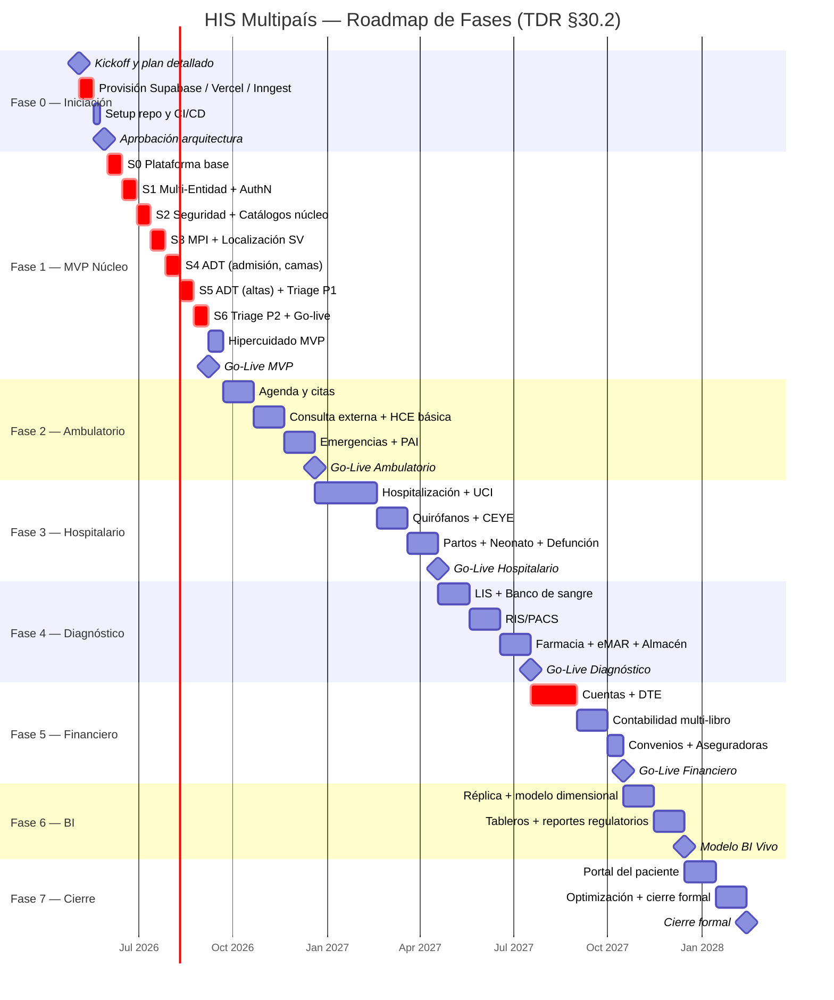
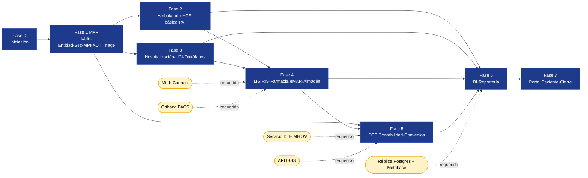

# 06 — Roadmap del Proyecto HIS Multipaís

**Proyecto:** HIS Multipaís — Inversiones Avante
**Autor:** @PO — Chief Product Officer
**Versión:** 1.0 — 2026-04-30
**Referencia:** TDR §30 (Cronograma); `docs/03_blueprints_modulos.md` (resumen ejecutivo)
**Horizonte total:** 20–22 meses (Fases 0–7)

---

## 1. Vista Ejecutiva

| Fase | Nombre | Duración | Contenido principal | Hito |
|------|--------|----------|---------------------|------|
| **0** | Iniciación | 1 mes | Provisión infra, kickoff, plan detallado | Ambientes listos |
| **1** | Núcleo + Multi-Entidad (**MVP**) | 3-4 meses | Multi-país, seguridad, catálogos, MPI, ADT, Triage | **Go-live MVP** |
| **2** | Asistencial Ambulatorio | 3 meses | Agenda, consulta externa, emergencias, HCE básica, PAI | Go-live ambulatorio |
| **3** | Asistencial Hospitalario | 4 meses | Hospitalización, UCI, quirófanos, partos, neonato, CEYE | Go-live hospitalización |
| **4** | Diagnóstico y Terapéutico | 3 meses | LIS, RIS/PACS, farmacia, eMAR, almacén, nutrición, banco de sangre, patología | Go-live diagnóstico |
| **5** | Financiero | 3 meses | DTE, contabilidad multi-libro, convenios, equipos | Go-live financiero |
| **6** | BI y Reportería | 2 meses | Tableros, KPIs, reportes regulatorios | Modelo dimensional vivo |
| **7** | Estabilización + Portal Paciente | 1-2 meses | Portal, optimización, cierre | Cierre formal |

---

## 2. Timeline Visual (Mermaid Gantt)

---

## 3. Dependencias Críticas entre Fases

### Dependencias bloqueantes

| Dependencia | Bloquea fase | Tipo | Mitigación |
|-------------|--------------|------|------------|
| **Multi-Entidad (E1)** | Todas las fases posteriores | Interna | Es el cimiento; entra en Sprint 1 del MVP |
| **Seguridad (E2)** | Todas las fases | Interna | RLS, RBAC, audit log desde Sprint 2 |
| **Catálogos núcleo (E3)** | F2, F3, F4 | Interna | CIE-10 + especialidades + servicios en MVP |
| **MPI (E4)** | F2, F3 | Interna | MVP entrega MPI completo |
| **Mirth Connect** | F3 (monitores), F4 (LIS, RIS) | Externa | Provisión paralela en Fase 0; gateway listo Fase 3 |
| **Orthanc PACS** | F4 (RIS) | Externa | Levantar entorno en Fase 3 |
| **Servicio DTE MH SV** | F5 (facturación) | Externa | Iniciar trámite cert MH en Fase 4; sandbox Fase 5 |
| **API ISSS** | F5 (convenios) | Externa | Manual con archivos si API no disponible |
| **Réplica + Metabase** | F6 (BI) | Interna | @DA/@BID inician modelo dimensional en Fase 5 |

---

## 4. Decision Points / Gates

> Cada gate es un comité (Steering Committee + @Orq + @PO + @AE + sponsor) que aprueba pasar a la siguiente fase.

| Gate | Cuándo | Decisión | Criterios de salida |
|------|--------|----------|---------------------|
| **G0 — Aprobación arquitectura** | Fin Fase 0 | ¿Arquitectura, stack y plan aprobados? | TDR firmado, infra provisionada, equipo onboarded, riesgos top-5 mitigados |
| **G1 — Go/No-Go MVP** | Fin Sprint 5 (semana 12) | ¿Lanzamos MVP en piloto? | DoD cumplido en E1–E5, SLO ≥ 99 % en QA, capacitación super-users completa, plan de hipercuidado firmado |
| **G2 — Cierre MVP** | Fin Sprint 6 + 2 semanas hipercuidado | ¿MVP estable para iniciar Fase 2? | KPIs sección 7 backlog dentro de objetivo, < 5 incidentes Sev-1/2, CSAT ≥ 4/5 |
| **G3 — Ambulatorio listo** | Fin Fase 2 | ¿Lanzamos consulta externa? | Agenda, HCE básica, PAI, emergencias estables 30 días en piloto |
| **G4 — Hospitalario listo** | Fin Fase 3 | ¿Lanzamos hospitalización + quirófanos? | Integraciones Mirth productivas con monitores, drills de UCI exitosos, OMS Safe Surgery checklist 100 % |
| **G5 — Diagnóstico listo** | Fin Fase 4 | ¿Lanzamos LIS/RIS/Farmacia/eMAR? | Mirth + Orthanc + bombas DERS productivos, 5R + doble-verificación con métricas verdes |
| **G6 — Financiero listo** | Fin Fase 5 | ¿Lanzamos facturación DTE? | DTE certificado por MH, contabilidad multi-libro conciliada, convenios con ≥ 3 aseguradoras operativos |
| **G7 — BI listo** | Fin Fase 6 | ¿Reportería oficial habilitada? | Tableros aprobados por jefes de servicio + dirección, reportes regulatorios MINSAL/CVPCPA enviados sin observaciones |
| **G8 — Cierre formal** | Fin Fase 7 | ¿Proyecto cerrado, en garantía? | 60 días en producción dentro de SLOs, capacitación 90 % personal, todos los entregables §30.1 firmados |

---

## 5. Hitos Visibles (Milestones)

| ID | Hito | Fecha objetivo | Definición |
|----|------|----------------|------------|
| M0 | Ambientes provisionados | Fin sem 4 | dev/prod en Supabase + Vercel; CI/CD verde |
| M1 | Demo Sprint 2 | Fin sem 8 | Login + MFA + audit + búsqueda CIE-10 |
| M2 | MPI funcional | Fin sem 10 | Dedupe + merge + DUI validator |
| M3 | ADT extremo a extremo | Fin sem 12 | Admisión → cama → traslado → alta + censo realtime |
| **M4** | **Go-live MVP** | Fin sem 14 | Establecimiento piloto en producción |
| M5 | Cierre MVP | Sem 16 | KPIs verdes 2 semanas post go-live |
| M6 | Go-live Ambulatorio | Mes 7-8 | Agenda + HCE básica en producción |
| M7 | Go-live Hospitalario | Mes 11-12 | Hospitalización + quirófanos en producción |
| M8 | Go-live Diagnóstico | Mes 14-15 | LIS + RIS + Farmacia en producción |
| M9 | Go-live Financiero (DTE) | Mes 17-18 | Facturación electrónica MH SV operativa |
| M10 | BI Vivo | Mes 19-20 | Tableros + reportes regulatorios |
| **M11** | **Cierre Formal** | Mes 21-22 | Proyecto en garantía, 60 días en SLO |

---

## 6. Estrategia de Riesgo por Fase

| Fase | Riesgo top | Indicador temprano | Plan B |
|------|-----------|--------------------|--------|
| 0 | Demoras de provisión | Sin acceso a Supabase/Vercel/Inngest a sem 2 | Activar plan local con Postgres + Docker hasta normalizar |
| **1 (MVP)** | Velocidad inicial < estimada | < 50 SP en Sprint 1 | Re-priorizar Should/Could; mantener Must intacto; agregar @Dev en S2 |
| 2 | Resistencia médica al sistema | Adopción < 50 % a 4 semanas | Refuerzo super-usuarios + sesiones 1:1 + ajuste de UX |
| 3 | Integración Mirth/HL7 inestable | Errores en mensajes > 2 % | Modo degradado: captura manual; volver al online tras estabilizar |
| 4 | Orthanc/PACS no productivo | Retrasos en setup | Diferir RIS a Fase 4.5 sin bloquear Farmacia/LIS |
| 5 | Cambios MH SV en formato DTE | Aviso oficial < 30 días antes | Adaptador fiscal modular; contrato de mantenimiento normativo |
| 6 | Modelo dimensional incompleto | KPIs sin definición a inicio Fase 6 | @DA/@BID inician modelo en Fase 5 (overlap) |
| 7 | Adopción del Portal Paciente | Bajo registro a 30 días | Campaña con SMS/email; integración con citas como gancho |

---

## 7. Vista de Capacidad (equipo asumido)

| Rol | FTE Fase 0 | FTE Fase 1 (MVP) | FTE Fases 2-5 | FTE Fase 6-7 |
|-----|-----------|------------------|---------------|--------------|
| @PO | 0.5 | 1.0 | 1.0 | 0.5 |
| @AE/@AS/@AT | 1.0 | 1.0 | 1.0 | 0.5 |
| @Dev (full-stack) | 1 | 3 | 5 | 2 |
| @QA / @QAF | 0.5 | 1 | 2 | 1 |
| @SRE | 1 | 1 | 1 | 1 |
| @DBA | 0.5 | 0.5 | 1 | 0.5 |
| @DA / @BID | 0 | 0 | 0.5 | 1 |
| **Total FTE** | **~4.5** | **~7.5** | **~11.5** | **~6.5** |

---

## 8. Próximos Pasos

1. **Sprint 0 (semanas 1-2 de junio 2026):** ejecutar épica E0 completa, kickoff, refinamiento de E1/E2.
2. **Refinamiento continuo:** sesiones de refinement los miércoles; planning lunes; review/retro viernes (cada dos semanas).
3. **Reporte mensual** a Steering Committee con avance vs roadmap, riesgos abiertos y decisiones pendientes.

---

**Aprobado por:**
- @PO — Chief Product Officer (autor)
- @Orq — Orquestador
- Pendiente firma Steering Committee en G0.
