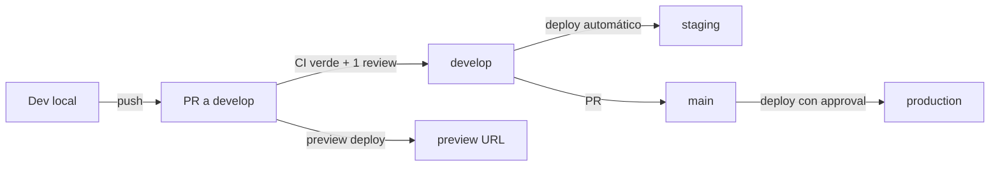

# 08 — DevOps & Operaciones HIS Multipaís

**Proyecto:** HIS Multipaís — Inversiones Avante
**Autor:** @SRE — Site Reliability Engineer
**Versión:** 1.0 — 2026-04-30
**Estado:** Operativo desde Sprint 0 (MVP). Revisión trimestral.

> **Push-back declarado:** El TDR §29.2 pide 99.9 %. En MVP comprometemos **99.5 %** (≤ 43.8 h/año de downtime) hasta tener observabilidad madura, runbooks probados y al menos un postmortem real. Subimos a 99.9 % al cierre de Fase 6 (madurez operativa) — declarado a @PO/@AE.

---

## 1. Ambientes

| Ambiente       | Propósito                                | Origen                          | URL                               | BD Supabase            |
|----------------|------------------------------------------|---------------------------------|-----------------------------------|------------------------|
| **dev local**  | Desarrollo individual                    | máquina del @Dev                | `http://localhost:3000`           | Postgres en Docker     |
| **preview**    | Una URL por PR — QA exploratoria         | Vercel auto-deploy en PR        | `*-his.vercel.app`                | Supabase branch       |
| **staging**    | Pre-producción, datos de prueba realistas | merge a `develop`               | `staging.avante-his.com`          | Supabase proyecto staging |
| **production** | Operación clínica real                   | merge a `main` + aprobación     | `app.avante-his.com` + país-suffix | Supabase proyecto prod |

> **Capacitación / pre-producción** del TDR §29.6 quedan pendientes de Fase 6 — alcance MVP cubre solo los cuatro ambientes anteriores.

---

## 2. Pipeline de despliegue

| Etapa            | Disparador                | Pipeline / Acción                                          | Gates                                            |
|------------------|---------------------------|------------------------------------------------------------|--------------------------------------------------|
| Build/test       | push o PR a `develop`/`main` | `.github/workflows/ci.yml`                                | typecheck + lint + test ≥ 80 % cov + build verde |
| Preview deploy   | PR abierto                | Vercel (automático)                                       | CI verde                                         |
| Staging deploy   | merge a `develop`         | Vercel (automático) + `db-migrate.yml` manual si hay migr. | Smoke tests post-deploy                          |
| Production deploy| merge a `main`            | Vercel + `db-migrate.yml` con required reviewer            | Aprobación manual + ventana de cambio            |
| Nightly E2E      | cron 06:00 UTC            | `.github/workflows/e2e.yml`                               | Reporte Playwright archivado                     |
| Security scan    | semanal lunes 07:00 UTC   | `.github/workflows/security.yml`                          | npm audit high+ y gitleaks                       |

---

## 3. Política de branching — **Trunk-based modificado** (recomendado)

**Decisión:** trunk-based con dos ramas largas (`main` + `develop`) y feature branches cortas (≤ 3 días).

**Por qué trunk-based y no GitFlow completo:**
- Equipo pequeño en MVP (3-5 devs).
- Vercel preview deployments hacen innecesarias las release branches.
- GitFlow añade ceremonia que no paga su costo en este tamaño.
- Migraciones forward-only (§4) eliminan el caso de uso de "release branch + hotfix".

**Reglas:**
- `main` siempre desplegable a producción. Protegida: 1 review, CI verde, sin force-push.
- `develop` integración continua a staging. Protegida: CI verde.
- Feature branches: `feat/<ticket>-<slug>`, `fix/<ticket>-<slug>`. Vida ≤ 3 días.
- Hotfix urgente: branch `hotfix/<slug>` desde `main`, PR a `main` Y a `develop`.
- Squash-merge obligatorio (historia limpia).
- Conventional Commits (`feat:`, `fix:`, `chore:`, `docs:`) — el `CHANGELOG` se generará automático en Fase 6.

---

## 4. Política de migraciones de BD — **Forward-only**

**Regla cardinal:** las migraciones **nunca se revierten** en producción. Un error en una migración se corrige con una **nueva migración** que compense.

**Por qué forward-only:**
- `prisma migrate down` puede causar pérdida de datos en producción.
- En multi-tenant con RLS, un rollback puede dejar registros huérfanos sin política aplicable.
- Auditoría exige trazabilidad — cada cambio queda en historia.

**Reglas operativas:**
1. Toda migración pasa por PR + review de @DBA o @AS.
2. Migraciones expansivas (DDL aditivo) **antes** del deploy de código que las usa. Migraciones destructivas (`DROP COLUMN`) **después** y solo cuando el código viejo ya no esté desplegado en ninguna región.
3. `db-migrate.yml` corre con `prisma migrate deploy` (no `migrate dev`) y usa `DIRECT_URL` (no pooler).
4. Migraciones grandes (> 1 min en producción) se ejecutan en ventana de mantenimiento anunciada con 7 días (TDR §29.2).
5. Backfills de datos van en scripts separados, no en el SQL de migración (control de tiempo + reanudable).
6. **Antes de cada migración a producción:** snapshot manual desde Supabase Dashboard → Database → Backups.

---

## 5. Monitoreo y alertas

### 5.1 SLIs / SLOs (TDR §29 — Sprint 0 MVP, revisión Fase 6)

| SLI                              | SLO MVP        | SLO meta (Fase 6) | Fuente                |
|----------------------------------|----------------|-------------------|-----------------------|
| Disponibilidad app (HTTP 2xx/3xx)| 99.5 %         | 99.9 %            | Vercel + uptime probe |
| p95 latencia API interactiva     | ≤ 1.5 s        | ≤ 1.0 s           | Vercel Analytics      |
| Error rate 5xx                   | < 0.5 %        | < 0.1 %           | Sentry + Vercel       |
| RPO (BD)                         | ≤ 15 min       | ≤ 5 min           | Supabase PITR         |
| RTO (recuperación)               | ≤ 4 h          | ≤ 1 h             | Runbook RB-01         |
| Cobertura de tests               | ≥ 80 %         | ≥ 85 %            | CI artifact           |

### 5.2 Stack de observabilidad MVP

- **Errores:** Sentry (`apps/web/sentry.{client,server,edge}.config.ts`). PII scrubbing obligatorio (`sentry.shared.ts`).
- **Logs:** Pino estructurado JSON (`packages/infrastructure/src/observability/logger.ts`). Vercel los recolecta y se exportan a un agregador externo cuando se pase a 99.9 %.
- **Métricas:** Vercel Analytics (Web Vitals + función) + Supabase Dashboard (BD conexiones, queries lentas). Prometheus/Grafana auto-hostados solo cuando salgamos de Vercel managed.
- **Healthcheck:** `GET /api/health` — DB + Supabase Auth + version + uptime.
- **Uptime externo:** Better Uptime o UptimeRobot apuntando a `/api/health` desde 3 regiones, frecuencia 1 min.

### 5.3 Umbrales de alerta (canal Slack `#sre-alerts`, PagerDuty solo P1)

| Evento                                    | Severidad | Notifica            | Acción                       |
|-------------------------------------------|-----------|---------------------|------------------------------|
| 3 fallos consecutivos del healthcheck     | P1        | PagerDuty + Slack   | Runbook RB-01 (DB) o RB-02 (Vercel) |
| Error rate 5xx > 2 % en 5 min             | P1        | PagerDuty           | Sentry triage + rollback si reciente |
| p95 latencia > 3 s sostenido 10 min       | P2        | Slack               | Vercel logs + queries lentas |
| Build de producción fallido               | P2        | Slack autor del PR  | Runbook RB-04                |
| `npm audit high+` en main                 | P3        | GitHub Issue        | Bump dependencia             |
| `gitleaks` detecta secreto                | P1        | PagerDuty + revocar | Runbook RB-05 (rotación)     |
| Conexiones BD > 80 % del límite           | P2        | Slack               | Aumentar pool / investigar leak |

---

## 6. Runbook de incidentes — Top 5

### RB-01 · Base de datos no responde

**Síntomas:** healthcheck `db.status = down` por > 2 min. Supabase dashboard → red.

1. **Confirmar:** abrir [status.supabase.com](https://status.supabase.com). Si Supabase reporta incidente → comunicar y esperar.
2. **Si es nuestro proyecto:**
   - Supabase Dashboard → Database → Pooler health.
   - Revisar conexiones activas (¿pool agotado por leak reciente?).
   - Si pool agotado: reiniciar pooler desde dashboard. Latencia recovery ~30 s.
3. **Si la BD está corrupta o no recupera en 15 min:**
   - Activar Point-In-Time Recovery (Supabase Dashboard → Database → Backups → PITR).
   - Comunicar a @PO + clínicas afectadas (RTO objetivo: 4 h).
4. **Postmortem blameless dentro de 5 días.**

### RB-02 · Vercel down / región caída

**Síntomas:** Vercel status amarillo/rojo, app inaccesible aunque BD esté ok.

1. Verificar [vercel-status.com](https://www.vercel-status.com).
2. **Mitigación corta plazo:** si solo `iad1` cayó, Vercel auto-failover a `gru1` (configurado en `vercel.json`). Confirmar tráfico se está sirviendo desde región alterna.
3. **Si cae todo Vercel:** activar plan de contingencia cloud-agnostic — desplegar imagen Docker en VPS de respaldo (procedimiento documentado en Fase 6).
4. Comunicar ETA a clínicas.

### RB-03 · RLS leak (un tenant ve datos de otro)

**Severidad: CRÍTICA — incidente de seguridad.**

1. **Contención inmediata:**
   - `kill -9` de la query problemática si es identificable.
   - Deshabilitar la ruta/módulo afectado vía feature flag o `vercel env` para forzar `503` controlado.
   - Levantar al @AS y @DBA por canal de incidentes.
2. **Captura de evidencia:**
   - Logs Pino con `requestId` afectado (ya scrubbed de PII para investigación segura).
   - Sentry event id.
   - Snapshot del estado de RLS policies: `SELECT * FROM pg_policies WHERE schemaname='public';`
3. **Remediación:**
   - Forzar logout global revocando `AUTH_SECRET` y rotándolo (todos los JWT activos invalidan).
   - Parche de policy RLS como nueva migración forward-only.
   - Auditoría: identificar qué tenants vieron qué datos para reporte.
4. **Notificación regulatoria** (TDR §29.8 + cumplimiento HIPAA-equivalente):
   - 72 h para notificar a autoridad sanitaria del país afectado.
   - Comunicación a pacientes si datos clínicos identificables fueron expuestos.
5. **Postmortem público interno + acción correctiva con prueba E2E que reproduzca el caso.**

### RB-04 · Deploy fallido en producción

**Síntomas:** `vercel deploy` → fail; o deploy ok pero healthcheck rojo post-deploy.

1. **Rollback inmediato:** Vercel Dashboard → Deployments → click deploy anterior verde → "Promote to Production". Tiempo: < 60 s.
2. **Si la falla incluye migración de BD aplicada:**
   - **NO revertir la migración** (forward-only — RB-04 §4).
   - Aplicar nueva migración compensatoria.
   - Promover deploy de código compatible con el estado de BD actual.
3. **Causas comunes a verificar:**
   - Variable de entorno faltante en Vercel (revisar contra lista de secrets).
   - Prisma client no regenerado (revisar `installCommand` de `vercel.json`).
   - Mismatch versión de schema vs. código.
4. Postmortem solo si afectó usuarios > 5 min o causó pérdida de datos.

### RB-05 · Secreto comprometido (en código, en logs, leak externo)

**Severidad: CRÍTICA.**

1. **Revocación inmediata** del secreto:
   - `SUPABASE_SERVICE_ROLE_KEY`: Supabase Dashboard → Settings → API → Reset.
   - `DATABASE_URL` password: Supabase Dashboard → Database → Reset password (causa reconexión).
   - `AUTH_SECRET`: rotar en Vercel + redeploy (invalida todas las sesiones — coordinar comunicación).
   - `SENTRY_DSN`: Sentry → Project Settings → Client Keys → revoke + new.
   - Tokens MH/DTE: contactar al MH para rotar.
2. **Limpieza del leak:**
   - Si vino de commit accidental: `gitleaks` ya lo detectó. Re-escribir historia con `git filter-repo` (coordinar con @AS).
   - **No** hacer force-push a `main` sin coordinación — todos los devs pierden contexto local.
3. **Auditoría retrospectiva:** ¿alguien usó la credencial robada? Revisar logs Supabase + GitHub audit log.
4. Postmortem + actualizar `.gitleaks.toml` con nuevo patrón si aplica.

---

## 7. DRP — Disaster Recovery Plan

### 7.1 Backups

| Recurso              | Mecanismo                          | Frecuencia        | Retención     | Verificación              |
|----------------------|------------------------------------|-------------------|---------------|---------------------------|
| Postgres (Supabase)  | Snapshots automáticos + PITR (WAL) | Diario + WAL continuo | 7 días MVP, 30 días en Fase 6 | Restore de prueba trimestral |
| Storage (PACS, docs) | Supabase Storage replication       | Continuo          | Ilimitado mientras esté en bucket | Auditoría mensual         |
| Código fuente        | GitHub                             | Por commit        | Indefinida    | N/A                       |
| Secrets              | Vercel + GitHub Secrets            | Manual            | Indefinida    | Lista en `docs/08_devops.md` §8 |
| Configuración Supabase | Export manual del dashboard      | Antes de cada cambio mayor | 1 año     | Checklist pre-cambio      |

### 7.2 Procedimiento de prueba trimestral

**Frecuencia:** primer viernes de cada trimestre (Q1, Q2, Q3, Q4).

**Pasos:**
1. Crear proyecto Supabase de prueba `his-dr-test-YYYYQX`.
2. Restaurar el backup más reciente de producción al proyecto de prueba (PITR a -1h).
3. Aplicar las últimas migraciones desde `main`.
4. Conectar un deploy preview de Vercel a este proyecto.
5. Ejecutar suite de smoke tests (login, crear paciente, crear encuentro, ver HCE).
6. Medir RTO real desde paso 1 hasta smoke ok. Comparar con SLO (4 h).
7. Documentar resultado en `docs/runbooks/dr-tests/YYYY-QX.md` (ruta a crear cuando ocurra primera prueba).
8. Destruir el proyecto de prueba.

### 7.3 Escalación

| Severidad | Tiempo respuesta | Resolución | Aprobador comunicación externa |
|-----------|------------------|------------|---------------------------------|
| P1 (paciente en riesgo, sistema caído) | < 15 min | < 2 h | @PO + dirección clínica |
| P2 (módulo principal) | < 1 h | < 8 h | @PO |
| P3 (funcionalidad limitada) | < 4 h | < 2 días | @SRE |
| P4 (mejora) | < 1 día | siguiente sprint | @SRE |

---

## 8. Secrets requeridos en GitHub (Settings → Secrets and variables → Actions)

### Repository-level (todos los workflows)
- _(ninguno crítico — los secrets cargan por environment)_

### Environment: `preview`
- `DATABASE_URL`, `DIRECT_URL` — proyecto Supabase de preview o branch.

### Environment: `staging`
- `DATABASE_URL`, `DIRECT_URL`
- `NEXT_PUBLIC_SUPABASE_URL`, `NEXT_PUBLIC_SUPABASE_ANON_KEY`, `SUPABASE_SERVICE_ROLE_KEY`
- `AUTH_SECRET`
- `SENTRY_DSN`, `SENTRY_AUTH_TOKEN` (para upload de source maps)

### Environment: `production`
- Todos los de `staging` apuntando al proyecto de producción.
- **Required reviewers:** @SRE + @PO mínimo.

### Repository-wide opcionales
- `GITLEAKS_LICENSE` — solo si Avante adquiere licencia comercial.
- `VERCEL_TOKEN` — si en algún momento queremos disparar deploys desde Actions en lugar de la integración nativa.

> **Nota:** los secrets de Vercel se configuran en el dashboard de Vercel (Settings → Environment Variables), **no** en GitHub. GitHub Secrets solo aplican a lo que corre dentro de Actions.

---

## 9. Pendientes para Fase 7 (madurez operativa)

- [ ] Implementar Terraform según `infra/terraform/README.md`.
- [ ] Migrar logging a un agregador externo (BetterStack / Datadog / Loki) — Vercel logs solo aguantan 24 h.
- [ ] Auto-hospedar la app en K8s (cloud-agnostic, TDR §29.7) como contingencia activa.
- [ ] Subir SLO a 99.9 %, recalibrar error budget.
- [ ] Mesa de ayuda 7×24 (TDR §29.9) — out of scope para @SRE pero requiere instrumentación que sí lo es (alertas a on-call).
- [ ] Pentest anual (TDR §29.4) — coordinar con tercero.
- [ ] Política de data residency por país cuando Fase 7 introduzca proyectos Supabase separados por país.
