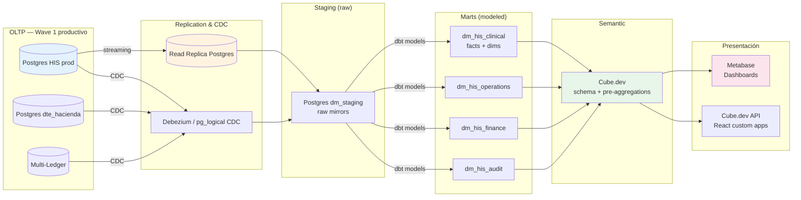

# Plan BI MVP — HIS Avante Wave 2

- **Estado:** Diseño (Wave 2, no implementable Wave 1)
- **Fecha:** 2026-05-13
- **Owners:** @DA (Data Architect, lead) + @BID (BI Developer) · revisión @AE + CFO/CMO Avante
- **Dependencias:** ADR 0006 (DTE Hacienda) y ADR 0007 (Multi-ledger) para fuentes fiscales y contables.
- **No bloqueante:** Wave 1 opera sin BI; reportes operacionales se sirven directamente desde HIS.

## 1. Resumen ejecutivo

Este plan describe la arquitectura, capa semántica, métricas iniciales, audiencias de dashboards, patrones ETL/ELT y gobierno para el primer release de BI/Reporting de HIS Avante en Wave 2.

Aproximación adoptada:

- **Pattern:** ELT con CDC (Change Data Capture) desde Postgres prod → DataMart `dm_his` → marts específicos por dominio → semantic layer → dashboards.
- **Stack core:** Postgres prod (origen) + Supabase Replica (lectura analítica) + Cube.dev (semantic layer) + Metabase (presentación). Justificación detallada en §3.
- **Audiencias:** Clínica (jefes servicio), Operacional (admin/RRHH), Ejecutivo (CEO/CMO/CFO directiva Avante).
- **Métricas iniciales:** 8 dominios cubiertos con 24 métricas iniciales (lista §5).
- **Gobierno:** RLS en marts, refresh cadence diferenciada por mart, versionado git de definiciones semánticas.

## 2. Data Sources

### 2.1 Fuentes primarias (Wave 2)

| Fuente | Naturaleza | Volumen estimado (3 años Wave 1) | Acceso analítico |
|---|---|---|---|
| Postgres HIS producción | OLTP transaccional | ~30 GB tabular + ~200 GB attachments | Vía read replica + CDC |
| Tabla `audit_log` (HIS) | Append-only, hash-chain | ~200 GB en 3 años | CDC + retención específica compliance |
| Tabla `domain_event` (HIS) | Outbox eventos | ~50 GB en 3 años | CDC |
| ExchangeRate (HIS) | Tipos cambio diarios | < 100 MB | Replica |
| BD `dte_hacienda` (ADR 0006) | Fiscal local SV | ~5 GB/año | CDC desde Wave 2.5 |
| Libros contables (ADR 0007) | Multi-ledger journal entries | ~10 GB/año total 6 libros | CDC desde Wave 2.5 |
| LMS interno | Capacitación, certificación | < 5 GB | Export periódico |
| Helpdesk (Linear) | Tickets clínicos/técnicos | < 10 GB | API export periódico |

### 2.2 Restricciones

- **PHI / datos clínicos sensibles:** queda en `dm_his_clinical`, segregado con RLS estricta, NO accesible vía dashboards genéricos.
- **Audit log:** queda en `dm_his_audit`, no aparece en dashboards salvo compliance/auditoria autorizado.
- **Servicios off-platform (HCM, ERP, PACS externo):** NO incluidos en Wave 2; bridge documentado para Wave 3 (BI consolidado).

## 3. Capa semántica: Cube.dev (decisión y justificación)

### 3.1 Alternativas evaluadas

| Tecnología | Pros | Contras | Veredicto |
|---|---|---|---|
| **Cube.dev** | Open-source robusto, GraphQL/REST/SQL API, caching de queries, multi-tenant nativo, schema en JS/YAML versionable en git, comunidad activa, deploy en Vercel posible | Curva aprendizaje, sin GUI de modeling visual | **Elegido** |
| dbt semantic layer (MetricFlow) | Cohesión con dbt si usamos dbt para transformaciones | Más joven, ecosistema menos maduro para serving | Considerado, descartado por madurez |
| LookML (Looker) | Industria estándar enterprise | Costo licencia alto, lock-in Google Cloud | Rechazado por costo |
| AtScale, Kyligence | Capa semántica con caching agresivo | Costo enterprise, overkill para volumen Avante | Rechazado |
| Sin semantic layer (SQL directo en Metabase) | Cero overhead | Dispersión de definiciones, métricas inconsistentes entre dashboards | Rechazado por gobierno |

**Decisión: Cube.dev**

Razones primarias:
1. **Versionado de definiciones en git** alinea con el SDLC de HIS (PR + review obligatorio).
2. **Caching de queries** absorbe picos de uso (apertura matutina dashboards directiva).
3. **API GraphQL/REST/SQL** permite consumo desde Metabase (Wave 2), futuro frontend React (Wave 3), aplicaciones móviles de directivos.
4. **Multi-tenant nativo** permite escalar a Honduras y Guatemala sin re-arquitectura.
5. **Self-hosted en Vercel** sin lock-in con cloud específico.

### 3.2 Estructura de cubos (cubes)

```yaml
# cubes/clinical/encounter.yml (ejemplo)
cube: Encounter
sql: SELECT * FROM dm_his_clinical.fact_encounter
data_source: dm_his_clinical

measures:
  count:
    sql: id
    type: count

  averageLengthOfStayHours:
    sql: |
      EXTRACT(EPOCH FROM (discharged_at - admitted_at)) / 3600
    type: avg

  emergencyAdmissionsCount:
    sql: id
    type: count
    filters:
      - sql: "{CUBE}.admission_type = 'EMERGENCY'"

dimensions:
  id:
    sql: id
    type: string
    primaryKey: true

  organizationId:
    sql: organization_id
    type: string

  establishmentId:
    sql: establishment_id
    type: string

  admittedAt:
    sql: admitted_at
    type: time

  dischargedAt:
    sql: discharged_at
    type: time

  admissionType:
    sql: admission_type
    type: string

  insurerName:
    sql: insurer_name
    type: string

preAggregations:
  daily:
    measures: [count, emergencyAdmissionsCount, averageLengthOfStayHours]
    dimensions: [organizationId, establishmentId, admissionType, insurerName]
    timeDimension: admittedAt
    granularity: day
    refreshKey:
      every: '1 hour'
```

### 3.3 Cubes iniciales (Wave 2 release 1)

| Cube | Fuente DataMart | Audiencias | Pre-aggregations |
|---|---|---|---|
| `Encounter` | dm_his_clinical | Clínica, Operacional, Ejecutivo | daily, monthly |
| `Patient` | dm_his_clinical | Clínica, Operacional | daily, monthly |
| `TriageEvent` | dm_his_clinical | Clínica | hourly, daily |
| `Prescription` | dm_his_clinical | Clínica | daily |
| `LabResult` | dm_his_clinical | Clínica | daily |
| `BedOccupancy` | dm_his_clinical | Clínica, Operacional | hourly, daily |
| `Inventory` | dm_his_operations | Operacional | daily |
| `JournalEntry` | dm_his_finance | Ejecutivo (CFO) | daily, monthly |
| `Claim` | dm_his_finance | Operacional, Ejecutivo | daily, monthly |
| `DteDocument` | dm_his_finance | Ejecutivo (CFO) | daily, monthly |

## 4. Arquitectura ELT/ETL

### 4.1 Topología completa



### 4.2 Patrones de transformación

- **Staging (raw mirrors):** copia 1:1 de tablas origen, sólo limpieza superficial (timestamps a UTC, nulls). Refresh: streaming (segundos).
- **Marts (dimensional model):** dbt-core transforma de staging a star schema con `fact_*` y `dim_*`. Refresh: hourly para clinical, daily para operations/finance.
- **Aggregations:** Cube.dev pre-aggrega top-N queries de cada dashboard. Refresh: hourly/daily según cube.

### 4.3 Refresh cadence

| Mart | Refresh staging→mart | Refresh mart→cube preagg | Latencia datos visible |
|---|---|---|---|
| dm_his_clinical | 15 min | 1 hour | < 1.5 h |
| dm_his_operations | 1 hour | 6 hour | < 7 h |
| dm_his_finance | 4 hour (post-DTE/Ledger) | 24 hour | < 28 h |
| dm_his_audit | Daily (madrugada) | On-demand | < 24 h |

Justificación: clinical es tiempo-cuasi-real para alertas tipo ocupación/triage; finance puede ser diferido por naturaleza contable.

## 5. Métricas iniciales (Wave 2 release 1)

### 5.1 Métricas clínicas (audience: Clínica + Operacional)

| ID | Métrica | Definición | Frecuencia |
|---|---|---|---|
| M-CLI-01 | Census ocupación de camas | (camas ocupadas / total disponibles) * 100% por unidad y por hora | Tiempo real |
| M-CLI-02 | Length of Stay (LOS) promedio | avg(discharged_at - admitted_at) por tipo episodio | Diaria |
| M-CLI-03 | Triage cycle time | avg(asignación box - llegada admisión) | Diaria |
| M-CLI-04 | Door-to-Doctor time p50/p95 | percentil tiempo desde llegada a primera atención médica | Diaria |
| M-CLI-05 | LWBS rate | (episodios LWBS / total triados) * 100% | Diaria |
| M-CLI-06 | Prescription compliance | prescripciones administradas / prescribidas | Diaria |
| M-CLI-07 | Lab TAT p95 | tiempo desde orden a release de resultado | Diaria |
| M-CLI-08 | Critical value ACK time p95 | tiempo desde alerta crítica a ACK del médico | Tiempo real |
| M-CLI-09 | Surgery cancellation rate | (cirugías canceladas / programadas) * 100% | Semanal |
| M-CLI-10 | Surgery utilization | horas quirófano usadas / horas disponibles | Semanal |
| M-CLI-11 | Infection markers | trazadores de infecciones nosocomiales (placeholder Wave 2.5) | Semanal |
| M-CLI-12 | Readmission 30d rate | reingresos en < 30d / altas totales | Mensual |

### 5.2 Métricas operacionales (audience: Admin + Ejecutivo)

| ID | Métrica | Definición | Frecuencia |
|---|---|---|---|
| M-OPS-01 | Inventory turnover | rotación stock por SKU/familia | Mensual |
| M-OPS-02 | Stock-out events | rupturas de stock críticos | Diaria |
| M-OPS-03 | Equipment uptime | horas operativas equipo / horas total | Diaria |
| M-OPS-04 | Personnel ratio | pacientes / personal activo por unidad | Tiempo real |
| M-OPS-05 | Training completion rate | personal certificado / total | Mensual |
| M-OPS-06 | Helpdesk ticket volume | tickets abiertos por categoría | Diaria |
| M-OPS-07 | Helpdesk MTTR | mean time to resolution por severidad | Semanal |

### 5.3 Métricas ejecutivas / financieras (audience: Directiva Avante)

| ID | Métrica | Definición | Frecuencia |
|---|---|---|---|
| M-EXE-01 | Revenue total | suma ingresos brutos por establishment, mes | Mensual |
| M-EXE-02 | Revenue por servicio | desglose por unidad (UCI, Med Int, Pediatría, etc) | Mensual |
| M-EXE-03 | Margen operativo | (revenue - opex) / revenue | Mensual |
| M-EXE-04 | Claim rejection rate | claims rechazados / emitidos por aseguradora | Mensual |
| M-EXE-05 | Days Sales Outstanding (DSO) | promedio días cobro | Mensual |

## 6. Dashboards Metabase (target audiences)

### 6.1 Dashboard "Director Médico" (CMO + jefes servicio)

- Census en vivo: ocupación por unidad/establecimiento (heatmap).
- Triage performance hoy: cola por color, cycle time, LWBS.
- Prescripciones: compliance, rejection rate (farmacéutico).
- LIS: TAT, critical values pendientes, validaciones 4-eyes en cola.
- Cirugías: programadas hoy, en curso, canceladas.
- Eventos adversos: últimos 30 días, tipos, severidad.

Refresh: cada 15 min.

### 6.2 Dashboard "Director Operativo" (COO + admin)

- Inventario: stock crítico por sucursal, FEFO alerts, próximas a vencer.
- Equipos: uptime, mantenimientos pendientes.
- Personal: cobertura por turno, certificaciones próximas a expirar.
- Helpdesk: tickets abiertos, MTTR, SLA breaches.
- Capacitación: compliance LMS.

Refresh: cada 1 hora.

### 6.3 Dashboard "Director Financiero" (CFO + ejecutivos)

- Revenue YTD vs presupuesto.
- Cuentas por cobrar aging.
- Claims status: emitidos, en proceso, rechazados, cobrados.
- DTE emitidos vs rechazados MH.
- Resultados libro IFRS vs FISCAL_SV (variance).
- Cash flow proyectado 30/60/90 días.

Refresh: cada 4 horas.

### 6.4 Dashboard "Director General" (CEO + junta directiva)

- Indicadores top: revenue mes, ocupación, eventos adversos críticos, claims rejected, NPS pacientes.
- Tendencias 12 meses.
- Comparativo vs sucursales (cuando aplique multi-país).
- Riesgos abiertos (regulatorios, operacionales).

Refresh: cada 24 horas (snapshot diario madrugada).

## 7. Gobierno y seguridad

### 7.1 Row-Level Security en marts

Replicar políticas RLS de HIS prod en marts:

```sql
-- Ejemplo en dm_his_clinical
ALTER TABLE fact_encounter ENABLE ROW LEVEL SECURITY;

CREATE POLICY org_isolation_encounter ON fact_encounter
  FOR SELECT
  USING (organization_id = current_setting('app.current_organization_id')::uuid);

CREATE POLICY phi_redaction_encounter ON fact_encounter
  FOR SELECT
  TO bi_role_low_privilege
  USING (false); -- BI role no puede ver PHI directo
```

Cube.dev recibe `organizationId` en cada query via `securityContext` y lo propaga al mart.

### 7.2 Roles

| Rol BI | Acceso | Audiencias |
|---|---|---|
| `bi_executive_full` | Todos los marts incluido finance | CEO, CFO, junta directiva |
| `bi_clinical_lead` | dm_his_clinical solamente | CMO, jefes servicio |
| `bi_operations` | dm_his_clinical + dm_his_operations | COO, admin |
| `bi_compliance_audit` | dm_his_audit solamente (en investigación) | Compliance officer |
| `bi_developer` | Schema sin filas (modeling solamente) | @BID |
| `bi_analyst` | Marts con PHI redactado | @BIA |

### 7.3 Compliance

- Audit log: queries ejecutadas por usuario quedan en `bi_query_log` (append-only) por 3 años.
- PHI redaction: campos como `patient.name`, `patient.docNumber` redactados a hash en marts no-clínicos.
- Retención marts: 10 años (alineado con DTE y normativa contable SV).
- GDPR-like / Hábeas Data SV: derecho a borrado del paciente cascadea a marts vía CDC del campo `is_anonymized=true` en HIS prod.

### 7.4 Versionado y change management

- Definiciones Cube.dev en git (`packages/bi-semantic/`).
- Cambios via PR + review @BID + @DA.
- Tests automatizados: snapshot de outputs de cubes con golden master.
- Tests de no-regresión de métricas: assertion que números no cambian inesperadamente entre versiones.

## 8. Implementación (roadmap Wave 2 BI)

1. **Sprint 1 (3 semanas):** Setup read replica + staging schema + permisos.
2. **Sprint 2 (4 semanas):** dbt models marts clinical + operations (no finance hasta ADR 0006/0007 ready).
3. **Sprint 3 (3 semanas):** Cube.dev setup + cubes clinical + dashboard Director Médico.
4. **Sprint 4 (3 semanas):** Cubes operations + dashboard Director Operativo.
5. **Sprint 5 (3 semanas):** Cubes finance (depende DTE + Ledger ready) + dashboard CFO.
6. **Sprint 6 (3 semanas):** Dashboard ejecutivo + roles + RLS marts.
7. **Sprint 7 (2 semanas):** Capacitación usuarios + Go-Live BI controlado.

Total: 21 semanas. Inicio realista: 3 meses después de Wave 2 backend (ADR 0006 + ADR 0007 implementados).

## 9. Costos estimados (orden de magnitud, USD/mes)

| Componente | Estimación |
|---|---|
| Read Replica Postgres (Supabase Pro+) | $200-400 |
| Cube.dev self-hosted en Vercel | $0 (incluido) |
| Metabase self-hosted Vercel + Postgres | $50 |
| Almacenamiento datamarts (Postgres) | $50-150 (en función de volumen) |
| Personal (40% FTE @BID + 20% FTE @DA) | $5,000-7,000 |
| **Total mensual operativo** | **~$5,500-7,500** |
| Setup inicial (one-time) | ~$25,000 (21 semanas × 1 FTE @BID + 0.3 @DA) |

## 10. KPIs de éxito del módulo BI

| KPI | Target Wave 2 release 1 |
|---|---|
| Adopción ejecutiva (logins/semana directiva) | ≥ 80% directiva activa |
| Query response p95 | < 3 s (gracias a pre-aggregations) |
| Refresh latencia datos clínicos | < 1.5 h |
| Discrepancia métricas finance vs ERP actual | < 0.5% |
| NPS de usuarios BI | ≥ 7/10 |

## 11. Dependencias bloqueantes

- ADR 0006 (DTE) en producción para métricas fiscales.
- ADR 0007 (Multi-ledger) en producción para métricas IFRS / management.
- Read replica Postgres provisionada por @SRE.
- Decisión de Avante directiva sobre presupuesto y prioridad.

## 12. Out of scope Wave 2 release 1

- Machine learning, predictivos clínicos (forecasting admisiones).
- GenAI/SQL para queries en lenguaje natural.
- Dashboards móviles (app dedicada para directivos).
- Integración con sistemas externos (PACS externo, HCM, ERP legacy).
- Reportes regulatorios MINSAL/ISSS automáticos (placeholder Wave 3).

Estos puntos forman parte de Wave 2 release 2 o Wave 3.

## 13. Referencias

- ADR 0006 — DTE Hacienda separate service
- ADR 0007 — Multi-ledger Accounting
- `docs/04_modelo_datos.md` — modelos HIS Wave 1
- `docs/13_slos_kpis.md` — SLOs HIS para alineación target BI
- Cube.dev docs: https://cube.dev/docs
- dbt-core docs: https://docs.getdbt.com/
- Metabase docs: https://www.metabase.com/docs/
