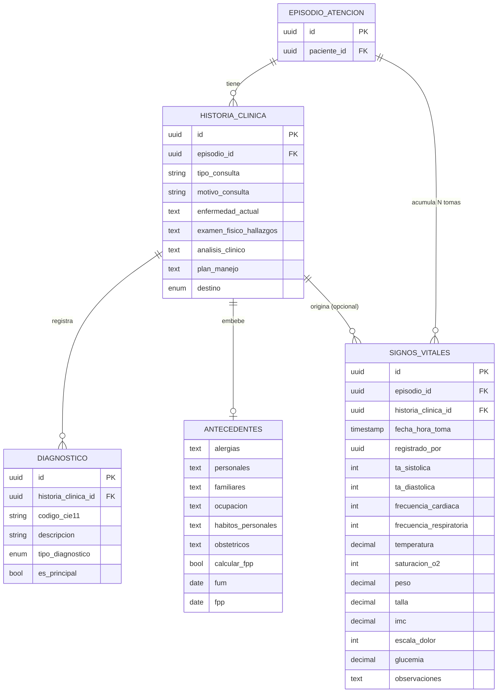

# Requerimiento Funcional y Técnico — Rediseño "Nueva Historia Clínica"

| Campo | Valor |
|---|---|
| **Sistema** | ECE / HIS Avante |
| **Pantalla afectada** | `/ece/historia-clinica/nueva` (`https://his-avante.vercel.app`) |
| **Referencia normativa** | NTEC Art. 7 — Historia Clínica Electrónica |
| **Tipo** | Cambio de alcance sobre pantalla existente |
| **Versión** | 1.0 |

---

## 1. Objetivo

Rediseñar el formulario de captura de la Historia Clínica Electrónica (HCE) para: (a) estructurar los antecedentes en una taxonomía clínica estándar (patológicos / no patológicos), (b) incorporar cálculo obstétrico de Fecha Probable de Parto, (c) migrar la codificación diagnóstica de **CIE-10 a CIE-11** con clasificación clínica del diagnóstico, (d) habilitar **múltiples tomas de signos vitales por admisión**, (e) agregar análisis clínico, y (f) reemplazar la disposición del paciente por un campo **Destino** con catálogo cerrado.

## 2. Alcance

Aplica exclusivamente a la pantalla de **creación** de Historia Clínica. No incluye módulos de agenda, admisión ni facturación, salvo la dependencia de datos descrita en §5 (el episodio/admisión ya existe y se referencia por su UUID).

## 3. Resumen de cambios

| # | Sección actual | Cambio solicitado |
|---|---|---|
| 1 | Antecedentes (plano: Personales, Familiares, Sociales, Alergias) | Agrupar en **Patológicos** y **No Patológicos** con sub-campos definidos |
| 2 | — | Checkbox de cálculo de **FPP** dentro de Obstétricos |
| 3 | Diagnósticos (CIE-10, tipo Principal/Secundario) | Migrar a **CIE-11**; tipos **Presuntivo / Definitivo / Complementario** (complementario obligatorio) |
| 4 | — | Nueva sección **Signos vitales** con N tomas por admisión |
| 5 | — | Nueva sección **Análisis clínico** (después de diagnósticos) |
| 6 | "Plan y disposición" | Renombrar a **Plan** |
| 7 | "Disposición del paciente" | Renombrar a **Destino** con catálogo de 8 opciones |

---

## 4. Requerimientos funcionales

### RF-01 — Reestructuración de Antecedentes

Reemplazar la sección plana actual por dos sub-secciones colapsables:

**4.1 Antecedentes Patológicos**
| Campo | Control | Obligatorio |
|---|---|---|
| Alergias | textarea | No |
| Personales | textarea | No |
| Familiares | textarea | No |

**4.2 Antecedentes No Patológicos**
| Campo | Control | Obligatorio |
|---|---|---|
| Ocupación | input / textarea | No |
| Hábitos Personales | textarea | No |
| Obstétricos | textarea + bloque de cálculo (ver RF-02) | No |

> **Migración de datos:** el campo actual *Sociales* (hábitos, ocupación, tabaquismo) se descompone en *Ocupación* + *Hábitos Personales* dentro de No Patológicos. El campo *Alergias conocidas* pasa a Patológicos → *Alergias*.

### RF-02 — Obstétricos: cálculo de Fecha Probable de Parto (FPP)

Dentro del campo Obstétricos:

1. Mostrar un **checkbox**: *"¿Desea calcular fecha probable de parto?"*
2. Si está activo, revelar (renderizado condicional) el campo **FUM** (Fecha de Última Menstruación, tipo `date`).
3. Al capturar FUM, calcular y mostrar en modo **solo lectura**:
   - **FPP** (Fecha Probable de Parto) — Regla de Naegele.
   - **Edad gestacional** actual (semanas + días).
4. Si el checkbox se desactiva, ocultar y limpiar FUM/FPP/EG.

**Fórmula (Regla de Naegele):**
```text
FPP = FUM − 3 meses + 1 año + 7 días        // equivalente a FUM + 280 días

edadGestacionalDias    = diferenciaEnDias(hoy, FUM)
edadGestacionalSemanas = floor(edadGestacionalDias / 7)
edadGestacionalDiasRem = edadGestacionalDias % 7
```
Validación: FUM no puede ser futura ni anterior a (hoy − 300 días).

### RF-03 — Diagnósticos CIE-11

1. **Migrar el catálogo de CIE-10 a CIE-11.** El campo de código deja de usar el formato CIE-10 (`letra + 2 dígitos`).
2. Cada fila de diagnóstico contiene:
   - **Código CIE-11** (con búsqueda/autocompletado, ver recomendación técnica §8).
   - **Descripción** (autocompletada desde el catálogo; editable).
   - **Tipo de diagnóstico** (catálogo): `Presuntivo` · `Definitivo` · `Complementario`.
3. Mantener el patrón actual de "Agregar" para registrar **N diagnósticos**.
4. **Validaciones:**
   - Mínimo **un** diagnóstico registrado.
   - Al menos **un diagnóstico de tipo Complementario** (obligatorio).

> **Nota de interpretación:** se modela `tipo_diagnostico ∈ {PRESUNTIVO, DEFINITIVO, COMPLEMENTARIO}` como única clasificación, sustituyendo el anterior Principal/Secundario, y la obligatoriedad del complementario como regla de validación. Si se requiere conservar también el eje Principal/Secundario como atributo independiente, basta con agregar la bandera booleana `es_principal` a la entidad (ver §5) — confirmar preferencia.

### RF-04 — Signos vitales (múltiples tomas por admisión)

Nueva sección con soporte para **varias tomas** del mismo paciente durante una admisión.

1. Mostrar una **tabla/lista** de tomas registradas (orden descendente por fecha-hora).
2. Botón **"Agregar toma"** que abre un sub-formulario con los campos del cuadro inferior.
3. Cada toma se sella con **fecha-hora** y **usuario** que registra.
4. Permitir editar/eliminar tomas según permisos.

| Campo | Unidad | Tipo | Notas |
|---|---|---|---|
| Presión arterial sistólica | mmHg | int | |
| Presión arterial diastólica | mmHg | int | |
| Frecuencia cardíaca | lpm | int | |
| Frecuencia respiratoria | rpm | int | |
| Temperatura | °C | decimal(4,1) | |
| Saturación O₂ (SpO₂) | % | int | 0–100 |
| Peso | kg | decimal(5,2) | |
| Talla | cm | decimal(5,1) | |
| IMC | kg/m² | decimal | **calculado** = `peso / (talla_m)²` |
| Escala de dolor (EVA) | 0–10 | int | opcional |
| Glucemia | mg/dL | decimal | opcional |
| Observaciones | — | text | opcional |

> **Decisión de arquitectura clave (optimización):** la toma de signos vitales se asocia a la **admisión / episodio de atención** (`episodio_id`), **no** a una nota de HC individual. Así, todas las tomas se acumulan y permanecen visibles durante toda la admisión, independientemente de cuántas notas de HC se generen. Opcionalmente se guarda `historia_clinica_id` para trazar qué nota originó cada toma. Ver §5.

### RF-05 — Análisis clínico

Agregar una sección **Análisis clínico** ubicada **inmediatamente después de Diagnósticos** y antes de Plan. Control: `textarea` para el razonamiento/correlación clínica. Obligatorio: No (configurable).

### RF-06 — Plan y Destino

1. Renombrar la sección **"Plan y disposición" → "Plan"**. Conservar el campo de texto de plan de manejo.
2. Reemplazar **"Disposición del paciente" → "Destino"** (select de catálogo cerrado) con las opciones:

| Valor (UI) | Código (enum) |
|---|---|
| Ingreso | `INGRESO` |
| Alta médica | `ALTA_MEDICA` |
| Alta voluntaria | `ALTA_VOLUNTARIA` |
| Seguimiento | `SEGUIMIENTO` |
| Observación | `OBSERVACION` |
| Procedimiento ambulatorio | `PROCEDIMIENTO_AMBULATORIO` |
| Referencia | `REFERENCIA` |
| Remisión | `REMISION` |

---

## 5. Modelo de datos



**Relaciones críticas:**
- `SIGNOS_VITALES.episodio_id` → **EPISODIO_ATENCION** (1:N). Esto es lo que habilita múltiples tomas por admisión. *No* colgar las tomas de `historia_clinica_id` como llave principal.
- `DIAGNOSTICO.historia_clinica_id` → **HISTORIA_CLINICA** (1:N). Los diagnósticos sí son por nota/encuentro.
- `ANTECEDENTES` puede modelarse como columnas dedicadas o como `JSONB` embebido en `HISTORIA_CLINICA`; se recomiendan columnas explícitas para `fum`/`fpp`/`calcular_fpp` por ser consultables.

**Enums a crear:**
- `tipo_diagnostico`: `PRESUNTIVO | DEFINITIVO | COMPLEMENTARIO`
- `destino`: `INGRESO | ALTA_MEDICA | ALTA_VOLUNTARIA | SEGUIMIENTO | OBSERVACION | PROCEDIMIENTO_AMBULATORIO | REFERENCIA | REMISION`

---

## 6. Reglas de negocio y validación

| ID | Regla |
|---|---|
| RN-01 | `Episodio (ID)` y `Tipo de consulta` permanecen obligatorios. |
| RN-02 | El código diagnóstico debe validarse contra el catálogo **CIE-11** (ver §8). |
| RN-03 | Debe existir ≥ 1 diagnóstico; ≥ 1 de tipo **Complementario**. |
| RN-04 | Si `calcular_fpp = true`, `FUM` es obligatoria y `FPP`/`EG` se derivan automáticamente. |
| RN-05 | `FUM` ∈ [hoy − 300 días, hoy]. |
| RN-06 | En cada toma de signos vitales: `SpO₂` ∈ [0,100]; `talla > 0` para calcular IMC. |
| RN-07 | `IMC` es siempre **derivado**, nunca capturado manualmente. |
| RN-08 | `Destino` es de catálogo cerrado (no texto libre). |

---

## 7. Estructura final de la pantalla (orden propuesto)

1. **Datos del episodio** — Episodio (ID)\*, Tipo de consulta\*, Motivo de consulta, Enfermedad actual *(sin cambios)*
2. **Antecedentes**
   - Patológicos: Alergias · Personales · Familiares
   - No Patológicos: Ocupación · Hábitos Personales · Obstétricos (+ checkbox FPP → FUM → FPP/EG)
3. **Signos vitales** — tabla de tomas + "Agregar toma" *(posición ajustable; ubicarla antes de Examen físico sigue el flujo clínico habitual)*
4. **Examen físico** — Hallazgos por aparato *(sin cambios)*
5. **Diagnósticos (CIE-11)** — Código · Descripción · Tipo {Presuntivo / Definitivo / Complementario} + "Agregar"
6. **Análisis clínico** *(nuevo)*
7. **Plan** — Plan de manejo · **Destino** (catálogo)

---

## 8. Recomendaciones técnicas de implementación (optimización)

Asumiendo el stack actual (Next.js sobre Vercel + React):

1. **Formulario único reactivo.** Usar `react-hook-form` + esquema `zod` para validación declarativa. Centralizar todas las reglas de §6 en el esquema → menos código de validación disperso y errores consistentes.
2. **Colecciones 1:N con `useFieldArray`.** Tanto **Diagnósticos** como **Signos vitales** son arreglos dinámicos: `useFieldArray` resuelve agregar/editar/eliminar filas sin estado manual.
3. **Campos derivados memoizados.** `IMC`, `FPP` y `Edad gestacional` deben calcularse con `useMemo`/`watch` (nunca persistir un valor capturado a mano); persistir el resultado solo al guardar.
4. **Renderizado condicional del bloque FPP.** `watch('calcular_fpp')` controla el montaje de FUM/FPP/EG; al desmontar, limpiar valores para evitar datos huérfanos.
5. **CIE-11 vía API oficial de la OMS (clave para no hardcodear el catálogo).** Integrar la **WHO ICD-11 API** (`https://icd.who.int/icdapi`, linealización **MMS**): búsqueda con *autocomplete* y *debounce* (~300 ms) que devuelve `code` + `title`. Esto evita mantener ~17.000 códigos localmente y garantiza validación oficial. Validación de formato como respaldo (los códigos MMS no usan letras `I`/`O`); patrón laxo sugerido: `^[A-HJ-NP-Z0-9]{2,}(\.[A-HJ-NP-Z0-9]+)*$`. *Preferir validación por API sobre regex.*
6. **Persistencia de signos vitales por episodio.** Endpoint `POST /episodios/{id}/signos-vitales` independiente del guardado de la HC, para permitir registrar tomas en cualquier momento de la admisión sin reabrir/guardar la nota completa. La pantalla de HC solo *consume y agrega* sobre esa colección.
7. **Catálogos como enums tipados** (TypeScript `as const` + tipo derivado) para `tipo_diagnostico` y `destino`; evita strings mágicos y alimenta directamente los `<select>`.
8. **Componentización sugerida:** `<SeccionAntecedentes>`, `<BloqueObstetricoFPP>`, `<TablaSignosVitales>` (con `<FormToma>`), `<ListaDiagnosticosCIE11>` (con `<BuscadorCIE11>`), `<SeccionPlanDestino>`. Cada uno autocontenido y conectado al `form` raíz por contexto.

---

## 9. Criterios de aceptación

- [ ] Antecedentes se muestran en dos grupos: Patológicos {Alergias, Personales, Familiares} y No Patológicos {Ocupación, Hábitos Personales, Obstétricos}.
- [ ] El checkbox de FPP revela FUM y calcula FPP + edad gestacional correctamente (Naegele).
- [ ] El código diagnóstico se valida/autocompleta contra CIE-11; ya no acepta formato CIE-10.
- [ ] El diagnóstico permite tipos Presuntivo, Definitivo y Complementario; el sistema exige al menos uno Complementario.
- [ ] Es posible registrar **múltiples** tomas de signos vitales en una misma admisión y todas persisten ligadas al episodio.
- [ ] El IMC se calcula automáticamente en cada toma.
- [ ] Existe la sección Análisis clínico después de Diagnósticos.
- [ ] La sección se titula "Plan"; el campo de salida se titula "Destino" con las 8 opciones del catálogo.

---

*Documento de requerimiento — listo para refinamiento técnico y estimación.*
