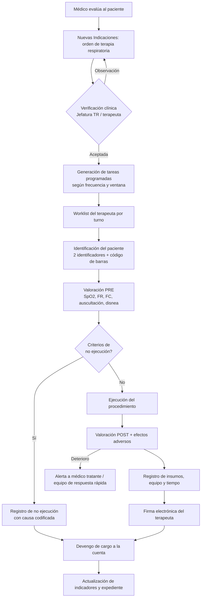
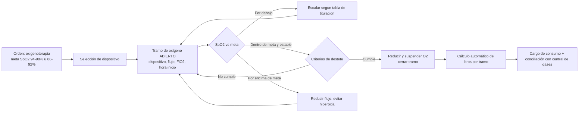
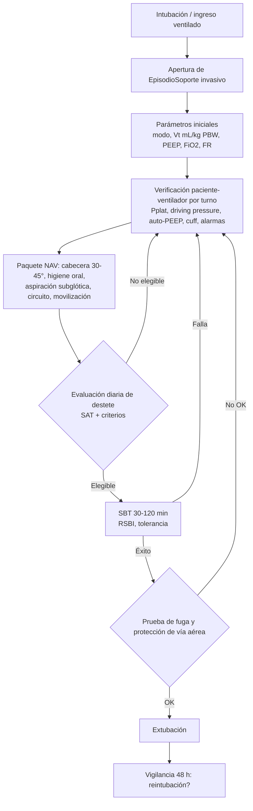

# REQ-HIS-TR-001 — Módulo de Terapia Respiratoria
## HIS Avante Multipaís · Unidad de Transformación Digital · Inversiones Avante, S.A. de C.V.

| Campo | Valor |
| :--- | :--- |
| **ID del documento** | REQ-HIS-TR-001 |
| **Versión** | 1.0 (borrador para Gate de Fase 1) |
| **Fecha** | 2026-09-16 |
| **Macroproceso** | APY (Servicios de Apoyo Clínico) con interfaces a HOS, AMB/EMG, DIAG y ADM |
| **Módulo destino** | `apps/web/src/modules/terapia-respiratoria` · `packages/domain/terapia-respiratoria` |
| **Autor / Solicitante** | TTD — Dirección de Tecnología y Transformación Digital |
| **Gatekeepers SDLC** | @AE cierra Fase 1 (impacto y alineación) · @PO cierra Fase 3 (backlog Gherkin + DoD) |
| **Estado** | Para revisión de Gerencia Médica, Jefatura de Terapia Respiratoria y Comité de Calidad |
| **Sedes en alcance** | Hospital Especializado (HE), Centro Médico (CM) y Surf City |
| **Reemplaza** | Formato en papel «Orden de Servicio de Terapia Respiratoria» (sin código, sin control de versión) |

---

## 1. Resumen ejecutivo

El servicio de Terapia Respiratoria opera hoy sobre un formulario en papel de una sola hoja que cumple simultáneamente —y mal— cuatro funciones distintas: orden médica, hoja de ejecución clínica, registro de consumo de oxígeno y soporte de cargos a la cuenta del paciente. El formato no identifica inequívocamente al paciente, no identifica al médico prescriptor, no registra dosis ni respuesta clínica, calcula el consumo de oxígeno a mano y consolida un turno de doce horas en una sola línea firmada una única vez al pie.

Este documento especifica el módulo **Terapia Respiratoria (TR)** del HIS Avante Multipaís, que sustituye el papel por un flujo digital cerrado **orden médica → verificación → worklist → ejecución a pie de cama → respuesta clínica → consumo y equipo → cargo devengado → indicadores**, alineado a los estándares vigentes de la OMS, la OPS/PAHO, la Joint Commission International (8.ª edición) y las guías de práctica clínica de la AARC, y a la normativa sanitaria y de protección de datos de El Salvador.

**Principio rector del diseño:** el terapeuta respiratorio no debe transcribir nada dos veces. Todo dato que el sistema pueda derivar (litros de oxígeno consumidos, FiO₂ estimada, índice ROX, RSBI, peso predicho, cargo a la cuenta, horas de equipo) se calcula; el terapeuta captura únicamente lo que solo un humano a pie de cama puede observar.

---

## 2. Situación actual (as-is) y análisis de brechas

### 2.1 Transcripción estructurada del formato en papel

El formulario vigente contiene:

| Bloque | Campos |
| :--- | :--- |
| Encabezado | Fecha (manuscrita), Nombre del paciente, Habitación, «Código» |
| Terapia respiratoria | Matriz de 22 procedimientos en dos columnas, cada uno con una casilla «Cantidad» |
| Medicamentos | Lista impresa: Salbutamol, Tropium (bromuro de ipratropio), Budesonida, Adrenalina, Lidocaína — sin dosis, vía ni horario |
| Consumo de oxígeno | H. inicio, H. final, Tipo ventilación, Flujo O₂ indicado, FiO₂ % indicado, LPM, Total horas, Gasto total lts O₂ (4 filas) |
| Uso equipo HRS | CPAP/BPAP, C.A.F., VMI, VMIT |
| Cierre | Observaciones, Firma terapeuta |

Los 22 procedimientos preimpresos son: atención de paro cardiorrespiratorio; inicio de oxigenoterapia (bajo flujo); supervisión y cuidado de oxigenoterapia (bajo flujo); traslado de paciente con O₂ (bajo flujo); inicio de oxigenoterapia (alto flujo); supervisión y cuidado de oxigenoterapia (alto flujo); ventilación manual a presión positiva; intubación orotraqueal; inicio de ventilación no invasiva; supervisión y cuidados de ventilación no invasiva; inicio de ventilación mecánica invasiva (UCI); supervisión y cuidados de V.M.I.; atención y uso de ventilador de transporte; asistencia a procedimientos respiratorios; nebulización convencional; vibropercusión y palmopercusión; ejercicios de rehabilitación / espirómetro incentivo; nebulización ultrasónica; aspiración faringotraqueal; lavado bronquial; espirometría; extubación.

**Registro de ejemplo analizado (16/09/2026):** paciente en habitación Santorini, código 24151; una supervisión y cuidado de oxigenoterapia de bajo flujo; tres nebulizaciones convencionales; Tropium 0.5 g (sic); oxígeno de 6 a. m. a 6 p. m., tipo «E», bajo flujo, FiO₂ 28 %, 2 L/min, 12 horas, gasto total 1440 L; observación manuscrita sobre medidor y regulador automático de presión.

> **Validación aritmética:** 2 L/min × 60 min × 12 h = 1 440 L. El cálculo del ejemplo es correcto, pero depende íntegramente de que el terapeuta lo haga a mano al final del turno. La anotación «Tropium 0.5 g» es un error de unidad de tres órdenes de magnitud (el bromuro de ipratropio se nebuliza en microgramos o miligramos: 0.5 mg = 500 µg), y es exactamente el tipo de evento que un campo libre en papel no puede prevenir y un catálogo con dosis paramétrica sí.

### 2.2 Brechas identificadas

| ID | Brecha | Riesgo | Estándar vulnerado |
| :--- | :--- | :--- | :--- |
| H-01 | Paciente identificado por nombre manuscrito, habitación y un «código» de significado ambiguo; sin número de expediente `PPP-AA-NNNNN` | Terapia aplicada al paciente equivocado | JCI IPSG.1 (dos identificadores) |
| H-02 | No consta el médico prescriptor, su firma ni la fecha/hora de la orden; el formato es una «orden de servicio», no una orden médica | Terapia sin orden trazable; responsabilidad indefinida | JCI COP.02.00 / MOI.03.00; Código de Salud SV |
| H-03 | No hay indicación clínica, dosis, frecuencia ni duración prescritas; «Nebulización 3» no dice qué, cuánto ni a qué hora | Ejecución por costumbre verbal; imposible auditar la adherencia | JCI MMU.04.00 |
| H-04 | Medicamentos preimpresos sin dosis, diluyente, vía ni registro de administración | Errores de dosificación (ver el «0.5 g» del ejemplo); doble registro con enfermería | JCI MMU.06.00; IPSG.3 |
| H-05 | No se registra respuesta clínica: SpO₂ pre/post, FR, auscultación, disnea, efectos adversos | No hay evidencia de efectividad ni de seguridad de la terapia | AARC CPG; JCI COP.03.00 |
| H-06 | No se documenta la **meta de saturación** ni reglas de titulación | Hiperoxia e hipoxia no detectadas; riesgo especial en EPOC | AARC CPG Oxígeno; OMS |
| H-07 | Consumo de O₂ calculado a mano, una línea para 12 horas continuas | Error de cálculo, sub/sobrefacturación, imposible conciliar con la central de gases | JCI HCT / GLD; control interno |
| H-08 | Uso de equipo en horas sin identificar el equipo (serie/GIAI) ni lectura de horómetro | Sin trazabilidad de qué ventilador estuvo en qué paciente; mantenimiento no se dispara por uso | JCI HCT.04.00 |
| H-09 | Una sola firma al pie para todo el turno; sin hora real de cada evento ni ejecutor por evento | Imposible reconstruir la línea de tiempo asistencial ante un evento adverso | JCI MOI.03.00; SQE |
| H-10 | No existe verificación de ventilador por turno, ni presión de cuff, ni alarmas | Ventilación no verificada; riesgo de barotrauma y de NAV | AARC CPG Patient-Ventilator Assessment (2024) |
| H-11 | Sin soporte a paquetes de seguridad (NAV/VAP, ABCDEF), ni listas de verificación | Indicadores de UCI no medibles | SHEA/IDSA; SCCM ICU Liberation |
| H-12 | Papel: sin respaldo, sin política de retención, sin control de acceso | Pérdida de expediente; incumplimiento de protección de datos | Decretos 143 y 144 (SV); JCI MOI |
| H-13 | Abreviaturas no normalizadas y campos ilegibles («E», «Bajo», «Praich») | Interpretación errónea entre turnos | JCI MOI (lista de abreviaturas prohibidas) |
| H-14 | El formato no conecta con la cuenta del paciente ni con el seguro | Fuga de ingresos por procedimientos ejecutados y no cargados | Ciclo de ingresos; DTE |
| H-15 | No se generan indicadores (cumplimiento, reintubación, días de VM, NAV/1000 días) | Gerencia Médica sin tablero del servicio | JCI QPS.05.00 |

---

## 3. Alcance

### 3.1 Dentro de alcance

1. **Orden médica electrónica de terapia respiratoria (CPOE-TR)**, nacida en el módulo *Nuevas Indicaciones*, con conjuntos de órdenes (order sets) y protocolos delegados.
2. **Worklist del terapeuta** por sede, unidad y turno, con priorización clínica y ventanas de cumplimiento.
3. **Hoja de ejecución a pie de cama** con valoración pre/post, tiempo de terapia, insumos y firma electrónica.
4. **Oxigenoterapia**: metas de saturación, dispositivos, titulación protocolizada, destete de O₂ y registro continuo.
5. **Consumo de oxígeno**: cálculo automático de litros por tramo, cilindros (duración y reserva), conciliación contra central de gases y cargo.
6. **Ventilación no invasiva (VNI/CPAP/BiPAP) y cánula de alto flujo (CAF)**: parametrización, índice ROX, criterios de fracaso.
7. **Ventilación mecánica invasiva (VMI) y de transporte (VMIT)**: parámetros, verificación por turno, ventilación protectora, presión de cuff, alarmas.
8. **Destete y extubación**: SAT/SBT diario, RSBI, prueba de fuga, extubación planificada y no planificada, reintubación.
9. **Vía aérea artificial**: aspiración (abierta/cerrada), lavado bronquial, cuidado de traqueostomía, cambio de cánula.
10. **Aerosolterapia**: catálogo de medicamentos inhalados con dosis por peso y edad, dispositivo, y registro de administración integrado con farmacia.
11. **Fisioterapia respiratoria y rehabilitación pulmonar**: percusión, drenaje postural, espirómetro incentivo, PEP/oscilación, asistente de tos, entrenamiento muscular inspiratorio.
12. **Pruebas funcionales**: espirometría (pre/post broncodilatador), gasometría arterial, capnografía, oximetría nocturna, prueba de caminata de 6 minutos, presiones máximas.
13. **Terapia respiratoria pediátrica y neonatal**: dosis por peso, escalas de dificultad respiratoria, metas de SpO₂ específicas.
14. **Paquetes de seguridad**: prevención de NAV, ABCDEF, metas internacionales de seguridad del paciente.
15. **Equipo biomédico**: asignación por GIAI, horas de uso, horómetro, mantenimiento disparado por uso, bitácora de desinfección.
16. **Cargos y facturación**: devengo automático por procedimiento ejecutado y por consumo de O₂, reglas por aseguradora (SSF, ISBM, DoctorSV, particular) y alimentación del DTE vía Odoo.
17. **Indicadores y tableros** del servicio para Jefatura de Terapia, Gerencia Médica y Comité de Calidad.
18. **Interoperabilidad**: perfiles HL7 FHIR R4 y codificación LOINC/SNOMED CT para los observables respiratorios.

### 3.2 Fuera de alcance (esta entrega)

- Integración en tiempo real por HL7 con ventiladores y monitores de cabecera (se deja el punto de extensión definido en §13.4; la captura es manual o por importación en esta entrega).
- Estudios del sueño (polisomnografía completa) y titulación domiciliaria de CPAP.
- Oxigenoterapia domiciliaria y programa ambulatorio de rehabilitación pulmonar de largo plazo.
- Portal del paciente para resultados de pruebas funcionales.
- Facturación electrónica: el HIS devenga y liquida; **Odoo emite el DTE** (coherente con la decisión de REQ-HIS-AFIL-001).

### 3.3 Supuestos

- Existe expediente único `PPP-AA-NNNNN` y cuenta de paciente activa antes de cualquier terapia (salvo el flujo de emergencia con paciente no identificado, §7.3).
- El catálogo de medicamentos e insumos proviene del MDM (ESP-MDM-GS1-001) con GTIN; el equipo biomédico se identifica con GIAI (dimensión D7).
- RBAC se hereda de REQ-HIS-RBAC-001; este módulo aporta recursos y bundles nuevos, no un esquema paralelo.
- Las tarifas y convenios con aseguradoras residen en el módulo de cuenta/seguros; TR solo devenga.

---

## 4. Marco normativo y de referencia

| Ref. | Fuente | Uso en este módulo |
| :--- | :--- | :--- |
| N-01 | **OMS** — Uso clínico del oxígeno; resolución **WHA76.3** sobre acceso al oxígeno médico (2023) y trabajo posterior de la Alianza Mundial del Oxígeno | Oxígeno tratado como medicamento: se prescribe, se titula, se documenta y se audita su consumo |
| N-02 | **OPS/PAHO** — Directrices y curso de planificación y gestión del oxígeno medicinal | Conciliación de consumo, continuidad de suministro, alerta de reserva |
| N-03 | **JCI 8.ª edición** (hospitales, vigente desde 2025): IPSG, COP (incluye COP.04.00 servicios de reanimación), MMU.06.00, HCT (tecnología sanitaria), MOI.03.00, QPS, PCI | Identificación, orden, administración, equipo, registro y calidad |
| N-04 | **AARC CPG — Management of Adult Patients With Oxygen in the Acute Care Setting** | Metas SpO₂ 94–98 %; 88–92 % en EPOC; 88–93 % si FiO₂ ≥ 0.70 sin estrategia de PEEP alta; humidificación sobre 4 L/min; inicio temprano de alto flujo |
| N-05 | **AARC CPG — Patient-Ventilator Assessment (2024)** | Contenido obligatorio del *system check*: Vt 4–8 mL/kg de peso predicho, Pplat ≤ 30 cmH₂O, presión de conducción ≤ 15 cmH₂O, PEEP/auto-PEEP, integridad de piel, presión de cuff con manómetro, humidificación |
| N-05b | **AARC CPG — Artificial Airway Suctioning (2022)** | Aspiración solo por necesidad, ≤ 15 s, preoxigenación, sistema cerrado en VM, sin instilación salina rutinaria |
| N-06 | **SHEA/IDSA** — Estrategias de prevención de NAV y de eventos asociados a ventilador | Paquete NAV y denominadores del indicador |
| N-07 | **SCCM ICU Liberation (ABCDEF)** | SAT/SBT, delirium, movilización temprana |
| N-08 | **ATS/ERS** — Estandarización de espirometría (2019) e interpretación (2022); pruebas de campo de marcha | Criterios de aceptabilidad, z-scores GLI, protocolo de 6 minutos |
| N-09 | **GOLD** (EPOC) y **GINA** (asma), ediciones vigentes | Metas de saturación y respuesta broncodilatadora |
| N-10 | **Código de Salud de El Salvador** y **Ley de Deberes y Derechos de los Pacientes y Prestadores de Servicios de Salud** | Contenido, custodia y retención del expediente; consentimiento informado en procedimientos invasivos |
| N-11 | **Decretos 143 y 144** (protección de datos, El Salvador) | Base de licitud, minimización, auditoría de accesos, derechos ARCO |
| N-12 | **Normativa de facturación electrónica (DTE, Ministerio de Hacienda SV)** | El devengo de TR alimenta el DTE emitido por Odoo |
| N-13 | **ISO 7396-1 / NFPA 99** (sistemas de gases medicinales) | Bitácora de presión, alarmas de central y reserva |
| N-15 | **CIE-11 de la OMS** (Clasificación Internacional de Enfermedades, 11.ª revisión) | Codificación obligatoria del diagnóstico que sustenta la orden; sustituye a CIE-10 en este módulo |
| N-14 | **Aviso de la FDA (2024-2025) sobre sesgo de la oximetría de pulso según pigmentación cutánea** | Alerta en la interfaz cuando la decisión de titulación depende solo de SpO₂; corroboración con gasometría en pacientes críticos |

> **Nota de altitud:** las sedes operan entre ~0 m (Surf City) y ~700 m (San Salvador). Las metas de SpO₂ de §9 aplican sin corrección; el sistema registra la sede para el análisis posterior.

---

## 5. Modelo de dominio (DDD)

### 5.1 Contexto acotado

`Terapia Respiratoria` es un **contexto acotado** propio dentro del monorepo, con arquitectura hexagonal: dominio puro en `packages/domain/terapia-respiratoria`, puertos hacia Expediente, Indicaciones, Farmacia, Cuenta, Equipo Biomédico y Catálogos MDM.

### 5.2 Agregados

| Agregado | Raíz | Invariantes clave |
| :--- | :--- | :--- |
| **OrdenTerapiaRespiratoria** | `OrdenTR` | Toda línea pertenece a una orden firmada por un prescriptor con privilegio vigente; no se ejecuta ninguna línea sin verificación de identidad del paciente |
| **SesionTerapia** | `SesionTR` | Una sesión corresponde a una y solo una línea de orden y a un ejecutor; no se cierra sin valoración post o sin causa documentada de no ejecución |
| **EpisodioSoporteRespiratorio** | `EpisodioSoporte` | Un paciente no puede tener dos episodios de soporte invasivo abiertos simultáneamente; el cierre exige evento terminal (extubación, decanulación, traslado, fallecimiento) |
| **RegistroOxigenoterapia** | `TramoOxigeno` | Tramos contiguos sin solape; el litraje se deriva, nunca se captura |
| **UsoEquipoBiomedico** | `AsignacionEquipo` | Un equipo no puede estar asignado a dos pacientes en el mismo instante |
| **PruebaFuncionalRespiratoria** | `PruebaFuncional` | Resultado sin validación técnica no es reportable |

### 5.3 Eventos de dominio

`OrdenTRCreada`, `OrdenTRVerificada`, `OrdenTRSuspendida`, `SesionTRProgramada`, `SesionTREjecutada`, `SesionTRNoEjecutada`, `MetaSaturacionDefinida`, `TramoOxigenoIniciado`, `TramoOxigenoCerrado`, `SoporteRespiratorioIniciado`, `ParametrosVentilatoriosModificados`, `VerificacionVentiladorRegistrada`, `PruebaDesteteRealizada`, `ExtubacionRegistrada`, `ReintubacionDetectada`, `EventoAdversoRespiratorio`, `EquipoAsignado`, `EquipoLiberado`, `CargoTRDevengado`, `AlertaDesaturacionEmitida`, `AlertaFracasoCAFEmitida`.

---

## 6. Catálogos maestros

Todos los catálogos se gobiernan bajo el modelo de *data owners* del MDM (GOB-MDM-GS1-001). **Data owner del catálogo de procedimientos de TR: Gerencia Médica**, con Jefatura de Terapia Respiratoria como *sub-steward* y Contabilidad como validador de tarifa.

### 6.1 Catálogo de procedimientos de terapia respiratoria

Nomenclatura: `TR-<categoría>-<secuencia>`. La columna «Papel» conserva el mapeo 1:1 con el formato vigente para garantizar continuidad operativa y comparabilidad histórica.

| Código | Procedimiento | Categoría | Unidad | Papel | Ejecutor mínimo | Consentimiento |
| :--- | :--- | :--- | :--- | :---: | :--- | :---: |
| TR-EMG-01 | Atención de paro cardiorrespiratorio | Emergencia | Evento | ✔ | Terapeuta + equipo de reanimación | No |
| TR-EMG-02 | Ventilación manual a presión positiva (bolsa-válvula-mascarilla) | Emergencia | Evento | ✔ | Terapeuta | No |
| TR-EMG-03 | Asistencia a intubación orotraqueal | Vía aérea | Evento | ✔ | Terapeuta + médico | Sí (diferible en emergencia) |
| TR-EMG-04 | Asistencia a procedimientos respiratorios | Apoyo | Evento | ✔ | Terapeuta | Según procedimiento |
| TR-OXI-01 | Inicio de oxigenoterapia de bajo flujo | Oxigenoterapia | Evento | ✔ | Terapeuta | No |
| TR-OXI-02 | Supervisión y cuidado de oxigenoterapia de bajo flujo | Oxigenoterapia | Turno | ✔ | Terapeuta | No |
| TR-OXI-03 | Inicio de oxigenoterapia de alto flujo | Oxigenoterapia | Evento | ✔ | Terapeuta | No |
| TR-OXI-04 | Supervisión y cuidado de oxigenoterapia de alto flujo | Oxigenoterapia | Turno | ✔ | Terapeuta | No |
| TR-OXI-05 | Traslado de paciente con oxígeno | Oxigenoterapia | Evento | ✔ | Terapeuta | No |
| TR-OXI-06 | Titulación protocolizada de oxígeno a meta de SpO₂ | Oxigenoterapia | Evento | ✱ nuevo | Terapeuta (protocolo delegado) | No |
| TR-OXI-07 | Destete y retiro de oxigenoterapia | Oxigenoterapia | Evento | ✱ nuevo | Terapeuta (protocolo delegado) | No |
| TR-VNI-01 | Inicio de ventilación no invasiva (CPAP/BiPAP) | Soporte no invasivo | Evento | ✔ | Terapeuta | Sí |
| TR-VNI-02 | Supervisión y cuidados de ventilación no invasiva | Soporte no invasivo | Turno | ✔ | Terapeuta | No |
| TR-VNI-03 | Inicio de cánula nasal de alto flujo (CAF) | Soporte no invasivo | Evento | ✱ nuevo | Terapeuta | No |
| TR-VNI-04 | Supervisión de CAF con cálculo de índice ROX | Soporte no invasivo | Turno | ✱ nuevo | Terapeuta | No |
| TR-VMI-01 | Inicio de ventilación mecánica invasiva | Ventilación invasiva | Evento | ✔ | Terapeuta + intensivista | Sí |
| TR-VMI-02 | Supervisión y cuidados de VMI | Ventilación invasiva | Turno | ✔ | Terapeuta | No |
| TR-VMI-03 | Verificación de sistema paciente-ventilador (*system check*) | Ventilación invasiva | Evento | ✱ nuevo | Terapeuta | No |
| TR-VMI-04 | Atención y uso de ventilador de transporte (VMIT) | Ventilación invasiva | Hora | ✔ | Terapeuta | No |
| TR-VMI-05 | Prueba de ventilación espontánea (SBT) | Destete | Evento | ✱ nuevo | Terapeuta (protocolo delegado) | No |
| TR-VMI-06 | Extubación programada | Destete | Evento | ✔ | Terapeuta + médico | Sí |
| TR-VIA-01 | Aspiración faringotraqueal | Vía aérea | Evento | ✔ | Terapeuta | No |
| TR-VIA-02 | Aspiración por sistema cerrado en paciente ventilado | Vía aérea | Evento | ✱ nuevo | Terapeuta | No |
| TR-VIA-03 | Lavado bronquial | Vía aérea | Evento | ✔ | Terapeuta | Sí |
| TR-VIA-04 | Cuidado de traqueostomía | Vía aérea | Evento | ✱ nuevo | Terapeuta | No |
| TR-VIA-05 | Cambio de cánula de traqueostomía | Vía aérea | Evento | ✱ nuevo | Terapeuta + médico | Sí |
| TR-VIA-06 | Medición y ajuste de presión del *cuff* | Vía aérea | Evento | ✱ nuevo | Terapeuta | No |
| TR-VIA-07 | Toma de muestra de aspirado traqueal / esputo inducido | Diagnóstico | Evento | ✱ nuevo | Terapeuta | No |
| TR-AER-01 | Nebulización convencional (jet) | Aerosolterapia | Evento | ✔ | Terapeuta | No |
| ~~TR-AER-02~~ | ~~Nebulización ultrasónica~~ — **retirado del catálogo activo el 17/09/2026 por decisión clínica**; se conserva solo para lectura de registros históricos del formato en papel | Aerosolterapia | — | ✔ | — | — |
| TR-AER-03 | Nebulización de malla vibratoria en circuito de VM | Aerosolterapia | Evento | ✱ nuevo | Terapeuta | No |
| TR-AER-04 | Administración con inhalador de dosis medida y **expansor de volumen** | Aerosolterapia | Evento | ✱ nuevo | Terapeuta | No |
| TR-AER-05 | Educación y verificación de técnica inhalatoria al egreso | Educación | Evento | ✱ nuevo | Terapeuta | No |
| TR-FIS-01 | Vibropercusión y palmopercusión | Fisioterapia | Evento | ✔ | Terapeuta | No |
| TR-FIS-02 | Drenaje postural | Fisioterapia | Evento | ✱ nuevo | Terapeuta | No |
| TR-FIS-03 | Ejercicios de rehabilitación con espirómetro incentivo | Fisioterapia | Evento | ✔ | Terapeuta | No |
| TR-FIS-04 | Terapia de presión espiratoria positiva (PEP / oscilación) | Fisioterapia | Evento | ✱ nuevo | Terapeuta | No |
| TR-FIS-05 | Asistencia mecánica de la tos (insuflación-exsuflación) | Fisioterapia | Evento | ✱ nuevo | Terapeuta | No |
| TR-FIS-06 | Entrenamiento de músculos inspiratorios | Fisioterapia | Sesión | ✱ nuevo | Terapeuta | No |
| TR-PFR-01 | Espirometría simple | Prueba funcional | Estudio | ✔ | Terapeuta certificado | No |
| TR-PFR-02 | Espirometría pre y post broncodilatador | Prueba funcional | Estudio | ✱ nuevo | Terapeuta certificado | No |
| TR-PFR-03 | Gasometría arterial (toma y procesamiento) | Prueba funcional | Estudio | ✱ nuevo | Terapeuta | Sí |
| TR-PFR-04 | Capnografía / capnometría | Prueba funcional | Estudio | ✱ nuevo | Terapeuta | No |
| TR-PFR-05 | Oximetría de pulso nocturna | Prueba funcional | Estudio | ✱ nuevo | Terapeuta | No |
| TR-PFR-06 | Prueba de caminata de 6 minutos | Prueba funcional | Estudio | ✱ nuevo | Terapeuta | Sí |
| TR-PFR-07 | Presiones inspiratoria y espiratoria máximas (PIM/PEM) | Prueba funcional | Estudio | ✱ nuevo | Terapeuta | No |

**Atributos obligatorios por ítem del catálogo:** código, nombre, sinónimo en papel, categoría, unidad de cobro, tiempo estándar (min), insumos estándar (GTIN + cantidad), perfil de ejecutor requerido, requiere consentimiento (S/N), requiere orden médica (S/N) o es delegable por protocolo, código CPT/local de facturación, código SNOMED CT del procedimiento, tarifa base por sede, vigencia (desde/hasta), estado.

### 6.2 Catálogo de dispositivos de oxígeno

| Código | Dispositivo | Flujo habitual (L/min) | FiO₂ aproximada | Humidificación | Notas |
| :--- | :--- | :--- | :--- | :---: | :--- |
| DO-CN | Cánula nasal | 1–6 | 24–44 % | > 4 L/min | FiO₂ estimada ≈ 21 % + 4 × L/min |
| DO-MS | Mascarilla simple | 5–10 | 40–60 % | Sí | Nunca por debajo de 5 L/min (reinhalación de CO₂) |
| DO-MV | Mascarilla Venturi | Según diluyente | 24/28/31/35/40/50 % | Opcional | Dispositivo de elección en riesgo de hipercapnia |
| DO-MR | Mascarilla con reservorio (no reinhalación) | 10–15 | 60–90 % | Sí | Reservorio debe permanecer inflado |
| DO-CAF | Cánula nasal de alto flujo | 20–60 | 21–100 % | Obligatoria | Requiere cálculo de índice ROX |
| DO-TT | Tubo en T / pieza en T | 8–15 | Variable | Obligatoria | Vía aérea artificial |
| DO-TQ | Mascarilla de traqueostomía | 8–15 | 28–100 % | Obligatoria | — |
| DO-CPAP | CPAP | — | Programada | Obligatoria | VNI |
| DO-BIPAP | BiPAP (IPAP/EPAP) | — | Programada | Obligatoria | VNI |
| DO-VMI | Ventilador de cuidados críticos | — | Programada | Obligatoria | — |
| DO-VMIT | Ventilador de transporte | — | Programada | Según equipo | — |
| DO-HC | Casco (*helmet*) / campana cefálica | Según protocolo | Programada | Obligatoria | Pediatría / VNI |

### 6.3 Catálogo de medicamentos inhalados (parametrizado, no impreso)

| Principio activo | Presentación | Dosis adulto habitual | Dosis pediátrica | Diluyente | Alertas |
| :--- | :--- | :--- | :--- | :--- | :--- |
| Salbutamol | Solución 5 mg/mL | 2.5–5 mg por nebulización | 0.15 mg/kg (mín. 2.5 mg) | SSN 0.9 % a 3–4 mL | Taquicardia, temblor, hipopotasemia |
| Bromuro de ipratropio («Tropium») | Solución 0.25 / 0.5 mg/mL | **0.5 mg** (500 µg) | 0.25 mg (< 12 años) | SSN 0.9 % | **Bloqueo duro: unidad en mg o µg; la captura en gramos se rechaza** |
| Budesonida | Suspensión 0.25 / 0.5 mg/mL | 0.5–1 mg cada 12 h | 0.25–0.5 mg cada 12 h | SSN 0.9 % | Enjuague bucal posterior obligatorio |
| Adrenalina (racémica o L-adrenalina) | Solución 1 mg/mL | 5 mg nebulizados | 0.5 mg/kg (máx. 5 mg) | SSN 0.9 % | **Medicamento de alto riesgo (IPSG.3)**: doble verificación y monitoreo continuo |
| Lidocaína | Solución 2 % | 2–4 mL nebulizados / tópica | Por peso | — | Uso en vía aérea; vigilar dosis tóxica acumulada |
| Solución salina hipertónica 3 % / 7 % | Ampolla | 4 mL | 4 mL | — | Broncoespasmo: premedicar con broncodilatador |
| N-acetilcisteína | Solución 100 mg/mL | 300 mg (3 mL al 10 %) | Según peso | — | Broncoespasmo: administrar tras broncodilatador |
| Salbutamol (inhalador de dosis medida) | 100 µg por disparo | 2–4 disparos | 2–4 disparos | No aplica | Con expansor de volumen; un disparo a la vez |
| Bromuro de ipratropio (inhalador de dosis medida) | 20 µg por disparo | 2–4 disparos | 2 disparos | No aplica | Evitar contacto con los ojos (glaucoma) |
| Budesonida (inhalador de dosis medida) | 200 µg por disparo | 1–2 disparos cada 12 h | 1 disparo cada 12 h | No aplica | Enjuague bucal obligatorio |
| Fluticasona (inhalador de dosis medida) | 125 µg por disparo | 1–2 disparos cada 12 h | 1 disparo cada 12 h | No aplica | Enjuague bucal obligatorio |

> El catálogo real se resuelve contra el maestro de medicamentos del MDM por GTIN; esta tabla define los **atributos clínicos adicionales** que TR requiere sobre ese maestro (dosis por peso, diluyente, dispositivo compatible, verificación doble).

### 6.4 Catálogo de modos ventilatorios

`VC-AC` (volumen control asistido), `PC-AC` (presión control asistido), `SIMV-VC`, `SIMV-PC`, `PSV` (presión soporte), `PRVC/APV` (volumen garantizado por presión), `APRV`, `CPAP`, `BiPAP S/T`, `NAVA`, `ASV`, `HFOV` (neonatal/pediátrico), `NIV-PS`, `CAF`. Cada modo define qué parámetros son obligatorios en la captura (§8, E6).

---

## 7. Procesos (to-be)

### 7.1 Flujo principal — terapia en hospitalización



### 7.2 Flujo de oxigenoterapia con titulación protocolizada



### 7.3 Flujo de emergencia

1. El paciente puede no estar identificado: se admite con identidad temporal (`EMG-AAAA-NNNN`) y pulsera con código de barras; la fusión posterior con el expediente definitivo arrastra todas las sesiones de TR.
2. Las terapias de emergencia (`TR-EMG-*`, `TR-OXI-01`, `TR-AER-01`) se ejecutan **bajo protocolo delegado**, con registro inmediato y **orden médica de convalidación obligatoria antes del cierre del turno**; el sistema mantiene la sesión en estado `PENDIENTE_CONVALIDACION` y la escala a la Jefatura si supera las 4 horas.
3. En paro cardiorrespiratorio, `TR-EMG-01` abre automáticamente el registro de reanimación (COP.04.00) y sella la línea de tiempo.
4. Indicador de servicio: **tiempo puerta–primera nebulización** en crisis asmática y **tiempo puerta–oxígeno** en hipoxemia.

### 7.4 Flujo de UCI / ventilación mecánica



### 7.5 Estados

**Orden:** `BORRADOR → FIRMADA → VERIFICADA → ACTIVA → (SUSPENDIDA ⇄ ACTIVA) → COMPLETADA | CANCELADA | VENCIDA`
**Tarea/Sesión:** `PROGRAMADA → EN_CURSO → EJECUTADA → FIRMADA → FACTURADA` · ramas: `NO_EJECUTADA (con causa)`, `RECHAZADA`, `PENDIENTE_CONVALIDACION`
**Episodio de soporte:** `ACTIVO → EN_DESTETE → FINALIZADO` · `REINTUBADO` reabre episodio enlazado al anterior.

---

## 8. Requisitos funcionales por épica

Formato: `RF-TR-<épica><secuencia>`. Cada épica incluye historias de usuario y criterios de aceptación en Gherkin (español), listos para el backlog de @PO.

### E1 · Orden médica electrónica de terapia respiratoria

| ID | Requisito |
| :--- | :--- |
| RF-TR-E101 | La orden de TR se crea desde *Nuevas Indicaciones* y desde la Vista 360 del Paciente, y hereda paciente, episodio, cuenta y ubicación sin recaptura. |
| RF-TR-E102 | Cada línea de orden exige: procedimiento del catálogo, diagnóstico codificado en **CIE-11** (obligatorio), frecuencia, duración o número de ejecuciones, prioridad (STAT / urgente / rutina), ventana de cumplimiento y, cuando aplique, medicamento con dosis, diluyente y dispositivo. |
| RF-TR-E103 | En oxigenoterapia la orden exige **meta de saturación** seleccionada de una lista cerrada (94–98 % · 88–92 % riesgo de hipercapnia · 88–93 % con FiO₂ ≥ 0.70). La opción **«Otro»** habilita los campos de rango mínimo y máximo y un campo de **justificación clínica obligatoria** (mínimo 15 caracteres): sin ambos la orden no puede firmarse. La regla de titulación aplicable se nombra sin abreviaturas (por ejemplo, «Protocolo de titulación de oxígeno TR-O2-02»). |
| RF-TR-E104 | El sistema ofrece **conjuntos de órdenes (order sets)** por condición: crisis asmática, exacerbación de EPOC, neumonía con hipoxemia, **preoperatorio** (preparación pulmonar), postoperatorio de tórax/abdomen alto, bronquiolitis pediátrica, SDRA, destete de VM. El conjunto **Preoperatorio** no fija diagnóstico: conserva el diagnóstico quirúrgico del paciente y precarga educación de técnica inhalatoria y entrenamiento con espirómetro incentivo. |
| RF-TR-E105 | Órdenes **delegables por protocolo**: la Jefatura de Terapia y la Gerencia Médica definen qué procedimientos puede iniciar el terapeuta bajo protocolo aprobado, con convalidación médica en ventana configurable. |
| RF-TR-E106 | Solo puede firmar órdenes un prescriptor con privilegio clínico vigente en la sede (validación contra SQE/credenciales); la firma es electrónica y no repudiable. |
| RF-TR-E107 | El sistema valida en tiempo real: duplicidad con órdenes activas, alergias del paciente, interacción con medicamentos activos, dosis fuera de rango por peso y edad, y contraindicaciones (p. ej. VNI en paciente sin protección de vía aérea). |
| RF-TR-E108 | Las órdenes de TR tienen **vigencia máxima configurable** (por defecto 72 h para terapias continuas y 24 h para protocolos delegados); al vencer pasan a `VENCIDA` y notifican al prescriptor. |
| RF-TR-E109 | Toda modificación de una orden activa genera versión nueva con trazabilidad de autor, hora y motivo; la versión anterior nunca se borra. |
| RF-TR-E110 | El sistema bloquea abreviaturas de la lista prohibida institucional en los campos libres de la orden (JCI MOI). Los códigos de protocolo y las etiquetas de la interfaz se escriben sin abreviar. |
| RF-TR-E111 | **Declaración afirmativa de oxigenoterapia.** El prescriptor debe pronunciarse siempre: o selecciona al menos un procedimiento de la sección de Oxigenoterapia, o marca la casilla **«No requiere oxigenoterapia»**, presentada con icono de aspa roja y alineada a la derecha del título de la sección. Marcarla limpia y deshabilita la lista de procedimientos de oxígeno y la meta de saturación, y deja constancia de la decisión en la orden con autor y hora. |
| RF-TR-E112 | **Selección única con pareo automático en Oxigenoterapia.** La sección admite una sola elección; al seleccionar `TR-OXI-01` el sistema agrega automáticamente `TR-OXI-02`, y al seleccionar `TR-OXI-03` agrega `TR-OXI-04`. Elegir otra opción deselecciona la anterior con su acompañante. |
| RF-TR-E113 | **Validación bloqueante al firmar.** Si no hay ninguna opción de Oxigenoterapia seleccionada y tampoco está marcada «No requiere oxigenoterapia», el sistema muestra un cuadro de diálogo modal de error con el mensaje: *«Debe seleccionar al menos una opción válida en la sección de Oxigenoterapia»*, e impide la firma. La misma validación bloqueante aplica a la meta personalizada sin justificación y a la dosis fuera de rango. |
| RF-TR-E114 | **Aerosolterapia de selección única.** La sección admite un solo procedimiento por orden. El bloque de medicamento se ubica inmediatamente después de la sección de Aerosolterapia, se **despliega o se contrae** según haya o no una opción seleccionada, y su título refleja el procedimiento elegido. |
| RF-TR-E116 | **Secciones numeradas y declaración por sección.** La pantalla de orden agrupa los procedimientos en tres secciones rotuladas «Sección 1: Oxigenoterapia», «Sección 2: Aerosolterapia» y «Sección 3: Fisioterapia respiratoria · Vía aérea · Pruebas funcionales». Las secciones 2 y 3 incorporan una casilla **«No aplica»** con icono de aspa roja alineada a la derecha del título, que al marcarse limpia y **colapsa** la sección completa —incluida la meta de saturación en la Sección 1 y el bloque de medicamento en la Sección 2—, dejando visibles únicamente el título, la casilla marcada y la leyenda de la declaración; desmarcarla vuelve a desplegarla. La validación bloqueante de RF-TR-E113 aplica a las tres secciones con el mensaje correspondiente a cada una. |
| RF-TR-E117 | **Parámetros de dosificación dependientes del procedimiento de aerosolterapia.** El bloque de medicamento carga los principios activos, las unidades permitidas, la dosis inicial, la lista de diluyentes y el parámetro técnico propio del procedimiento elegido: nebulización jet (fármacos nebulizables, diluyentes de solución salina o agua estéril, flujo impulsor de oxígeno), malla vibratoria en circuito de ventilación mecánica (sin diluyente o 2 mL de solución salina, posición en el circuito) e inhalador de dosis medida con expansor de volumen (dosis en disparos, sin diluyente, interfaz del expansor). `TR-AER-05 Educación de técnica inhalatoria` **no despliega** bloque de medicamento. |
| RF-TR-E120 | **Orden y correlativo del catálogo en pantalla.** Cada sección presenta sus procedimientos en orden correlativo de código, sin saltos y agrupados por subfamilia: la Sección 3 se despliega en 3.1 Fisioterapia respiratoria (`TR-FIS-01` a `TR-FIS-06`), 3.2 Vía aérea artificial (`TR-VIA-01` a `TR-VIA-07`) y 3.3 Pruebas funcionales respiratorias (`TR-PFR-01` a `TR-PFR-07`). Los códigos son identificadores inmutables: un procedimiento retirado (como `TR-AER-02`) deja su número vacante y **nunca se reutiliza ni se renumera** la serie. |
| RF-TR-E118 | El **diluyente es una lista cerrada** de opciones parametrizadas por procedimiento, nunca un campo de texto libre. |
| RF-TR-E119 | El mensaje de la sección de meta de saturación es **dinámico**: cambia de contenido y de tono según la meta elegida (estándar del adulto agudo, riesgo de hipercapnia, o fracción inspirada de oxígeno igual o mayor de 0.70) y se oculta cuando se elige una meta personalizada o cuando se declara que el paciente no requiere oxigenoterapia. |
| RF-TR-E115 | El mensaje de orientación clínica del bloque de medicamento corresponde al **principio activo seleccionado** (rango de dosis en adulto y pediatría, unidad válida, advertencias propias); en medicamentos de alto riesgo el mensaje cambia de tono y anuncia la doble verificación. |

```gherkin
Característica: Prescripción de oxigenoterapia con meta de saturación

  Escenario: El médico prescribe oxígeno a un paciente con EPOC
    Dado que el paciente "PPP-26-24151" tiene diagnóstico activo CA22.0 en CIE-11 (EPOC con exacerbación aguda)
    Y el médico "Dr. Ramírez" tiene privilegio clínico vigente en la sede "HE"
    Cuando prescribe "TR-OXI-01 Inicio de oxigenoterapia de bajo flujo"
    Y selecciona dispositivo "Mascarilla Venturi 28%"
    Entonces el sistema propone por defecto la meta de saturación "88-92%"
    Y muestra la advertencia "Paciente con riesgo de hipercapnia: evitar SpO2 > 92%"
    Y exige confirmar la meta antes de permitir la firma

  Escenario: Bloqueo de dosis en unidad incorrecta
    Dado que el médico prescribe "Bromuro de ipratropio" por nebulización
    Cuando captura la dosis "0.5" con unidad "g"
    Entonces el sistema rechaza la captura
    Y muestra "Unidad no válida para este medicamento. Use mg o µg. Dosis habitual: 0.5 mg (500 µg)"
    Y no permite firmar la orden hasta corregir la unidad

  Escenario: El prescriptor no se pronuncia sobre la oxigenoterapia
    Dado que la orden no tiene ninguna opción seleccionada en la sección de "Oxigenoterapia"
    Y la casilla "No requiere oxigenoterapia" no está marcada
    Cuando el médico intenta firmar la orden
    Entonces el sistema muestra un cuadro de diálogo modal de error
    Y el mensaje es "Debe seleccionar al menos una opción válida en la sección de Oxigenoterapia"
    Y la orden no se firma

  Escenario: Pareo automático de inicio y supervisión de oxigenoterapia
    Cuando el médico selecciona "TR-OXI-01 Inicio de oxigenoterapia de bajo flujo"
    Entonces el sistema selecciona automáticamente "TR-OXI-02 Supervisión y cuidado de O2 bajo flujo"
    Y cuando el médico selecciona "TR-OXI-03 Inicio de oxigenoterapia de alto flujo"
    Entonces el sistema selecciona "TR-OXI-04" y deselecciona "TR-OXI-01" y "TR-OXI-02"

  Escenario: Meta de saturación fuera de las metas institucionales
    Dado que el médico elige la meta "Otro"
    Cuando captura el rango 90-94 % sin justificación clínica
    Entonces el sistema impide la firma
    Y muestra "La justificación clínica es obligatoria cuando la meta se aparta de las metas institucionales"

  Escenario: Orden delegada por protocolo en emergencia
    Dado que el paciente ingresa a Emergencia con SpO2 de 84% en aire ambiente
    Y existe el protocolo delegado "PROTOCOLO-TR-HIPOXEMIA-01" aprobado y vigente
    Cuando el terapeuta inicia oxigenoterapia bajo ese protocolo
    Entonces el sistema registra la sesión en estado "PENDIENTE_CONVALIDACION"
    Y notifica al médico de turno para convalidación
    Y escala a la Jefatura de Terapia si no se convalida en 4 horas
```

### E2 · Worklist del terapeuta

| ID | Requisito |
| :--- | :--- |
| RF-TR-E201 | Worklist por sede, unidad, turno y terapeuta, con vista de tarjetas y vista de lista, optimizada para tableta. |
| RF-TR-E202 | Ordenamiento por prioridad clínica y proximidad de vencimiento de ventana; los STAT encabezan siempre. |
| RF-TR-E203 | Semáforo de cumplimiento: verde (dentro de ventana), ámbar (últimos 15 min), rojo (vencida), gris (no ejecutada con causa). |
| RF-TR-E204 | Asignación de tareas por la Jefatura o autoasignación con bloqueo optimista (dos terapeutas no pueden tomar la misma tarea). |
| RF-TR-E205 | Entrega de turno (*handoff*) con resumen estructurado: pacientes con soporte, pendientes, eventos y alertas abiertas. |
| RF-TR-E206 | Vista de carga: número de terapias por terapeuta y minutos estándar comprometidos vs. disponibles en el turno. |
| RF-TR-E207 | Modo degradado: si se pierde la conexión, la tableta permite registrar hasta 8 horas de ejecución en local y sincroniza al reconectar, con resolución de conflictos por hora de evento. |

### E3 · Ejecución y hoja de terapia

| ID | Requisito |
| :--- | :--- |
| RF-TR-E301 | Antes de ejecutar, verificación de identidad con **dos identificadores** (nombre completo y número de expediente) mediante lectura de código de barras de la pulsera; la confirmación manual exige justificación. |
| RF-TR-E302 | Valoración **PRE**: SpO₂, FiO₂ actual, FR, FC, PA, temperatura, auscultación por campos, características de secreciones, esfuerzo respiratorio, escala de disnea (Borg modificada o mMRC), nivel de conciencia. |
| RF-TR-E303 | Valoración **POST** obligatoria con el mismo conjunto mínimo (SpO₂, FR, FC, auscultación) más tolerancia y efectos adversos codificados. |
| RF-TR-E304 | Registro de hora real de inicio y fin; el tiempo de terapia se calcula, no se digita. |
| RF-TR-E305 | Registro de insumos consumidos por GTIN con descuento de inventario y de medicamentos administrados (integrado al MAR, sin doble registro con enfermería). |
| RF-TR-E306 | **No ejecución** con causa codificada: paciente ausente / en estudio, rechazo del paciente, inestabilidad clínica, contraindicación sobrevenida, falta de insumo o equipo, falta de personal, fallecimiento. La causa alimenta indicadores y no genera cargo. |
| RF-TR-E307 | Firma electrónica del terapeuta por **cada sesión** (no una firma por turno), con sello de tiempo y usuario autenticado. |
| RF-TR-E308 | Corrección posterior solo por adenda: el registro original permanece visible y marcado, con autor y motivo de la corrección. |
| RF-TR-E309 | La hoja de terapia del día es imprimible y exportable a PDF con el formato institucional, conservando el orden y la nomenclatura que el personal ya reconoce del papel. |
| RF-TR-E310 | Alerta automática al médico tratante y al equipo de respuesta rápida ante: caída de SpO₂ ≥ 4 puntos respecto del basal, SpO₂ < 88 % pese a terapia, FR > 30 o < 8, o evento adverso grave durante la terapia. |

```gherkin
Característica: Ejecución de nebulización con registro de respuesta

  Escenario: Nebulización con mejoría documentada
    Dado que el terapeuta "L. Barrera" tiene la tarea "TR-AER-01" programada a las 14:00
    Y el paciente porta pulsera con código de barras válido
    Cuando escanea la pulsera y el sistema confirma nombre y expediente
    Y registra la valoración PRE con SpO2 90%, FR 26, sibilancias espiratorias difusas
    Y administra "Salbutamol 2.5 mg + Ipratropio 0.5 mg en 4 mL de SSN" con nebulizador jet a 6 L/min
    Y registra la valoración POST con SpO2 95%, FR 20, sibilancias escasas
    Entonces el sistema calcula el tiempo de terapia a partir de las horas de inicio y fin
    Y descuenta los insumos del inventario por GTIN
    Y registra la administración en el MAR sin solicitar recaptura a enfermería
    Y devenga el cargo de "TR-AER-01" más los medicamentos en la cuenta del paciente
    Y muestra en la Vista 360 la tendencia de SpO2 pre/post de las últimas 24 horas

  Escenario: Deterioro durante la terapia
    Dado que la valoración PRE registró SpO2 92%
    Cuando la valoración POST registra SpO2 86% y FR 34
    Entonces el sistema marca la sesión con "evento de deterioro"
    Y emite alerta al médico tratante y al equipo de respuesta rápida
    Y exige registrar la conducta tomada antes de permitir la firma
```

### E4 · Oxigenoterapia y titulación

| ID | Requisito |
| :--- | :--- |
| RF-TR-E401 | El estado de oxigenación del paciente se modela como **tramos contiguos sin solape**: al cambiar dispositivo, flujo o FiO₂ se cierra el tramo vigente y se abre uno nuevo automáticamente. |
| RF-TR-E402 | La FiO₂ estimada se calcula para dispositivos de bajo flujo (`FiO₂ ≈ 21 % + 4 × L/min`, tope 44 % a 6 L/min) y se marca como **estimada**, distinguible de la FiO₂ programada en VNI/CAF/VMI. |
| RF-TR-E403 | Tabla de titulación configurable por protocolo, con escalón de escalada y de descenso por dispositivo, e intervalo mínimo de reevaluación (por defecto 20 minutos tras un cambio). |
| RF-TR-E404 | Indicador de **tiempo dentro de meta**: porcentaje del tiempo con SpO₂ dentro del rango prescrito, por paciente y por unidad. |
| RF-TR-E405 | Alerta de **hiperoxia**: SpO₂ sostenida por encima de la meta durante más de 30 minutos con FiO₂ suplementaria activa dispara tarea de descenso. |
| RF-TR-E406 | Humidificación obligatoria por defecto cuando el flujo supera 4 L/min, con registro de su cumplimiento. |
| RF-TR-E407 | Protocolo de destete de O₂: criterios de elegibilidad, descenso escalonado y suspensión con verificación en aire ambiente durante el tiempo configurado. |
| RF-TR-E408 | Advertencia visible cuando la decisión de titulación se apoya únicamente en SpO₂ en paciente crítico o con pigmentación cutánea oscura, recomendando corroboración con gasometría (N-14). |

### E5 · Consumo de oxígeno, cilindros y conciliación

| ID | Requisito |
| :--- | :--- |
| RF-TR-E501 | Cálculo automático del consumo por tramo: `litros = flujo (L/min) × duración (min)`; el total diario es la suma de tramos, nunca una captura manual. |
| RF-TR-E502 | Para CAF, VNI y VMI el consumo se calcula con el flujo total del dispositivo y la FiO₂ programada, según fórmula por tipo de equipo (§9, RN-TR-23). |
| RF-TR-E503 | Registro de fuente: central de gases (red) o cilindro. Para cilindro se captura tipo (D, E, M, H/K), presión inicial y final. |
| RF-TR-E504 | Cálculo de **autonomía restante del cilindro**: `minutos = (presión psi − reserva de seguridad) × factor de conversión / flujo`, con factores D 0.16, E 0.28, M 1.56, H/K 3.14 y reserva por defecto de 200 psi; alerta cuando la autonomía baja de 30 minutos o antes de un traslado. |
| RF-TR-E505 | Conciliación periódica del consumo registrado frente a las lecturas de la central de gases y de las entregas del proveedor, con reporte de diferencia por unidad y por sede. |
| RF-TR-E506 | El consumo devenga cargo según la unidad de cobro parametrizada (litro, metro cúbico, hora de dispositivo o día-terapia), configurable por sede y por convenio de aseguradora. |
| RF-TR-E507 | Bitácora de continuidad del suministro: presión de la central, alarmas y activación de la reserva, con registro de incidentes (N-13). |

```gherkin
Característica: Cálculo automático del consumo de oxígeno

  Escenario: Turno de 12 horas con flujo constante
    Dado que se abre un tramo de oxígeno a las 06:00 con cánula nasal a 2 L/min
    Y el tramo se cierra a las 18:00 sin cambios intermedios
    Entonces el sistema calcula 720 minutos de terapia
    Y calcula un consumo de 1440 litros
    Y estima una FiO2 de 29% marcada como "estimada"
    Y devenga el cargo de consumo según la tarifa vigente de la sede

  Escenario: Cambio de flujo dentro del turno
    Dado un tramo abierto a las 06:00 con 2 L/min
    Cuando a las 10:00 el terapeuta sube el flujo a 4 L/min
    Entonces el sistema cierra el primer tramo con 480 litros
    Y abre un tramo nuevo desde las 10:00 con 4 L/min
    Y el total del día es la suma de todos los tramos, sin intervención manual

  Escenario: Alerta de autonomía de cilindro
    Dado un traslado programado con cilindro tipo "E" a 8 L/min
    Y el cilindro registra una presión de 800 psi
    Entonces el sistema calcula una autonomía aproximada de 21 minutos
    Y bloquea el inicio del traslado mostrando "Autonomía insuficiente: sustituya el cilindro"
```

### E6 · Ventilación mecánica invasiva, VNI y alto flujo

| ID | Requisito |
| :--- | :--- |
| RF-TR-E601 | Apertura de `EpisodioSoporte` con tipo (VMI, VNI, CAF, VMIT), vía aérea (TOT, traqueostomía, máscara, casco), fecha/hora y motivo. |
| RF-TR-E602 | Captura de parámetros por modo ventilatorio, con campos obligatorios condicionales: en volumen (Vt, FR, PEEP, FiO₂, flujo, relación I:E), en presión (Pinsp, Ti, FR, PEEP, FiO₂), en soporte (PS, PEEP, FiO₂). |
| RF-TR-E603 | Cálculo y despliegue automático de **peso predicho (PBW)**, `Vt en mL/kg PBW`, **presión de conducción** (`Pplat − PEEP`), relación **PaO₂/FiO₂**, índice **ROX** en CAF e **índice de oxigenación** en pediatría. |
| RF-TR-E604 | Alertas de ventilación protectora: Vt > 8 mL/kg PBW, Pplat > 30 cmH₂O, presión de conducción > 15 cmH₂O, auto-PEEP detectada, FiO₂ ≥ 0.70 sostenida más de 2 horas. |
| RF-TR-E605 | **Verificación paciente-ventilador** por turno y tras todo cambio de parámetros, con los contenidos de la guía AARC 2024: parámetros programados vs. medidos, alarmas verificadas, presión de *cuff* con manómetro (meta 20–30 cmH₂O), humidificación, integridad de piel bajo interfaz o tubo, posición y fijación del tubo, exploración física. |
| RF-TR-E606 | En CAF, cálculo del índice ROX (`SpO₂/FiO₂ ÷ FR`) con evaluación a las 2, 6 y 12 horas y alerta de riesgo de fracaso cuando el valor es bajo o desciende entre mediciones. |
| RF-TR-E607 | En VNI, registro de interfaz, IPAP/EPAP, fugas, tolerancia y criterios de fracaso; alerta ante persistencia de acidosis o deterioro del sensorio. |
| RF-TR-E608 | Bitácora completa de cambios de parámetros con autor, hora, valor anterior y nuevo, y motivo. |
| RF-TR-E609 | Registro de eventos de vía aérea: extubación no planificada, obstrucción, desplazamiento, broncoaspiración, neumotórax, con notificación automática al sistema de eventos adversos (QPS). |
| RF-TR-E610 | Contador automático de **días de ventilación** por episodio y acumulado por paciente, base del denominador de los indicadores de UCI. |

### E7 · Destete y extubación

| ID | Requisito |
| :--- | :--- |
| RF-TR-E701 | Evaluación diaria de elegibilidad de destete con lista de verificación: causa resuelta o en mejoría, PaO₂/FiO₂ adecuado, PEEP ≤ 8 cmH₂O, FiO₂ ≤ 0.40, estabilidad hemodinámica sin vasopresores altos, esfuerzo inspiratorio presente, sin bloqueo neuromuscular. |
| RF-TR-E702 | Registro de **SAT** (interrupción de la sedación) coordinado con enfermería y de la escala de sedación y de delirium utilizadas. |
| RF-TR-E703 | **SBT** con modalidad (pieza en T, PS mínima, CPAP), duración de 30 a 120 minutos y criterios de intolerancia definidos; cálculo automático de **RSBI** (`FR ÷ Vt en litros`) con umbral de referencia configurable (por defecto 105). |
| RF-TR-E704 | Prueba de fuga del *cuff* antes de extubar en pacientes con factores de riesgo de estridor. |
| RF-TR-E705 | Registro de extubación: planificada o no planificada, soporte posterior (O₂, CAF, VNI profiláctica), y **vigilancia automática de reintubación a 48 y 72 horas**. |
| RF-TR-E706 | Tablero de destete por unidad: pacientes elegibles, SBT realizados, tasa de éxito, días de VM evitados. |

### E8 · Vía aérea artificial

| ID | Requisito |
| :--- | :--- |
| RF-TR-E801 | La aspiración se registra **por necesidad clínica documentada** (secreciones visibles, curva de flujo en dientes de sierra, desaturación, aumento de presión pico), no por horario fijo; el sistema no genera tareas de aspiración programadas salvo orden expresa. |
| RF-TR-E802 | Captura de: sistema (abierto/cerrado), calibre de sonda, presión negativa aplicada, duración (advertencia sobre 15 segundos), número de pases, preoxigenación, tolerancia y características de secreciones (cantidad, color, consistencia, olor, sangre). |
| RF-TR-E803 | La instilación de solución salina **no** se ofrece como opción por defecto; si se registra, exige justificación clínica (AARC 2022). |
| RF-TR-E804 | Presión de *cuff*: registro por turno con manómetro, meta 20–30 cmH₂O, y alerta fuera de rango con acción correctiva registrada. |
| RF-TR-E805 | Cuidado y cambio de cánula de traqueostomía con verificación de kit de emergencia a la cabecera y registro fotográfico opcional del estoma. |
| RF-TR-E806 | Toma de muestras respiratorias con generación automática de la solicitud a laboratorio y trazabilidad de la muestra. |

### E9 · Aerosolterapia y medicamentos

| ID | Requisito |
| :--- | :--- |
| RF-TR-E901 | Dosis paramétrica con validación por peso, edad y función renal/hepática cuando aplique; **bloqueo duro de unidades imposibles** (gramos en broncodilatadores inhalados). |
| RF-TR-E902 | Adrenalina nebulizada y demás medicamentos de alto riesgo exigen **doble verificación** por segundo profesional y monitoreo definido (IPSG.3). |
| RF-TR-E903 | La administración se registra una sola vez y es visible tanto en el MAR de enfermería como en la hoja de TR. |
| RF-TR-E904 | En paciente ventilado, el sistema exige registrar posición del nebulizador en el circuito y cambio de filtro espiratorio cuando el protocolo lo requiera. |
| RF-TR-E905 | Registro de enjuague bucal obligatorio tras corticoide inhalado. |
| RF-TR-E906 | Educación y verificación de técnica inhalatoria antes del egreso, con lista de verificación y registro de comprensión del paciente o cuidador (PCC/PFE). |

### E10 · Pruebas funcionales respiratorias

| ID | Requisito |
| :--- | :--- |
| RF-TR-E1001 | Espirometría con captura de maniobras, criterios de aceptabilidad y repetibilidad ATS/ERS, cálculo de FEV₁, FVC, FEV₁/FVC, FEF₂₅₋₇₅ y **z-scores con ecuaciones GLI**; la interpretación no se basa en el cociente fijo de 0.70. |
| RF-TR-E1002 | Prueba post broncodilatador con cálculo de la respuesta y su significación según el criterio ATS/ERS vigente. |
| RF-TR-E1003 | Gasometría arterial: sitio, prueba de Allen, FiO₂ al momento de la toma, resultados, cálculo de PaO₂/FiO₂ y gradiente A-a, e interpretación asistida del trastorno ácido-base. |
| RF-TR-E1004 | Capnografía: EtCO₂, forma de onda y gradiente con PaCO₂. |
| RF-TR-E1005 | Prueba de caminata de 6 minutos con protocolo estandarizado: distancia, SpO₂ y FC por minuto, disnea de Borg inicial y final, paradas, y motivo de interrupción. |
| RF-TR-E1006 | Oximetría nocturna con índice de desaturación y tiempo bajo 90 %. |
| RF-TR-E1007 | Todo estudio genera un informe estructurado con validación técnica y, cuando corresponda, interpretación médica firmada; se publica en el expediente y devenga cargo. |

### E11 · Fisioterapia respiratoria y rehabilitación pulmonar

| ID | Requisito |
| :--- | :--- |
| RF-TR-E1101 | Plan de terapia con objetivos medibles, sesiones programadas y evaluación de progreso. |
| RF-TR-E1102 | Registro de técnicas aplicadas, posiciones de drenaje, tolerancia, saturación durante el esfuerzo y volumen de secreciones movilizadas. |
| RF-TR-E1103 | Espirómetro incentivo: metas volumétricas, repeticiones y adherencia, con educación al paciente registrada. |
| RF-TR-E1104 | Movilización temprana en UCI coordinada con el paquete ABCDEF y con fisioterapia motora. |

### E12 · Seguridad del paciente y paquetes de cuidado

| ID | Requisito |
| :--- | :--- |
| RF-TR-E1201 | **Paquete de prevención de NAV** como lista de verificación por turno: cabecera 30–45°, higiene oral con cepillado, evaluación diaria de destete y sedación, movilización, manejo del circuito solo cuando esté visiblemente sucio o con mal funcionamiento, aspiración subglótica en intubación prolongada, profilaxis según protocolo institucional. Cumplimiento medido y reportado. |
| RF-TR-E1202 | **Paquete ABCDEF** con los elementos que corresponden a TR (SAT/SBT, movilización) enlazados a los de enfermería y medicina. |
| RF-TR-E1203 | Registro obligatorio de higiene de manos según los cinco momentos, integrado a la auditoría de PCI. |
| RF-TR-E1204 | Notificación de eventos adversos y de casi-errores desde la propia hoja de terapia, con flujo hacia QPS y análisis causal. |
| RF-TR-E1205 | Verificación de equipo de reanimación y de vía aérea difícil a la cabecera del paciente ventilado, por turno. |
| RF-TR-E1206 | Registro de aislamiento y precauciones (gotas, aerosoles, contacto) visible en la tarjeta del worklist antes de entrar a la habitación. |

### E13 · Equipo biomédico

| ID | Requisito |
| :--- | :--- |
| RF-TR-E1301 | Asignación de equipo al paciente por **GIAI** mediante lectura de código; un equipo no puede estar asignado a dos pacientes a la vez. |
| RF-TR-E1302 | Registro de horas de uso por equipo y por paciente, con lectura de horómetro al inicio y al final; sustituye el bloque «Uso equipo HRS» del papel. |
| RF-TR-E1303 | El uso acumulado dispara órdenes de mantenimiento preventivo hacia el módulo de equipo biomédico. |
| RF-TR-E1304 | Bitácora de limpieza y desinfección entre pacientes, con insumo y responsable. |
| RF-TR-E1305 | Bloqueo de asignación de equipo con mantenimiento vencido, calibración caducada o marcado fuera de servicio. |
| RF-TR-E1306 | Tablero de disponibilidad de ventiladores, CAF y CPAP/BiPAP por sede, con porcentaje de utilización. |

### E14 · Cargos, seguros y facturación

| ID | Requisito |
| :--- | :--- |
| RF-TR-E1401 | El cargo se devenga **al firmar la sesión**, nunca antes; una sesión no ejecutada jamás genera cargo. |
| RF-TR-E1402 | Cargos por procedimiento, por medicamento e insumo, y por consumo de oxígeno, cada uno con su regla de tarifa por sede y convenio. |
| RF-TR-E1403 | Reglas de agrupación y exclusión: procedimientos incluidos en paquetes quirúrgicos o en tarifa diaria de UCI no se cargan por separado; la regla es parametrizable por convenio (SSF, ISBM, DoctorSV, particular). |
| RF-TR-E1404 | Validación de cobertura y de autorización previa cuando el convenio lo exige, antes de ejecutar terapias de alto costo. |
| RF-TR-E1405 | Publicación del devengo hacia Odoo para la emisión del DTE; el HIS conserva el detalle clínico y el soporte del cargo. |
| RF-TR-E1406 | Reporte de conciliación clínica-financiera: sesiones ejecutadas vs. cargos generados vs. facturados, con detección de fuga de ingresos. |

### E15 · Indicadores y tableros

| ID | Requisito |
| :--- | :--- |
| RF-TR-E1501 | Tablero operativo del servicio por sede y turno: terapias programadas, ejecutadas, no ejecutadas por causa, cumplimiento de ventana, carga por terapeuta. |
| RF-TR-E1502 | Tablero clínico: pacientes con soporte respiratorio, días de VM, destetes, reintubaciones, eventos adversos. |
| RF-TR-E1503 | Tablero de calidad con los indicadores de §18, comparables entre sedes y con series históricas. |
| RF-TR-E1504 | Exportación a la plataforma de BI institucional (capa semántica) sin consultas directas a la base transaccional. |

### E16 · Pediatría y neonatología

| ID | Requisito |
| :--- | :--- |
| RF-TR-E1601 | Dosificación por peso con doble verificación y límites máximos por edad; el peso debe tener menos de 24 horas de antigüedad para prescribir. |
| RF-TR-E1602 | Metas de saturación diferenciadas: neonato pretérmino con oxígeno suplementario 90–95 %, lactante y niño según condición, con justificación cuando se aparten del rango. |
| RF-TR-E1603 | Escalas de dificultad respiratoria pediátrica (Silverman-Andersen en neonato, Wood-Downes-Ferrés o equivalente en bronquiolitis y asma) y puntaje de alerta temprana pediátrica. |
| RF-TR-E1604 | Interfaces y dispositivos pediátricos en catálogo (campana cefálica, CPAP nasal, cánula de alto flujo pediátrica) con rangos de flujo propios. |
| RF-TR-E1605 | Alertas específicas de hiperoxia neonatal y registro del tiempo con SpO₂ fuera de rango. |

---

## 9. Reglas de negocio y fórmulas

| ID | Regla | Expresión / valor |
| :--- | :--- | :--- |
| RN-TR-01 | Meta de saturación por defecto en adulto agudo | 94–98 % |
| RN-TR-02 | Meta en paciente con riesgo de hipercapnia (EPOC, obesidad-hipoventilación, enfermedad neuromuscular, sobredosis de depresores) | 88–92 % |
| RN-TR-03 | Meta en crítico con FiO₂ ≥ 0.70 sin estrategia de PEEP alta | 88–93 % |
| RN-TR-04 | Meta en neonato pretérmino con O₂ suplementario | 90–95 % |
| RN-TR-05 | FiO₂ estimada en bajo flujo | `FiO₂ ≈ 0.21 + 0.04 × flujo (L/min)`, válida hasta 6 L/min |
| RN-TR-06 | Consumo de oxígeno por tramo | `litros = flujo (L/min) × duración (min)` |
| RN-TR-07 | Autonomía de cilindro | `minutos = (Ppsi − 200) × factor / flujo`; factores: D 0.16 · E 0.28 · M 1.56 · H/K 3.14 |
| RN-TR-08 | Humidificación obligatoria | flujo > 4 L/min |
| RN-TR-09 | Peso corporal predicho | Hombre `50 + 0.91 × (talla cm − 152.4)` · Mujer `45.5 + 0.91 × (talla cm − 152.4)` |
| RN-TR-10 | Volumen corriente objetivo | 4–8 mL/kg de PBW |
| RN-TR-11 | Presión meseta | ≤ 30 cmH₂O |
| RN-TR-12 | Presión de conducción | `Pplat − PEEP ≤ 15 cmH₂O` |
| RN-TR-13 | Índice ROX | `(SpO₂ / FiO₂) / FR`; evaluar a las 2, 6 y 12 h de iniciada la CAF; valor bajo o descendente = riesgo de fracaso |
| RN-TR-14 | Índice de respiración rápida y superficial (RSBI) | `FR / Vt (L)`; umbral de referencia configurable, por defecto 105 |
| RN-TR-15 | Relación PaO₂/FiO₂ | `PaO₂ (mmHg) / FiO₂ (fracción)` |
| RN-TR-16 | Índice de oxigenación (pediátrico) | `(FiO₂ × Presión media de vía aérea × 100) / PaO₂` |
| RN-TR-17 | Presión del *cuff* | 20–30 cmH₂O, verificada con manómetro por turno |
| RN-TR-18 | Aspiración | Duración ≤ 15 s por pase; presión negativa de −80 a −150 mmHg en adulto (menor en pediatría); preoxigenación previa; sistema cerrado de elección en VM |
| RN-TR-19 | Instilación de solución salina en aspiración | No rutinaria; requiere justificación explícita |
| RN-TR-20 | Vigencia de orden | 72 h terapias continuas · 24 h protocolos delegados (parametrizable) |
| RN-TR-21 | Ventana de cumplimiento de una tarea | ±30 min sobre la hora programada (parametrizable por prioridad; STAT 15 min) |
| RN-TR-22 | Convalidación de terapia delegada | ≤ 4 h; al vencer escala a Jefatura de Terapia |
| RN-TR-23 | Consumo en CAF / VNI / VMI | `litros = flujo total (L/min) × ((FiO₂ − 0.21) / 0.79) × duración (min)` para mezcladores de aire-oxígeno; en equipos con consumo declarado por el fabricante se usa la curva del equipo |
| RN-TR-24 | Cargo | Se devenga al firmar la sesión; sesión no ejecutada no genera cargo; procedimiento incluido en paquete no se carga por separado |
| RN-TR-25 | Reintubación | Reintubación dentro de 48 h de la extubación se contabiliza como fracaso de extubación y enlaza ambos episodios |
| RN-TR-26 | Doble verificación | Obligatoria en adrenalina nebulizada, en toda dosis pediátrica calculada por peso y en cambios de parámetros ventilatorios en neonato |
| RN-TR-27 | Antigüedad del peso en pediatría | < 24 h para poder prescribir dosis calculada por peso |
| RN-TR-28 | Identificación | Dos identificadores verificados antes de cada sesión; el fallo de escaneo exige justificación registrada |
| RN-TR-29 | Retención documental | Registro clínico conservado según el Código de Salud y la política institucional; ningún registro firmado se elimina, solo se enmienda por adenda |
| RN-TR-30 | Alerta de deterioro | Caída de SpO₂ ≥ 4 puntos respecto del basal, o SpO₂ < 88 % con terapia activa, o FR > 30 o < 8 |
| RN-TR-31 | Diagnóstico de la orden | Obligatorio y codificado en CIE-11; sin diagnóstico no hay firma ni cargo |
| RN-TR-32 | Declaración de oxigenoterapia | Exactamente una de dos: una opción de la sección de Oxigenoterapia, o «No requiere oxigenoterapia» |
| RN-TR-33 | Pareo automático | `TR-OXI-01 → TR-OXI-02` y `TR-OXI-03 → TR-OXI-04`; el par es indivisible |
| RN-TR-34 | Meta personalizada | Rango entre 70 % y 100 %, mínimo menor que máximo, y justificación clínica de al menos 15 caracteres |
| RN-TR-35 | Declaración por sección | Cada una de las tres secciones de la orden exige una selección o su casilla «No aplica» / «No requiere oxigenoterapia» antes de firmar |
| RN-TR-36 | Dosificación por procedimiento | Los principios activos, unidades, diluyentes y parámetros técnicos se derivan del procedimiento de aerosolterapia elegido; el diluyente es lista cerrada y `TR-AER-05` no admite medicamento |

---

## 10. Modelo de datos (Prisma 6 / PostgreSQL 17)

Esquema dedicado `terapia_respiratoria`, con `citext` para códigos y particionamiento por fecha en las tablas de alto volumen (`SesionTerapia`, `TramoOxigeno`, `ParametroVentilatorio`).

```prisma
/// ---------- Catálogos ----------
model ProcedimientoTR {
  id                String   @id @default(cuid())
  codigo            String   @unique              // TR-AER-01
  nombre            String
  sinonimoPapel     String?
  categoria         CategoriaTR
  unidadCobro       UnidadCobro
  tiempoEstandarMin Int
  requiereOrden     Boolean  @default(true)
  delegablePorProtocolo Boolean @default(false)
  requiereConsentimiento Boolean @default(false)
  perfilEjecutor    PerfilEjecutor
  codigoFacturacion String?
  codigoSnomed      String?
  vigenteDesde      DateTime
  vigenteHasta      DateTime?
  activo            Boolean  @default(true)
  insumos           InsumoProcedimientoTR[]
  lineas            OrdenTRLinea[]
  @@index([categoria, activo])
}

model InsumoProcedimientoTR {
  id             String @id @default(cuid())
  procedimientoId String
  procedimiento  ProcedimientoTR @relation(fields: [procedimientoId], references: [id])
  gtin           String
  cantidad       Decimal @db.Decimal(10, 3)
  obligatorio    Boolean @default(true)
}

model DispositivoOxigeno {
  id            String  @id @default(cuid())
  codigo        String  @unique                   // DO-CN
  nombre        String
  flujoMin      Decimal? @db.Decimal(5, 2)
  flujoMax      Decimal? @db.Decimal(5, 2)
  fio2Min       Decimal? @db.Decimal(4, 3)
  fio2Max       Decimal? @db.Decimal(4, 3)
  altoFlujo     Boolean  @default(false)
  requiereHumidificacion Boolean @default(false)
  poblacion     Poblacion @default(TODAS)
  activo        Boolean  @default(true)
}

model ProtocoloTR {
  id            String  @id @default(cuid())
  codigo        String  @unique                   // PROTOCOLO-TR-HIPOXEMIA-01
  nombre        String
  version       String
  contenido     Json                              // criterios, escalones de titulación, destete
  aprobadoPor   String
  vigenteDesde  DateTime
  vigenteHasta  DateTime?
  activo        Boolean @default(true)
}

/// ---------- Orden ----------
model OrdenTR {
  id              String   @id @default(cuid())
  numero          String   @unique                // TR-AA-NNNNNN
  pacienteId      String
  episodioId      String
  cuentaId        String
  sedeId          String
  unidadId        String
  prescriptorId   String?
  protocoloId     String?
  origen          OrigenOrden                     // MEDICA | PROTOCOLO_DELEGADO | CONVALIDACION
  prioridad       Prioridad
  estado          EstadoOrdenTR
  diagnosticoCie11 String
  indicacionTexto String?
  metaSpo2Min     Int?
  metaSpo2Max     Int?
  metaJustificacion String?
  firmadaEn       DateTime?
  vigenteHasta    DateTime?
  version         Int      @default(1)
  ordenPadreId    String?                          // versionado
  creadoEn        DateTime @default(now())
  lineas          OrdenTRLinea[]
  @@index([pacienteId, estado])
  @@index([sedeId, unidadId, estado])
}

model OrdenTRLinea {
  id               String  @id @default(cuid())
  ordenId          String
  orden            OrdenTR @relation(fields: [ordenId], references: [id])
  procedimientoId  String
  procedimiento    ProcedimientoTR @relation(fields: [procedimientoId], references: [id])
  dispositivoId    String?
  frecuencia       String                          // c/4h, c/6h, PRN, continuo
  totalEjecuciones Int?
  duracionHoras    Int?
  medicamentos     MedicamentoLineaTR[]
  parametros       Json?                           // parámetros iniciales propuestos
  observaciones    String?
  estado           EstadoLineaTR
  sesiones         SesionTerapia[]
}

model MedicamentoLineaTR {
  id           String  @id @default(cuid())
  lineaId      String
  linea        OrdenTRLinea @relation(fields: [lineaId], references: [id])
  gtin         String
  principio    String
  dosis        Decimal @db.Decimal(10, 3)
  unidadDosis  UnidadDosis                        // MCG | MG | ML | UI  (G prohibido para inhalados)
  dosisPorKg   Decimal? @db.Decimal(10, 4)
  diluyenteMl  Decimal? @db.Decimal(5, 2)
  altoRiesgo   Boolean @default(false)
}

/// ---------- Ejecución ----------
model SesionTerapia {
  id                 String  @id @default(cuid())
  lineaId            String
  linea              OrdenTRLinea @relation(fields: [lineaId], references: [id])
  pacienteId         String
  programadaPara     DateTime
  ventanaMin         Int     @default(30)
  estado             EstadoSesion
  ejecutorId         String?
  identificacionOk   Boolean @default(false)
  identificacionMetodo MetodoIdentificacion?
  inicioEn           DateTime?
  finEn              DateTime?
  duracionMin        Int?                          // derivada
  valoracionPre      Json?                         // SpO2, FR, FC, PA, auscultación, Borg...
  valoracionPost     Json?
  eventoAdverso      Json?
  causaNoEjecucion   CausaNoEjecucion?
  notas              String?
  firmadaEn          DateTime?
  firmaHash          String?
  cargoId            String?
  equipoUsoId        String?
  creadoEn           DateTime @default(now())
  @@index([pacienteId, programadaPara])
  @@index([estado, programadaPara])
}

model AdendaSesion {
  id          String   @id @default(cuid())
  sesionId    String
  autorId     String
  motivo      String
  contenido   Json
  creadoEn    DateTime @default(now())
}

/// ---------- Oxígeno ----------
model TramoOxigeno {
  id             String  @id @default(cuid())
  pacienteId     String
  episodioId     String
  cuentaId       String
  dispositivoId  String
  fuente         FuenteOxigeno                    // CENTRAL | CILINDRO | CONCENTRADOR
  cilindroTipo   CilindroTipo?
  presionInicial Int?
  presionFinal   Int?
  flujoLpm       Decimal? @db.Decimal(5, 2)
  fio2Programada Decimal? @db.Decimal(4, 3)
  fio2Estimada   Decimal? @db.Decimal(4, 3)
  inicioEn       DateTime
  finEn          DateTime?
  litrosCalculados Decimal? @db.Decimal(12, 2)     // derivado al cerrar
  registradoPor  String
  motivoCambio   String?
  @@index([pacienteId, inicioEn])
}

/// ---------- Soporte ventilatorio ----------
model EpisodioSoporte {
  id              String   @id @default(cuid())
  pacienteId      String
  episodioId      String
  tipo            TipoSoporte                     // VMI | VNI | CAF | VMIT
  viaAerea        ViaAerea?
  inicioEn        DateTime
  finEn           DateTime?
  motivoInicio    String
  eventoTerminal  EventoTerminal?
  episodioPrevioId String?                        // reintubación
  diasVentilacion Int?                            // derivado
  parametros      ParametroVentilatorio[]
  verificaciones  VerificacionVentilador[]
  destetes        PruebaDestete[]
  @@index([pacienteId, inicioEn])
}

model ParametroVentilatorio {
  id              String  @id @default(cuid())
  episodioId      String
  episodio        EpisodioSoporte @relation(fields: [episodioId], references: [id])
  registradoEn    DateTime
  registradoPor   String
  modo            ModoVentilatorio
  vtProgramadoMl  Int?
  vtMlKgPbw       Decimal? @db.Decimal(4, 2)      // derivado
  fr              Int?
  peep            Decimal? @db.Decimal(4, 1)
  fio2            Decimal? @db.Decimal(4, 3)
  pinsp           Decimal? @db.Decimal(4, 1)
  presionSoporte  Decimal? @db.Decimal(4, 1)
  pplat           Decimal? @db.Decimal(4, 1)
  ppico           Decimal? @db.Decimal(4, 1)
  drivingPressure Decimal? @db.Decimal(4, 1)      // derivado
  autoPeep        Decimal? @db.Decimal(4, 1)
  ipap            Decimal? @db.Decimal(4, 1)
  epap            Decimal? @db.Decimal(4, 1)
  flujoCafLpm     Decimal? @db.Decimal(5, 2)
  rox             Decimal? @db.Decimal(5, 2)      // derivado
  motivoCambio    String?
  @@index([episodioId, registradoEn])
}

model VerificacionVentilador {
  id             String   @id @default(cuid())
  episodioId     String
  episodio       EpisodioSoporte @relation(fields: [episodioId], references: [id])
  turno          Turno
  realizadaEn    DateTime
  realizadaPor   String
  alarmasOk      Boolean
  presionCuff    Int?                              // cmH2O, meta 20-30
  humidificacionOk Boolean
  pielIntegra    Boolean
  fijacionTuboOk Boolean
  circuitoOk     Boolean
  hallazgos      Json?
  accionesCorrectivas String?
}

model PruebaDestete {
  id              String   @id @default(cuid())
  episodioId      String
  episodio        EpisodioSoporte @relation(fields: [episodioId], references: [id])
  fecha           DateTime
  elegible        Boolean
  criteriosNoElegible Json?
  satRealizado    Boolean  @default(false)
  modalidadSbt    ModalidadSbt?
  duracionMin     Int?
  rsbi            Decimal? @db.Decimal(6, 2)      // derivado
  resultado       ResultadoSbt?
  pruebaFugaCuff  Boolean?
  extubadoEn      DateTime?
  tipoExtubacion  TipoExtubacion?
  soportePost     String?
  reintubadoEn    DateTime?
}

/// ---------- Vía aérea, pruebas, equipo, cargos ----------
model EventoViaAerea {
  id           String   @id @default(cuid())
  pacienteId   String
  sesionId     String?
  tipo         TipoEventoViaAerea               // ASPIRACION | LAVADO | CUFF | CAMBIO_CANULA | MUESTRA
  realizadoEn  DateTime
  realizadoPor String
  datos        Json                              // sistema, calibre, presión, pases, secreciones
  justificacionSalina String?
}

model PruebaFuncional {
  id            String   @id @default(cuid())
  pacienteId    String
  procedimientoId String
  realizadaEn   DateTime
  realizadaPor  String
  datosCrudos   Json
  resultados    Json                              // FEV1, FVC, z-scores, distancia, gases
  calidad       CalidadPrueba
  validadaPor   String?
  interpretacion String?
  informeUrl    String?                           // MinIO
}

model UsoEquipoTR {
  id            String   @id @default(cuid())
  giai          String
  tipoEquipo    TipoEquipo
  pacienteId    String
  inicioEn      DateTime
  finEn         DateTime?
  horometroIni  Decimal? @db.Decimal(10, 1)
  horometroFin  Decimal? @db.Decimal(10, 1)
  horasUso      Decimal? @db.Decimal(8, 2)        // derivado
  desinfectadoEn DateTime?
  desinfectadoPor String?
  @@index([giai, inicioEn])
  @@index([pacienteId, inicioEn])
}

model CargoTR {
  id            String   @id @default(cuid())
  cuentaId      String
  origen        OrigenCargo                       // PROCEDIMIENTO | MEDICAMENTO | INSUMO | OXIGENO | EQUIPO
  referenciaId  String                            // sesión, tramo o uso de equipo
  codigo        String
  cantidad      Decimal  @db.Decimal(12, 3)
  unidad        String
  tarifaId      String?
  montoBruto    Decimal  @db.Decimal(12, 2)
  convenioId    String?
  incluidoEnPaquete Boolean @default(false)
  devengadoEn   DateTime @default(now())
  publicadoErpEn DateTime?
  @@index([cuentaId, devengadoEn])
}

model ChecklistSeguridadTR {
  id           String   @id @default(cuid())
  pacienteId   String
  episodioId   String?
  tipo         TipoChecklist                     // NAV | ABCDEF | EQUIPO_CABECERA
  turno        Turno
  fecha        DateTime
  realizadoPor String
  items        Json                               // {clave: cumple|no_cumple|no_aplica, obs}
  porcentajeCumplimiento Decimal @db.Decimal(5,2)
}
```

**Enums principales:** `CategoriaTR`, `UnidadCobro`, `PerfilEjecutor`, `Poblacion`, `OrigenOrden`, `Prioridad`, `EstadoOrdenTR`, `EstadoLineaTR`, `EstadoSesion`, `CausaNoEjecucion`, `MetodoIdentificacion`, `UnidadDosis`, `FuenteOxigeno`, `CilindroTipo`, `TipoSoporte`, `ViaAerea`, `EventoTerminal`, `ModoVentilatorio`, `Turno`, `ModalidadSbt`, `ResultadoSbt`, `TipoExtubacion`, `TipoEventoViaAerea`, `CalidadPrueba`, `TipoEquipo`, `OrigenCargo`, `TipoChecklist`.

**Restricciones de integridad adicionales (a nivel de base de datos):**

- `TramoOxigeno`: restricción de exclusión por rango de tiempo (`tstzrange`) por paciente, para impedir solapes.
- `EpisodioSoporte`: índice único parcial que impide dos episodios invasivos abiertos por paciente.
- `UsoEquipoTR`: restricción de exclusión por `giai` y rango de tiempo.
- `SesionTerapia`: `firmadaEn` inmutable una vez establecido (trigger); toda corrección va a `AdendaSesion`.
- Auditoría por tabla con esquema `audit` (quién, qué, cuándo, valor anterior y nuevo), requisito de Decretos 143/144 y de JCI MOI.

---

## 11. Contratos de API (tRPC 11)

Router raíz `terapiaRespiratoria`, con sub-routers y validación Zod compartida en `packages/contracts`.

```ts
terapiaRespiratoria: {
  catalogos: {
    procedimientos: query({ categoria?, poblacion?, soloActivos? }) -> ProcedimientoTR[]
    dispositivos:   query({ altoFlujo?, poblacion? })              -> DispositivoOxigeno[]
    protocolos:     query({ vigentes: boolean })                   -> ProtocoloTR[]
    medicamentos:   query({ busqueda, pacienteId })                -> MedicamentoInhaladoDTO[]  // con dosis por peso resuelta
  },
  orden: {
    crear:        mutation(CrearOrdenInput)      -> OrdenTR        // emite OrdenTRCreada
    firmar:       mutation({ ordenId, firma })   -> OrdenTR
    verificar:    mutation({ ordenId, nota? })   -> OrdenTR
    modificar:    mutation(ModificarOrdenInput)  -> OrdenTR        // crea versión nueva
    suspender:    mutation({ ordenId, motivo })  -> OrdenTR
    cancelar:     mutation({ ordenId, motivo })  -> OrdenTR
    convalidar:   mutation({ sesionId, medicoId })-> SesionTerapia
    porPaciente:  query({ pacienteId, estados? })-> OrdenTR[]
    orderSets:    query({ condicion })           -> OrderSetDTO[]
  },
  worklist: {
    listar:       query({ sedeId, unidadId?, turno, terapeutaId?, estados? }) -> TareaDTO[]
    tomar:        mutation({ sesionId })         -> TareaDTO       // bloqueo optimista
    liberar:      mutation({ sesionId })         -> TareaDTO
    asignar:      mutation({ sesionId, terapeutaId }) -> TareaDTO
    handoff:      query({ sedeId, unidadId, turno })  -> HandoffDTO
    carga:        query({ sedeId, turno })       -> CargaTerapeutaDTO[]
  },
  sesion: {
    iniciar:      mutation({ sesionId, identificacion }) -> SesionTerapia
    registrarPre: mutation({ sesionId, valoracion })     -> SesionTerapia
    registrarPost:mutation({ sesionId, valoracion, eventoAdverso? }) -> SesionTerapia
    registrarInsumos: mutation({ sesionId, insumos[] })  -> SesionTerapia
    noEjecutar:   mutation({ sesionId, causa, nota })    -> SesionTerapia
    firmar:       mutation({ sesionId, firma })          -> SesionTerapia  // emite CargoTRDevengado
    adenda:       mutation({ sesionId, motivo, contenido }) -> AdendaSesion
    hojaDelDia:   query({ pacienteId, fecha })           -> HojaTerapiaDTO
  },
  oxigeno: {
    abrirTramo:   mutation(AbrirTramoInput)   -> TramoOxigeno
    cambiar:      mutation(CambiarTramoInput) -> TramoOxigeno   // cierra y abre en una transacción
    cerrarTramo:  mutation({ tramoId, finEn, presionFinal? }) -> TramoOxigeno
    consumoDia:   query({ pacienteId, fecha })  -> ConsumoDiaDTO
    autonomiaCilindro: query({ tipo, presionPsi, flujoLpm }) -> { minutos, alerta }
    conciliacion: query({ sedeId, desde, hasta }) -> ConciliacionDTO
    tiempoEnMeta: query({ pacienteId, desde, hasta }) -> { porcentaje, series }
  },
  ventilacion: {
    abrirEpisodio:   mutation(AbrirEpisodioInput)     -> EpisodioSoporte
    registrarParametros: mutation(ParametrosInput)    -> ParametroVentilatorio  // calcula PBW, Vt/kg, DP, ROX
    verificacion:    mutation(VerificacionInput)      -> VerificacionVentilador
    evaluarDestete:  mutation(EvaluarDesteteInput)    -> PruebaDestete
    registrarSbt:    mutation(SbtInput)               -> PruebaDestete
    extubar:         mutation(ExtubacionInput)        -> PruebaDestete
    eventoViaAerea:  mutation(EventoViaAereaInput)    -> EventoViaAerea
    cerrarEpisodio:  mutation({ episodioId, eventoTerminal }) -> EpisodioSoporte
    tablero:         query({ sedeId, unidadId })      -> TableroVentilacionDTO
  },
  pruebas: {
    registrar:    mutation(PruebaFuncionalInput) -> PruebaFuncional
    validar:      mutation({ pruebaId, validadorId }) -> PruebaFuncional
    interpretar:  mutation({ pruebaId, interpretacion, medicoId }) -> PruebaFuncional
    informe:      query({ pruebaId })             -> { url, expiraEn }   // MinIO firmado
  },
  equipo: {
    asignar:      mutation({ giai, pacienteId, horometroIni }) -> UsoEquipoTR
    liberar:      mutation({ usoId, horometroFin, desinfeccion }) -> UsoEquipoTR
    disponibilidad: query({ sedeId, tipoEquipo? })  -> DisponibilidadDTO[]
  },
  seguridad: {
    checklist:    mutation(ChecklistInput)        -> ChecklistSeguridadTR
    cumplimiento: query({ sedeId, tipo, desde, hasta }) -> CumplimientoDTO
  },
  indicadores: {
    operativo:    query({ sedeId, desde, hasta })  -> IndicadoresOperativosDTO
    clinico:      query({ sedeId, desde, hasta })  -> IndicadoresClinicosDTO
    calidad:      query({ sedeId, periodo })       -> IndicadoresCalidadDTO
  }
}
```

**Convenciones:** todos los `mutation` son idempotentes por `clientRequestId`; los cálculos derivados (litros, PBW, ROX, RSBI, driving pressure, horas de equipo) se resuelven **en el dominio**, no en el cliente; el cliente nunca envía un valor derivado.

---

## 12. Seguridad y control de acceso (extensión de REQ-HIS-RBAC-001)

### 12.1 Roles nuevos

| Rol | Descripción |
| :--- | :--- |
| `TR_TERAPEUTA` | Ejecuta terapias, registra valoraciones, firma sus sesiones, abre y cierra tramos de O₂ |
| `TR_TERAPEUTA_UCI` | Lo anterior más parámetros ventilatorios, verificación de ventilador, SBT y extubación asistida |
| `TR_TERAPEUTA_PFR` | Habilitado para pruebas funcionales; requiere certificación vigente registrada en SQE |
| `TR_JEFE_SERVICIO` | Asigna cargas, aprueba protocolos, consulta indicadores, gestiona el catálogo con la Gerencia Médica |
| `TR_MEDICO_PRESCRIPTOR` | Crea, firma, modifica y convalida órdenes (privilegio clínico verificado) |
| `TR_AUDITOR_CUENTAS` | Solo lectura sobre cargos y conciliación, sin acceso a notas clínicas libres |
| `TR_BIOMEDICO` | Gestiona equipo, horómetros, mantenimiento y bloqueos; sin acceso clínico |

### 12.2 Recursos y permisos

Recursos: `tr.orden`, `tr.linea`, `tr.sesion`, `tr.tramo_oxigeno`, `tr.episodio_soporte`, `tr.parametro_ventilatorio`, `tr.verificacion_ventilador`, `tr.destete`, `tr.evento_via_aerea`, `tr.prueba_funcional`, `tr.uso_equipo`, `tr.cargo`, `tr.checklist`, `tr.catalogo`, `tr.protocolo`, `tr.indicador`.
Acciones: `crear`, `leer`, `actualizar`, `firmar`, `verificar`, `convalidar`, `anular`, `exportar`, `administrar`.

**Principio heredado:** los menús se derivan de los permisos, nunca de las fuentes de autorización. El bundle `TR_EJECUCION_BASICA` agrupa los permisos mínimos del terapeuta y se compone, no se duplica.

### 12.3 Controles adicionales

- Firma electrónica con reautenticación (segundo factor o PIN clínico) para firmar sesiones y órdenes.
- Acceso a la hoja de terapia limitado a profesionales con relación asistencial activa con el paciente (*break-the-glass* con justificación y notificación al oficial de datos).
- Registro de auditoría de todo acceso de lectura a datos clínicos (Decretos 143/144).
- Enmascaramiento de datos del paciente en ambientes no productivos.
- Retención y bloqueo legal (*legal hold*) sobre expedientes en litigio.

---

## 13. Integraciones

### 13.1 Con módulos del HIS

| Módulo | Dirección | Contenido |
| :--- | :--- | :--- |
| Nuevas Indicaciones / CPOE | Entrada | Creación y firma de la orden; devuelve tareas de TR al plan de cuidado |
| Vista 360 del Paciente | Salida | Tarjeta de estado respiratorio: soporte actual, meta de SpO₂, última terapia, tendencia, alertas |
| Expediente / Evolución médica | Entrada/Salida | Diagnósticos, peso y talla, notas; TR publica resultados y eventos |
| Farmacia e inventario | Entrada/Salida | Dispensación por GTIN, descuento de insumos, registro en el MAR |
| Cuenta del paciente y seguros | Salida | Devengo de cargos, reglas de paquete y convenio |
| Equipo biomédico | Entrada/Salida | GIAI, estado, mantenimiento, horas de uso |
| Laboratorio | Salida/Entrada | Solicitud de gasometría y cultivos; resultado retorna al episodio |
| Enfermería | Bidireccional | Posición del paciente, higiene oral, sedación, escalas; evita doble registro |
| Quirófano y recuperación | Entrada | Terapia respiratoria postanestésica y soporte en recuperación |
| BI institucional | Salida | Capa semántica para tableros e indicadores |
| Odoo (ERP) | Salida | Devengo publicado para DTE y costos |

### 13.2 Eventos (RabbitMQ)

Exchange `his.terapia-respiratoria` (topic). Claves: `tr.orden.creada`, `tr.orden.firmada`, `tr.sesion.programada`, `tr.sesion.ejecutada`, `tr.sesion.no_ejecutada`, `tr.oxigeno.tramo.cerrado`, `tr.soporte.iniciado`, `tr.soporte.finalizado`, `tr.destete.sbt`, `tr.extubacion`, `tr.reintubacion`, `tr.evento_adverso`, `tr.equipo.asignado`, `tr.equipo.liberado`, `tr.cargo.devengado`, `tr.alerta.deterioro`.
Todos los eventos llevan `traceId` de OpenTelemetry, `sedeId`, `pacienteId` seudonimizado y versión de esquema.

### 13.3 Interoperabilidad HL7 FHIR R4

| Recurso FHIR | Uso en TR |
| :--- | :--- |
| `ServiceRequest` | Orden de terapia respiratoria |
| `Task` | Tarea programada del worklist |
| `Procedure` | Sesión ejecutada |
| `Observation` | SpO₂, FiO₂, FR, parámetros ventilatorios, gases, espirometría |
| `MedicationAdministration` | Medicamento inhalado administrado |
| `Device` / `DeviceUsage` | Ventilador, CAF, CPAP asignados |
| `CarePlan` | Plan de terapia y rehabilitación |
| `DiagnosticReport` | Informe de prueba funcional |
| `ChargeItem` | Cargo devengado |

Terminologías: **LOINC** para observables (SpO₂ por oximetría, FiO₂ inspirada, flujo de oxígeno inspirado, frecuencia respiratoria, PaO₂, PaCO₂, pH arterial, FEV₁, FVC, FEV₁/FVC) y **SNOMED CT** para procedimientos y hallazgos. Los códigos concretos se fijan y se verifican contra las publicaciones oficiales vigentes durante la Fase 2, y quedan en el diccionario de datos del MDM; ningún código se incrusta en el código fuente.

### 13.4 Punto de extensión: dispositivos a la cabecera

Se define desde ya el puerto `DeviceTelemetryPort` con implementación *null* en esta entrega, para que una futura integración con ventiladores y monitores (HL7 v2 ORU, IEEE 11073 o pasarela del fabricante) alimente `ParametroVentilatorio` y `TramoOxigeno` sin cambios en el dominio. Toda medición automática se marcará con `origen = DISPOSITIVO` y requerirá validación del terapeuta antes de ser clínicamente vinculante.

---

## 14. Requisitos no funcionales

| ID | Requisito | Meta |
| :--- | :--- | :--- |
| NFR-01 | Latencia de las consultas del worklist | p95 < 400 ms con 500 tareas activas |
| NFR-02 | Latencia de registro de sesión | p95 < 600 ms |
| NFR-03 | Disponibilidad del módulo en UCI y Emergencia | 99.9 % mensual |
| NFR-04 | Modo degradado sin conexión en tableta | hasta 8 h de registro local con sincronización y resolución de conflictos |
| NFR-05 | Concurrencia | 60 terapeutas simultáneos por sede sin degradación |
| NFR-06 | Auditoría | 100 % de accesos y cambios auditados, con retención no menor a la del expediente |
| NFR-07 | Accesibilidad | WCAG 2.2 AA; uso operable con guantes en tableta; objetivos táctiles ≥ 44 px |
| NFR-08 | Usabilidad | Registro completo de una nebulización en ≤ 60 segundos y ≤ 8 toques |
| NFR-09 | Seguridad | Cifrado en tránsito y en reposo; secretos fuera del código; Keycloak como único emisor de identidad |
| NFR-10 | Trazabilidad | Todo cargo reconstruible hasta la sesión clínica que lo originó |
| NFR-11 | Observabilidad | Trazas OpenTelemetry extremo a extremo, métricas de negocio en Prometheus, tableros en Grafana |
| NFR-12 | Internacionalización | Español (es-SV) como idioma base; textos externalizados para el despliegue multipaís; unidades y formatos por sede |
| NFR-13 | Impresión | Hoja de terapia diaria y hoja de UCI imprimibles en tamaño carta, con el mismo orden de lectura del formato en papel |
| NFR-14 | Rendimiento de tableros | Consultas de indicadores resueltas contra vistas materializadas o capa BI, nunca contra tablas transaccionales calientes |
| NFR-15 | Pruebas | Cobertura ≥ 85 % en el dominio; 100 % de las fórmulas de §9 con pruebas unitarias parametrizadas |

---

## 15. Experiencia de usuario y pantallas

El mockup de referencia es `MOCK-HIS-TR-001.html` (entregado junto a este documento) y, una vez aprobado, se deposita en `design/mockup/` como **única fuente de verdad visual**, conforme a la sección «Fidelidad de diseño (mockup)» del `CLAUDE.md` raíz. Los tokens se materializan primero en `docs/DESIGN-SPEC.md` y en `tailwind.config.ts` / `packages/ui/src/styles/globals.css`, y después se maquetan los componentes.

| Pantalla | Propósito | Notas de diseño |
| :--- | :--- | :--- |
| P-01 Orden de terapia respiratoria | Prescripción y protocolos | Banner fijo del paciente + selección por categoría; meta de SpO₂ siempre visible |
| P-02 Worklist del terapeuta | Operación del turno | Tarjetas grandes para tableta; semáforo de ventana; aislamiento visible antes de entrar |
| P-03 Hoja de terapia (ejecución) | Registro a pie de cama | Flujo en tres pasos: identificar → PRE → ejecutar → POST → firmar |
| P-04 Panel de ventilación / UCI | Soporte invasivo y no invasivo | Cálculos derivados destacados; verificación por turno; paquete NAV |
| P-05 Oxígeno y equipo | Tramos, consumo y GIAI | Línea de tiempo de flujo con litros acumulados; autonomía de cilindro |
| P-06 Pruebas funcionales | Espirometría, gases, caminata | Captura guiada con criterios de calidad |
| P-07 Indicadores del servicio | Gestión | Tablero por sede, unidad y turno |
| P-08 Vista 360 — tarjeta respiratoria | Consulta rápida por cualquier clínico | Estado actual, meta, última terapia y tendencia |

**Reglas de interacción heredadas del sistema:** banner fijo del paciente con expediente, alergias y aislamiento; patrón maestro-detalle; ningún dato derivado editable; los campos numéricos clínicos usan teclado numérico y validación de rango en el propio control; los estados de carga y error nunca pierden lo capturado.

---

## 16. Soporte a la decisión clínica (alertas)

| ID | Disparador | Severidad | Acción |
| :--- | :--- | :--- | :--- |
| CDS-01 | Dosis fuera de rango por peso o unidad imposible | Bloqueante | Impide firmar |
| CDS-02 | Alergia documentada al medicamento prescrito | Bloqueante | Impide firmar; permite anulación justificada por el prescriptor |
| CDS-03 | SpO₂ fuera de la meta durante más de 30 min | Alta | Tarea de titulación al worklist |
| CDS-04 | Hiperoxia sostenida con O₂ suplementario | Media | Sugiere reducir flujo |
| CDS-05 | Índice ROX bajo o en descenso en CAF | Alta | Notifica al médico: riesgo de fracaso |
| CDS-06 | Vt > 8 mL/kg PBW, Pplat > 30 o driving pressure > 15 | Alta | Sugiere ajuste de ventilación protectora |
| CDS-07 | Presión de *cuff* fuera de 20–30 cmH₂O | Media | Tarea de corrección inmediata |
| CDS-08 | FiO₂ ≥ 0.70 por más de 2 h sin gasometría reciente | Media | Sugiere gasometría |
| CDS-09 | Paciente ventilado sin evaluación de destete en 24 h | Media | Tarea a UCI |
| CDS-10 | Paquete NAV con cumplimiento < 90 % en el turno | Media | Notifica a Jefatura y a PCI |
| CDS-11 | Terapia delegada sin convalidación médica en 4 h | Alta | Escala a Jefatura de Terapia |
| CDS-12 | Autonomía de cilindro insuficiente para el traslado | Bloqueante | Impide iniciar el traslado |
| CDS-13 | Equipo con mantenimiento o calibración vencida | Bloqueante | Impide asignación |
| CDS-14 | Decisión de titulación basada solo en SpO₂ en paciente crítico | Informativa | Recomienda corroborar con gasometría (N-14) |
| CDS-15 | Tres o más nebulizaciones de rescate en 4 h | Alta | Sugiere reevaluación médica (crisis grave) |

Todas las alertas se registran con su desenlace (aceptada, modificada, anulada con motivo) para medir la **tasa de anulación** y evitar la fatiga de alertas; las bloqueantes se revisan trimestralmente en el Comité de Calidad.

---

## 17. Indicadores del módulo

| ID | Indicador | Fórmula | Meta inicial |
| :--- | :--- | :--- | :--- |
| KPI-01 | Cumplimiento de terapias programadas | Ejecutadas en ventana / programadas | ≥ 95 % |
| KPI-02 | Terapias no ejecutadas por falta de personal o insumo | No ejecutadas por esas causas / programadas | ≤ 2 % |
| KPI-03 | Tiempo puerta–primera nebulización en crisis asmática | Mediana de minutos desde el triage | ≤ 15 min |
| KPI-04 | Órdenes con meta de SpO₂ documentada | Órdenes de O₂ con meta / órdenes de O₂ | 100 % |
| KPI-05 | Tiempo dentro de la meta de saturación | Minutos en meta / minutos con O₂ | ≥ 85 % |
| KPI-06 | Verificaciones de ventilador completas por turno | Verificaciones realizadas / turnos con paciente ventilado | ≥ 98 % |
| KPI-07 | Cumplimiento del paquete NAV | Ítems cumplidos / ítems aplicables | ≥ 95 % |
| KPI-08 | Evaluación diaria de destete en elegibles | SBT o evaluación / pacientes elegibles-día | ≥ 90 % |
| KPI-09 | Fracaso de extubación (reintubación < 48 h) | Reintubados / extubados | ≤ 12 % |
| KPI-10 | Extubación no planificada | Eventos / 100 días-ventilador | ≤ 1 |
| KPI-11 | Neumonía asociada a ventilador | Casos / 1 000 días-ventilador | Línea base y reducción sostenida |
| KPI-12 | Días de ventilación mecánica | Promedio por episodio | Vigilancia de tendencia |
| KPI-13 | Exactitud del consumo de oxígeno | 1 − ‖registrado − central‖ / central | ≥ 95 % |
| KPI-14 | Fuga de ingresos de TR | Sesiones firmadas sin cargo / sesiones firmadas | 0 % |
| KPI-15 | Tiempo de registro por sesión | Mediana de segundos entre inicio y firma | ≤ 90 s |
| KPI-16 | Tasa de anulación de alertas bloqueantes | Anulaciones / alertas emitidas | ≤ 5 % |

---

## 18. Estrategia de pruebas y Definición de Terminado

### 18.1 Niveles

- **Unitarias (Vitest):** 100 % de las fórmulas de §9 con casos límite y valores del formato en papel real (2 L/min × 12 h = 1 440 L; cilindro E a 800 psi y 8 L/min ≈ 21 min; PBW de hombre de 170 cm = 66.0 kg; ROX con SpO₂ 92 %, FiO₂ 0.5 y FR 28 = 6.57).
- **Integración:** transiciones de estado de orden y sesión; exclusión de solapes de tramos y de asignación de equipo; devengo de cargos.
- **Contrato:** esquemas Zod de entrada y salida; compatibilidad de eventos.
- **Extremo a extremo (Playwright):** los siete flujos de §7, incluidos el modo degradado y la fusión de identidad temporal de emergencia.
- **Rendimiento (k6):** worklist con 500 tareas, 60 usuarios concurrentes por sede, conforme a `REQ-HIS-PERF-001`.
- **Seguridad:** revisión con el subagente `auditor-seguridad`; pruebas de acceso entre pacientes y de *break-the-glass*.
- **Aceptación clínica:** validación en simulación con terapeutas de las tres sedes, con casos tomados de hojas de papel reales de los últimos 30 días.

### 18.2 Definición de Terminado

1. Historias con criterios Gherkin aprobados por @PO y ejecutados en verde.
2. Cobertura de dominio ≥ 85 % y todas las fórmulas cubiertas.
3. Comparación lado a lado con el mockup mediante capturas de Playwright, sin desviaciones no registradas en la tabla §8 del `DESIGN-SPEC`.
4. Cero hallazgos críticos o altos de seguridad.
5. Migraciones Prisma reversibles y probadas en un ambiente con datos representativos.
6. Documentación de usuario y guía rápida de una página para el terapeuta.
7. Plan de capacitación y de convivencia con el papel ejecutado (§20).
8. Métricas y tableros publicados y verificados.
9. Firma de @AE, @QA, @QAF y @SRE; declaración de cierre por @Orq.

---

## 19. Riesgos y dependencias

| ID | Riesgo | Prob. | Impacto | Mitigación |
| :--- | :--- | :--- | :--- | :--- |
| R-01 | Resistencia del personal al cambio del papel | Alta | Alto | Convivencia controlada de 30 días, hoja imprimible con el mismo orden de lectura, capacitación por turno y referentes internos |
| R-02 | Catálogo de procedimientos y tarifas no aprobado a tiempo por Gerencia Médica y Contabilidad | Media | Alto | Bloque de trabajo dedicado en el Comité de Trazabilidad; el catálogo es prerrequisito de Sprint 1 |
| R-03 | Conectividad deficiente en áreas de hospitalización | Media | Alto | Modo degradado en tableta (NFR-04) y verificación previa de cobertura inalámbrica |
| R-04 | Captura manual de parámetros de ventilador percibida como carga | Alta | Medio | Plantillas por modo, valores previos precargados y puerto de telemetría definido para la siguiente fase |
| R-05 | Dependencia de la carga de catálogos (medicamentos SRS, GTIN, GIAI) | Alta | Alto | Tratada como prerrequisito externo, igual que en el plan de cierre de brechas de hospitalización |
| R-06 | Fatiga de alertas | Media | Medio | Reglas afinables, medición de la tasa de anulación y revisión trimestral |
| R-07 | Capacidad de desarrollo limitada (tres personas en modelo asistido por agentes) | Alta | Alto | Alcance por sprints con valor entregable en cada uno; el Sprint 1 ya reemplaza el papel |
| R-08 | Ambigüedad clínica en protocolos delegados | Media | Alto | Aprobación formal por Gerencia Médica antes de habilitar cada protocolo en producción |
| R-09 | Conciliación de oxígeno imposible por falta de medición en la central | Media | Medio | Fase inicial con conciliación por entregas del proveedor; instrumentación de la central como iniciativa aparte |

**Dependencias externas:** catálogo MDM de medicamentos e insumos con GTIN; registro de equipo biomédico con GIAI; privilegios clínicos en SQE; tarifario por convenio; publicación de devengo hacia Odoo.

---

## 20. Plan de entrega

Alineado a la fecha fija de diciembre de 2026 y a la capacidad real de tres personas en modelo asistido por agentes. Cada sprint entrega valor utilizable en producción.

| Sprint | Alcance | Resultado para el negocio |
| :--- | :--- | :--- |
| **S1 — Núcleo (reemplazo del papel)** | Catálogo de procedimientos, orden médica, worklist, ejecución con PRE/POST, firma, hoja imprimible, cargo por procedimiento | El formulario en papel deja de usarse en hospitalización |
| **S2 — Oxígeno y equipo** | Tramos, cálculo de consumo, cilindros y autonomía, metas de SpO₂ y titulación, uso de equipo por GIAI, cargo de O₂, conciliación | Se cierra la fuga de ingresos por oxígeno y se elimina el cálculo manual |
| **S3 — UCI y ventilación** | Episodios de soporte, parámetros y derivados, verificación por turno, vía aérea, SAT/SBT, extubación, paquete NAV, alertas de ventilación protectora | UCI con registro completo y medible; indicadores de calidad disponibles |
| **S4 — Pruebas, rehabilitación e indicadores** | Espirometría y demás pruebas funcionales, fisioterapia respiratoria, pediatría y neonatología, tableros e integración con BI | Servicio completo y gobernado por indicadores |

**Estrategia de transición:** treinta días de convivencia con el papel solo como respaldo impreso (nunca como registro paralelo), con auditoría diaria de diferencias durante la primera semana y retiro definitivo del formato al cumplirse dos semanas consecutivas con KPI-01 por encima del 95 %.

---

## 21. Matriz de trazabilidad normativa

| Estándar | Exigencia | Requisito que la satisface |
| :--- | :--- | :--- |
| JCI IPSG.1 | Dos identificadores antes de todo procedimiento | RF-TR-E301, RN-TR-28 |
| JCI IPSG.3 | Gestión de medicamentos de alto riesgo | RF-TR-E902, RN-TR-26 |
| JCI COP.02.00 / COP.03.00 | Orden trazable y atención uniforme a pacientes de alto riesgo | E1 completa, RF-TR-E310 |
| JCI COP.04.00 | Servicios de reanimación | §7.3 punto 3, TR-EMG-01 |
| JCI MMU.04.00 / MMU.06.00 | Prescripción completa y administración por personal calificado | RF-TR-E102, E9 completa, §12.1 |
| JCI HCT | Gestión de tecnología sanitaria | E13 completa |
| JCI MOI.03.00 | Integridad del registro clínico | RF-TR-E307, E308, RN-TR-29, §10 auditoría |
| JCI QPS.05.00 | Medición y mejora | §17, RF-TR-E1204 |
| JCI PCI | Prevención de infecciones | RF-TR-E1201, E1203, E1206, RF-TR-E1304 |
| OMS / WHA76.3 | Oxígeno como medicamento esencial, con prescripción y trazabilidad | E4 y E5 completas |
| OPS/PAHO | Gestión del oxígeno medicinal | RF-TR-E505, E507 |
| AARC Oxígeno (adultos) | Metas de SpO₂, humidificación sobre 4 L/min, alto flujo temprano | RN-TR-01 a 03, RN-TR-08, RF-TR-E403 |
| AARC Patient-Ventilator Assessment 2024 | Contenido de la verificación del sistema | RF-TR-E605, RN-TR-10 a 12, RN-TR-17 |
| AARC Artificial Airway Suctioning | Aspiración por necesidad, ≤ 15 s, sin salina rutinaria | RF-TR-E801 a E803, RN-TR-18 y 19 |
| SHEA/IDSA | Prevención de NAV | RF-TR-E1201, KPI-07, KPI-11 |
| SCCM ICU Liberation | ABCDEF | RF-TR-E1202, E7 completa |
| ATS/ERS | Espirometría y prueba de marcha | RF-TR-E1001, E1002, E1005 |
| Código de Salud SV / Ley de Deberes y Derechos | Expediente, consentimiento, información al paciente | RN-TR-29, catálogo §6.1 columna de consentimiento, RF-TR-E906 |
| Decretos 143 y 144 | Protección de datos personales | §12.3, §10 auditoría, NFR-06, NFR-09 |
| Normativa DTE | Soporte del documento tributario | RF-TR-E1405, E1406 |

---

## 22. Anexos

### Anexo A — Equivalencia entre el formato en papel y el módulo

| Campo del papel | Destino en el HIS | Cambio |
| :--- | :--- | :--- |
| Fecha manuscrita | Sello de tiempo del sistema por evento | Se elimina la captura |
| Nombre del paciente | Banner fijo desde el expediente | Verificado por código de barras |
| Habitación | Ubicación del episodio (cama censada) | Automática |
| «Código» | Expediente `PPP-AA-NNNNN` y número de cuenta | Desambiguado |
| (ausente en el papel) | Diagnóstico codificado en CIE-11 | La terapia queda sustentada por un diagnóstico trazable |
| Matriz de procedimientos con «cantidad» | Líneas de orden y sesiones individuales con hora y ejecutor | De conteo agregado a evento trazable |
| Medicamentos preimpresos | Catálogo parametrizado con dosis, unidad y diluyente | Valida unidad y dosis |
| Consumo de oxígeno (4 filas) | Tramos ilimitados con cálculo automático | Litros derivados |
| «Tipo ventilación» | Dispositivo del catálogo | Sin abreviaturas libres |
| Uso equipo HRS | `UsoEquipoTR` con GIAI y horómetro | Identifica el equipo |
| Observaciones | Nota estructurada más texto libre acotado | Sin abreviaturas prohibidas |
| Firma del terapeuta | Firma electrónica por sesión | De una firma por turno a una por evento |

### Anexo B — Causas codificadas de no ejecución

`PACIENTE_AUSENTE`, `PACIENTE_EN_ESTUDIO`, `RECHAZO_PACIENTE`, `INESTABILIDAD_CLINICA`, `CONTRAINDICACION_SOBREVENIDA`, `FALTA_INSUMO`, `FALTA_EQUIPO`, `FALTA_PERSONAL`, `ORDEN_SUSPENDIDA`, `PACIENTE_EGRESADO`, `FALLECIMIENTO`, `OTRA_JUSTIFICADA`.

### Anexo C — Efectos adversos codificados

`BRONCOESPASMO`, `DESATURACION`, `TAQUICARDIA`, `ARRITMIA`, `TEMBLOR`, `NAUSEA_VOMITO`, `BRONCOASPIRACION`, `EPISTAXIS`, `LESION_MUCOSA`, `HIPOTENSION`, `AGITACION`, `NEUMOTORAX`, `EXTUBACION_NO_PLANIFICADA`, `OBSTRUCCION_TUBO`, `LESION_POR_PRESION_INTERFAZ`, `OTRO`.

### Anexo D — Listas de verificación

**Paquete de prevención de NAV (por turno):** cabecera elevada 30–45° · higiene bucal con cepillado · evaluación diaria de sedación e interrupción programada · evaluación diaria de destete · movilización temprana · circuito sin cambio rutinario (solo si está sucio o funciona mal) · aspiración subglótica en intubación prolongada · presión de *cuff* verificada · manos higienizadas en los cinco momentos.

**Verificación del sistema paciente-ventilador (por turno y tras cada cambio):** modo y parámetros programados frente a medidos · Vt en mL/kg de PBW · Pplat y presión de conducción · PEEP y auto-PEEP · FiO₂ · alarmas verificadas y audibles · presión de *cuff* con manómetro · humidificación adecuada · circuito íntegro y sin condensado hacia el paciente · posición y fijación del tubo · integridad de la piel bajo la interfaz o la fijación · exploración física (inspección, palpación, percusión, auscultación) · equipo de emergencia a la cabecera.

**Equipo a la cabecera del paciente ventilado:** bolsa-válvula-mascarilla funcional · fuente de oxígeno alterna · aspiración funcional con sondas · manómetro de *cuff* · kit de vía aérea difícil accesible · cánula de repuesto en traqueostomizados.

### Anexo E — Glosario

CAF: cánula nasal de alto flujo · CPOE: prescripción médica electrónica · DTE: documento tributario electrónico · GIAI: identificador global de activo individual (GS1) · GTIN: número global de artículo comercial (GS1) · MAR: registro de administración de medicamentos · NAV: neumonía asociada a ventilación mecánica · PBW: peso corporal predicho · PFR: pruebas de función respiratoria · ROX: índice de oxigenación respiratoria (SpO₂/FiO₂ ÷ FR) · RSBI: índice de respiración rápida y superficial · SAT: prueba de despertar espontáneo · SBT: prueba de ventilación espontánea · VMI: ventilación mecánica invasiva · VMIT: ventilador mecánico de transporte · VNI: ventilación no invasiva.

---

## 23. Aprobaciones

| Rol | Nombre | Decisión | Fecha |
| :--- | :--- | :--- | :--- |
| Dirección de TTD | Edwin Martínez | | |
| Gerencia Médica | | | |
| Jefatura de Terapia Respiratoria | | | |
| Jefatura de UCI | | | |
| Gerencia Financiera / Contabilidad | | | |
| Comité de Calidad y Seguridad del Paciente | | | |
| Arquitecto Empresarial (@AE) — cierre de Fase 1 | | | |

> **Nota de validación clínica:** este documento traduce estándares internacionales a requisitos de sistema. Los valores clínicos parametrizables (metas de saturación, umbrales de alerta, dosis, duraciones y criterios de destete) deben ser ratificados por la Gerencia Médica y la Jefatura de UCI antes de su configuración en producción; el sistema los expone como parámetros institucionales, no como constantes de código.
