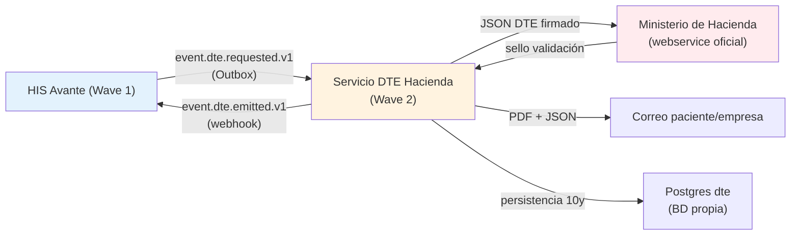

# ADR 0006 — DTE Hacienda como servicio separado del HIS

- **Estado:** Propuesto (diseño Wave 2)
- **Fecha:** 2026-05-13
- **Decisores:** @AE (proponente), @AS, @SRE, @AT, Legal Avante
- **Fase:** Post-MVP (Wave 2)
- **Norma de referencia:** Ley de Simplificación Tributaria de El Salvador (Decreto 487, 2022) + JSON Schema DTE 1.4 del Ministerio de Hacienda.
- **Diferimiento:** No bloqueante para Go-Live Wave 1. Avante opera con facturación papel/PDF firmado hasta cierre de este servicio.

## Contexto

El gobierno de El Salvador, a través del Ministerio de Hacienda (MH), exige desde 2022 la emisión obligatoria de **Documentos Tributarios Electrónicos (DTE)** para todos los contribuyentes formales. Los hospitales privados deben emitir:

- Factura Electrónica (FE) por servicios prestados a personas naturales y particulares.
- Comprobante de Crédito Fiscal Electrónico (CCFE) para clientes contribuyentes.
- Nota de Crédito Electrónica (NCE) y Nota de Débito Electrónica (NDE) para correcciones.
- Comprobante de Liquidación (CL) y Factura de Sujeto Excluido (FSE) en casos específicos.
- Comprobante de Retención Electrónico (CRE).

Cada DTE debe:

1. Cumplir el JSON Schema oficial del MH (versión vigente 1.4).
2. Firmarse digitalmente con certificado X.509 emitido por una Autoridad Certificadora autorizada por el MH (Avante adquirirá el suyo).
3. Enviarse al webservice del MH para sello de validación.
4. Almacenarse por el contribuyente durante 10 años para auditoría tributaria.
5. Enviarse al receptor (paciente/empresa) por correo electrónico con copia visual (PDF) + DTE original (JSON firmado).

Si el webservice MH no responde, el DTE puede emitirse en **modo contingencia** (firmado por el contribuyente) y enviarse posteriormente cuando el servicio MH esté disponible (ventana de 24h).

### Razones para mantener este servicio fuera del HIS

| Razón | Consecuencia |
|---|---|
| Ciclo de cambios normativos diferente al clínico | Cada cambio del MH en schema/proceso requiere redeploy independiente sin tocar HIS clínico. |
| Volumen alto y picos previsibles (cierre mes/quincena) | Escalado horizontal del servicio DTE sin impactar HIS. |
| Almacenamiento legal 10 años con auditorías MH | BD propia con backup y retention específicos; aislado del PHI clínico. |
| Acoplamiento con sistemas no-clínicos (POS, ERP) | Otros sistemas Avante consumen DTE; no deben tocar HIS clínico. |
| Riesgo regulatorio aislado | Multa o suspensión MH al servicio DTE no degrada operación clínica. |

## Decisión

**Servicio independiente `dte-hacienda` con BD propia, comunicado con HIS vía eventos asíncronos (Outbox + webhook).**

### Topología arquitectónica



### Especificación del servicio `dte-hacienda`

#### S1. Stack técnico

- **Runtime:** Node.js 22 LTS (alineado con HIS para reuso de SDKs/libs internas).
- **Framework:** Hono + tRPC (lightweight; no necesita Next.js).
- **Persistencia:** Postgres 15 dedicado (NO compartido con HIS; instancia Supabase separada).
- **Storage:** Supabase Storage bucket `dte-archive` (cifrado at-rest, retención 10y).
- **Firma:** Librería `node-forge` o `xades-js` para PKCS#7 / XAdES — TBD por Legal.
- **Despliegue:** Vercel Edge Functions + Vercel Postgres (o equivalente).
- **Observabilidad:** Sentry + Better Uptime + métricas custom Prometheus (compatible con HIS).

#### S2. Modelo de datos (high level)

```prisma
// packages/dte-hacienda/prisma/schema.prisma (NUEVO repo o paquete separado)

enum DteType {
  FE   // Factura Electrónica
  CCFE // Comprobante de Crédito Fiscal Electrónico
  NCE  // Nota de Crédito Electrónica
  NDE  // Nota de Débito Electrónica
  CL   // Comprobante de Liquidación
  FSE  // Factura de Sujeto Excluido
  CRE  // Comprobante de Retención Electrónico
}

enum DteStatus {
  Drafted       // creado, sin firmar
  Signed        // firmado pero no enviado a MH
  ValidatedByMH // sellado por MH
  Rejected      // rechazado por MH (con motivo)
  Voided        // anulado (NDE asociada)
  Contingency   // modo contingencia, pendiente envío
}

model DteDocument {
  id              String     @id @default(uuid())
  organizationId  String     // tenant Avante
  externalRequestId String   @unique // idempotencia desde HIS
  dteType         DteType
  status          DteStatus  @default(Drafted)

  // Datos del receptor (paciente o empresa)
  receiverDocType String     // DUI, NIT, etc.
  receiverDocNum  String
  receiverName    String
  receiverEmail   String?

  // Items (servicios facturados)
  items           DteItem[]

  // Totales
  subTotal        Decimal    @db.Decimal(14, 2)
  taxAmount       Decimal    @db.Decimal(14, 2)
  total           Decimal    @db.Decimal(14, 2)

  // Sello MH
  mhStampDateTime DateTime?  @db.Timestamptz()
  mhStampHash     String?    // hash de validación MH
  mhCorrelativo   String?    // correlativo asignado por MH

  // Firma digital
  signatureRef    String?    // PKCS#7 token reference
  signedJsonRef   String?    // path en storage al JSON firmado
  pdfRef          String?    // path en storage al PDF

  // Contingencia
  contingencyReason String?
  contingencyAt     DateTime? @db.Timestamptz()
  retryCount        Int       @default(0)
  lastRetryAt       DateTime? @db.Timestamptz()

  // Audit
  createdAt       DateTime   @default(now()) @db.Timestamptz()
  updatedAt       DateTime   @updatedAt @db.Timestamptz()

  @@index([organizationId, createdAt])
  @@index([status])
  @@index([mhCorrelativo])
}

model DteItem {
  id           String  @id @default(uuid())
  dteDocumentId String
  document     DteDocument @relation(fields: [dteDocumentId], references: [id], onDelete: Cascade)
  serviceCode  String  // CUPS o código interno
  description  String
  quantity     Decimal @db.Decimal(10, 2)
  unitPrice    Decimal @db.Decimal(12, 2)
  taxRate      Decimal @db.Decimal(5, 2)
  total        Decimal @db.Decimal(14, 2)
}

model DteEventLog {
  id             BigInt    @id @default(autoincrement())
  dteDocumentId  String
  eventType      String    // SIGN_REQUESTED, MH_SUBMITTED, MH_VALIDATED, etc.
  payload        Json
  actorId        String?
  occurredAt     DateTime  @default(now()) @db.Timestamptz()

  @@index([dteDocumentId, occurredAt])
}
```

#### S3. Endpoints expuestos

| Endpoint | Método | Auth | Descripción |
|---|---|---|---|
| `/v1/dte/emit` | POST | HMAC + tenant ID | Solicitar emisión DTE (idempotente por externalRequestId) |
| `/v1/dte/:id` | GET | HMAC | Consultar estado y artefactos |
| `/v1/dte/:id/void` | POST | HMAC | Anular DTE (genera NDE asociada) |
| `/v1/dte/:id/retry` | POST | HMAC | Reintentar envío MH (contingencia) |
| `/v1/dte/health` | GET | None | Healthcheck |
| `/v1/dte/webhook/mh-callback` | POST | MH signature | Callback del Ministerio Hacienda |

#### S4. Flujo principal (happy path)

```
1. HIS publica event.dte.requested.v1 al cerrar episodio facturable.
2. dte-hacienda recibe vía webhook /v1/dte/emit con idempotencia externalRequestId.
3. Valida payload contra JSON Schema MH 1.4.
4. Calcula totales, aplica reglas de redondeo del MH.
5. Firma JSON con certificado X.509.
6. Envía al webservice MH (timeout 30s).
7a. MH responde con sello → status=ValidatedByMH.
7b. MH no responde → status=Contingency, retry policy (1m, 5m, 15m, 1h, 4h, 24h).
8. Genera PDF visual + envía email al receptor.
9. Publica event.dte.emitted.v1 (webhook a HIS).
10. HIS actualiza referencia DTE en su Claim/Invoice.
```

#### S5. Integración con HIS

**Eventos consumidos (HIS → DTE):**

- `event.dte.requested.v1`: nuevo DTE a emitir.
  - Payload: `{ organizationId, externalRequestId, dteType, receiver, items[], totals }`
- `event.dte.void_requested.v1`: anulación DTE existente.
- `event.dte.email_resend_requested.v1`: reenviar email al receptor.

**Eventos producidos (DTE → HIS):**

- `event.dte.emitted.v1`: DTE emitido y sellado por MH.
- `event.dte.rejected.v1`: MH rechazó el DTE.
- `event.dte.voided.v1`: DTE anulado correctamente.
- `event.dte.contingency_activated.v1`: pasó a modo contingencia.

**Outbox pattern (tabla `domain_event` en HIS):**

HIS escribe al outbox al cerrar episodio facturable. Un worker (Vercel Cron + Inngest) lee outbox y POSTea a `/v1/dte/emit` con retry+idempotencia.

**Webhook DTE → HIS:**

DTE POSTea a `https://app.avante-his.com/api/webhooks/dte` con HMAC. HIS valida y actualiza Claim/Invoice referenciado por `externalRequestId`.

#### S6. Seguridad

- **Comunicación HIS↔DTE:** mTLS + HMAC signatures.
- **Comunicación DTE↔MH:** TLS + certificado X.509 Avante autorizado por MH.
- **Almacenamiento certificado:** Vercel Secrets (encrypted), rotación anual.
- **RLS:** una sola organización (Avante); pero el campo `organizationId` queda preparado para multi-cliente Avante futuro.
- **Audit log:** todos los eventos en `DteEventLog` append-only.
- **Retención:** 10 años obligatorio por ley MH.

#### S7. Performance y SLO

| Métrica | Target |
|---|---|
| Latencia p95 `/v1/dte/emit` | < 5s (incluye firma + envío MH) |
| Disponibilidad servicio | ≥ 99.0% mensual |
| Tasa éxito MH | ≥ 98% (cuando MH disponible) |
| Tiempo a salir de contingencia | < 24h |
| Throughput pico cierre mes | 500 DTE/min |

## Consecuencias

### Positivas

- HIS clínico no se ve afectado por cambios regulatorios fiscales.
- Servicio escalable independientemente.
- Riesgo regulatorio aislado.
- Reusable por otros sistemas Avante (POS, ERP).

### Negativas / Trade-offs

- Latencia adicional vs in-process call (mitigada con async outbox).
- Operación bicentral (HIS + DTE) — runbooks y monitoring por separado.
- Coordinación de despliegues si JSON Schema MH cambia drásticamente.
- Inversión en certificado X.509 + integración inicial.

### Mitigaciones

- Outbox + retry asegura entrega eventual (no pérdida de datos).
- Healthcheck mutuo entre HIS y DTE en `/admin/health`.
- Diccionario de errores compartido en `@his/contracts` package.
- Runbook conjunto `docs/sdlc/dte-hacienda-runbook.md` (a crear Wave 2).

## Alternativas consideradas y descartadas

### A1. DTE como módulo monolítico dentro del HIS

- Pros: menor latencia, despliegue único.
- Contras: acoplamiento clínico↔fiscal, cambios MH afectan HIS clínico, no reusable por otros sistemas Avante.
- Veredicto: rechazada — alto riesgo regulatorio en módulo de misión crítica clínica.

### A2. SaaS de terceros (FactuPro, Hulisoft, ContaSV)

- Pros: time-to-market < 1 mes.
- Contras: vendor lock-in, costo mensual por documento (~$0.10 USD), almacenamiento fuera de Avante, integración cerrada.
- Veredicto: rechazada — datos sensibles del paciente en JSON DTE (motivo, descripción servicio); preferimos control on-premise.

### A3. Microservicios múltiples (firma, MH client, email, archive)

- Pros: máxima separación de concerns.
- Contras: overkill para volumen Avante, complejidad operacional alta.
- Veredicto: rechazada para Wave 2 — un solo servicio `dte-hacienda` es suficiente.

## Implementación (roadmap Wave 2)

1. **Sprint 1 (4 semanas):** Setup repo, schema, autenticación con MH, firma X.509.
2. **Sprint 2 (4 semanas):** Implementar 5 DteType principales (FE, CCFE, NCE, NDE, CRE), happy path.
3. **Sprint 3 (3 semanas):** Modo contingencia, retry policy, webhook callbacks.
4. **Sprint 4 (3 semanas):** UI admin DTE en HIS (consultas, anulaciones), reportes fiscales.
5. **Sprint 5 (2 semanas):** Testing intensivo en ambiente MH testing.
6. **Sprint 6 (2 semanas):** Pruebas con MH producción + Go-Live DTE controlado.

Total estimado: 18 semanas desde inicio Wave 2.

## Validación

- ✅ Cumple ley DTE El Salvador 2022 + JSON Schema MH 1.4.
- ✅ Compatible con Wave 1 HIS sin reescritura.
- ✅ Permite operación clínica si DTE está caído (degradación elegante).
- ✅ Auditable y retenido por 10 años.
- ⏳ Pendiente: revisión legal final + adquisición certificado X.509 Avante.

## Referencias

- Ley de Simplificación Tributaria 2022 (Decreto 487, Asamblea Legislativa SV)
- JSON Schema DTE 1.4 — Portal MH El Salvador (https://factura.gob.sv/)
- ADR 0007 — Multi-ledger Accounting (consume DTE para fiscal local SV)
- `docs/04_modelo_datos.md` — modelos HIS Wave 1 que disparan DTE
