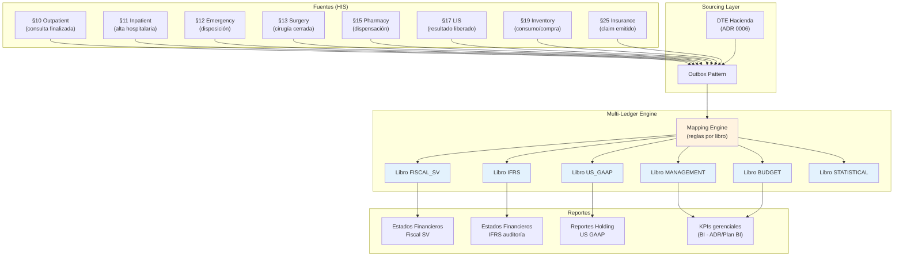

# ADR 0007 — Multi-ledger Accounting

- **Estado:** Propuesto (diseño Wave 2)
- **Fecha:** 2026-05-13
- **Decisores:** @AE (proponente), @AS, @DBA, @DA, Legal Avante, CFO Avante
- **Fase:** Post-MVP (Wave 2)
- **Norma de referencia:** IFRS Foundation Standards + US GAAP FASB + Código Tributario SV + buenas prácticas Avante grupo corporativo.
- **Dependencia:** ADR 0006 (DTE Hacienda) para sourcing de movimientos fiscales locales.
- **Diferimiento:** No bloqueante Go-Live Wave 1. Avante opera con ERP externo hasta cierre de este módulo.

## Contexto

El Grupo Inversiones Avante consolida operaciones hospitalarias en múltiples países (El Salvador, Honduras, Guatemala futuros) con requerimientos contables diferenciados:

1. **Reporte fiscal local SV** — Código Tributario SV + DGII + Ministerio Hacienda. Genera DTE (ADR 0006).
2. **Reporte IFRS** — Para auditoría externa, transparencia inversionistas extranjeros, futura emisión de bonos.
3. **Reporte US GAAP** — Reportes consolidados a holding internacional (si aplica).
4. **Contabilidad gerencial** — KPIs internos por servicio, doctor, unidad de negocio, no regulada.
5. **Presupuesto** — Comparación actual vs presupuesto aprobado, control de costos.
6. **Estadística** — Métricas no monetarias (camas-día, procedimientos, censo) que alimentan informes de gestión.

Cada libro tiene:
- **Plan de cuentas propio** (catálogo de cuentas distinto por norma contable).
- **Reglas de reconocimiento propias** (revenue recognition difiere entre IFRS y SV local).
- **Tipos de cambio propios** (USD funcional pero reportes en moneda local de cada país).
- **Período de cierre propio** (fiscal SV: 1 enero - 31 diciembre; IFRS: año natural; gerencial: mensual).

### Restricción Wave 1 actual

En el schema Wave 1 ya existen `Ledger` y `Account` con kind enum y `JournalEntry`/`JournalLine`. El diseño Wave 2 amplía estos modelos y añade los **6 libros simultáneos** con reglas de mapeo desde transacciones HIS.

## Decisión

**Modelo append-only de 6 libros (`Ledger`) con `JournalEntry` referencia transacción HIS origen, y reglas configurables por libro para mapear movimientos.**

### Topología arquitectónica



### Decisiones de diseño detalladas

#### D1. 6 libros simultáneos en una sola plataforma

| Ledger kind (enum ya existente en schema) | Norma | Propósito | Periodicidad cierre |
|---|---|---|---|
| `FISCAL_SV` | Código Tributario El Salvador | Reporte DGII, IVA, ISR | Mensual + Anual |
| `IFRS` | IFRS Foundation | Auditoría externa, inversionistas | Anual + Trimestral |
| `US_GAAP` | FASB | Consolidación holding (si aplica) | Anual |
| `MANAGEMENT` | Gerencial Avante | KPIs internos | Mensual |
| `BUDGET` | Presupuesto Avante | Control vs ejecutado | Mensual |
| `STATISTICAL` | Métricas no-monetarias | Censo, ocupación, procedimientos | Diaria |

Justificación: separar 6 libros permite que cada uno tenga su propio plan de cuentas, reglas de reconocimiento, y períodos de cierre. Sin esto, terminamos con ajustes manuales costosos al final de cada período.

#### D2. JournalEntry append-only

Una vez creado un asiento contable, **NO se modifica**. Toda corrección se hace con un nuevo asiento de reversión + asiento correcto, ambos referenciados por `originalEntryId`.

```prisma
model JournalEntry {
  id              String          @id @default(uuid())
  organizationId  String
  ledgerId        String          // FK al libro
  ledger          Ledger          @relation(...)

  entryDate       DateTime        @db.Timestamptz()
  description     String          @db.VarChar(500)
  documentRef     String?         // referencia a tx HIS o DTE
  documentType    String?         // 'invoice', 'dte_fe', 'dispensation', etc.

  status          JournalEntryStatus @default(Posted)
  // Reversal chain
  reversesEntryId String?
  reversedByEntryId String?

  // FX snapshot (caso multimoneda)
  fxRate          Decimal?        @db.Decimal(18, 8)
  fxRateDate      DateTime?       @db.Date

  // Audit
  postedAt        DateTime        @default(now()) @db.Timestamptz()
  postedById      String
  closedPeriodId  String?         // si entry está en período cerrado

  lines           JournalLine[]

  @@index([organizationId, ledgerId, entryDate])
  @@index([documentType, documentRef])
}

enum JournalEntryStatus {
  Draft       // staging, aún no posted
  Posted      // confirmed
  Reversed    // reversado por otro entry
  Voided      // anulado completamente
}

model JournalLine {
  id            String   @id @default(uuid())
  journalEntryId String
  entry         JournalEntry @relation(fields: [journalEntryId], references: [id])

  accountId     String   // FK al plan de cuentas del libro
  account       Account  @relation(...)

  debit         Decimal  @db.Decimal(18, 4)
  credit        Decimal  @db.Decimal(18, 4)
  // sum(debit) == sum(credit) constraint a nivel JournalEntry

  taxTypeId     String?  // referencia al tipo impuesto SV (IVA 13%, ISR 5%)
  costCenterId  String?  // unidad de negocio
  doctorId      String?  // para attribution
  servicePeriodFrom DateTime? @db.Date
  servicePeriodTo   DateTime? @db.Date

  description   String   @db.VarChar(300)
}
```

#### D3. Account chart hierarchical por libro

```prisma
model Account {
  id              String   @id @default(uuid())
  ledgerId        String
  ledger          Ledger   @relation(...)

  code            String   @db.VarChar(40) // ej: '1.1.01.001'
  name            String   @db.VarChar(200)
  accountType     AccountType
  isLeaf          Boolean  @default(true)
  parentAccountId String?
  parent          Account? @relation("Hierarchy", fields: [parentAccountId], references: [id])
  children        Account[] @relation("Hierarchy")

  isActive        Boolean  @default(true)
  allowPosting    Boolean  @default(true)
  natureSign      AccountNature // DEBIT or CREDIT (natural balance)

  @@unique([ledgerId, code])
  @@index([ledgerId, parentAccountId])
}

enum AccountType {
  Asset
  Liability
  Equity
  Revenue
  Expense
  Statistical  // para STATISTICAL ledger únicamente
}
```

#### D4. FX rate snapshot por entry

Caso multi-moneda: una transacción USD se registra en el libro IFRS en USD funcional, pero el libro FISCAL_SV requiere USD (moneda funcional SV). La conversión usa el FX rate del día del entry, snapshot persistido.

`fxRate` y `fxRateDate` se snapshot al momento del posting; cambios posteriores en `ExchangeRate` no alteran entries posted.

#### D5. Tax types por país

```prisma
model TaxType {
  id              String   @id @default(uuid())
  countryCode     String   @db.VarChar(3) // 'SLV', 'HND', 'GTM'
  code            String   @db.VarChar(20) // 'IVA_13', 'ISR_5', 'IVA_HND_15'
  name            String   @db.VarChar(120)
  rate            Decimal  @db.Decimal(5, 4) // 0.1300 = 13%
  validFrom       DateTime @db.Date
  validTo         DateTime? @db.Date

  @@index([countryCode, code, validFrom])
}
```

Esto permite ampliar a Honduras (IVA 15%, ISR escalonado) y Guatemala (IVA 12%, ISR 7%) sin redeploy.

#### D6. Close period workflow

```prisma
model AccountingPeriod {
  id              String   @id @default(uuid())
  organizationId  String
  ledgerId        String
  periodYear      Int
  periodMonth     Int      // 1-12; usar 0 para anual
  startDate       DateTime @db.Date
  endDate         DateTime @db.Date
  status          PeriodStatus @default(Open)

  closedAt        DateTime?    @db.Timestamptz()
  closedById      String?
  closingNote     String?      @db.VarChar(500)

  @@unique([organizationId, ledgerId, periodYear, periodMonth])
}

enum PeriodStatus {
  Open
  PendingClose  // staging final ajustes
  Closed        // no admite más entries
  Reopened      // excepcional, requiere autorización
}
```

Reglas:
- Un `JournalEntry` con `entryDate` dentro de un período `Closed` requiere reapertura explícita (`Reopened`).
- Reapertura requiere autorización dual (CFO + Auditor).
- Cierre genera un `PeriodCloseReport` con balance sheet + P&L snapshot.

#### D7. Mapping rules engine

Cada evento HIS dispara entries en N libros simultáneamente, según reglas configuradas:

```typescript
// packages/accounting-rules/src/rules/outpatient.ts (a crear Wave 2)

export const outpatientCompletedRules: MappingRule[] = [
  {
    eventType: 'event.outpatient.encounter.completed.v1',
    target: 'FISCAL_SV',
    when: (event) => event.payerType === 'PRIVATE',
    journal: (event, ctx) => ({
      description: `Consulta ambulatoria ${event.encounterId}`,
      documentRef: event.encounterId,
      documentType: 'outpatient_encounter',
      lines: [
        { accountCode: '1.1.02.001', debit: event.amount, credit: 0 }, // Cuentas por cobrar
        { accountCode: '4.1.01.001', debit: 0, credit: event.netAmount }, // Ingreso consulta
        { accountCode: '2.1.04.001', debit: 0, credit: event.taxAmount }, // IVA por pagar
      ]
    })
  },
  {
    eventType: 'event.outpatient.encounter.completed.v1',
    target: 'IFRS',
    journal: (event, ctx) => ({
      // Plan IFRS distinto: usa cuentas IAS 18 / IFRS 15
      description: `Outpatient revenue ${event.encounterId}`,
      lines: [
        { accountCode: '120-001', debit: event.amount, credit: 0 },
        { accountCode: '400-100', debit: 0, credit: event.amount },
      ]
    })
  },
  {
    eventType: 'event.outpatient.encounter.completed.v1',
    target: 'STATISTICAL',
    journal: (event, ctx) => ({
      description: `Consulta finalizada`,
      lines: [
        { accountCode: 'STAT-001', debit: 1, credit: 0 }, // contador consultas
      ]
    })
  }
];
```

Las reglas se versionan en git (no en BD) para auditabilidad. Cambios requieren PR + revisión CFO.

## Consecuencias

### Positivas

- **Cumplimiento simultáneo:** un solo origen de verdad genera reportes fiscales, IFRS y gerenciales sin reconciliaciones manuales costosas.
- **Auditable:** entries append-only con linaje completo al evento HIS originador.
- **Escalable multipaís:** soporte para HND, GTM con cambios mínimos.
- **Versionado de reglas:** cambios contables traceable en git.
- **Decoupled HIS:** módulos clínicos no necesitan saber de contabilidad.

### Negativas / Trade-offs

- **Complejidad inicial alta:** 6 libros, reglas de mapeo, períodos de cierre.
- **Volumen de datos:** cada transacción HIS genera 3-6 entries (uno por libro relevante).
- **Curva de aprendizaje:** Avante necesita contador con experiencia multi-norma.
- **Tooling propio:** no usamos un ERP off-the-shelf; mantenemos las reglas internamente.

### Mitigaciones

- Implementar libro `FISCAL_SV` primero (Sprint 1-3 Wave 2); IFRS y demás después.
- Particionar `journal_entry` por mes para queries eficientes.
- Reglas en código + tests unitarios obligatorios.
- Contratar contador senior multi-norma en T-30d antes Wave 2.

## Alternativas consideradas y descartadas

### A1. ERP comercial (SAP S/4HANA, Oracle Cloud ERP, Microsoft Dynamics 365)

- Pros: madurez, soporte oficial, cumplimiento de norma garantizado.
- Contras: costo prohibitivo (~$50k+ USD/año licencia + implementación), vendor lock-in, integración compleja con HIS custom, configuración rígida.
- Veredicto: rechazada — Avante prefiere control y costos predecibles.

### A2. Software libre (Odoo, ERPNext, Dolibarr)

- Pros: bajo costo, modificable.
- Contras: módulo SV específico inmaduro, requiere personalización pesada para multi-libro, riesgo de divergencia con tronco.
- Veredicto: rechazada — alto costo de mantenimiento personalizado.

### A3. Single-ledger con dimensiones (un libro, dimensión "norma")

- Pros: simpler schema.
- Contras: no permite planes de cuentas distintos, complica close periods, dificulta auditoría externa IFRS.
- Veredicto: rechazada — auditoría IFRS exigió libro separado.

### A4. ETL nocturno desde HIS a sistema contable externo

- Pros: bajo acoplamiento.
- Contras: latencia 24h, reconciliaciones costosas, no en tiempo real.
- Veredicto: rechazada — Avante necesita tiempo real para flujos críticos (IVA, claims).

## Implementación (roadmap Wave 2)

1. **Sprint 1 (4 semanas):** Schema completo + plan de cuentas SV + período Open/Close.
2. **Sprint 2 (4 semanas):** Mapping engine + reglas iniciales (outpatient, inpatient, surgery).
3. **Sprint 3 (3 semanas):** Reglas pharmacy + LIS + inventory + insurance.
4. **Sprint 4 (3 semanas):** Libro IFRS + reglas paralelas.
5. **Sprint 5 (3 semanas):** UI admin contable (consultas, ajustes, cierre).
6. **Sprint 6 (3 semanas):** Reportes estados financieros + dashboards BI.
7. **Sprint 7 (3 semanas):** Libro MANAGEMENT + BUDGET + STATISTICAL.
8. **Sprint 8 (2 semanas):** Testing intensivo + paralelo con ERP actual Avante.
9. **Sprint 9 (2 semanas):** Capacitación contadores + cutover.

Total estimado: 27 semanas desde inicio Wave 2.

## Validación

- ✅ Cumple Código Tributario SV (libro FISCAL_SV).
- ✅ Compatible IFRS Foundation Standards (libro IFRS).
- ✅ Extensible a US GAAP, HND, GTM.
- ✅ Append-only auditable.
- ✅ Depende correctamente de ADR 0006 (DTE) para fiscal local.
- ⏳ Pendiente: definición exacta del plan de cuentas SV con CFO Avante.

## Referencias

- ADR 0006 — DTE Hacienda separate service (fuente de fiscal SV)
- IFRS Foundation — IFRS 15 Revenue Recognition
- FASB ASC 606 — Revenue from Contracts with Customers
- Código Tributario El Salvador (Decreto Legislativo 230, 2000)
- `docs/04_modelo_datos.md` — modelos HIS Wave 1 que disparan entries
- `docs/25_bi_plan.md` — plan BI consume libros MANAGEMENT y STATISTICAL
