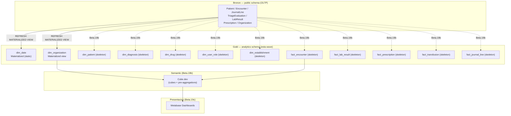

# ADR 0009 — BI Medallion Architecture

- **Estado:** Aceptado
- **Fecha:** 2026-05-16
- **Decisores:** @DA (proponente), @AE, @DBA, CFO Avante, CMO Avante
- **Fase:** Fase 6 — BI y Reporteria (TDR §26-27)
- **Dependencias:**
  - ADR 0007 (Multi-ledger Accounting) — fuente de hechos financieros
  - ADR 0006 (DTE Hacienda) — sourcing fiscal SV
  - `docs/25_bi_plan.md` — plan BI Wave 2 aprobado
- **Wave:** Beta.19a (planning + foundation SQL)

---

## Contexto

HIS Multipaís necesita capacidad de reporteria ejecutiva, clinica y regulatoria
(MINSAL SV, CVPCPA) sobre datos transaccionales producidos por los modulos §5–§25.
El modelo OLTP (Postgres 4NF, RLS por organization_id) no puede servir directamente
queries analiticas complejas sin degradar el rendimiento operacional.

Restricciones de partida:

- **Presupuesto de infraestructura fase 6:** conservar el mismo Postgres/Supabase;
  no provisionar data warehouse externo en Beta.19a.
- **Equipo disponible en Fase 6:** @DA + @BID (1 FTE conjunto); @BIA para
  validacion de metricas.
- **Latencia objetivo (clinico):** datos visibles en dashboard en < 1.5 h.
- **Latencia objetivo (financiero):** < 28 h (aceptable por naturaleza contable).
- **RLS y multi-tenancy:** cualquier capa analitica debe aislar datos por
  organization_id, igual que OLTP.

---

## Decision

**Medallion Architecture en el mismo cluster Postgres/Supabase, usando el schema
`analytics` como capa gold inicial.** La evolucion a un lakehouse externo (S3 +
Iceberg o Delta Lake) queda pospuesta hasta que el volumen tabular supere 200 GB
o el equipo de BI escale a 3+ FTE dedicados.

### Justificacion del trade-off principal

| Opcion | Latencia | Costo mes | Complejidad ops | Veredicto |
|--------|----------|-----------|-----------------|-----------|
| **Postgres analytics schema** (esta decision) | < 1.5 h (matviews) | $0 adicional | Baja (mismo cluster) | **Elegida** |
| Replica Postgres + schema separado | < 15 min (replica lag) | $200-400 (Supabase Pro+) | Media | Fase 6b si volumen lo exige |
| Redshift / BigQuery externo | < 5 min (streaming CDC) | $800-2000 | Alta (CDC, IAM, redes) | Wave 3 multi-pais |
| Lakehouse (S3 + Iceberg + Athena) | Minutos-horas | $300-800 + ELT ops | Muy alta | Wave 3+ |

El analytics schema en el mismo Postgres elimina cualquier costo de replica,
mantiene RLS nativa de Postgres, y permite a @BID usar SQL estandar sin tooling
adicional. El riesgo de contention con el OLTP se mitiga con `statement_timeout`
y `lock_timeout` en el rol `bi_reader`.

---

## Arquitectura Medallion

### Capas definidas

```
Bronze (raw)          Silver (clean+conformed)      Gold (business-ready)
────────────          ────────────────────────       ─────────────────────
public.*              [future: staging schema]       analytics.*
tablas OLTP           dbt incremental models         dim_* + fact_* + agg_*
append-only           dedup, tipo casting,           materialized views
sin transformar       SCD handling, FK resolve       refresh cadenciado
```

Para Beta.19a el esquema es simplificado: Bronze = public schema existente;
Silver se omite (se implementa en Beta.19b con dbt); Gold = `analytics` schema
con materialized views que seleccionan directamente de public.

En Beta.19b @DE implementara la capa Silver con dbt-core o transformaciones SQL
incrementales. En ese momento fact_* podran refactorizarse para leer de staging
en vez de public directamente.

### Topologia Beta.19a



---

## Decisiones de diseno detalladas

### D1. Schema `analytics` separado (no schema `public`)

Separar schemas permite:
- Control de permisos independiente (GRANT SELECT en analytics sin exponer public).
- Evitar colisiones de nombres con tablas OLTP.
- Habilitar future migration a replica/warehouse sin cambiar las queries downstream.

### D2. Naming convention

| Objeto | Patron | Ejemplo |
|--------|--------|---------|
| Dimension | `dim_<entidad>` | `dim_patient`, `dim_date` |
| Fact | `fact_<proceso>` | `fact_encounter`, `fact_journal_line` |
| Agregado pre-calculado | `agg_<granularidad>_<proceso>` | `agg_daily_encounter` |
| Funcion de refresh | `analytics.refresh_<objeto>()` | `analytics.refresh_all()` |
| Secuencia de surrogate key | `<tabla>_sk_seq` | `dim_patient_sk_seq` |

Surrogate keys (SK) como `BIGINT GENERATED ALWAYS AS IDENTITY` en dims.
Natural keys del OLTP se preservan como atributos (`patient_id UUID`).

### D3. Slowly Changing Dimensions — estrategia por dimension

| Dimension | Tipo SCD | Razon |
|-----------|----------|-------|
| `dim_date` | Estatica (no cambia) | Calendario no muta |
| `dim_organization` | SCD Tipo 1 (overwrite) | Cambios raros; historico no requerido por BI |
| `dim_establishment` | SCD Tipo 1 (overwrite) | Idem |
| `dim_patient` | SCD Tipo 2 (versiones con `valid_from`/`valid_to`) | Datos demograficos cambian; historial clinico requiere snapshot al momento del encuentro |
| `dim_diagnosis` | SCD Tipo 1 | CIE-10 catalog; versiones por `code_system_version` |
| `dim_drug` | SCD Tipo 1 | Catalogo de farmacos; nombre comercial puede cambiar |
| `dim_user_role` | SCD Tipo 1 | Rol actual del usuario para atribucion |

### D4. Rol `bi_reader` — acceso minimo

- Solo `SELECT` en `analytics.*`.
- `statement_timeout = '30s'`, `lock_timeout = '5s'` para no bloquear OLTP.
- Nunca accede a `public.*` directamente; las materialized views son la unica
  superficie expuesta.
- Cube.dev conecta como `bi_reader` en las queries de produccion.

### D5. Refresh strategy — cadencia inicial

| Objeto | Tipo | Cadencia | Mecanismo |
|--------|------|----------|-----------|
| `dim_date` | REFRESH MATERIALIZED VIEW CONCURRENTLY | Una vez al ano (o al desplegar) | Manual / `analytics.refresh_all()` |
| `dim_organization` | REFRESH MATERIALIZED VIEW CONCURRENTLY | Cada 24 h | pg_cron job |
| `dim_establishment` | REFRESH MATERIALIZED VIEW CONCURRENTLY | Cada 24 h | pg_cron job |
| Dims Beta.19b (patient, diag, drug, user_role) | REFRESH MV CONCURRENTLY | Cada 1 h | pg_cron job |
| Facts (encounter, lab, rx, transfusion) | REFRESH MV CONCURRENTLY | Cada 1 h (clinico) | pg_cron job |
| `fact_journal_line` | REFRESH MV CONCURRENTLY | Cada 4 h (financiero) | pg_cron job |

`CONCURRENTLY` requiere un unique index en la matview; se especifica en SQL 48.
El fallback si el cluster no soporta pg_cron es un edge function de Supabase
con `invoke()` en cron schedule.

### D6. Multi-tenancy en analytics

Toda matview incluye `organization_id UUID NOT NULL`. RLS se habilita en
analytics schema siguiendo el mismo patron que public (SQL 49):
`current_setting('app.current_org_id')::uuid`.

El rol `bi_reader` esta sujeto a RLS. Cube.dev propaga `organizationId` via
`securityContext` a la sesion Postgres antes de ejecutar queries.

### D7. PHI redaction en analytics

Datos PHI (nombre paciente, numero documento) no se exponen en facts.
Las facts usan el surrogate key de dim_patient (`patient_sk`), no el UUID
ni el nombre. El join a dim_patient requiere rol elevado (`bi_clinical_lead`)
y una politica RLS adicional. Implementacion completa en Beta.19b.

---

## Consecuencias

### Positivas

- Cero costo de infraestructura adicional en Beta.19a.
- RLS nativa de Postgres; no requiere re-implementacion en capa externa.
- Path claro de evolucion: cuando el volumen lo requiera, las matviews se
  reemplazan por vistas sobre una replica/warehouse externo sin cambiar
  las queries de Cube.dev.
- `dim_date` completamente poblable con SQL puro (sin fuentes externas).

### Negativas / trade-offs

- Matviews bloquean brevemente la tabla origen durante el refresh si no se
  usa `CONCURRENTLY` (mitigado con indices unicos obligatorios).
- Queries pesadas de BI comparten I/O con OLTP (mitigado con
  `statement_timeout` y horario de refresh nocturno para facts pesadas).
- No hay capa Silver real en Beta.19a; la logica de limpieza vive en la
  definicion SQL de cada matview (aceptable para el volumen inicial).

---

## Alternativas descartadas

### A1. Read Replica + schema separado (descartada para Beta.19a)

Ventaja: aislamiento de I/O total. Costo: $200-400/mes adicional en Supabase
Pro+. Veredicto: justificado cuando el volumen supere 50 GB tabular o cuando
los reportes ejecutivos en horario pico degraden el OLTP. Candidato natural
para Beta.19b/c.

### A2. dbt + Postgres (descartada como capa unica)

dbt-core es el mecanismo correcto para la capa Silver (transformaciones
incrementales). Sin embargo, para Gold (serving), las matviews de Postgres
son mas simples de operar que dbt models corriendo en Airflow/pg_cron.
Decision: usar dbt en Silver (Beta.19b), matviews en Gold (Beta.19a).

### A3. Lakehouse externo (S3 + Iceberg + Athena o Redshift)

Overkill para el volumen actual (< 30 GB tabular a 3 anos). Requiere
DataOps experience que el equipo no tiene en Fase 6. Reservado para Wave 3
multipaís cuando el grupo Avante consolide Honduras y Guatemala.

---

## Validacion

- Analytics schema completamente aislado de public por permisos.
- `bi_reader` no puede escribir ni acceder a public directamente.
- `dim_date` poblable con funcion SQL sin fuentes externas.
- RLS en analytics hereda logica de `app.current_org_id`.
- Naming convention validada contra plan BI (`docs/25_bi_plan.md`): `fact_encounter`
  mapea al cube `Encounter`, `fact_journal_line` mapea al cube `JournalEntry`.

---

## Referencias

- ADR 0007 — Multi-ledger Accounting (fuente de `fact_journal_line`)
- ADR 0008 — Beta.15 Notifications Outbox (patron pg_cron reutilizado para refresh)
- `docs/25_bi_plan.md` — cubes Cube.dev, metricas iniciales, roles BI
- `docs/blueprints/beta19_bi_modelo_dimensional.md` — diseno detallado de dims + facts
- `packages/database/sql/48_bi_analytics_schema.sql` — implementacion foundation
- `packages/database/sql/49_bi_rls.sql` — RLS en analytics schema
- Kimball Group — The Data Warehouse Toolkit (SCD types)
- dbt docs — Incremental models
