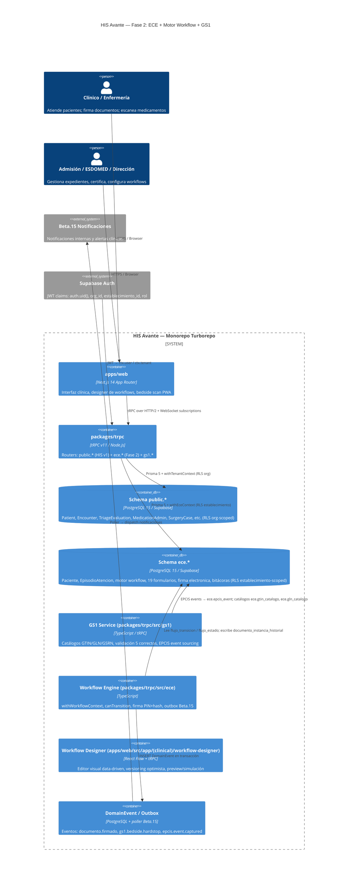
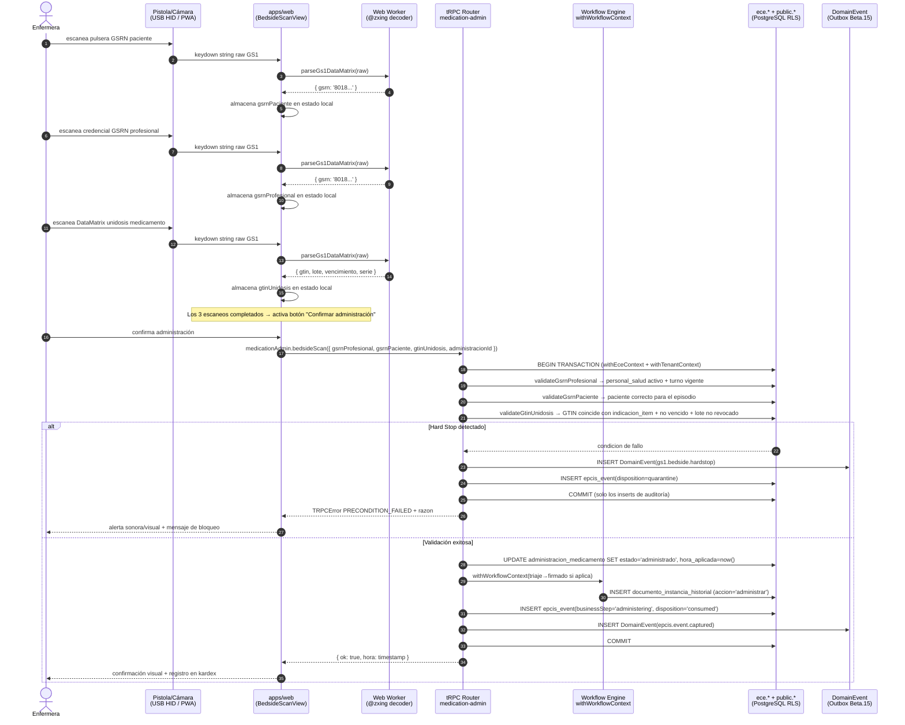

# Blueprint Arquitectónico — Fase 2 HIS Avante
## ECE (Expediente Clínico Electrónico) + Motor Workflow + GS1

**Versión:** 1.0.0  
**Fecha:** 2026-05-16  
**Autor:** @AS — Arquitecto de Software  
**Referencia normativa:** NTEC Acuerdo n.° 1616 MINSAL 2024 + Guía GS1 Hospitalaria

---

## 1. Arquitectura Objetivo — C4 Nivel Contenedor



### Notas de convivencia schema `public.*` + `ece.*`

| Aspecto | `public.*` (HIS actual) | `ece.*` (Fase 2) |
|---|---|---|
| Tenant scope | `organization_id` | `establecimiento_id` |
| RLS actor | `withTenantContext` + rol `authenticated` | `withEceContext` + rol `authenticated` |
| Audit | `audit.audit_log` con hash chain (TDR §6.3) | `ece.bitacora_auditoria` + `ece.bitacora_acceso` (Art. 55-56 NTEC) |
| Paciente root | `public.Patient` (MPI multi-tenant) | `ece.paciente` (expediente único por establecimiento NTEC) |
| Encounter | `public.Encounter` | `ece.episodio_atencion` (mapeo explícito, ver §5) |

---

## 2. Decisión de Schema — ADR-F2-01

### Contexto

El ECE NTEC exige un expediente único por usuario en el SNIS (Ley SNIS Arts. 24-26). El sistema HIS ya cuenta con `public.Patient` y `public.Encounter` bajo multitenancy `organization_id`. El esquema `ece.*` definido en los insumos tiene su propia `ece.paciente` raíz y `ece.episodio_atencion`.

### Opciones

| Criterio | Opción A: Schema `ece` autónomo | Opción B: Reuso `public.Patient` + tablas `ece.*` documentales |
|---|---|---|
| Alineación NTEC | Alta: `ece.paciente` modela exactamente Art. 15 (NUI, CUN, identificadores, expediente único) | Media: `public.Patient` carece de NUI, CUN, número de expediente NTEC, afiliación ISSS |
| Duplicación de datos | Sí — require sincronización `public.Patient` ↔ `ece.paciente` | No duplicación; `public.Patient` actúa como fuente única |
| RLS multitenancy | Limpio: la policy `ece` usa `establecimiento_id` distinto de `organization_id`; no hay mezcla de scopes | Complejo: una entidad Patient debe satisfacer dos políticas RLS con granularidades distintas |
| Complejidad sync | Alta: trigger o job que mantenga coherencia entre los dos registros de paciente | Baja para datos existentes; alta para datos exclusivos NTEC (NUI, expediente) que no existen en `public.Patient` |
| Performance | Sin join cross-schema para el flujo ECE puro; queries simples dentro de `ece.*` | Joins frecuentes cross-schema para componer el expediente |
| Migración MVP → ECE | Requiere script de seed inicial de `ece.paciente` desde `public.Patient` (ADR-F2-07) | No requiere migración de datos de paciente |
| Riesgo de schema drift | Menor: `ece.*` evoluciona independiente de `public.*` | Mayor: cambios en `public.Patient` pueden romper el ECE |

### Recomendación: **Opción A — Schema `ece` separado**

La Opción A es preferible porque:

1. `public.Patient` no modela los campos NUI, CUN, número de expediente NTEC, patrón de numeración por establecimiento, ni afiliación ISSS — añadirlos contaminaría el modelo MPI multi-país.
2. Las políticas RLS tienen granularidades distintas: `organization_id` (HIS global) vs. `establecimiento_id` (NTEC local). Mezclarlas en una sola tabla viola el principio de responsabilidad única del bounded context.
3. El motor de workflow data-driven (tablas `tipo_documento`, `flujo_estado`, `flujo_transicion`) opera exclusivamente sobre entidades `ece.*`; no tiene acoplamiento con `public.*`.
4. Vernon (*Implementing Domain-Driven Design*, cap. 2): los bounded contexts deben tener sus propios modelos; el mapeo entre contextos es explícito y controlado.

**Consecuencias:**

- Debe existir un **Anticorruption Layer (ACL)** que mapea `public.Patient.id` ↔ `ece.paciente.public_patient_id` (columna FK nullable que permite lookup bidireccional).
- El script `ADR-F2-07` siembra `ece.paciente` desde `public.Patient` en el arranque del piloto.
- Los routers que afectan ambos bounded contexts (p. ej. `patient.router` → crear ficha identificación) orquestan dos escrituras en transacción distribuida emulada: primero `public.Patient`, luego `ece.paciente`, con rollback explícito si el segundo falla.

---

## 3. Motor de Workflow — Diseño Técnico

### 3.1 Invocación desde routers tRPC

```typescript
// packages/trpc/src/ece/workflow-context.ts

export interface WorkflowTransitionInput {
  tipoDocumentoCodigo: string;     // e.g. 'triaje', 'epicrisis_egreso'
  instanceId: string;               // ece.documento_instancia.id
  accion: string;                   // e.g. 'firmar', 'validar', 'certificar'
  personalId: string;               // ece.personal_salud.id
  rolId: string;                    // ece.rol.id del ejecutor
  firmaId?: string;                 // ece.firma_electronica.id (si requiere_firma = true)
  observacion?: string;
}

export async function withWorkflowContext(
  prisma: PrismaClient,
  eceEstablecimientoId: string,
  input: WorkflowTransitionInput,
  callback: (tx: Prisma.TransactionClient) => Promise<void>
): Promise<void>
```

El helper ejecuta dentro de una transacción Prisma. Antes de invocar `callback`, valida la transición con `canTransition`. Si es válida, escribe en `ece.documento_instancia_historial` y dispara el evento de outbox. Patrón análogo a `withTenantContext` del schema `public.*`.

### 3.2 Validación de transición

```typescript
// packages/trpc/src/ece/workflow-engine.ts

export async function canTransition(
  tx: Prisma.TransactionClient,
  tipoDocumentoId: string,
  estadoOrigenId: string,
  accion: string,
  rolId: string
): Promise<{ allowed: boolean; requiereFirma: boolean; transicionId: string | null }> {
  const transicion = await tx.$queryRaw<FluentTransicion[]>`
    SELECT id, requiere_firma
    FROM ece.flujo_transicion
    WHERE tipo_documento_id = ${tipoDocumentoId}
      AND estado_origen_id  = ${estadoOrigenId}
      AND accion            = ${accion}
      AND rol_autoriza_id   = ${rolId}
  `;
  if (transicion.length === 0) return { allowed: false, requiereFirma: false, transicionId: null };
  return { allowed: true, requiereFirma: transicion[0].requiere_firma, transicionId: transicion[0].id };
}
```

El dato reside en `ece.flujo_transicion`; cambiar un flujo es un `UPDATE` de dato, no una migración de código.

### 3.3 Firma electrónica simple — vínculo y validación

El router `eceProcedure` (ver §9) exige que el `personalId` tenga una fila activa en `ece.firma_electronica` y que el PIN provisto produzca `SHA-256(PIN + salt)` igual al hash almacenado. El vínculo es 1:1 (Art. 23 NTEC).

```typescript
export async function validateFirma(
  tx: Prisma.TransactionClient,
  personalId: string,
  pinIngresado: string
): Promise<string> { // retorna firma_electronica.id
  const firma = await tx.$queryRaw<FirmaRow[]>`
    SELECT id, hash_pin, salt
    FROM ece.firma_electronica
    WHERE personal_id = ${personalId} AND activa = true
  `;
  if (firma.length === 0) throw new TRPCError({ code: 'FORBIDDEN', message: 'Sin firma activa' });
  const computed = crypto.createHash('sha256').update(pinIngresado + firma[0].salt).digest('hex');
  if (computed !== firma[0].hash_pin) throw new TRPCError({ code: 'FORBIDDEN', message: 'PIN incorrecto' });
  return firma[0].id;
}
```

Cache de PIN activo 15 min en sesión server-side (cookie HttpOnly) para reducir fricción sin sacrificar seguridad.

### 3.4 Evento de dominio al cambiar estado → outbox Beta.15

Dentro de la transacción del workflow, se inserta en `public.DomainEvent` (outbox Beta.15 existente):

```typescript
await tx.domainEvent.create({
  data: {
    organizationId: ctx.tenant.organizationId,
    eventType: 'ece.documento.firmado',
    aggregateType: 'DocumentoInstancia',
    aggregateId: input.instanceId,
    payload: {
      tipoDocumento: tipoDocumentoCodigo,
      accion: input.accion,
      estadoNuevo: nuevoEstadoCodigo,
      personalId: input.personalId,
    },
    occurredAt: new Date(),
  },
});
```

El poller Beta.15 existente recoge el evento y despacha la notificación correspondiente.

---

## 4. Designer Visual de Workflows — Arquitectura

### 4.1 Decisión de librería frontend — ADR-F2-06

**React Flow** (`@xyflow/react`) es la opción recomendada sobre Mermaid editor o canvas custom:

| Criterio | React Flow | Mermaid editor | Canvas custom |
|---|---|---|---|
| Interactividad (drag/drop nodos, aristas) | Nativa | No (solo renderizado) | Alta pero costosa de construir |
| Integración React/Next.js | Excelente (componente React puro) | Moderada (iframe o div) | Total |
| Persistencia de estado | `useReactFlow()` → serialización JSON propia | No aplica | Manual |
| Licencia | MIT | MIT | — |
| Curva de aprendizaje | Baja (1-2 días) | Muy baja | Alta (semanas) |
| Esfuerzo estimado | 3 sprints | 1 sprint (solo visualización) | 6+ sprints |

React Flow permite mapear directamente los nodos a filas `ece.flujo_estado` y las aristas a filas `ece.flujo_transicion`, con metadata de rol, acción y `requiere_firma` en los labels de arista.

### 4.2 Persistencia con versionado optimista

El designer opera sobre una representación en memoria del workflow (grafo React Flow) y persiste al confirmar cambios:

```typescript
// Mutation del designer
eceWorkflow.publishVersion.mutate({
  tipoDocumentoCodigo: 'triaje',
  version: currentVersion,          // número de versión cliente (optimistic lock)
  estados: [...],                   // array de ece.flujo_estado a upsert
  transiciones: [...],              // array de ece.flujo_transicion a upsert
});
```

El router verifica que `currentVersion === DB.version` antes de aplicar el cambio. En conflicto devuelve `CONFLICT (409)` con el estado actual para resolución manual.

### 4.3 Preview / simulación

El componente `WorkflowSimulator` (client-side) carga el grafo de estados y permite navegar transiciones paso a paso sin persistir, mostrando qué rol puede ejecutar cada acción y si se requiere firma. Se renderiza en un drawer lateral del designer.

### 4.4 Locking durante edición

Optimistic locking con `version` (ver §4.2). No se implementa distributed lock (WebSocket room) en MVP: el mecanismo de conflicto 409 es suficiente dado el bajo concurrencia esperada (solo administradores del establecimiento editan workflows). Se puede escalar a Supabase Realtime presence en una fase posterior si es necesario.

---

## 5. Integración con Módulos HIS Existentes

### 5.1 `patient.router` — Ficha de Identificación NTEC

Al crear o editar un paciente en HIS, si el establecimiento tiene ECE habilitado, se ejecuta:

1. `public.Patient` CREATE/UPDATE (comportamiento actual, multi-tenant por `organization_id`).
2. Upsert de `ece.paciente` via `withEceContext`, vinculando `public_patient_id = public.Patient.id` y completando los campos NTEC adicionales (NUI, CUN, número de expediente NTEC, patrón de numeración, afiliación ISSS).
3. Si el step 2 falla, rollback de step 1 (transacción coordinada en el procedimiento tRPC).

Nuevo input de la mutation `patient.create`:

```typescript
eceFields?: {
  nui: string;
  cun?: string;
  numeroExpediente?: string;    // si ya existe en papel
  establecimientoId: string;
  afiliacionIsss?: { numeroAfiliado: string; tipo: AfiliacionTipo; };
}
```

### 5.2 `encounter.router` — Mapeo a `ece.episodio_atencion`

Cada `public.Encounter` creado genera automáticamente un `ece.episodio_atencion` correspondiente:

| `public.Encounter` | `ece.episodio_atencion` |
|---|---|
| `id` | → `public_encounter_id` (FK nullable) |
| `type` (EMERGENCY/OUTPATIENT/INPATIENT) | → `modalidad` (ambulatorio/hospitalario) |
| `establishmentId` | → `establecimiento_id` |
| `patientId` | → `paciente_id` (via lookup `ece.paciente.public_patient_id`) |

El mapeo es unidireccional: `public.*` es la fuente de admisión; `ece.*` es la fuente de documentación clínica.

### 5.3 `triage.router` — Documento `ece.triaje`

Al completar un `TriageEvaluation` (Manchester), el router emite un `documento_instancia` de tipo `triaje`:

```typescript
// Dentro de triage.router.ts, al transicionar a COMPLETED
await withWorkflowContext(prisma, establecimientoId, {
  tipoDocumentoCodigo: 'triaje',
  instanceId: newDocInstance.id,
  accion: 'firmar',
  personalId: personalSaludId,
  rolId: rolENFId,
  firmaId: firmaValidaId,
});
```

El triage Manchester existente en `public.TriageEvaluation` **no se elimina**; el documento ECE es una capa documental encima del registro clínico operacional.

### 5.4 `pharmacy.router` — GTIN para dispensación

En la dispensación de recetas, el picker de farmacia escanea el GS1 DataMatrix de la unidosis. El GTIN decodificado se valida contra `ece.gtin_catalogo` y la orden médica activa. Si el GTIN no hace match: `TRPCError({ code: 'PRECONDITION_FAILED' })`.

El registro de dispensación existente en `public.StockMovement` se enriquece con:

```typescript
gs1Fields?: {
  gtin: string;
  lote: string;
  vencimiento: Date;
  serie?: string;
  glnOrigen: string;
  glnDestino: string;
}
```

### 5.5 `medication-admin.router` — Bedside Scanning 5 correctos (eMAR)

Ver diagrama de secuencia en §11. El router implementa el hard-stop GS1 como server action:

```typescript
medicationAdmin.bedsideScan.mutate({
  gsrnProfesional: string,
  gsrnPaciente: string,
  gtinUnidosis: string,
  administracionMedicamentoId: string,
  establecimientoId: string,
})
```

Si cualquiera de las 5 validaciones falla, se retorna `TRPCError({ code: 'PRECONDITION_FAILED', message: 'GS1_HARDSTOP', data: { razon, codigoGs1 } })` y se inserta un `DomainEvent` de tipo `gs1.bedside.hardstop` en el outbox.

### 5.6 `surgery.router` — Documentos quirúrgicos al motor workflow

La ruta quirúrgica requiere que los siguientes documentos ECE existan y estén firmados antes de avanzar al siguiente paso (dependencias bloqueantes):

| Paso quirúrgico | Documento ECE requerido | Estado mínimo |
|---|---|---|
| Pre-quirúrgico | `consentimiento_informado` (tipo quirúrgico + anestésico) | `firmado` |
| Sala de operaciones | `checklist_cirugia_segura` (dentro de `acto_quirurgico`) | `completado` |
| Post-acto | `descripcion_operatoria` (dentro de `acto_quirurgico`) | `firmado` por cirujano |
| URPA | `recuperacion_urpa` (dentro de `acto_quirurgico`) | `firmado` por anestesiólogo |

El `surgery.router` consulta `ece.documento_instancia` para verificar el estado antes de ejecutar cada transición quirúrgica.

### 5.7 `outpatient.router` + `emergency.router` — Documentos ambulatorios

| Router | Documentos ECE emitidos |
|---|---|
| `outpatient.router` (consulta primera vez) | `historia_clinica` (tipo `primera_vez`) |
| `outpatient.router` (consulta subsecuente) | `evolucion_medica` |
| `emergency.router` | `triaje` → `atencion_emergencia` → (si ingreso) `orden_ingreso` |

La emisión es automática: al completar el encuentro, el router llama al workflow engine para instanciar el documento en estado `borrador` y lo asocia al `episodio_id` correspondiente.

---

## 6. GS1 — Arquitectura Técnica

### 6.1 Catálogos maestros — Nuevas tablas Prisma

```prisma
// Agrega en schema.prisma (schema "ece" via multiSchema)

model GtinCatalogo {
  id          String   @id @default(uuid()) @db.Uuid
  gtin        String   @unique @db.VarChar(14)    // GTIN-14 padding
  descripcion String
  unidadMedida String  @db.VarChar(40)
  fabricante  String?
  activo      Boolean  @default(true)
  createdAt   DateTime @default(now()) @db.Timestamptz()

  stockLots    GtinStockLot[]
  epcisEvents  EpcisEvent[]

  @@map("gtin_catalogo")
  @@schema("ece")
}

model GlnCatalogo {
  id           String   @id @default(uuid()) @db.Uuid
  gln          String   @unique @db.VarChar(13)
  nombre       String
  tipo         String   // almacen_central, farmacia, sala, cama, establecimiento
  establecimientoId String @db.Uuid
  activo       Boolean  @default(true)

  @@map("gln_catalogo")
  @@schema("ece")
}

model GsrnCatalogo {
  id          String   @id @default(uuid()) @db.Uuid
  gsrn        String   @unique @db.VarChar(18)
  tipo        String   // profesional, paciente
  referenciaId String  @db.Uuid  // personal_salud.id o paciente.id
  activo      Boolean  @default(true)

  @@map("gsrn_catalogo")
  @@schema("ece")
}
```

### 6.2 DataMatrix Decoder — Client-side

**ADR-F2-03:** `@zxing/browser` (licencia Apache 2.0) corriendo en el browser.

| Opción | Pros | Contras |
|---|---|---|
| `@zxing/browser` | Madura (port de ZXing Java), soporta DataMatrix GS1 con AIs, PWA-compatible | Bundle ~200 KB gzip |
| `zxing-js` | Misma base, más lightweight | Menos activo, soporte DataMatrix menos probado |
| Servidor (sharp + decode) | Bundle zero client | Latencia de red en bedside crítico; requiere upload de imagen |

La decodificación se ejecuta en un Web Worker para no bloquear el hilo principal. El resultado (string GS1 raw) se parsea con una función `parseGs1DataMatrix(raw: string)` que extrae AIs:

```typescript
// packages/contracts/src/validators/gs1.ts
export function parseGs1DataMatrix(raw: string): Gs1ParsedResult {
  // Extrae (01)GTIN, (17)fecha_vencimiento, (10)lote, (21)serie
  // Maneja FNC1 como separador (char \x1D)
}
```

Esta función vive en `packages/contracts` para ser compartida entre web y tests.

### 6.3 EPCIS Events — Event Sourcing

```prisma
model EpcisEvent {
  id            String   @id @default(uuid()) @db.Uuid
  // WHAT
  gtinId        String?  @db.Uuid
  lote          String?
  vencimiento   DateTime? @db.Date
  serie         String?
  sscc          String?
  // WHERE
  glnOrigenId   String?  @db.Uuid
  glnDestinoId  String?  @db.Uuid
  // WHEN
  eventoEn      DateTime @db.Timestamptz()
  // WHY
  businessStep  String   // receiving, shipping, commissioning, dispensing, administering, decommissioning
  disposition   String   // in_progress, in_transit, available, consumed, expired, recalled, quarantine
  // WHO
  gsrnOperador  String?
  gsrnPaciente  String?
  // Contexto HIS
  establecimientoId String @db.Uuid
  episodioId    String?  @db.Uuid
  instanciaId   String?  @db.Uuid  // documento_instancia vinculado
  // Inmutabilidad
  createdAt     DateTime @default(now()) @db.Timestamptz()

  gtinCatalogo  GtinCatalogo? @relation(fields: [gtinId], references: [id])

  @@index([gtinId, eventoEn])
  @@index([glnOrigenId])
  @@index([establecimientoId, eventoEn])
  @@map("epcis_event")
  @@schema("ece")
}
```

Los eventos EPCIS son **append-only**. El trigger de inmutabilidad de `07_auditoria_seguridad.sql` se extiende para cubrir `epcis_event`.

### 6.4 Hardware — Pistolas USB HID + Cámara móvil PWA

| Dispositivo | Modo | Integración |
|---|---|---|
| Pistola USB (Zebra DS2208, etc.) | Emulación de teclado (HID) | `input` de texto HTML + listener `keydown` que detecta sufijo `\r` del scanner; no requiere driver |
| Cámara móvil (smartphone) | `getUserMedia()` + `@zxing/browser` | Web Worker + stream de video; requiere HTTPS y permiso de cámara |

La UI del bedside scan muestra ambas opciones al usuario; el componente acepta entrada de cualquier fuente. Sin drivers nativos. El campo de input se enfoca automáticamente al cargar la vista de administración.

### 6.5 Hard-stops 5 Correctos — Server Action

El router valida secuencialmente:

```typescript
// packages/trpc/src/gs1/bedside-validation.ts
export async function validateFiveRights(
  tx: Prisma.TransactionClient,
  input: BedsideScanInput
): Promise<void> {
  const prof = await validateGsrnProfesional(tx, input.gsrnProfesional, input.establecimientoId);
  const pac  = await validateGsrnPaciente(tx, input.gsrnPaciente, input.episodioId);
  const med  = await validateGtinUnidosis(tx, input.gtinUnidosis, input.administracionId);
  // Los tres componen los 5 correctos: profesional correcto, paciente correcto,
  // medicamento correcto (GTIN), dosis correcta (derivada de la indicacion), momento correcto (timestamp)
  if (med.vencido) throw new TRPCError({
    code: 'PRECONDITION_FAILED',
    message: 'GS1_HARDSTOP_VENCIDO',
    data: { gtin: input.gtinUnidosis, vencimiento: med.vencimiento }
  });
  if (!med.matchIndicacion) throw new TRPCError({
    code: 'PRECONDITION_FAILED',
    message: 'GS1_HARDSTOP_MEDICAMENTO_NO_COINCIDE',
  });
  if (med.loteRevocado) throw new TRPCError({
    code: 'PRECONDITION_FAILED',
    message: 'GS1_HARDSTOP_LOTE_REVOCADO',
    data: { lote: med.lote }
  });
}
```

Todo hard-stop escribe un `DomainEvent` de tipo `gs1.bedside.hardstop` y un `EpcisEvent` con `disposition: 'quarantine'` cuando aplique.

---

## 7. Firma Electrónica Simple — Arquitectura

### 7.1 Qué califica (Art. 4.17 NTEC)

La firma electrónica simple es el mecanismo de identificación del firmante y aprobación del registro. Para cumplir Art. 4.17 sin PKI (no requerido por NTEC), el sistema implementa:

```
firma = {
  personal_id:   UUID del profesional (vínculo 1:1 con personal_salud)
  hash_pin:      SHA-256(PIN_6_digitos + salt_aleatorio_32bytes)
  salt:          generado en creación, nunca expuesto
  ip_origen:     inet capturada en el request tRPC
  user_agent:    string del browser
  documento_ref: documento_instancia.id que firma
  firmado_en:    clock_timestamp() (nivel segundo, Art. 55)
}
```

La fila `ece.firma_electronica` en `07_auditoria_seguridad.sql` ya modela el hash del PIN. Se agrega `ip_origen` e `user_agent` como columnas en la migración Fase 2.

### 7.2 UX — Modal de confirmación con cache

El componente `FirmaElectronicaModal` en `packages/ui/src/ece/`:

1. Se presenta en cada acción que `requiere_firma = true` según `flujo_transicion`.
2. El usuario ingresa su PIN de 6 dígitos.
3. El hash se calcula **client-side** (`SubtleCrypto.digest`) y se envía al servidor; el PIN plano nunca viaja por red.
4. Si la verificación es correcta, el servidor guarda un token de sesión de firma en cookie HttpOnly con TTL 15 min.
5. Acciones subsiguientes en los 15 min usan el token cacheado; no se pide PIN de nuevo.
6. El token expira o se invalida explícitamente al cerrar la sesión clínica.

---

## 8. Inmutabilidad + Bitácora

### 8.1 Triggers Postgres

Los triggers `trg_inmutable_*` definidos en `07_auditoria_seguridad.sql` bloquean UPDATE/DELETE en:

- `ece.consentimiento_informado`
- `ece.epicrisis_egreso`
- `ece.certificado_defuncion`
- `ece.acto_quirurgico`
- `ece.documento_instancia_historial`
- `ece.bitacora_acceso`
- `ece.bitacora_auditoria`
- `ece.rectificacion`
- `ece.supresion`

**Extensión Fase 2:** se agrega `ece.epcis_event` a la lista de tablas inmutables.

### 8.2 Rectificación

El mecanismo de rectificación (Art. 42 NTEC) usa la tabla `ece.rectificacion`:

```typescript
// Flujo de rectificación desde tRPC
eceDocument.rectificar.mutate({
  instanciaId: string,
  tabla: string,          // 'historia_clinica', 'evolucion_medica', etc.
  registroId: string,
  campo: string,
  valorAnterior: string,
  valorNuevo: string,
  justificacion: string,  // obligatorio
})
```

El router usa `withEceContext` para la escritura en `ece.rectificacion`. El documento original permanece intacto. La UI muestra el historial de rectificaciones al lado del campo modificado.

### 8.3 Bitácora de acceso — Middleware tRPC

Para cumplir Art. 55-56 NTEC (bitácora de todo intento de acceso, incluyendo lecturas):

```typescript
// packages/trpc/src/ece/access-logger.middleware.ts
export const eceAccessLogger = middleware(async ({ ctx, next, path }) => {
  const result = await next();
  // Insertar en ece.bitacora_acceso fuera del resultado (fire and forget con error boundary)
  void logAccess({
    authUserId: ctx.user?.id,
    personalId: ctx.ecePersonalId,
    componente: path,
    tipoAcceso: path.includes('get') || path.includes('list') ? 'lectura' : 'escritura',
    autorizado: result.ok,
    recursoId: ctx.eceRecursoId,
    ipOrigen: ctx.req?.ip,
  });
  return result;
});
```

Este middleware se aplica a todos los procedures del router `ece.*`. El `fire and forget` con `void` evita que un fallo de bitácora bloquee la respuesta clínica.

---

## 9. Patrones tRPC + Prisma para Fase 2

### 9.1 `withEceContext` — Análogo a `withTenantContext`

```typescript
// packages/trpc/src/ece/ece-context.ts

export async function withEceContext<T>(
  prisma: PrismaClient,
  establecimientoId: string,
  callback: (tx: Prisma.TransactionClient) => Promise<T>,
  opts: { demoteRole?: boolean } = { demoteRole: true }
): Promise<T> {
  return prisma.$transaction(async (tx) => {
    if (opts.demoteRole) {
      await tx.$executeRaw`SET LOCAL ROLE authenticated`;
    }
    await tx.$executeRaw`SET LOCAL app.establecimiento_id = ${establecimientoId}`;
    await tx.$executeRaw`SET LOCAL app.current_user_id = current_setting('app.current_user_id')`;
    return callback(tx);
  });
}
```

Las policies RLS en `07_auditoria_seguridad.sql` leen `current_setting('app.establecimiento_id')` para filtrar datos por establecimiento.

### 9.2 `eceProcedure` — Procedure con firma activa

```typescript
// packages/trpc/src/trpc.ts (extensión)

export const eceProcedure = tenantProcedure.use(
  middleware(async ({ ctx, next }) => {
    // Verifica que ctx.user tenga personal_salud activo en ece
    const personal = await getPersonalSalud(ctx.user.id, ctx.tenant.establishmentId);
    if (!personal) throw new TRPCError({ code: 'FORBIDDEN', message: 'No es personal ECE activo' });
    return next({ ctx: { ...ctx, ecePersonalId: personal.id } });
  })
);

export const eceSignedProcedure = eceProcedure.use(
  middleware(async ({ ctx, input, next }) => {
    // Verifica token de firma activo en cookie (cache 15 min)
    const firmaToken = ctx.req?.cookies?.['his.ece.firma'];
    if (!firmaToken || !verifyFirmaToken(firmaToken, ctx.ecePersonalId)) {
      throw new TRPCError({ code: 'PRECONDITION_FAILED', message: 'Firma electrónica requerida' });
    }
    return next();
  })
);
```

### 9.3 Eventos de dominio Fase 2

| Evento | Tabla destino | Trigger |
|---|---|---|
| `ece.documento.firmado` | `public.DomainEvent` (outbox Beta.15) | Transición workflow con `requiere_firma = true` |
| `ece.documento.certificado` | `public.DomainEvent` | Transición `certificar` por rol `DIR` |
| `gs1.bedside.hardstop` | `public.DomainEvent` | Fallo validación 5 correctos |
| `gs1.lote.revocado` | `public.DomainEvent` | INSERT en tabla de lotes revocados |
| `epcis.event.captured` | `ece.epcis_event` (append-only) | Todo movimiento GS1 rastreado |
| `ece.rectificacion.creada` | `public.DomainEvent` | POST rectificación aprobada |

---

## 10. ADRs Propuestos

| ADR | Decisión | Estado |
|---|---|---|
| **ADR-F2-01** | Schema separado `ece` con ACL a `public.*` | Propuesto (ver §2) |
| **ADR-F2-02** | Motor workflow data-driven (tablas `ece.tipo_documento + flujo_*`), no BPMN nativo | Propuesto |
| **ADR-F2-03** | GS1 DataMatrix decoder client-side con `@zxing/browser` + Web Worker | Propuesto (ver §6.2) |
| **ADR-F2-04** | Firma electrónica simple: PIN 6 dígitos + SHA-256 + salt + cache 15 min | Propuesto (ver §7) |
| **ADR-F2-05** | EPCIS event sourcing append-only en `ece.epcis_event` con las 5 dimensiones GS1 | Propuesto (ver §6.3) |
| **ADR-F2-06** | Designer visual de workflows con React Flow (`@xyflow/react`) | Propuesto (ver §4.1) |
| **ADR-F2-07** | Migración de datos MVP→ECE: script seed que cruza `public.Patient` ↔ `ece.paciente` via `public_patient_id` | Propuesto |

Cada ADR deberá formalizarse en `docs/adr/` con formato: Contexto / Decisión / Consecuencias / Estado.

---

## 11. Diagrama de Secuencia: Bedside Scanning



---

## 12. Estimación de Esfuerzo Arquitectónico

### 12.1 Modelos Prisma nuevos (schema `ece`)

| Grupo | Modelos | Cuenta |
|---|---|---|
| Motor workflow | `TipoDocumento`, `FlujoEstado`, `FlujoTransicion`, `DocumentoRol`, `DocumentoInstancia`, `DocumentoInstanciaHistorial` | 6 |
| Documentos clínicos | `HistoriaClinica`, `SignosVitales`, `Triaje`, `AtencionEmergencia`, `IndicacionesMedicas`, `IndicacionItem`, `RegistroEnfermeria`, `AdministracionMedicamento`, `EvolucionMedica`, `ConsentimientoInformado`, `ReferenciaRri`, `OrdenIngreso`, `HojaIngreso`, `ActoQuirurgico`, `DocumentoObstetrico`, `EpicrisisEgreso`, `CertificadoDefuncion`, `CertificadoIncapacidad`, `SolicitudEstudio`, `ResultadoEstudio` | 20 |
| Seguridad ECE | `PersonalSalud`, `AsignacionRol`, `FirmaElectronica`, `PerfilAcceso`, `BitacoraAcceso`, `BitacoraAuditoria`, `Rectificacion`, `Supresion` | 8 |
| GS1 | `GtinCatalogo`, `GlnCatalogo`, `GsrnCatalogo`, `EpcisEvent`, `GtinStockLot`, `LoteRevocado` | 6 |
| Institucional ECE | `Paciente`, `IdentificadorPaciente`, `ResponsablePaciente`, `AfiliacionIsss`, `EpisodioAtencion`, `EpisodioHospitalario`, `AsignacionCama` | 7 |
| **Total** | | **47** |

### 12.2 Routers tRPC nuevos / modificados

| Categoría | Routers | Cuenta |
|---|---|---|
| Nuevos ECE | `ece-workflow.router`, `ece-document.router`, `ece-paciente.router`, `ece-episodio.router`, `ece-firma.router`, `ece-rectificacion.router`, `ece-bitacora.router` | 7 |
| Nuevos GS1 | `gs1-bedside.router`, `gs1-catalogo.router`, `epcis.router`, `gs1-recall.router` | 4 |
| Nuevo Designer | `workflow-designer.router` | 1 |
| Modificados | `patient.router`, `encounter.router`, `triage.router`, `pharmacy.router`, `medication-admin.router`, `surgery.router`, `outpatient.router`, `emergency.router` | 8 |
| **Total** | | **20** |

### 12.3 Páginas Next.js nuevas

| Sección | Páginas / Componentes page.tsx | Cuenta |
|---|---|---|
| ECE — Expediente | Ficha identificación, historia clínica, triaje ECE, evolución médica, indicaciones, enfermería, consentimientos, RRI, orden ingreso, epicrisis, defunción, incapacidad | 12 |
| ECE — Documentos quirúrgicos | Preoperatorio, checklist, descripción operatoria, anestesia, URPA | 5 |
| ECE — Obstétrico | Partograma, labor de parto, atención RN | 3 |
| GS1 | Bedside scan, catálogo GTIN/GLN/GSRN, EPCIS viewer, recall management | 4 |
| Workflow Designer | Editor + simulador | 2 |
| Firma electrónica | Modal (componente compartido, no page) | 1 |
| **Total** | | **27** |

### 12.4 LOC Estimado

| Capa | LOC estimado |
|---|---|
| Schema Prisma (47 modelos nuevos) | ~2,800 |
| SQL Fase 2 (00-08 ya existentes en insumos) | ~1,600 (ya escritos) |
| Routers tRPC nuevos (7 + 4 + 1) | ~4,500 |
| Routers tRPC modificados (8) | ~1,200 (parches) |
| Helpers ECE (`withEceContext`, workflow engine, gs1 validator) | ~800 |
| Páginas Next.js (27) | ~8,100 |
| Componentes UI ECE/GS1 (packages/ui) | ~3,500 |
| Tests (vitest + Playwright, threshold ≥80%) | ~5,000 |
| **Total estimado** | **~27,500 LOC** |

---

## Top 5 Decisiones Arquitectónicas

1. **Schema `ece` separado (ADR-F2-01):** la diferencia de granularidad de tenancy (`organization_id` vs `establecimiento_id`) y los campos NTEC exclusivos hacen inviable el reuso de `public.Patient` sin contaminar el modelo MPI. El ACL con `public_patient_id` es el precio controlado de la separación.

2. **Motor workflow data-driven (ADR-F2-02):** los flujos son datos, no código. Esto permite al administrador del establecimiento reconfigurar transiciones, roles y requerimientos de firma sin deploy. Es el aporte más diferencial de la arquitectura Fase 2.

3. **`withEceContext` análogo a `withTenantContext`:** el contrato RLS de `public.*` se replica en `ece.*` con `SET LOCAL app.establecimiento_id`. Toda escritura a tablas `ece.*` que no pase por este helper es un hallazgo de seguridad (mismo principio que el contrato RLS documentado en CLAUDE.md).

4. **GS1 DataMatrix client-side + hard-stop server-side (ADR-F2-03 + §6.5):** la decodificación en browser elimina la dependencia de red en el momento crítico del bedside scan; la validación de los 5 correctos es siempre server-side para garantizar atomicidad y auditoría. Ninguna regla de negocio de seguridad vive solo en el cliente.

5. **Firma electrónica simple PIN + hash sin PKI (ADR-F2-04):** cumple Art. 4.17 NTEC con el mínimo de complejidad operacional. El hash SHA-256 + salt + cache 15 min balancea seguridad y fricción clínica. Se documentará explícitamente que esto NO cumple firma avanzada ni calificada (que NTEC no exige para establecimientos del SNIS).

---

*— @AS | Arquitectura de Software | Inversiones Avante | 2026-05-16*
