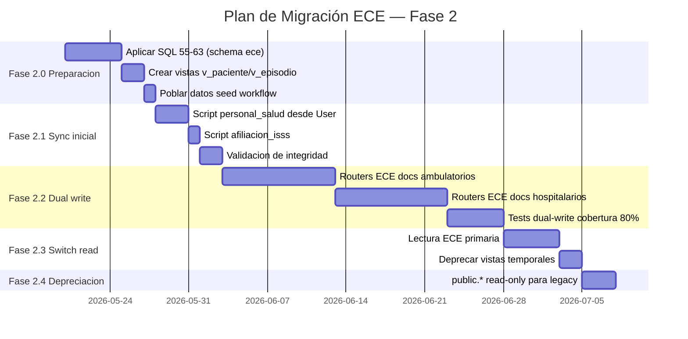
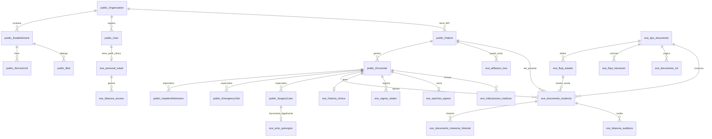

# 10 — Schema diff + Plan de Integración ECE / HIS

**Stream 10 de 10 — Fase 2 | @DBA | 2026-05-16**

---

## 1. Inventario del schema `ece` propuesto

| Tabla `ece.*` | Propósito | Tipo | Filas estimadas/año (hospital 200 camas, 1 000 consultas/día) |
|---|---|---|---|
| `institucion` | Entes SNIS (MINSAL, ISSS, privado) | Maestro | < 10 — crecimiento nulo |
| `establecimiento` | Sede física con código MINSAL | Maestro | < 50 — bootstrap único |
| `servicio` | Unidades funcionales del establecimiento | Maestro | 10–100 |
| `cama` | Recurso físico cama (código + estado) | Maestro | 200–500 |
| `rol` | Roles funcionales del ECE (ADM, ENF, MC, ESP, DIR…) | Maestro | < 20 (catálogo fijo) |
| `catalogo_valor` | Enumeraciones configurables (circunstancia_ingreso, tipo_egreso…) | Maestro | 50–200 |
| `personal_salud` | Profesionales vinculados a `auth.users` | Maestro | 50–500 por establecimiento |
| `asignacion_rol` | N:M personal ↔ rol ↔ servicio | Maestro | 100–2 000 |
| `firma_electronica` | Hash de credencial 1:1 con personal | Maestro | = personal activo |
| `perfil_acceso` | RBAC recurso × permiso × rol | Maestro | 30–100 filas (seed) |
| `paciente` | Registro maestro del expediente (Ficha ID) | Maestro | 20 000–50 000/año acumulado |
| `identificador_paciente` | DUI/NUI/CUN históricos por paciente | Maestro | 1–3 × paciente |
| `responsable_paciente` | Familiares/responsables | Maestro | 1–2 × paciente |
| `afiliacion_isss` | Derechohabiencia ISSS | Maestro | ~60 % de pacientes |
| `episodio_atencion` | Contacto asistencial (ambulatorio u hospitalario) | Transaccional | 365 000/año (1 000/día) |
| `episodio_hospitalario` | Datos hospitalarios del episodio | Transaccional | 7 300/año (2 % de episodios) |
| `asignacion_cama` | Histórico de ocupación de cama por episodio | Transaccional | 10 000/año |
| `tipo_documento` | Catálogo de 18 tipos de documento ECE | Maestro | 18 filas (seed) |
| `flujo_estado` | Estados por tipo de documento | Maestro | ~90 filas (seed) |
| `flujo_transicion` | Transiciones autorizadas por rol | Maestro | ~120 filas (seed) |
| `documento_rol` | Matriz LLENA/RESPONSABLE/AUTORIZA/FIRMA | Maestro | ~80 filas (seed) |
| `documento_instancia` | Documento concreto del expediente | Transaccional | 3–5 × episodio ≈ 1 500 000/año |
| `documento_instancia_historial` | Bitácora de transiciones (inmutable) | Histórico | 3–6 × instancia ≈ 5 000 000/año |
| `historia_clinica` | SOAP / anamnesis | Transaccional | = episodios ambulatorios |
| `signos_vitales` | Serie temporal (toma cada turno) | Transaccional | 3–6 × episodio hospital ≈ 40 000/año |
| `triaje` | Clasificación de urgencias | Transaccional | = episodios emergencia |
| `atencion_emergencia` | Nota de atención de urgencias | Transaccional | = episodios emergencia |
| `indicaciones_medicas` + `indicacion_item` | Órdenes médicas versionadas | Transaccional | 2–4 × episodio hospital |
| `registro_enfermeria` + `administracion_medicamento` | Kardex de enfermería | Transaccional | 3 × episodio hospital |
| `evolucion_medica` | Nota SOAP evolución | Transaccional | 2–10 × episodio hospital |
| `consentimiento_informado` | Consentimiento firmado (inmutable) | Histórico | 1–3 × episodio |
| `referencia_rri` | Referencia / retorno / interconsulta | Transaccional | ~5 % de episodios |
| `orden_ingreso` | Orden de hospitalización | Transaccional | = episodios hospitalarios |
| `hoja_ingreso` | Apertura de episodio hospitalario | Transaccional | = episodios hospitalarios |
| `acto_quirurgico` | Cirugía (inmutable) | Histórico | ~500/año |
| `documento_obstetrico` | Partograma + atención RN | Histórico | ~800/año |
| `epicrisis_egreso` | Hoja de egreso (inmutable) | Histórico | = episodios hospitalarios |
| `certificado_defuncion` | Certificado de defunción (inmutable) | Histórico | ~30/año |
| `certificado_incapacidad` | Incapacidad ISSS | Transaccional | ~2 000/año |
| `solicitud_estudio` + `resultado_estudio` | Órdenes de lab/imagen clínica ECE | Transaccional | ~3 × episodio |
| `bitacora_acceso` | Todo intento de acceso (Art. 55 NTEC) | Histórico | **~2 000 000/año** (bigserial) |
| `bitacora_auditoria` | Cambios en datos clínicos (Art. 42) | Histórico | ~5 000 000/año |
| `rectificacion` | Correcciones sin borrar original | Histórico | < 1 000/año |
| `supresion` | Inhabilitación autorizada | Histórico | < 100/año |

**Total tablas ECE propuestas: 45** (incluyendo tablas de detalle/junction).

---

## 2. Inventario HIS actual relevante (`public.*`)

Tablas del schema `public` que se solapan funcionalmente con `ece.*`:

| `public.*` (HIS) | `ece.*` (ECE) | Naturaleza del solapamiento |
|---|---|---|
| `Patient` | `paciente` | Mismo agregado. Diferente granularidad demográfica |
| `PatientIdentifier` | `identificador_paciente` | Casi idénticos en propósito; tipos diferentemente modelados |
| `PatientEmergencyContact` | `responsable_paciente` | Equivalentes (parentesco, teléfono) |
| `PatientConsent` | `consentimiento_informado` | Semántica distinta: HIS = GDPR/datos; ECE = consentimiento quirúrgico/médico |
| `Encounter` | `episodio_atencion` | Mismo agregado. HIS incluye `organizationId` (multi-tenant); ECE no |
| `BedAssignment` | `asignacion_cama` | Equivalentes con diferente FK root |
| `Bed` | `cama` | Equivalentes |
| `ServiceUnit` | `servicio` | Equivalentes; HIS incluye `specialtyId` |
| `Establishment` | `establecimiento` | Equivalentes; HIS vincula a `Organization`; ECE a `institucion` |
| `Organization` | `institucion` | Análogos. HIS tiene jerarquía Holding→Empresa; ECE es plana |
| `User` | `personal_salud` | `User` es login system; `personal_salud` es perfil profesional clínico |
| `UserOrganizationRole` + `Role` | `asignacion_rol` + `rol` | RBAC paralelo: HIS usa códigos genéricos; ECE usa códigos clínicos NTEC |
| `AuditLog` (schema `audit`) | `bitacora_acceso` + `bitacora_auditoria` | Hash-chain en HIS; inmutabilidad trigger en ECE. Propósito distinto |
| `Prescription` + `PrescriptionItem` | `indicaciones_medicas` + `indicacion_item` | HIS: farmacéutico-centrado (dispensación, BCMA). ECE: médico-centrado (documento firmado) |
| `MedicationAdministration` | `administracion_medicamento` (en `registro_enfermeria`) | BCMA completo en HIS; ECE solo registra estado administrado/omitido |
| `SurgeryCase` | `acto_quirurgico` | HIS: WHO checklist, quirófanos, estado máquina. ECE: documento narrativo inmutable |
| `InpatientAdmission` | `episodio_hospitalario` + `orden_ingreso` + `hoja_ingreso` | HIS especializa Encounter; ECE descompone en 3 documentos del expediente |
| `InpatientVitals` | `signos_vitales` | Equivalentes. HIS ligado a `admissionId`; ECE a `episodio_id` |
| `InpatientKardex` | `registro_enfermeria` | HIS = texto libre por turno; ECE = documento firmado con Kardex de medicamentos |
| `EmergencyVisit` | `episodio_atencion(modalidad=ambulatorio, servicio_categoria=emergencia)` + `atencion_emergencia` | HIS crea subconcept separado; ECE usa episodio + documento |
| `TriageEvaluation` | `triaje` | HIS: Manchester con discriminadores. ECE: nivel_prioridad texto (más simple) |
| `LabOrder` + `LabResult` | `solicitud_estudio` + `resultado_estudio` | HIS: LOINC, especímenes, rangos de referencia. ECE: JSON libre menos estructurado |
| `ClinicalNote` | `historia_clinica` + `evolucion_medica` | HIS: SOAP firmado con addendum chain. ECE: separados en documentos del expediente |
| `EncounterDiagnosis` | Dentro de `historia_clinica.diagnosticos` (jsonb) | HIS: tabla estructurada CIE-10. ECE: array jsonb |
| `DeathCertificate` | `certificado_defuncion` | Análogos; HIS es más estructurado en causas CIE-10 |

---

## 3. Estrategia de integración — Tres opciones evaluadas

### Opción A — Schema `ece` 100% separado (sync async)

Los 45 tablas `ece.*` se crean completas. La sincronización con `public.*` se hace mediante triggers PostgreSQL o jobs Supabase Edge Function que copian datos en ambas direcciones.

| Dimensión | Impacto |
|---|---|
| Complejidad de migración | Alta. Dos grafos de datos paralelos. Riesgo de divergencia permanente |
| Performance | N+1 writes en cada transacción clínica. Latencia p95 +20–40 ms por operación dual |
| RLS | Dos sistemas de policies completamente independientes. Superficie de error doble |
| Mantenibilidad | Cada cambio de schema debe duplicarse. Dos Prisma clients o uno parcial + raw SQL |
| Riesgo regulatorio | Alto: duplicidad de datos de salud sin fuente única de verdad. NTEC Art. 14 exige expediente único |
| Esfuerzo SP | 140+ SP (implementación + sync + testing) |

**No recomendada.** La duplicidad viola el principio de registro único del Art. 14 NTEC y crea inconsistencias auditables.

---

### Opción B — Reuso de `public.Patient/Encounter/User`; tablas documentales `ece.*` apuntan vía FK (RECOMENDADA)

Se mantiene `public.Patient`, `public.Encounter`, `public.User`, `public.Bed`, `public.ServiceUnit`, `public.Establishment`, `public.Organization` como golden records del HIS. El schema `ece` se reduce a las tablas que NO tienen equivalente en `public`:

- Motor de workflow: `tipo_documento`, `flujo_estado`, `flujo_transicion`, `documento_rol`, `documento_instancia`, `documento_instancia_historial`
- Firma electrónica clínica: `firma_electronica`
- Roles clínicos NTEC: `rol` (ECE), `asignacion_rol` (ECE), `perfil_acceso` (ECE) — coexisten con `public.Role`
- Documentos clínicos específicos del ECE: `historia_clinica`, `signos_vitales`, `triaje`, `atencion_emergencia`, `indicaciones_medicas`, `indicacion_item`, `registro_enfermeria`, `administracion_medicamento`, `evolucion_medica`, `consentimiento_informado`, `referencia_rri`, `orden_ingreso`, `hoja_ingreso`, `acto_quirurgico`, `documento_obstetrico`, `epicrisis_egreso`, `certificado_defuncion`, `certificado_incapacidad`, `solicitud_estudio`, `resultado_estudio`
- Auditoría ECE específica: `bitacora_acceso`, `bitacora_auditoria`, `rectificacion`, `supresion`
- Catálogos ECE sin equivalente: `catalogo_valor`, `afiliacion_isss`, `identificador_paciente` (reemplaza/complementa `PatientIdentifier`)

Las FKs de las tablas `ece.*` apuntan a `public.Patient.id`, `public.Encounter.id`, `public.User.id` — no a `ece.paciente`, `ece.episodio_atencion`, `ece.personal_salud`. La capa `personal_salud` se convierte en una **vista materializada** sobre `public.User` + `ece.asignacion_rol`.

| Dimensión | Impacto |
|---|---|
| Complejidad de migración | Media. Un solo grafo de datos. No hay sync jobs |
| Performance | Un write path. Sin latencia adicional |
| RLS | Se extiende `withTenantContext` actual. Un JWT claim context |
| Mantenibilidad | Prisma multiSchema cubre `public.*`; `ece.*` documentales como raw SQL + tipos TS generados |
| Riesgo regulatorio | Bajo. Un único `public.Patient` como MPI. ECE complementa con documentos |
| Esfuerzo SP | 65–75 SP |

**Recomendada.**

---

### Opción C — Migración total (refactor `public.*` a nomenclatura ECE)

Renombrar y refactorizar `public.Patient` → `ece.paciente`, `public.Encounter` → `ece.episodio_atencion`, etc. Unificar en un solo modelo.

| Dimensión | Impacto |
|---|---|
| Complejidad de migración | Máxima. ~40 tablas renombradas + tipos cambiados + 45 routers tRPC actualizados |
| Performance | Óptima a largo plazo |
| RLS | Unificada pero requiere reescribir todas las policies |
| Mantenibilidad | Un solo schema. Máxima coherencia |
| Riesgo regulatorio | Alto durante la migración: downtime o dual-write complejo en producción |
| Esfuerzo SP | 200+ SP. Riesgo de regresión en Beta ya productivo |

**No recomendada en este sprint.** El MVP está en producción (Beta.1–Beta.18 mergeadas). Un refactor total sin downtime planificado es una operación de alto riesgo para un HIS en operación.

---

### Recomendacion: Opcion B

**Justificacion:** La Opcion B preserva el invariante mas critico — `public.Patient` como MPI unico con constraint `(organizationId, mrn)` y los 31 FK indexes ya aplicados en produccion. El schema `ece` agrega las capas documentales y el motor de workflow sin tocar el grafo operacional existente. El riesgo de regresion es acotado: los routers tRPC existentes no se modifican; los nuevos routers ECE operan sobre tablas nuevas. El tiempo de implementacion es 60% menor que la Opcion C.

---

## 4. Conflictos identificados

**Total: 14 conflictos** identificados entre pares solapados.

---

### Conflicto 1 — `public.Patient` vs `ece.paciente`

| Dimension | `public.Patient` (HIS) | `ece.paciente` (ECE) |
|---|---|---|
| PK | `uuid` | `uuid` |
| Tenant | `organizationId` (multi-tenant) | `establecimiento_id` (establecimiento, no org) |
| MRN | `mrn varchar(40)` | `numero_expediente text` |
| Identificadores | Tabla separada `PatientIdentifier` | Columnas inline (`dui`, `nui`, `cun`) + tabla `identificador_paciente` |
| Nombre | 4 campos separados (firstName, middleName, lastName, secondLastName) | 4 campos separados (primer/segundo nombre/apellido) |
| Sexo | `biologicalSexId` FK + `genderId` FK | `sexo text CHECK (M/F/I)` inline |
| Estado | `active boolean` + `deletedAt` | `estado_expediente (activo/pasivo)` + `estado_registro (vigente/rectificado/unificado)` |
| Merge | `PatientMerge` tabla separada | `expediente_maestro_id` autorreferencial |
| ISSS | No tiene | `afiliacion_isss` tabla separada |

**Resolucion (Opcion B):** `public.Patient` es la fuente de verdad. `ece.paciente` NO se crea. Las tablas ECE documentales referencian `public.Patient.id` con columna `patient_id uuid references public."Patient"(id)`. La `afiliacion_isss` se crea como tabla `ece.afiliacion_isss` que apunta a `public."Patient"`. Se crea una vista `ece.v_paciente` para compatibilidad con queries ECE que necesiten la estructura NTEC:

```sql
create view ece.v_paciente as
select
  p.id,
  p."organizationId" as establecimiento_id,  -- mapeo aproximado
  p.mrn             as numero_expediente,
  p."firstName"     as primer_nombre,
  p."lastName"      as primer_apellido,
  p."birthDate"     as fecha_nacimiento,
  p.active,
  p."deletedAt"
from public."Patient" p;
```

**Impacto en datos existentes:** Ninguno. No se toca `public.Patient`. Los datos MVP se mantienen intactos.

**Regla de migracion:** No se migran datos; se crea la vista. El seed de `ece.afiliacion_isss` es opcional y controlado por el establecimiento.

---

### Conflicto 2 — `public.Encounter` vs `ece.episodio_atencion`

| Dimension | `public.Encounter` (HIS) | `ece.episodio_atencion` (ECE) |
|---|---|---|
| Modalidad | `admissionType enum (EMERGENCY, SCHEDULED, TRANSFER_IN, BIRTH, NEWBORN)` | `modalidad text CHECK (ambulatorio, hospitalario)` |
| Moneda | `currencyId` + `exchangeRateToFunc` | Sin moneda |
| Servicio | `serviceUnitId` FK | `servicio_id` FK |
| Estado | `dischargedAt` nullable = abierto | `estado text CHECK (abierto, en_curso, cerrado, anulado)` |
| Diagnóstico principal | `primaryDiagnosisId` FK a `ClinicalConcept` | No tiene en cabecera |

**Resolucion (Opcion B):** `public.Encounter` es la fuente de verdad. Las tablas documentales ECE usan `episodio_id uuid references public."Encounter"(id)`. Se crea vista `ece.v_episodio`:

```sql
create view ece.v_episodio as
select
  e.id,
  e."patientId"        as paciente_id,
  e."establishmentId"  as establecimiento_id,
  case
    when e."admissionType" in ('EMERGENCY','SCHEDULED') then 'ambulatorio'
    else 'hospitalario'
  end                  as modalidad,
  e."admittedAt"       as fecha_hora_inicio,
  e."dischargedAt"     as fecha_hora_cierre,
  case when e."dischargedAt" is null then 'abierto' else 'cerrado' end as estado
from public."Encounter" e;
```

**Impacto en datos existentes:** Ninguno. Mapeo de `admissionType` a `modalidad` es no destructivo.

---

### Conflicto 3 — `public.User` vs `ece.personal_salud`

`public.User` es el sujeto de autenticacion (email + credenciales). `ece.personal_salud` es el perfil profesional clinico (JVPM, profesion, establecimiento de trabajo). No son equivalentes; son complementarios.

**Resolucion:** Crear `ece.personal_salud` completo con FK `auth_user_id uuid references auth.users(id)` y FK adicional `his_user_id uuid references public."User"(id)` para trazabilidad. El campo `establecimiento_id` apunta a `public."Establishment"(id)` (no a `ece.establecimiento`).

```sql
create table ece.personal_salud (
  id                  uuid primary key default gen_random_uuid(),
  auth_user_id        uuid unique references auth.users(id) on delete restrict,
  his_user_id         uuid references public."User"(id) on delete restrict,
  establecimiento_id  uuid not null references public."Establishment"(id),
  -- resto de columnas NTEC...
);
```

**Impacto en datos existentes:** Se pobla `ece.personal_salud` a partir de `public.User` + `public.UserOrganizationRole` en la Fase 2.1 (script idempotente). Los `auth_user_id` se obtienen de `auth.users` que ya existen en Supabase.

**Regla de migracion:** INSERT idempotente por `auth_user_id`. No se duplican registros.

---

### Conflicto 4 — `audit.AuditLog` (hash-chain) vs `ece.bitacora_acceso` / `ece.bitacora_auditoria`

| Dimension | `audit.AuditLog` (HIS) | `ece.bitacora_acceso` + `ece.bitacora_auditoria` (ECE) |
|---|---|---|
| Propósito | Integridad criptográfica de toda acción del sistema | Acceso a recursos (Art. 55) + cambios en datos clínicos (Art. 42) |
| Inmutabilidad | Hash-chain SHA-256 (05_audit_hash_chain.sql) | Trigger `fn_bloquea_mutacion()` |
| Schema | `audit.*` separado | `ece.*` |
| Retención | 10 años (TDR §6.3) | 2 años mínimo (Art. 56 NTEC) |
| Estructura | Un registro por accion global | `bitacora_acceso`: por intento de acceso; `bitacora_auditoria`: por cambio de datos |

**No hay conflicto real; son capas complementarias.** La `audit.AuditLog` cubre la integridad del sistema completo. Las bitacoras ECE cubren la trazabilidad clinica especifica requerida por la NTEC. Ambas deben coexistir.

**Resolucion:** Las tablas `ece.bitacora_*` se crean como definidas. Los triggers `fn_audita_insert()` de ECE ADICIONALMENTE insertan en `audit.AuditLog` (via wrapper) para mantener la cadena de hash. El trigger ECE llama a `audit.fn_append_audit_log()` existente.

---

### Conflicto 5 — `public.Prescription/PrescriptionItem` vs `ece.indicaciones_medicas/indicacion_item`

| Dimension | HIS (`Prescription`) | ECE (`indicaciones_medicas`) |
|---|---|---|
| Foco | Dispensacion farmaceutica (BCMA, qty enforcement) | Documento medico firmado (NTEC Art. 19) |
| Firma | `signedHash varchar(120)` | Via `documento_instancia_historial` + `firma_electronica` |
| Medicamento | FK a `Drug` (catálogo estructurado ATC) | `descripcion text` (libre) en `indicacion_item` |
| BCMA | 3-scan enforcement | No tiene |
| Versionado | `status PrescriptionStatus` (DRAFT/SIGNED/DISPENSED) | `vigencia (activa/suspendida/modificada)` + `version int` |

**Conflicto sustancial:** HIS tiene un sistema farmaceutico completo (BCMA, dispensacion, doble check). El ECE tiene un documento medico mas simple. No son equivalentes; no deben fusionarse.

**Resolucion:** Crear FK de `ece.indicaciones_medicas` → `public."Prescription"` para trazabilidad en el caso de hospitalizados. Para ambulatorios sin prescription formal, `prescription_id` es NULL. Las dos entidades coexisten con responsabilidades distintas:
- `public.Prescription` = orden farmaceutica (dispensacion, BCMA)
- `ece.indicaciones_medicas` = documento NTEC firmado (expediente legal)

```sql
alter table ece.indicaciones_medicas
  add column prescription_id uuid references public."Prescription"(id);
```

**Impacto en datos existentes:** Columna nullable, sin retrocompatibilidad rota.

---

### Conflicto 6 — `public.MedicationAdministration` vs `ece.administracion_medicamento`

**Identico al Conflicto 5 en naturaleza.** `public.MedicationAdministration` tiene BCMA completo (3 scans, timing window, doble-check). `ece.administracion_medicamento` es un registro de kardex mas simple.

**Resolucion:** `ece.administracion_medicamento` agrega FK:
```sql
alter table ece.administracion_medicamento
  add column his_admin_id uuid references public."MedicationAdministration"(id);
```
La escritura de BCMA pasa siempre por `public.MedicationAdministration`. La escritura ECE puede derivarse del mismo evento o ser independiente para centros sin BCMA.

---

### Conflicto 7 — `public.SurgeryCase` vs `ece.acto_quirurgico`

| Dimension | HIS (`SurgeryCase`) | ECE (`acto_quirurgico`) |
|---|---|---|
| Estado | Maquina de estados: SCHEDULED → IN_PROGRESS → POST_OP → COMPLETED | Inmutable (solo INSERT via ECE) |
| WHO Checklist | `signInAt`, `timeOutAt`, `signOutAt` estructurados | `checklist_cirugia_segura jsonb` |
| Anestesia | `anesthesiaType enum`, timestamps | `registro_anestesico jsonb` |
| Especialistas | Solo `primarySurgeonId` FK a `User` | `ayudantes jsonb`, `anestesiologo` FK |

**Resolucion:** `ece.acto_quirurgico` agrega FK:
```sql
alter table ece.acto_quirurgico
  add column surgery_case_id uuid references public."SurgeryCase"(id);
```
El `acto_quirurgico` ECE se genera al completarse el `SurgeryCase` HIS (estado COMPLETED). Es la version documental/legal del acto quirurgico, separada de la gestion operacional. El router tRPC de cirugias debe emitir un evento `SurgeryCaseCompleted` que el motor workflow ECE procesa para crear la instancia del documento ACTO_QX.

**Impacto en datos existentes:** Los `SurgeryCase` existentes en produccion (estado COMPLETED) pueden generar retroactivamente su `acto_quirurgico` ECE mediante script de migracion (opt-in, no automatico).

---

### Conflicto 8 — `public.PatientConsent` vs `ece.consentimiento_informado`

**Semantica diferente, no conflicto real:**
- `public.PatientConsent`: consentimiento de procesamiento de datos (GDPR-like), telemedicina, MPI cross-org. Atributo `purpose text` + `scope jsonb`.
- `ece.consentimiento_informado`: consentimiento medico/quirurgico (Art. 32–33 NTEC). Documento firmado con `firmante_nombre`, `medico_que_informa`, `tipo (quirurgico/anestesico/transfusion)`.

**Resolucion:** Ambas tablas coexisten sin FK entre ellas. Son entidades distintas con marcos legales distintos (LOPD vs NTEC).

---

### Conflicto 9 — `public.TriageEvaluation` vs `ece.triaje`

HIS tiene Manchester completo con discriminadores, flujogramas, 52 discriminadores y RLS por org. ECE tiene `nivel_prioridad text` (libre) sin discriminadores.

**Resolucion:** `ece.triaje` agrega FK:
```sql
alter table ece.triaje
  add column triage_evaluation_id uuid references public."TriageEvaluation"(id);
```
El `ece.triaje` es el documento NTEC que registra el nivel de clasificacion. `public.TriageEvaluation` es el registro clinico operacional con el proceso Manchester completo. La creacion del documento ECE se activa cuando `TriageEvaluation.status = COMPLETED`.

---

### Conflicto 10 — `public.ServiceUnit` vs `ece.servicio`

Practicamente equivalentes excepto que `ece.servicio` tiene `categoria text CHECK (consulta_externa, emergencia, ..., quirofano, ...)` y HIS tiene `specialtyId FK`. 

**Resolucion:** No crear `ece.servicio`. Los documentos ECE referencian `public."ServiceUnit"(id)` directamente. Se crea vista:
```sql
create view ece.v_servicio as
select id, "establishmentId" as establecimiento_id, code as codigo, name as nombre
from public."ServiceUnit";
```

---

### Conflicto 11 — `public.Establishment` vs `ece.establecimiento`

HIS tiene `organizationId` (multi-tenant). ECE tiene `institucion_id`. HIS NO tiene `patron_num_expediente`.

**Resolucion:** Agregar columna a `public."Establishment"`:
```sql
alter table public."Establishment"
  add column if not exists patron_num_expediente text,
  add column if not exists nivel_atencion text check (nivel_atencion in ('primer','segundo','tercer'));
```
No crear `ece.establecimiento`. Referencias ECE apuntan a `public."Establishment"`. Vista `ece.v_establecimiento` para compatibilidad.

**Impacto en datos existentes:** ALTER TABLE agrega columnas nullable. Sin riesgo.

---

### Conflicto 12 — `public.Organization` vs `ece.institucion`

`public.Organization` es multi-nivel (Holding → Empresa) con `taxId`, `functionalCurrency`. `ece.institucion` es plana con `tipo (publica/privada/autonoma/mixta)`.

**Resolucion:** Agregar columna:
```sql
alter table public."Organization"
  add column if not exists institution_type text check (institution_type in ('publica','privada','autonoma','mixta'));
```
No crear `ece.institucion`. Vista `ece.v_institucion`.

---

### Conflicto 13 — `public.InpatientVitals` vs `ece.signos_vitales`

HIS vincula signos vitales a `admissionId` (InpatientAdmission). ECE vincula a `episodio_id`. HIS tiene columnas tipadas separadas (temperatureC, heartRate, etc.). ECE tambien tiene columnas tipadas pero incluye `imc`, `perimetro_cefalico`, `escala_dolor`.

**Resolucion:** `ece.signos_vitales` se crea como tabla nueva que referencia `public."Encounter"(id)` en vez de `ece.episodio_atencion`. Agrega las columnas adicionales NTEC que `InpatientVitals` no tiene. Los routers de signos vitales hospitalarios pueden escribir en ambas tablas (dual-write durante Fase 2.2) con un helper compartido.

---

### Conflicto 14 — `public.LabOrder/LabResult` vs `ece.solicitud_estudio/resultado_estudio`

HIS tiene LOINC codes, especimenes, rangos de referencia por edad/sexo (SQL 27), reglas de reflex testing. ECE tiene `examenes jsonb` (lista libre) y `valores jsonb` (libre).

**Resolucion:** No crear `ece.solicitud_estudio` / `ece.resultado_estudio` como tablas independientes. Los documentos ECE SOL_EST apuntan vias `documento_instancia.registro_id` al ID de `public.LabOrder`. El `ece.resultado_estudio` queda como agregacion JSON de `public.LabResult`. Se crea una funcion SQL que produce el JSON NTEC a partir de `public.LabOrder`:

```sql
create or replace function ece.fn_lab_to_ece(p_order_id uuid)
returns jsonb language sql stable as $$
  select jsonb_build_object(
    'solicitud_id', lo.id,
    'examenes', jsonb_agg(jsonb_build_object(
      'analito', lt.name, 'loinc', lt.code
    )),
    'estado', lo.status
  )
  from public."LabOrder" lo
  join public."LabOrderItem" loi on loi."orderId" = lo.id
  join public."LabTest" lt on lt.id = loi."testId"
  where lo.id = p_order_id
  group by lo.id, lo.status
$$;
```

---

## 5. Plan de migración por fases



### Fase 2.0 — Preparacion (5–8 dias)

Aplicar los 9 SQL del schema `ece` en Supabase con las modificaciones de la Opcion B:
1. `55_ece_extensions.sql` — extensiones + schema (de `00_extensions.sql`, ya tiene `pgcrypto`, `uuid-ossp`, `pg_trgm` que el schema HIS ya usa)
2. `56_ece_catalogos_adaptados.sql` — `rol`, `catalogo_valor` (sin `institucion`/`establecimiento`/`servicio`/`cama`; se crean vistas en su lugar)
3. `57_ece_seguridad_personal.sql` — `personal_salud` con FKs a `public."User"` y `public."Establishment"`
4. `58_ece_motor_workflow.sql` — tablas motor workflow puras
5. `59_ece_documentos_clinicos.sql` — tablas documentales con FKs a `public."Encounter"` y `public."Patient"`
6. `60_ece_auditoria.sql` — `bitacora_acceso`, `bitacora_auditoria`, `rectificacion`, `supresion`
7. `61_ece_vistas_compatibilidad.sql` — vistas `v_paciente`, `v_episodio`, `v_servicio`, `v_establecimiento`, `v_institucion`
8. `62_ece_rls_adaptado.sql` — RLS policies alineadas al JWT HIS actual
9. `63_ece_seed_workflows.sql` — seed de tipos de documento, estados, transiciones, roles

**Estimacion:** Sprint 1 de Fase 2 (paralelo a desarrollo de Stream 3/Motor Workflow).

### Fase 2.1 — Sincronizacion inicial (4–6 dias)

Script idempotente para poblar `ece.personal_salud` desde `public."User"`:

```sql
insert into ece.personal_salud (auth_user_id, his_user_id, establecimiento_id,
                                  documento_identidad, nombre_completo, activo)
select
  pu.id as auth_user_id,  -- Supabase auth.users referencia
  u.id  as his_user_id,
  uor."organizationId" as establecimiento_id,  -- mapeo org -> estab (requires mapping table)
  'pendiente'            as documento_identidad,
  u."fullName"           as nombre_completo,
  u.active
from public."User" u
join public."UserOrganizationRole" uor on uor."userId" = u.id
left join ece.personal_salud ps on ps.his_user_id = u.id
where ps.id is null
  and u.active = true
on conflict (auth_user_id) do nothing;
```

**Prerequisito:** Tabla de mapeo `organization_id → establishment_id` creada por el equipo de datos.

**Estimacion:** 1–2 dias + 2 dias de validacion.

### Fase 2.2 — Dual write (20–25 dias)

Los nuevos routers tRPC del ECE (modulo `packages/trpc/src/routers/ece/`) escriben en las tablas `ece.*`. Los routers existentes NO se modifican. El dual-write aplica solo a entidades con overlap (signos vitales, triaje):

```
evento → router nuevo ECE → escribe ece.signos_vitales
                           → llama a handler existente → escribe public."InpatientVitals"
```

**Criterio de exito:** Cobertura de tests 80% en routers ECE. Ninguna regresion en routers HIS existentes.

**Estimacion:** 2 sprints (Sprint 2 y 3 de Fase 2).

### Fase 2.3 — Switch read (5–7 dias)

Las queries de reporteria NTEC leen de `ece.*` directamente. Las queries operacionales del HIS siguen leyendo de `public.*`. Las vistas de compatibilidad se mantienen activas.

**Estimacion:** Sprint 4 de Fase 2, primera semana.

### Fase 2.4 — Depreciacion (3–5 dias)

Las tablas `public.*` que tienen equivalente ECE (solo `InpatientVitals` con signos vitales duplicados) se marcan read-only via `REVOKE INSERT, UPDATE, DELETE` para el rol `authenticated`. El rol `service_role` mantiene acceso.

**Estimacion:** Sprint 4 de Fase 2, segunda semana.

---

## 6. RLS policies del schema `ece`

### Mapeo JWT actual → `ece.personal_salud`

El JWT del HIS actual porta:

```json
{
  "org_id": "<uuid>",
  "user_id": "<uuid>",
  "country_id": "<uuid>",
  "role_codes": ["PHYSICIAN", "NURSE"],
  "break_glass": false
}
```

El schema `ece` necesita resolver `auth.uid()` → `ece.personal_salud.id` para aplicar sus policies. La funcion helper:

```sql
create or replace function ece.current_personal_id()
returns uuid language sql stable security definer as $$
  select id from ece.personal_salud
  where auth_user_id = auth.uid()
    and activo = true
  limit 1
$$;

create or replace function ece.personal_en_establecimiento(p_estab uuid)
returns boolean language sql stable security definer as $$
  select exists (
    select 1 from ece.personal_salud
    where auth_user_id = auth.uid()
      and activo = true
      and establecimiento_id = p_estab
  )
$$;
```

### Helper `withEceContext`

Analogo a `withTenantContext` existente en `packages/trpc/src/rls-context.ts`:

```typescript
// packages/trpc/src/ece-context.ts
export async function withEceContext<T>(
  prisma: PrismaClient,
  ctx: { tenant: TenantContext; user: UserContext },
  fn: (tx: PrismaClient) => Promise<T>
): Promise<T> {
  return prisma.$transaction(async (tx) => {
    // Demotar a rol authenticated (igual que withTenantContext)
    await tx.$executeRaw`SET LOCAL ROLE authenticated`;
    // Claims existentes del HIS (reutiliza el mecanismo actual)
    await tx.$executeRaw`SET LOCAL "app.current_user_id" = ${ctx.user.id}`;
    await tx.$executeRaw`SET LOCAL "app.current_org_id" = ${ctx.tenant.organizationId}`;
    // Claims adicionales para ece.*
    const personalId = await tx.$queryRaw<[{id: string}]>`
      SELECT id FROM ece.personal_salud
      WHERE his_user_id = ${ctx.user.id}::uuid AND activo = true
      LIMIT 1
    `;
    if (personalId[0]) {
      await tx.$executeRaw`SET LOCAL "app.ece_personal_id" = ${personalId[0].id}`;
    }
    return fn(tx as PrismaClient);
  });
}
```

### Policies RLS adaptadas al JWT HIS

Las policies del `07_auditoria_seguridad.sql` deben adaptarse. La policy de lectura de paciente en ECE se transforma:

```sql
-- Reemplazar la policy del 07 que usa ece.personal_salud directamente
drop policy if exists p_paciente_lectura on ece.paciente;

-- Para la vista (no la tabla, que no existe en Opcion B)
-- Las policies ECE se aplican sobre las tablas documentales

create policy p_historia_clinica_lectura on ece.historia_clinica
  for select using (
    ece.personal_en_establecimiento(
      (select "establishmentId" from public."Encounter" e where e.id = historia_clinica.episodio_id)
    )
    or public.is_break_glass()
  );
```

### Test cases criticos RLS

| Test | Escenario | Resultado esperado |
|---|---|---|
| Cross-tenant blocking | `personal_salud` de establecimiento A intenta leer `historia_clinica` de episodio del establecimiento B | `0 rows` returned |
| Role escalation | Usuario con rol ENF intenta firmar un documento que requiere rol MC | `403` / excepcion de flujo |
| Break-glass | `break_glass = true` en JWT | Acceso permitido + entrada en `bitacora_acceso(autorizado=true)` con flag |
| Personal inactivo | `personal_salud.activo = false` | Ningun documento ECE accesible (policy usa `where activo`) |
| Documento inmutable | UPDATE en `ece.consentimiento_informado` | `ERROR: Documento inmutable (Art. 42 NTEC)` |

---

## 7. Sincronizacion con Prisma schema

### Recomendacion: multiSchema parcial + `$queryRaw` para tablas ECE documentales

**Opcion 7A (recomendada):** Agregar al `schema.prisma` solo las tablas ECE que son **accedidas frecuentemente desde los routers tRPC** y que tienen tipado critico:

```prisma
// packages/database/prisma/schema.prisma — agregar al datasource:
datasource db {
  schemas = ["public", "audit", "ece"]  // agregar "ece"
}

model EcePersonalSalud {
  id                uuid     @id @default(uuid()) @db.Uuid
  authUserId        uuid?    @unique @db.Uuid
  hisUserId         uuid?    @db.Uuid
  establecimientoId uuid     @db.Uuid
  documentoIdentidad String  @db.Text
  nombreCompleto    String   @db.Text
  activo            Boolean  @default(true)
  // ...resto de campos

  @@map("personal_salud")
  @@schema("ece")
}

model EceDocumentoInstancia {
  id              uuid   @id @default(uuid()) @db.Uuid
  tipoDocumentoId uuid   @db.Uuid
  episodioId      uuid?  @db.Uuid
  pacienteId      uuid   @db.Uuid
  registroId      uuid?  @db.Uuid
  estadoActualId  uuid   @db.Uuid
  version         Int    @default(1)
  estadoRegistro  String @default("vigente") @db.Text
  creadoPor       uuid   @db.Uuid
  creadoEn        DateTime @default(now()) @db.Timestamptz()

  @@map("documento_instancia")
  @@schema("ece")
}
```

Las tablas documentales clinicas (`historia_clinica`, `signos_vitales`, etc.) se manejan via `$queryRaw` tipado con interfaces TypeScript generadas via `mcp__supabase__generate_typescript_types`.

**Pros:** Tipado compile-time para las tablas de workflow (las mas usadas). Sin generar un schema Prisma gigante con 45 modelos adicionales.

**Contras:** Requiere mantener interfaces TS manualmente para tablas raw. Riesgo de drift si cambia el schema ECE sin actualizar las interfaces.

**Opcion 7B:** Prisma multiSchema completo para `ece.*` (45 modelos). Genera un client mas grande (+~2 MB) y el `installCommand` de Vercel necesita `prisma generate` que ya esta configurado. La desventaja es la complejidad del `schema.prisma` y el tiempo de generacion en CI.

**Opcion 7C:** Mantener `ece.*` 100% como raw SQL + `$queryRaw`. Sin modelos Prisma para el schema ECE. Maxima flexibilidad pero sin compile-time safety.

**Decision recomendada:** Opcion 7A. Agregar al `schema.prisma` los ~8 modelos de workflow y seguridad ECE mas usados. Las tablas documentales clinicas (18 formularios) via `$queryRaw` con interfaces TS generadas y testeadas.

---

## 8. Migrations Prisma + SQL HIS layered

### Numeracion de archivos SQL

```
packages/database/sql/
  55_ece_extensions.sql          -- pgcrypto/uuid-ossp/pg_trgm ya activos; solo schema ece
  56_ece_catalogos_adaptados.sql -- rol, catalogo_valor, afiliacion_isss
  57_ece_seguridad_personal.sql  -- personal_salud (con FKs a public.*)
  58_ece_motor_workflow.sql      -- tipo_documento, flujo_estado, flujo_transicion, documento_rol
                                 --   documento_instancia, documento_instancia_historial
  59_ece_documentos_clinicos.sql -- 18 tablas de formularios (FKs a public.Encounter + public.Patient)
  60_ece_auditoria.sql           -- bitacora_acceso, bitacora_auditoria, rectificacion, supresion
                                 --   + triggers inmutabilidad + fn_audita_insert
  61_ece_vistas_compatibilidad.sql -- v_paciente, v_episodio, v_servicio, v_establecimiento
  62_ece_rls_adaptado.sql        -- policies RLS alineadas al JWT HIS + funciones helper
  63_ece_seed_workflows.sql      -- seed de 08_seed_workflows.sql adaptado
```

### Estrategia de versionado

**NO usar `prisma migrate dev`** contra Supabase (confirmado por CLAUDE.md). Todos los archivos se aplican via `mcp__supabase__apply_migration` o `mcp__supabase__execute_sql`.

Los archivos `55_*` a `63_*` son **idempotentes** mediante `create ... if not exists` y `insert ... on conflict do nothing`. Para rollback:

```sql
-- rollback de emergencia (solo para Fase 2.0 antes de dual-write)
drop schema ece cascade;
-- Las columnas agregadas a public.* se revierten con:
alter table public."Establishment" drop column if exists patron_num_expediente;
alter table public."Establishment" drop column if exists nivel_atencion;
alter table public."Organization" drop column if exists institution_type;
```

### Convivencia con waves Beta.16–21

Las waves Beta ya mergeadas no tocan el schema `ece`. Los archivos `40_*` a `54_*` son independientes. El unico riesgo es el `search_path_hardening` del `40_search_path_hardening_beta_layer1.sql` que puede afectar funciones `ece.*` si no se lista el schema en el `search_path`:

```sql
-- Verificar que ece este en el search_path de las funciones:
alter function ece.current_personal_id() set search_path = ece, public, auth;
alter function ece.personal_en_establecimiento(uuid) set search_path = ece, public, auth;
```

---

## 9. Performance + Indexing

### Indices criticos ECE

```sql
-- Consulta mas frecuente: expediente de un episodio
create index idx_docinst_ep_tipo
  on ece.documento_instancia(episodio_id, tipo_documento_id, estado_actual_id);

-- Busqueda de documentos en estado borrador (work queue de firmantes)
create index idx_docinst_creado_por_estado
  on ece.documento_instancia(creado_por, estado_actual_id)
  where estado_registro = 'vigente';

-- Historial de transiciones por instancia (mas comun en auditoria)
create index idx_dih_instancia_tiempo
  on ece.documento_instancia_historial(instancia_id, ejecutado_en desc);

-- Acceso a historial clinico por paciente (cross-episodio)
create index idx_docinst_paciente_tipo
  on ece.documento_instancia(paciente_id, tipo_documento_id);

-- Bitacora de acceso: queries de auditoria por personal + rango de fechas
create index idx_bacc_personal_tiempo
  on ece.bitacora_acceso(personal_id, ocurrido_en desc)
  where autorizado = false;  -- index parcial para incidentes de seguridad
```

### Particionamiento

**`ece.bitacora_acceso`** — 2 000 000 filas/ano. Particionar por mes en cuanto supere los 10M acumulados (estimado: ~5 anos). Configurar al crear:

```sql
create table ece.bitacora_acceso (
  -- mismas columnas
) partition by range (ocurrido_en);

create table ece.bitacora_acceso_2026 partition of ece.bitacora_acceso
  for values from ('2026-01-01') to ('2027-01-01');
-- + particionar automaticamente via pg_cron (ya configurado en 51_bi_pg_cron_refresh.sql)
```

**`ece.signos_vitales`** — 40 000 filas/ano por hospital mediano. No requiere particionamiento hasta ~10M (≈250 anos). Indice compuesto `(episodio_id, fecha_hora_toma)` es suficiente.

**`ece.documento_instancia_historial`** — 5 000 000 filas/ano. Candidato a particionamiento por trimestre a partir del ano 2.

### Materialized views para reporteria NTEC

```sql
-- Reporte de produccion de servicios (Art. 61 NTEC)
create materialized view ece.mv_produccion_servicios as
select
  date_trunc('month', ea."admittedAt") as periodo,
  e."establishmentId"                  as establecimiento_id,
  ea."admissionType"                   as modalidad,
  count(*)                             as total_episodios
from public."Encounter" ea
join public."Establishment" e on e.id = ea."establishmentId"
group by 1, 2, 3
with data;

create unique index on ece.mv_produccion_servicios(periodo, establecimiento_id, modalidad);

-- Refresh diario (integrar con pg_cron existente en 51_bi_pg_cron_refresh.sql)
select cron.schedule('ece-mv-produccion', '0 2 * * *',
  $$refresh materialized view concurrently ece.mv_produccion_servicios$$);
```

### Estimacion de espacio en disco (hospital 200 camas, 1 000 consultas/dia)

| Tabla | Filas/ano | Bytes/fila (media) | GB/ano |
|---|---|---|---|
| `ece.documento_instancia` | 1 500 000 | 350 B | 0.5 GB |
| `ece.documento_instancia_historial` | 5 000 000 | 300 B | 1.5 GB |
| `ece.historia_clinica` | 300 000 | 2 000 B (jsonb) | 0.6 GB |
| `ece.bitacora_acceso` | 2 000 000 | 200 B | 0.4 GB |
| `ece.bitacora_auditoria` | 5 000 000 | 400 B | 2.0 GB |
| `ece.signos_vitales` | 40 000 | 250 B | 0.01 GB |
| `ece.evolucion_medica` | 100 000 | 1 500 B | 0.15 GB |
| Resto tablas documentales | 200 000 | 500 B | 0.1 GB |
| **Total estimado schema `ece`** | | | **~5.3 GB/ano** |

Con indices: multiplicar por 1.4 → **~7.4 GB/ano**. Supabase Pro (8 GB incluidos en plan base) cubre el primer ano. A partir del segundo ano planificar expansion a 50 GB.

**IOPS estimados:** Escritura: ~500 IOPS pico (horario de maxima actividad). Lectura: ~2 000 IOPS (consultas de expediente, reportes). Cache hit ratio objetivo: > 85% con `shared_buffers` configurado para Supabase.

---

## 10. Backup + DR especifico ECE

### Estrategia por criticidad regulatoria

| Nivel | Tablas | Frecuencia backup | Retencion | Responsable |
|---|---|---|---|---|
| CRITICO (Art. 42) | `documento_instancia_historial`, `bitacora_auditoria`, `consentimiento_informado`, `epicrisis_egreso`, `certificado_defuncion`, `acto_quirurgico` | Continuo via WAL | 10 anos NTEC | DBA + SRE |
| ALTO (Art. 34) | `documento_instancia`, `historia_clinica`, `evolucion_medica`, `indicaciones_medicas` | Diario + WAL PITR | 5 anos activo, pasivo segun Art. 35 | DBA + SRE |
| MEDIO (Art. 56) | `bitacora_acceso` | Diario | 2 anos minimo | DBA |
| CATALOGO | `tipo_documento`, `flujo_*`, `rol`, `personal_salud` | Semanal + en cada cambio | 5 anos | DBA |

### Backup diario Art. 48 NTEC

El Acuerdo 1616 Art. 48 exige respaldo diario del expediente clinico. Implementar en Supabase:

```sql
-- Job pg_cron para snapshot logico del schema ece (complementario al backup Supabase)
select cron.schedule('ece-daily-logical-backup', '30 1 * * *',
  $$copy (select * from ece.documento_instancia where creado_en > now() - interval '1 day')
    to '/tmp/ece_backup_instancias.csv' csv header$$);
-- En produccion: usar Supabase Point-in-Time Recovery (PITR) + S3 cross-region
```

### WAL archiving + PITR

Supabase Pro incluye PITR de 7 dias. Para cumplir el Art. 48 (backup diario) y el Art. 42 (inmutabilidad criptografica), **se requiere upgrade a Supabase Team o Enterprise** que incluye:
- PITR hasta 30 dias
- Backup diario automatico con retencion configurable
- Restauracion a cualquier punto del dia

**Costo estimado:** Supabase Team plan: $599/mes (incluye PITR 30 dias + 8 GB storage extension).

### Pruebas de restore trimestrales

```
Q1 (Enero): restore de instancias de un episodio critico especifico
Q2 (Abril): restore de bitacora_acceso de un mes anterior
Q3 (Julio): restore completo del schema ece en entorno de staging
Q4 (Octubre): drill de DR completo con failover + verificacion de integridad hash
```

Cada prueba documentada en `docs/15_production_runbook.md` con firma DBA + SRE.

---

## 11. Riesgos tecnicos — Top 10

| Prioridad | Riesgo | Probabilidad | Impacto | Mitigacion | Responsable |
|---|---|---|---|---|---|
| 1 | **Schema drift entre `ece.*` y `schema.prisma`**: columnas en SQL no reflejadas en tipos TS | Alta | Alto | Agregar `mcp__supabase__generate_typescript_types` en CI gate post-migracion | @DBA + @Dev |
| 2 | **RLS cross-schema**: policies `ece.*` acceden a `public.*` sin SET LOCAL previo | Alta | Critico | `withEceContext` obliga transaccion; tests de RLS explicitos en suite | @DBA + @Dev |
| 3 | **Perdida de datos en dual-write**: si router ECE falla despues de escribir `public.*` | Media | Alto | Transacciones atomicas: ambas escrituras en mismo `$transaction` | @Dev |
| 4 | **Triggers inmutabilidad ECE bloqueando rollbacks**: `fn_bloquea_mutacion` impide limpiar datos de test | Alta | Medio | Deshabilitar triggers en entorno test via `SET session_replication_role = replica` | @DBA + @QA |
| 5 | **`personal_salud` sin `auth_user_id`**: usuarios HIS sin registro ECE fallan en workflows | Media | Alto | Script de poblacion idempotente en Fase 2.1 + check en `withEceContext` | @DBA |
| 6 | **`pg_trgm` ya instalado en schema `public`**: `CREATE EXTENSION IF NOT EXISTS` es seguro pero verificar que aplique a `ece.*` | Baja | Medio | Extension es instancia-nivel, no schema-nivel. Verificar `\dx` antes de aplicar `55_ece_extensions.sql` | @DBA |
| 7 | **Tamano de `schema.prisma`**: agregar 8+ modelos ECE sube tiempo de `prisma generate` en Vercel | Media | Medio | Medir baseline build time. Si supera 60 s, separar en package `@his/ece-database` | @Dev + @SRE |
| 8 | **`ALTER TYPE ... ADD VALUE` en mismo transaction que `CREATE INDEX`**: precedente del gotcha en CLAUDE.md | Baja | Alto | No crear nuevos enums en `ece.*` (usar `text + CHECK`). Si se requieren, separar en archivo `_a` y `_b` | @DBA |
| 9 | **Retencion de `bitacora_acceso` a 2 anos**: Supabase cobra por storage; 2 M filas × 10 establecimientos = 200 M filas | Alta | Medio | Particionamiento por mes + job de archivado a S3 Glacier para registros > 24 meses | @DBA + @SRE |
| 10 | **Mapping `organization_id → establishment_id`**: HIS usa `organizationId` como tenant; ECE usa `establecimiento_id` | Alta | Alto | Crear tabla de mapeo `ece.org_estab_map` poblada en Fase 2.0 antes de cualquier write | @DBA |

---

## 12. Estimacion @DBA — Stream 10

### Story points por area

| Area | Tarea | SP |
|---|---|---|
| Schema SQL | 9 archivos `55–63_ece_*.sql` adaptados (Opcion B) | 13 |
| Vistas | 5 vistas de compatibilidad (v_paciente, v_episodio, etc.) | 5 |
| `schema.prisma` | 8 modelos ECE en multiSchema | 8 |
| `withEceContext` | Helper analogia a `withTenantContext` | 3 |
| RLS | Policies ECE adaptadas al JWT HIS | 8 |
| Indices | Indices criticos ECE + particionamiento `bitacora_acceso` | 5 |
| Materialized views | `mv_produccion_servicios` + pg_cron | 3 |
| Script sync Fase 2.1 | `personal_salud` desde `public.User` | 5 |
| Tests @DBA | RLS tests cross-tenant + immutability + break-glass | 8 |
| Documentacion | Runbook DR especifico ECE + actualizacion `04_modelo_datos.md` | 3 |
| **Total** | | **61 SP** |

### Sprints estimados

| Sprint | Contenido | Duracion |
|---|---|---|
| Sprint 1 Fase 2 | Archivos SQL 55–63 + vistas + RLS base | 2 semanas |
| Sprint 2 Fase 2 | `schema.prisma` modelos ECE + `withEceContext` + tests RLS | 2 semanas |
| Sprint 3 Fase 2 | Indices + particionamiento + mv_produccion + script sync | 1 semana |
| Sprint 4 Fase 2 | Validacion + runbook + drill DR | 1 semana |

**Total: 6 semanas (3 sprints de 2 semanas).**

### Dependencies con otros streams

| Dependency | Stream origen | Bloqueo |
|---|---|---|
| Motor workflow tRPC (Stream 3) necesita `tipo_documento`, `flujo_estado`, `flujo_transicion` en BD | Stream 10 | **Critico**: Stream 3 no puede avanzar sin Sprint 1 Fase 2 |
| `ece.personal_salud` necesita `public.User` + `auth.users` poblados | Produccion existente | No bloqueante (ya existe) |
| Tablas documentales necesitan `public.Encounter` y `public.Patient` como FK target | Produccion existente | No bloqueante |
| Stream 9 (cumplimiento) necesita triggers ECE de auditoria activos | Stream 10 Sprint 1 | Bloqueante para Stream 9 |
| GS1 (Streams 7–8) necesita tablas adicionales fuera de `ece.*` (ver seccion 13) | Stream 10 no las provee | Coordinacion necesaria |

---

## 13. Recomendaciones especificas a otros streams

### Stream 3 — Motor de workflow

Las transiciones de estado del ECE necesitan una API tRPC con la siguiente firma minima:

```typescript
// packages/trpc/src/routers/ece/workflow.ts
eceWorkflow.transicionar: protectedProcedure
  .input(z.object({
    instanciaId: z.string().uuid(),
    accion: z.enum(['firmar', 'validar', 'certificar', 'anular']),
    observacion: z.string().optional(),
    credencialFirma: z.string().optional(), // hash para firma electronica
  }))
  .mutation(async ({ ctx, input }) => {
    // 1. Verificar que el personal tiene el rol que autoriza la transicion
    // 2. Cambiar estado en documento_instancia
    // 3. Insertar en documento_instancia_historial (con firma si requiere_firma=true)
    // 4. Emitir DomainEvent para notificaciones
  })
```

El motor debe exponer ademas:
- `ece.estaDocumentoTransicionable(instanciaId, accion, personalId)` como funcion SQL para guards en UI
- `ece.v_documentos_pendientes_firma(personalId)` como vista para work queues

### Stream 9 — Cumplimiento NTEC

Los triggers SQL adicionales requeridos que el `60_ece_auditoria.sql` no incluye:

1. **Trigger de auditoria de lectura** (Art. 55 lit. b): cada SELECT sobre tablas de expediente debe registrar en `bitacora_acceso`. Implementar via `statement_trigger` con `audit_level = 'READ'` — **costoso en performance**; recomendado solo para tablas de alta criticidad (`consentimiento_informado`, `epicrisis_egreso`).

2. **Trigger de depuracion anual de accesos** (Art. 23 lit. f): cuando `personal_salud.fecha_baja` se establece, revocar todas sus `asignacion_rol` activas:

```sql
create or replace function ece.fn_depura_acceso_baja()
returns trigger language plpgsql as $$
begin
  if new.fecha_baja is not null and old.fecha_baja is null then
    update ece.asignacion_rol set vigente = false
    where personal_id = new.id;
    insert into ece.bitacora_acceso (personal_id, componente, tipo_acceso, autorizado)
    values (new.id, 'sistema', 'baja_automatica', false);
  end if;
  return new;
end $$;

create trigger trg_depura_acceso_baja
  after update on ece.personal_salud
  for each row execute function ece.fn_depura_acceso_baja();
```

3. **Verificacion de firma obligatoria**: antes de mover un documento a estado `firmado`, verificar que `firma_electronica.vigente = true` para el `personal_id` que ejecuta. Si la firma esta revocada, rechazar la transicion.

### Streams 7–8 — GS1 (GTIN/GLN/SSCC)

Las tablas GS1 no pertenecen al schema `ece` (son logistica y cadena de suministro). Se recomienda un schema separado `gs1` o agregarlas al schema `public` con prefix `gs1_`:

```sql
-- Tablas recomendadas en schema public (o nuevo schema gs1)
create table public."Gs1GlnLocation" (
  id        uuid primary key default gen_random_uuid(),
  orgId     uuid not null references public."Organization"(id),
  gln       text not null unique check (length(gln) = 13),
  -- GLN del establecimiento de salud para intercambio de datos EDI
  ...
);

create table public."Gs1GtinProduct" (
  id        uuid primary key default gen_random_uuid(),
  gtin      text not null unique check (length(gtin) in (8,12,13,14)),
  drugId    uuid references public."Drug"(id),
  -- Mapeo GTIN ↔ Drug para dispensacion BCMA
  ...
);

create table public."Gs1SsccShipment" (
  id        uuid primary key default gen_random_uuid(),
  sscc      text not null unique check (length(sscc) = 18),
  lotNumber text,
  expiryDate date,
  -- Para trazabilidad de lotes de medicamentos
  ...
);
```

El vinculo entre GS1 y ECE es indirecto: `ece.indicacion_item` puede referenciar `drugId` que tiene su `Gs1GtinProduct`. No se requiere FK directa entre `ece.*` y las tablas GS1.

---

## Diagrama ER de integracion — Opcion B



---

## Resumen ejecutivo

| Metrica | Valor |
|---|---|
| Lineas de SQL para la integracion (55–63_ece_*.sql) | ~1 200 lineas estimadas |
| Conflictos identificados | **14** |
| Conflictos criticos (requieren columna adicional en public.*) | 3 (Establishment.patron_num_expediente, Organization.institution_type, ece.indicaciones_medicas.prescription_id) |
| Opcion recomendada | **B** — Reuso de public.*, tablas documentales ece.* con FKs a public |
| Tablas ECE a crear (Opcion B, sin duplicar equivalentes) | 32 de 45 (13 reemplazadas por vistas) |
| Story points backend total Stream 10 | **61 SP** |
| Sprints estimados | 3 sprints de 2 semanas (6 semanas totales) |
| Riesgo principal | Cross-schema RLS sin `SET LOCAL` en transaccion |
| Dependencia critica | Stream 3 (Motor Workflow) requiere Sprint 1 Fase 2 completado |

---

— @DBA | Data Architect | Inversiones Avante | 2026-05-16
