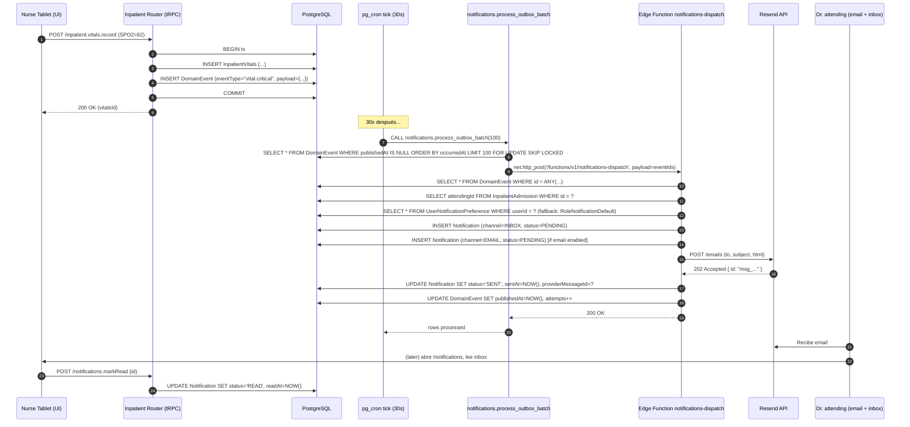
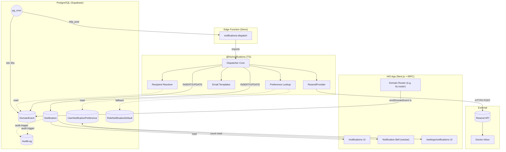

# Beta.15 — Blueprint Técnico: Alerts & Notifications

**Owner:** @AS (Arquitecto de Software, Inversiones Avante)
**Fecha:** 2026-05-14
**Versión:** 0.1 — para refinement con @DBA + @SRE
**Backlog:** [`docs/backlog/beta15_alerts_notifications.md`](../backlog/beta15_alerts_notifications.md)
**ADR asociada:** [`docs/adr/0008-beta15-notifications-outbox.md`](../adr/0008-beta15-notifications-outbox.md)

---

## 0. Resumen ejecutivo (TL;DR)

Beta.15 introduce un **bounded context "Notifications"** desacoplado de los dominios clínicos mediante el **patrón Outbox transaccional** + **dispatcher síncrono accionado por `pg_cron`**.

- **Entrada:** cualquier router que mutó estado puede `emitDomainEvent(tx, {...})` dentro de su transacción Prisma. La fila aterriza en `DomainEvent` *atómicamente* con la mutación.
- **Procesamiento:** `pg_cron` corre cada 30 segundos una función SQL `notifications.process_outbox_batch(limit)` que (a) reclama lote vía `SELECT ... FOR UPDATE SKIP LOCKED`, (b) llama a una **Edge Function** Supabase (`notifications-dispatch`) por evento, (c) marca `publishedAt` al regresar.
- **Edge Function** ejecuta el código TS del paquete `@his/notifications`: resolve recipientes, lee preferences, crea filas `Notification` (INBOX siempre, EMAIL condicional), dispara Resend para canal EMAIL.
- **Salida:** filas `Notification` consultadas por la UI (`/notifications`, badge navbar) + emails entregados por Resend.
- **Audit:** cada inserción/publicación crea entrada en `AuditLog` (cadena hash existente).

**3 trade-offs cerrados:**

1. **eventType es `VARCHAR` con catálogo TS, NO enum PostgreSQL** — porque `ALTER TYPE ADD VALUE` ya nos mordió en Beta.6 (POST_OP) y cada nuevo evento dispararía el mismo problema.
2. **Dispatcher corre en Edge Function (Deno) NO en pg_cron PL/pgSQL** — pg_cron sólo orquesta el latido y la query del lote; la lógica de routing/templates/Resend es TS reutilizable y testeable.
3. **Outbox vive en `packages/database/` (schema + helper Prisma) — sin paquete `@his/outbox` separado** — es 1 tabla + 1 helper, no merece su propio paquete.

---

## 1. Bounded context "Notifications"

```
┌─────────────────────────────────────────────────────────────────────┐
│                      BOUNDED CONTEXTS CLÍNICOS                      │
│  Inpatient · Pharmacy · LIS · Emergency · Surgery · eMAR · Imaging  │
│  Respiratory · Nutrition · Insurance · EHR Notes · Outpatient       │
└────────────────────────────┬────────────────────────────────────────┘
                             │ (emitDomainEvent)
                             ▼
                  ┌──────────────────────┐
                  │  DomainEvent (outbox)│ ◄─── tabla pública (multi-tenant RLS)
                  └──────────┬───────────┘
                             │
                             │ pg_cron tick 30s
                             ▼
┌────────────────────────────────────────────────────────────────────┐
│                BOUNDED CONTEXT — NOTIFICATIONS                     │
│                                                                    │
│  ┌────────────────┐  ┌──────────────┐  ┌──────────────────┐        │
│  │ Event Dispatcher├─►│ Recipient    ├─►│ Preference Filter│        │
│  │ (TS)            │  │ Resolver (TS)│  │ (TS)             │        │
│  └────────────────┘  └──────────────┘  └────────┬─────────┘        │
│                                                  │                  │
│                                                  ▼                  │
│  ┌──────────────────────┐         ┌──────────────────────────┐     │
│  │ Notification (envelope├────────►│ Channel Adapters         │     │
│  │ aggregate root)       │         │  - InboxChannel (no-op)  │     │
│  │                       │         │  - EmailChannel (Resend) │     │
│  └──────────────────────┘         └──────────────────────────┘     │
└────────────────────────────────────────────────────────────────────┘
                             │
              ┌──────────────┴──────────────┐
              ▼                             ▼
     ┌────────────────┐            ┌────────────────┐
     │  UI /inbox     │            │  Email entregado │
     │  badge navbar  │            │   (Resend)       │
     └────────────────┘            └────────────────┘
```

### 1.1 Aggregate roots

| Aggregate | Identificador | Invariantes |
|---|---|---|
| **`DomainEvent`** | `id` (UUID) | Inmutable una vez insertado. `publishedAt` solo puede pasar de NULL → timestamp (no retroceder). `attempts++` monotónico. |
| **`Notification`** | `id` (UUID) | Status sigue máquina: `PENDING → SENT → DELIVERED → READ` (forward only) o `PENDING → FAILED` (terminal). Inmutable post-FAILED salvo `attempts` y `lastError`. |
| **`UserNotificationPreference`** | `(userId, severity, channel)` único | CRITICAL+INBOX *no se puede deshabilitar* (regla de negocio en el dispatcher). |
| **`RoleNotificationDefault`** | `(roleId, severity, channel)` único | Read-mostly. Cambios via migration/seed. |

### 1.2 Qué *entra* y qué *sale* del contexto

**Entra (input):**
- Llamadas `emitDomainEvent(tx, dto)` desde routers tRPC de otros contextos.
- Mutaciones directas vía SQL trigger (ej. `fn_respiratory_critical_alert` insertando en `DomainEvent`).

**Sale (output):**
- Filas `Notification` (consumidas por UI tRPC `notifications.list`, `notifications.markRead`).
- HTTPS calls a Resend API.
- Filas `AuditLog` (consumidas por context "Compliance/Audit").
- Métricas Prometheus (consumidas por @SRE).

**NO interactúa directamente con** routers clínicos. Solo consume `DomainEvent` (read-only del outbox).

---

## 2. Diagrama de secuencia end-to-end

### 2.1 Happy path: alerta vital crítica → email entregado



### 2.2 Error paths

| Caso | Punto de fallo | Mitigación |
|---|---|---|
| **Crash entre INSERT vitals y INSERT DomainEvent** | tRPC router | Atómico por transacción Prisma — si crash, rollback completo, no hay vitals ni evento. |
| **Crash entre COMMIT y pg_cron tick** | DB | Outbox garantiza durabilidad. Próximo tick procesa el pendiente. |
| **Edge Function 5xx transient** | EF → RS | `publishedAt` queda NULL, `attempts++`, `lastError` registrado. Reintenta con back-off (30s, 1m, 5m, 30m, 2h, 12h). |
| **Resend rechaza email (4xx invalid)** | RS | `Notification.status = FAILED`, `failureReason` con razón. NO se reintenta. `DomainEvent.publishedAt` se marca igual (el dispatch *intentó*, no es culpa del outbox). |
| **Payload malformado (Zod fail)** | EF | `DomainEvent.attempts++` + `lastError = "payload validation failed"`. Tras 6 intentos → dead-letter (status implícito por `attempts >= 6`). Operador investiga. |
| **Recipient sin email o inactivo** | Recipient Resolver | NO se crea row `Notification(channel=EMAIL)`. Sí se crea `Notification(channel=INBOX)`. Log INFO. |
| **Cron tick mientras hay deploy** | Concurrencia | `pg_try_advisory_xact_lock(beta15_poller_lock_id)` — solo un tick procesa a la vez. Si lock falla, tick exit early. |

---

## 3. Contratos TypeScript

### 3.1 Catálogo de eventTypes (canónico)

**Path:** `packages/contracts/src/events/catalog.ts`

```ts
import { z } from "zod";

/**
 * Catálogo canónico de eventTypes Beta.15.
 * Patrón: <domain>.<noun-or-verb> (kebab-case dentro del segmento).
 * Cada eventType DEBE tener un schema Zod registrado abajo.
 */
export const EVENT_TYPES = [
  "vital.critical",
  "lab.criticalValue",
  "drug.interaction",
  "allergy.mismatch",
  // Futuros (Beta.16+):
  // "prescription.created",
  // "med.missed",
  // "coverage.expired",
] as const;

export type EventType = (typeof EVENT_TYPES)[number];

export const eventTypeSchema = z.enum(EVENT_TYPES);
```

### 3.2 Payload schemas por eventType

**Path:** `packages/contracts/src/events/payloads.ts`

```ts
import { z } from "zod";

export const vitalCriticalPayload = z.object({
  admissionId: z.string().uuid(),
  patientId: z.string().uuid(),
  vitalsId: z.string().uuid(),
  alerts: z.array(z.object({
    parameter: z.enum(["SPO2","HR","BP_SYS","TEMP","GCS","PAIN","RR","ETCO2"]),
    value: z.number(),
    severity: z.enum(["CRITICAL","WARNING"]),
    message: z.string(),
  })).min(1),
});

export const labCriticalValuePayload = z.object({
  orderItemId: z.string().uuid(),
  resultId: z.string().uuid(),
  prescriberId: z.string().uuid(),
  testCode: z.string(),
  flag: z.enum(["CRITICAL_LOW","CRITICAL_HIGH"]),
  value: z.number(),
  unit: z.string().optional(),
  referenceRange: z.object({ low: z.number().nullable(), high: z.number().nullable() }),
});

export const drugInteractionPayload = z.object({
  prescriptionId: z.string().uuid(),
  prescriberId: z.string().uuid(),
  conflictingDrugIds: z.array(z.string().uuid()).min(2),
  severity: z.enum(["CRITICAL","WARNING"]),
  description: z.string(),
});

export const allergyMismatchPayload = z.object({
  prescriptionItemId: z.string().uuid().optional(),
  medicationAdministrationId: z.string().uuid().optional(),
  patientId: z.string().uuid(),
  allergyId: z.string().uuid(),
  drugId: z.string().uuid(),
  prescriberId: z.string().uuid().nullable(),
});

/**
 * Discriminated union — un evento solo es válido si su eventType matchea
 * con el shape correcto del payload.
 */
export const domainEventPayloadSchema = z.discriminatedUnion("eventType", [
  z.object({ eventType: z.literal("vital.critical"),     payload: vitalCriticalPayload }),
  z.object({ eventType: z.literal("lab.criticalValue"),  payload: labCriticalValuePayload }),
  z.object({ eventType: z.literal("drug.interaction"),   payload: drugInteractionPayload }),
  z.object({ eventType: z.literal("allergy.mismatch"),   payload: allergyMismatchPayload }),
]);
export type DomainEventPayload = z.infer<typeof domainEventPayloadSchema>;
```

### 3.3 `Notification` envelope schema

**Path:** `packages/contracts/src/schemas/notifications.ts`

```ts
import { z } from "zod";

export const notificationChannelSchema  = z.enum(["INBOX", "EMAIL"]);
export const notificationSeveritySchema = z.enum(["CRITICAL", "WARNING", "INFO"]);
export const notificationStatusSchema   = z.enum(["PENDING", "SENT", "DELIVERED", "READ", "FAILED"]);

export const notificationSchema = z.object({
  id: z.string().uuid(),
  organizationId: z.string().uuid(),
  eventId: z.string().uuid(),
  recipientUserId: z.string().uuid(),
  channel: notificationChannelSchema,
  severity: notificationSeveritySchema,
  subject: z.string().min(1).max(200),
  body: z.string().min(1).max(5000),
  status: notificationStatusSchema,
  sentAt: z.coerce.date().nullable(),
  deliveredAt: z.coerce.date().nullable(),
  readAt: z.coerce.date().nullable(),
  failedAt: z.coerce.date().nullable(),
  failureReason: z.string().nullable(),
  providerMessageId: z.string().nullable(),
  metadata: z.record(z.unknown()).nullable(),
  createdAt: z.coerce.date(),
  updatedAt: z.coerce.date(),
});
export type Notification = z.infer<typeof notificationSchema>;
```

### 3.4 `UserNotificationPreference` schema

```ts
export const userNotificationPreferenceSchema = z.object({
  userId: z.string().uuid(),
  severity: notificationSeveritySchema,
  channel: notificationChannelSchema,
  enabled: z.boolean(),
});
```

### 3.5 Interfaces (ports — hexagonal)

**Path:** `packages/notifications/src/ports/`

```ts
// ports/email-provider.ts
export interface EmailProvider {
  send(input: {
    to: string;
    from: string;
    subject: string;
    html: string;
    text: string;
    tags?: Record<string, string>;
  }): Promise<{ providerMessageId: string }>;
}

export class TransientProviderError extends Error { readonly kind = "transient" as const; }
export class PermanentProviderError extends Error { readonly kind = "permanent" as const; }

// ports/event-dispatcher.ts
import type { DomainEventPayload } from "@his/contracts/events/payloads";

export interface DispatchedEvent {
  id: string;
  organizationId: string;
  occurredAt: Date;
  payload: DomainEventPayload;
}

export interface EventDispatcher {
  dispatch(events: DispatchedEvent[]): Promise<DispatchResult>;
}

export type DispatchResult = {
  succeeded: Array<{ eventId: string; notificationsCreated: number }>;
  failed: Array<{ eventId: string; error: string; transient: boolean }>;
};

// ports/recipient-resolver.ts
export interface RecipientResolver {
  resolve(event: DispatchedEvent): Promise<Array<{
    userId: string;
    role: "DOCTOR" | "NURSE" | "PHARMACIST" | "ADMIN";
    email: string | null;
    active: boolean;
  }>>;
}
```

### 3.6 Adapter Resend (implementación de `EmailProvider`)

**Path:** `packages/notifications/src/providers/resend.ts`

```ts
import { Resend } from "resend";
import type { EmailProvider } from "../ports/email-provider";
import { TransientProviderError, PermanentProviderError } from "../ports/email-provider";

export class ResendEmailProvider implements EmailProvider {
  private client: Resend;
  constructor(apiKey: string) { this.client = new Resend(apiKey); }

  async send(input) {
    try {
      const { data, error } = await this.client.emails.send({
        from: input.from, to: input.to, subject: input.subject,
        html: input.html, text: input.text, tags: input.tags
          ? Object.entries(input.tags).map(([name, value]) => ({ name, value }))
          : undefined,
      });
      if (error) {
        // Resend retorna 4xx en `error` con `.statusCode`
        if (error.statusCode >= 500) throw new TransientProviderError(error.message);
        throw new PermanentProviderError(error.message);
      }
      return { providerMessageId: data!.id };
    } catch (e: unknown) {
      if (e instanceof TransientProviderError || e instanceof PermanentProviderError) throw e;
      // Errores de red/timeout → transient
      throw new TransientProviderError((e as Error).message);
    }
  }
}
```

---

## 4. Schema Prisma propuesto

> **@DBA valida después.** Schemas en `packages/database/prisma/schema.prisma`. RLS y triggers van en `packages/database/sql/42_notifications.sql` (a redactar en spike US.B15.1.1).

### 4.1 Enums nuevos

```prisma
enum NotificationChannel {
  INBOX
  EMAIL
  // SMS  (Beta.16+)
  // WHATSAPP (Beta.17+)
  @@schema("public")
}

enum NotificationSeverity {
  CRITICAL
  WARNING
  INFO
  @@schema("public")
}

enum NotificationStatus {
  PENDING
  SENT
  DELIVERED
  READ
  FAILED
  @@schema("public")
}
```

### 4.2 `DomainEvent` (outbox)

```prisma
/// Outbox pattern — eventos de dominio emitidos dentro de transacción.
/// eventType es VARCHAR (no enum PG) para evolución sin ALTER TYPE — ver ADR 0008.
/// RLS: tenant-scoped por organizationId. Trigger `fn_audit_log_chain` cubre auditoría.
model DomainEvent {
  id             String    @id @default(dbgenerated("gen_random_uuid()")) @db.Uuid
  organizationId String    @db.Uuid
  eventType      String    @db.VarChar(80)
  aggregateType  String    @db.VarChar(60)
  aggregateId    String    @db.Uuid
  payload        Json
  occurredAt     DateTime  @default(now()) @db.Timestamptz()
  publishedAt    DateTime? @db.Timestamptz()
  attempts       Int       @default(0)
  lastError      String?   @db.Text
  emittedById    String?   @db.Uuid /// usuario que disparó la mutación origen.

  organization Organization @relation(fields: [organizationId], references: [id], onDelete: Restrict)
  notifications Notification[]

  @@index([organizationId, eventType])
  @@index([occurredAt])
  /// Index parcial — solo eventos NO publicados. Lo usa el poller pg_cron.
  @@index([occurredAt], name: "ix_domain_event_unpublished", map: "ix_domain_event_unpublished")
  @@schema("public")
}
```

> El `@@index([occurredAt], name: "...", map: "...")` con `WHERE publishedAt IS NULL` se aplica en SQL crudo porque Prisma no soporta partial indexes en schema declaration — @DBA lo añade en SQL 42.

### 4.3 `Notification`

```prisma
/// Envelope persistente de notificaciones — una row por (eventId, recipientUserId, channel).
/// UNIQUE en (eventId, recipientUserId, channel) garantiza idempotencia del dispatcher.
/// Retención: 90 días por status=READ (purge via pg_cron diario) — ver ADR 0008.
model Notification {
  id                String              @id @default(dbgenerated("gen_random_uuid()")) @db.Uuid
  organizationId    String              @db.Uuid
  eventId           String              @db.Uuid
  recipientUserId   String              @db.Uuid
  channel           NotificationChannel
  severity          NotificationSeverity
  subject           String              @db.VarChar(200)
  body              String              @db.Text
  status            NotificationStatus  @default(PENDING)
  sentAt            DateTime?           @db.Timestamptz()
  deliveredAt       DateTime?           @db.Timestamptz()
  readAt            DateTime?           @db.Timestamptz()
  failedAt          DateTime?           @db.Timestamptz()
  failureReason     String?             @db.Text
  providerMessageId String?             @db.VarChar(120)
  metadata          Json?
  attempts          Int                 @default(0)
  createdAt         DateTime            @default(now()) @db.Timestamptz()
  updatedAt         DateTime            @updatedAt @db.Timestamptz()

  organization  Organization @relation(fields: [organizationId], references: [id], onDelete: Restrict)
  event         DomainEvent  @relation(fields: [eventId], references: [id], onDelete: Restrict)
  recipientUser User         @relation("NotificationRecipient", fields: [recipientUserId], references: [id], onDelete: Restrict)

  @@unique([eventId, recipientUserId, channel])
  @@index([recipientUserId, status, createdAt(sort: Desc)])
  @@index([organizationId, status])
  @@schema("public")
}
```

### 4.4 `UserNotificationPreference`

```prisma
/// Preferencias por usuario × severity × channel. UPSERT-friendly.
/// Si no hay row → se aplica RoleNotificationDefault del rol del usuario.
/// CRITICAL+INBOX se ignora (no se puede deshabilitar; validado en dispatcher).
model UserNotificationPreference {
  id        String                @id @default(dbgenerated("gen_random_uuid()")) @db.Uuid
  userId    String                @db.Uuid
  severity  NotificationSeverity
  channel   NotificationChannel
  enabled   Boolean               @default(true)
  updatedAt DateTime              @updatedAt @db.Timestamptz()

  user User @relation(fields: [userId], references: [id], onDelete: Cascade)

  @@unique([userId, severity, channel])
  @@schema("public")
}
```

### 4.5 `RoleNotificationDefault`

```prisma
/// Defaults por rol. Seed inicial cubre Doctor / Nurse / Pharmacist / Admin Org.
/// Cambios se gestionan via migration/seed, NO por UI.
model RoleNotificationDefault {
  id       String                @id @default(dbgenerated("gen_random_uuid()")) @db.Uuid
  roleId   String                @db.Uuid
  severity NotificationSeverity
  channel  NotificationChannel
  enabled  Boolean

  role Role @relation(fields: [roleId], references: [id], onDelete: Cascade)

  @@unique([roleId, severity, channel])
  @@schema("public")
}
```

### 4.6 Relations inversas que añadir a modelos existentes

```prisma
// En model User:
notificationsReceived       Notification[]                @relation("NotificationRecipient")
notificationPreferences     UserNotificationPreference[]

// En model Organization:
domainEvents                DomainEvent[]
notifications               Notification[]

// En model Role:
notificationDefaults        RoleNotificationDefault[]
```

### 4.7 RLS / triggers (hints para @DBA)

- **`DomainEvent`**: RLS por `organizationId` (patrón `_tenant_modify`). `INSERT` permitido a `authenticated`; `UPDATE` solo a `service_role` (el dispatcher).
- **`Notification`**: RLS por `organizationId` para SELECT, y *adicionalmente* `recipientUserId = current_user_id()` para SELECT no-admin. UPDATE solo permitido para `status` (READ marker) por el propio recipient.
- **`UserNotificationPreference`**: RLS por `userId = current_user_id()` (self-only).
- **`RoleNotificationDefault`**: read-public dentro del tenant, escritura solo `service_role`.
- **Audit triggers genéricos** del SQL 22 cubren las 4 tablas automáticamente (relkind=r).

---

## 5. Routing matrix — recipient resolver

> Implementación TS en `packages/notifications/src/recipients.ts`. Reglas codificadas (no configurables por tenant en Beta.15).

| eventType | Aggregate | Recipients TS query (pseudocode) |
|---|---|---|
| `vital.critical` | `InpatientVitals` o `VentilatorSession` | `attendingId` desde `InpatientAdmission` matchando `admissionId` del payload. Si proviene de respiratory (no tiene admission), usar `prescriberId` desde `RespiratoryOrder`. |
| `lab.criticalValue` | `LabResult` | `prescriberId` desde `LabOrder` matchando `orderItemId.orderId`. |
| `drug.interaction` | `Prescription` | `prescriberId` + todos los farmacéuticos activos de la org (rol = PHARMACIST). |
| `allergy.mismatch` | `MedicationAdministration` o `PrescriptionItem` | `prescriberId` desde `Prescription` + todos los farmacéuticos activos. |

### 5.1 Multi-recipient: 1 evento → N notifications

Si el resolver retorna 3 usuarios, el dispatcher crea hasta `3 × n_canales_aplicables` filas en `Notification`. La idempotencia se mantiene por el `@@unique([eventId, recipientUserId, channel])`.

### 5.2 Filtro de actividad

- Solo recipients con `User.active = true`.
- Para EMAIL: solo si `User.email IS NOT NULL` (siempre lo es por unique constraint, pero validamos).
- Si el rol ya no es válido (`UserOrganizationRole.validTo < now()`), se excluye.

---

## 6. `pg_cron` design

### 6.1 Función SQL del poller

**Path:** `packages/database/sql/42_notifications_outbox.sql`

```sql
CREATE OR REPLACE FUNCTION notifications.process_outbox_batch(p_limit INT DEFAULT 100)
RETURNS TABLE(event_id UUID, status TEXT, error TEXT)
LANGUAGE plpgsql
SECURITY DEFINER -- corre con role 'postgres' para llamar net.http_post
SET search_path = ''
AS $$
DECLARE
  v_locked BOOLEAN;
  v_response JSONB;
BEGIN
  -- Lock global para evitar pollers concurrentes
  v_locked := pg_try_advisory_xact_lock(7311500); -- hash arbitrario "beta15-poller"
  IF NOT v_locked THEN
    RAISE NOTICE 'process_outbox_batch: another poller is running, skipping tick';
    RETURN;
  END IF;

  -- Llama Edge Function con los IDs del lote
  WITH batch AS (
    SELECT de.id
    FROM public."DomainEvent" de
    WHERE de."publishedAt" IS NULL
      AND de.attempts < 6
    ORDER BY de."occurredAt" ASC
    LIMIT p_limit
    FOR UPDATE SKIP LOCKED
  )
  SELECT extensions.http_post(
    url := current_setting('app.notifications_dispatch_url'),
    body := jsonb_build_object('eventIds', array_agg(batch.id)),
    headers := jsonb_build_object(
      'Authorization', 'Bearer ' || current_setting('app.service_role_key'),
      'Content-Type', 'application/json'
    )
  ) INTO v_response FROM batch;

  -- Edge Function se encarga de actualizar publishedAt / attempts / lastError.
  -- Aquí solo loggeamos.
  RAISE NOTICE 'process_outbox_batch dispatched: %', v_response;
END;
$$;

-- Schedule pg_cron cada 30 segundos
SELECT cron.schedule(
  'notifications-outbox-poller',
  '*/30 * * * * *', -- pg_cron supports 6-field cron (segundos) cuando se compila con --with-cron-seconds
  $$ SELECT notifications.process_outbox_batch(100) $$
);
```

**Notas:**
- `SECURITY DEFINER` + `search_path = ''` igual que el resto de funciones del SQL 24.
- `pg_try_advisory_xact_lock` previene concurrencia entre instancias.
- `FOR UPDATE SKIP LOCKED` permite múltiples workers eventualmente (Beta.18+) sin reentrancia.
- Settings `app.notifications_dispatch_url` y `app.service_role_key` se inyectan vía `ALTER DATABASE ... SET app.X = '...'` por @SRE.

### 6.2 Schedule

- **30s** entre ticks. Cumple métrica P95 < 90s (3 ticks * 30s = 90s buffer).
- Si pg_cron en Supabase no soporta 6-field cron (segundos), fallback a `* * * * *` (cada minuto). En ese caso métrica P95 se afloja a 180s.

### 6.3 Edge Function `notifications-dispatch`

**Path:** `supabase/functions/notifications-dispatch/index.ts`

Recibe `{ eventIds: string[] }`, procesa cada evento secuencialmente:

```ts
import { createClient } from "@supabase/supabase-js";
import { dispatcher } from "@his/notifications";

Deno.serve(async (req) => {
  const { eventIds } = await req.json();
  const supabase = createClient(/* service role */);

  const events = await supabase
    .from("DomainEvent").select("*")
    .in("id", eventIds);

  const result = await dispatcher.dispatch(events.data);

  // Update DomainEvent rows según result
  for (const ok of result.succeeded) {
    await supabase.from("DomainEvent").update({
      publishedAt: new Date().toISOString(), attempts: { increment: 1 }
    }).eq("id", ok.eventId);
  }
  for (const fail of result.failed) {
    await supabase.from("DomainEvent").update({
      attempts: { increment: 1 },
      lastError: fail.error.slice(0, 2000),
      // si !transient → marcamos publishedAt para no reintentar
      publishedAt: fail.transient ? null : new Date().toISOString(),
    }).eq("id", fail.eventId);
  }

  return new Response(JSON.stringify(result), { status: 200 });
});
```

Edge Function NO duplica lógica del dispatcher — importa `@his/notifications` (TS shared). El package se compila a ES2022 + ESM, deployable a Deno via `deno bundle` o `esbuild`.

### 6.4 Job de purga (retención 90 días)

```sql
SELECT cron.schedule(
  'notifications-purge-read-older-90d',
  '0 3 * * *', -- 03:00 UTC diario
  $$ DELETE FROM public."Notification"
     WHERE status = 'READ' AND "readAt" < NOW() - INTERVAL '90 days' $$
);
```

`AuditLog` permanece intacto (compliance forever).

---

## 7. Idempotencia

### 7.1 Dedup key

`UNIQUE(eventId, recipientUserId, channel)` en `Notification`.

Si el dispatcher se reintenta tras un crash parcial, el `INSERT ... ON CONFLICT DO NOTHING` garantiza que NO se creen duplicados:

```sql
INSERT INTO public."Notification" (eventId, recipientUserId, channel, ...)
VALUES (...)
ON CONFLICT (eventId, recipientUserId, channel) DO NOTHING
RETURNING id;
```

### 7.2 Reintento del provider (Resend)

- Si el `INSERT Notification` ya existe (conflict) y `status = SENT`, NO se llama Resend de nuevo — leer `providerMessageId` y log INFO "already dispatched".
- Si la row existe con `status = PENDING` (significa que el crash fue *después* de INSERT pero *antes* de Resend), SÍ se llama Resend y se actualiza status.

### 7.3 Hash del payload (defensa adicional)

Para detectar "mismo logical event re-emitido por bug en router" (no por crash de retry), opcionalmente añadir `payloadHash VARCHAR(64)` SHA-256 del JSON. En Beta.15 se loguea sin enforce — Beta.16 podría hacer constraint UNIQUE(payloadHash, aggregateId) si surface duplicates reales.

---

## 8. Backpressure

### 8.1 Límites operacionales

- **Batch size:** 100 eventos por tick.
- **Tick frequency:** cada 30s.
- **Throughput máximo MVP:** 100 × 2 = 200 eventos/minuto = 12,000 eventos/hora.
- **Volumen esperado @PO:** 50-200 alertas/día/establecimiento. Con 10 establecimientos = 2,000/día = 0.024 eventos/segundo. **200x margen sobre carga base.**

### 8.2 Comportamiento bajo pico

Si llegan 1,000 eventos en 1 segundo (ej. crash + recovery de toda una sala UCI):
- Primer tick procesa 100, deja 900 pendientes.
- Tick #2 (30s después): 100 más.
- 10 ticks × 30s = **5 minutos para drenar 1,000 eventos**.

Aceptable para Beta.15. Si queremos mejor, opciones futuras:
- Subir `LIMIT 100 → 500` (riesgo: Edge Function timeout 60s).
- Múltiples instancias Edge Function en paralelo (requiere quitar `pg_try_advisory_xact_lock` global y reemplazar por row-level via `FOR UPDATE SKIP LOCKED` que ya existe).
- Inngest con concurrency tuneable (Beta.18+).

### 8.3 Queue length cap

NO se impone cap en Beta.15. `DomainEvent` puede crecer indefinidamente. @SRE configurará alerta Prometheus si `count(publishedAt IS NULL) > 5000` por > 10 min.

---

## 9. Estructura de paquetes

### 9.1 Paquete nuevo: `@his/notifications`

```
packages/notifications/
├── package.json
├── tsconfig.json
├── src/
│   ├── index.ts                    # barrel
│   ├── ports/
│   │   ├── email-provider.ts       # interface + errors
│   │   ├── event-dispatcher.ts     # interface
│   │   └── recipient-resolver.ts   # interface
│   ├── providers/
│   │   └── resend.ts               # ResendEmailProvider
│   ├── dispatcher/
│   │   ├── core.ts                 # implementa EventDispatcher
│   │   ├── recipients.ts           # implementa RecipientResolver
│   │   ├── preferences.ts          # lookup UserNotificationPreference → RoleNotificationDefault
│   │   └── templates.ts            # renderers React Email por eventType
│   └── __tests__/
│       ├── recipients.test.ts
│       ├── preferences.test.ts
│       └── dispatcher.test.ts      # integration (vitest + testcontainers postgres)
```

**Dependencies (`package.json`):**
- `resend` (^4.x) — único provider.
- `@react-email/components` + `@react-email/render` — templates HTML+text.
- `zod` (peer) — validation.
- `@his/contracts` (workspace) — schemas + types.
- `@his/database` (workspace, peer) — Prisma client types.

### 9.2 Paquete existente extendido: `@his/contracts`

```
packages/contracts/src/
├── events/                         # NUEVO directorio
│   ├── catalog.ts                  # eventType enum + array
│   ├── payloads.ts                 # discriminated union schemas
│   └── index.ts
└── schemas/
    └── notifications.ts            # NUEVO archivo — Notification, Preference schemas
```

### 9.3 Outbox helper en `@his/database`

```
packages/database/
├── src/
│   └── outbox/
│       ├── emit.ts                 # emitDomainEvent(tx, dto)
│       └── __tests__/emit.test.ts
└── prisma/
    └── schema.prisma               # +DomainEvent +Notification +Preference +RoleNotificationDefault
```

**Justificación de NO crear `packages/outbox/`:**
- 1 tabla + 1 helper = no merece overhead de workspace package.
- Tightly coupled a Prisma client → vive donde está Prisma.

### 9.4 UI en `apps/web`

```
apps/web/src/app/
├── (clinical)/notifications/
│   ├── page.tsx                    # inbox listing
│   └── actions.ts                  # markRead, markAllRead server actions
└── settings/
    └── notifications/
        ├── page.tsx                # preferences UI
        └── actions.ts              # upsertPreference

apps/web/src/components/
├── notifications-bell.tsx          # badge + dropdown navbar
└── notification-card.tsx           # row del inbox
```

### 9.5 Edge Function en `supabase/functions/`

```
supabase/functions/notifications-dispatch/
├── index.ts                        # Deno entrypoint (imports @his/notifications bundled)
├── deno.json
└── README.md
```

---

## 10. Riesgos arquitecturales (5) + mitigación

| # | Riesgo | Probabilidad | Impacto | Mitigación |
|---|---|---|---|---|
| **R1** | **Payload malformado bloquea el poller** (ej. Zod fail → exception → tick falla). | MEDIA | ALTO | Edge Function envuelve `dispatch()` en try/catch por evento (no por batch). Fallos individuales marcan `lastError` y `attempts++` sin abortar el tick. Test: inyectar payload `{}` en `vital.critical` → assert que el siguiente evento del lote se procesa OK. |
| **R2** | **Recipient sin email genera `Notification(EMAIL)` que falla indefinido.** | ALTA | MEDIO | Recipient Resolver pre-valida `user.email != null && user.active`. Si falla, NO se crea la row EMAIL. Solo se crea INBOX. Log estructurado para investigación. |
| **R3** | **Tenant ruidoso satura el poller** (un hospital genera 5,000 eventos/h por bug, otros tenants se demoran). | BAJA | MEDIO | Fase 1: monitoring + alerta. Fase 2 (si materializa): query del lote con fairness — `ORDER BY (organizationId hash, occurredAt)` o limit por org via window function. Se difiere a Beta.16 con datos reales. |
| **R4** | **Drift entre `eventType` en TS y filas reales en DB** (alguien insert "vital.critic" typo → poller falla en discriminated union). | MEDIA | ALTO | `eventType` es VARCHAR pero Zod `eventTypeSchema = z.enum(EVENT_TYPES)` se valida ANTES de `emitDomainEvent(tx, dto)`. `emitDomainEvent` lanza si no matchea. Test unitario contractual: cada eventType en `EVENT_TYPES` debe tener entrada en `domainEventPayloadSchema`. CI bloquea si falta. |
| **R5** | **Edge Function frio o timeout** (Deno cold start > 60s para batch grande). | MEDIA | MEDIO | Batch size 100 está conservadora. Resend tiene SDK liviano. Si timeout, `publishedAt` queda NULL → próximo tick reintenta. Métrica @SRE: P95 invocation duration. Si > 30s reducir batch a 50. |

---

## 11. Sequencing técnico — handoff a @Dev

### 11.1 Sprint 1 (2 semanas, target ~22 pts)

Objetivo: **outbox funcional + provider Resend + 1 evento end-to-end**.

| Orden | Story | Pts | Dependencias | Notas |
|---|---|---|---|---|
| 1 | US.B15.1.1 DomainEvent schema | 5 | — | Spike + schema + RLS + SQL 42. |
| 2 | US.B15.1.2 emitDomainEvent helper | 3 | 1 | Paquete contracts + helper en database. |
| 3 | US.B15.2.1 Notification schema | 5 | 1 | Mismo PR que 1 si conviene. |
| 4 | US.B15.2.2 ResendEmailProvider adapter | 3 | — | Paralelo a 1-3 (no depende de schema). |
| 5 | US.B15.4.2 Wiring lab.criticalValue | 5 | 2, 3 | Conecta 1 evento real end-to-end como proof. |

**Hitos Sprint 1:**
- DomainEvent table aplicada en staging.
- `pg_cron` schedule activo cada 30s (sin dispatcher real aún — mock).
- Un router de LIS emite un evento real, manualmente verifico que aterriza en tabla.

### 11.2 Sprint 2 (~22 pts)

Objetivo: **dispatcher completo + UI inbox**.

| Orden | Story | Pts | Dependencias |
|---|---|---|---|
| 6 | US.B15.2.3 Dispatcher core | 8 | 2, 4 |
| 7 | US.B15.1.3 Worker poller (pg_cron + Edge Function) | 5 | 6 |
| 8 | US.B15.3.1 Inbox UI `/notifications` | 5 | 3 |
| 9 | US.B15.3.2 Badge navbar | 3 | 8 |

**Hitos Sprint 2:**
- E2E: emit vital.critical → email entrega real a Resend test inbox → row INBOX visible en UI.
- Demo a @PO con un escenario clínico simulado.

### 11.3 Sprint 3 (~22 pts)

Objetivo: **preferences + plantillas + wirings restantes + tests**.

| Orden | Story | Pts | Dependencias |
|---|---|---|---|
| 10 | US.B15.3.3 Preferences UI | 5 | 6 |
| 11 | US.B15.3.4 Defaults por rol | 3 | 10 |
| 12 | US.B15.2.4 Email templates | 5 | 6 |
| 13 | US.B15.4.1 Wiring vital.critical | 5 | 6 |
| 14 | US.B15.4.3 Wiring drug.interaction + allergy.mismatch | 5 | 6 |
| 15 | US.B15.1.4 Audit trail integration | 2 | 7 |

**Hitos Sprint 3:**
- 4/4 eventos pilotos cableados.
- 60+ tests unitarios + 8 integration tests + 1 E2E Playwright (notification flow).
- @QAF firma escenarios BDD `tests/features/notifications.feature`.
- Beta.15 listo para producción tras UAT.

### 11.4 Paralelizable

Equipo de 2 devs en Sprint 1:
- Dev A: stories 1, 2, 3 (DB schema + helper).
- Dev B: story 4 (ResendProvider standalone) + spike Edge Function deploy.

Sprint 2:
- Dev A: 6 (dispatcher) + 7 (poller).
- Dev B: 8 (UI inbox) + 9 (badge).

Sprint 3:
- Dev A: 10, 11, 12 (UI prefs + templates).
- Dev B: 13, 14, 15 (wirings + audit).

---

## 12. Out of scope explícito (recordatorio)

- Push móvil → Beta.16.
- WhatsApp → Beta.17.
- WebSocket/SSE real-time → Beta.18 (hoy polling 30s suficiente).
- Escalation policies → Phase 7.
- Templates configurables por tenant → futuro.
- Modo concentración para Doctor → Beta.16.
- Allergy mismatch bloqueante (break-the-glass) → Beta.16.

---

## 13. Checklist de validación pre-construcción

Antes de que @Dev abra el primer PR:

- [ ] @DBA aprueba schemas Prisma + RLS strategy (§4 + §6.1).
- [ ] @SRE confirma que `pg_cron` extension está habilitado en Supabase project HIS (`SELECT * FROM pg_extension WHERE extname='pg_cron'`).
- [ ] @SRE provisiona Resend account + API key (`RESEND_API_KEY`) en Vercel env + Supabase secret.
- [ ] @SRE define dominio sender verificado en Resend (`notifications@his.avante.example`).
- [ ] @AT decide región de Edge Function (`us-east-1` o `iad1` para alinear con Vercel).
- [ ] @QA esboza estrategia de testing (Vitest + 1 integration + 1 E2E Playwright).
- [ ] @AE valida que `Notification.body` puede contener PHI (sí, pero solo dentro del tenant; emails fuera del tenant NO incluyen identificadores directos del paciente — convención: usar `patientId` como hash truncado en subject).

---

## 14. Diagrama C4 — nivel Component (Notifications context)



---

**Fin del blueprint Beta.15.**
