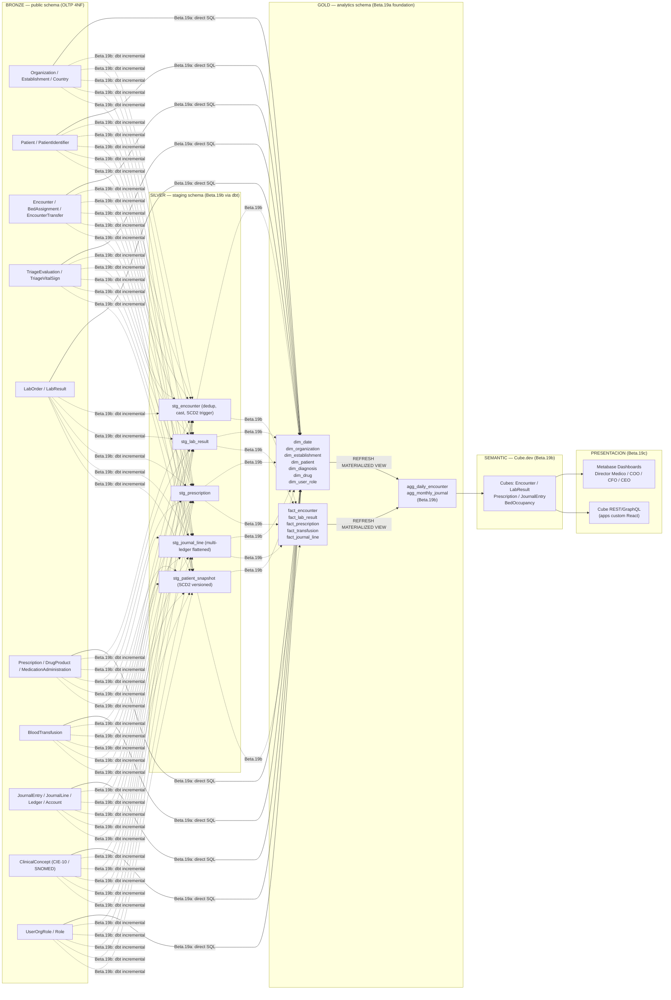

# Blueprint Beta.19a — BI Modelo Dimensional HIS Avante

- **Estado:** Diseno aprobado (Wave Beta.19a)
- **Fecha:** 2026-05-16
- **Owner:** @DA — Data Architect BI
- **Reviewers:** @BID (implementacion), @BIA (validacion metricas), @DBA (SQL review)
- **ADR base:** ADR 0009 — BI Medallion Architecture
- **Wave siguiente:** Beta.19b — capa semantica Cube.dev + dbt Silver layer

---

## 1. Diagrama de capas Medallion



---

## 2. Dimensiones iniciales — definicion completa

### 2.1 `dim_date`

**Tipo:** Tabla estatica (no matview). Poblada por funcion SQL una vez.
**Grain:** Un registro por dia del calendario.
**SCD:** No aplica (immutable).

| Columna | Tipo | Descripcion |
|---------|------|-------------|
| `date_sk` | INT (PK) | Surrogate key = YYYYMMDD (20260101) |
| `full_date` | DATE | Fecha completa |
| `year` | SMALLINT | 2026 |
| `quarter` | SMALLINT | 1-4 |
| `month` | SMALLINT | 1-12 |
| `month_name_es` | VARCHAR(20) | Enero, Febrero... |
| `week_of_year` | SMALLINT | ISO week |
| `day_of_week` | SMALLINT | 1 (lunes) a 7 (domingo) — ISO |
| `day_name_es` | VARCHAR(20) | Lunes, Martes... |
| `day_of_month` | SMALLINT | 1-31 |
| `is_weekend` | BOOLEAN | sabado o domingo |
| `is_sv_holiday` | BOOLEAN | Festivos SV (placeholder; actualizar anual) |
| `fiscal_year_sv` | SMALLINT | Ano fiscal SV (enero-diciembre) |
| `fiscal_month_sv` | SMALLINT | Mes fiscal SV (=month para SV) |

**Rango:** 2020-01-01 a 2040-12-31 (7306 filas).

**Funcion de poblado:**
```sql
SELECT analytics.populate_dim_date('2020-01-01'::DATE, '2040-12-31'::DATE);
```

---

### 2.2 `dim_organization`

**Tipo:** Materialized View sobre `public."Organization"`.
**Grain:** Un registro por organizacion activa.
**SCD:** Tipo 1 (overwrite en REFRESH).

| Columna | Tipo | Fuente OLTP |
|---------|------|-------------|
| `org_sk` | BIGINT (PK, identity) | Generado |
| `organization_id` | UUID NK | `Organization.id` |
| `org_name` | VARCHAR(300) | `Organization.name` |
| `org_tax_id` | VARCHAR(30) | `Organization.taxId` |
| `country_code` | CHAR(3) | `Country.isoAlpha3` via join |
| `functional_currency` | CHAR(3) | `Organization.functionalCurrency` |
| `reporting_currency` | CHAR(3) | `Organization.reportingCurrency` |
| `is_active` | BOOLEAN | `Organization.isActive` |
| `created_date_sk` | INT | FK dim_date |

---

### 2.3 `dim_establishment`

**Tipo:** Materialized View sobre `public."Establishment"`.
**Grain:** Un registro por establecimiento.
**SCD:** Tipo 1.

| Columna | Tipo | Fuente OLTP |
|---------|------|-------------|
| `estab_sk` | BIGINT (PK, identity) | Generado |
| `establishment_id` | UUID NK | `Establishment.id` |
| `organization_id` | UUID | FK para filtro RLS |
| `estab_name` | VARCHAR(300) | `Establishment.name` |
| `estab_code` | VARCHAR(50) | `Establishment.code` |
| `country_code` | CHAR(3) | via Organization.Country |
| `estab_type` | VARCHAR(50) | `Establishment.type` |
| `is_active` | BOOLEAN | `Establishment.isActive` |

---

### 2.4 `dim_patient`

**Tipo:** Materialized View con versionado SCD Tipo 2.
**Grain:** Un registro por version de datos demograficos del paciente.
**SCD:** Tipo 2 — columnas `valid_from`, `valid_to`, `is_current`.

| Columna | Tipo | Fuente OLTP |
|---------|------|-------------|
| `patient_sk` | BIGINT (PK, identity) | Generado |
| `patient_id` | UUID NK | `Patient.id` |
| `organization_id` | UUID | `Patient.organizationId` (RLS) |
| `age_band` | VARCHAR(20) | Calculado: 0-4, 5-14, 15-44, 45-64, 65+ |
| `biological_sex` | VARCHAR(10) | `Patient.biologicalSex` |
| `country_of_birth` | CHAR(3) | `Patient.countryOfBirth` |
| `valid_from` | DATE | Fecha del snapshot |
| `valid_to` | DATE | NULL si es current |
| `is_current` | BOOLEAN | Flag version activa |
| **NO incluye** | | `name`, `docNumber`, `dateOfBirth` — PHI redactada en Gold |

**Nota PHI:** nombre, numero de documento y fecha exacta de nacimiento no se
exponen en Gold. Solo `age_band` (banda de edad) y `biological_sex` para
analisis epidemiologico. El join a datos nominales requiere rol `bi_clinical_lead`
y se realiza en la capa Silver con politica RLS adicional.

---

### 2.5 `dim_diagnosis`

**Tipo:** Materialized View sobre `public."ClinicalConcept"` filtrado por CIE-10.
**Grain:** Un codigo diagnostico.
**SCD:** Tipo 1 (el catalogo CIE-10 no revierte codigos, solo agrega).

| Columna | Tipo | Fuente OLTP |
|---------|------|-------------|
| `diag_sk` | BIGINT (PK, identity) | Generado |
| `concept_id` | UUID NK | `ClinicalConcept.id` |
| `code` | VARCHAR(20) | `ClinicalConcept.code` (ej. J18.9) |
| `display` | VARCHAR(500) | `ClinicalConcept.display` |
| `code_system` | VARCHAR(50) | `CodeSystem.name` (ICD-10, SNOMED) |
| `code_system_version` | VARCHAR(20) | `CodeSystem.version` |
| `chapter_code` | CHAR(1) | Primera letra del codigo CIE-10 |
| `chapter_name_es` | VARCHAR(200) | Descripcion del capitulo (lookup estatico) |
| `is_active` | BOOLEAN | `ClinicalConcept.isActive` |

---

### 2.6 `dim_drug`

**Tipo:** Materialized View sobre `public."DrugProduct"`.
**Grain:** Un producto farmaceutico (SKU de farmacia).
**SCD:** Tipo 1.

| Columna | Tipo | Fuente OLTP |
|---------|------|-------------|
| `drug_sk` | BIGINT (PK, identity) | Generado |
| `drug_product_id` | UUID NK | `DrugProduct.id` |
| `organization_id` | UUID | RLS |
| `generic_name` | VARCHAR(300) | `DrugProduct.genericName` |
| `atc_code` | VARCHAR(20) | `DrugProduct.atcCode` (WHO ATC) |
| `atc_level1_name` | VARCHAR(100) | Descripcion nivel 1 ATC (lookup) |
| `dosage_form` | VARCHAR(100) | `DrugProduct.dosageForm` |
| `strength` | VARCHAR(100) | `DrugProduct.strength` |
| `is_controlled` | BOOLEAN | `DrugProduct.isControlled` |
| `is_active` | BOOLEAN | `DrugProduct.isActive` |

---

### 2.7 `dim_user_role`

**Tipo:** Materialized View sobre `public."UserOrgRole"` JOIN `public."Role"`.
**Grain:** Un par (usuario, rol) activo por organizacion.
**SCD:** Tipo 1 (rol actual; el historico de cambios de rol esta en audit_log OLTP).

| Columna | Tipo | Fuente OLTP |
|---------|------|-------------|
| `user_role_sk` | BIGINT (PK, identity) | Generado |
| `user_id` | UUID NK | `UserOrgRole.userId` |
| `organization_id` | UUID | RLS |
| `role_code` | VARCHAR(50) | `Role.code` |
| `role_display` | VARCHAR(100) | `Role.name` |
| `professional_category` | VARCHAR(50) | Derivado: PHYSICIAN/NURSE/ADMIN/OTHER |
| `is_active` | BOOLEAN | `UserOrgRole.isActive` |

---

## 3. Fact tables — definicion completa

### 3.1 `fact_encounter`

**Grain:** Un encuentro clinico (admision o visita ambulatoria/emergencia).
**Fuente:** `public."Encounter"` JOIN `public."TriageEvaluation"` (si existe).
**Refresh:** Cada 1 hora (clinico).
**SCD dims referenciadas:** dim_patient (SCD2 → usar `patient_sk` del snapshot
mas cercano a `admitted_at`), dim_organization, dim_establishment, dim_date.

| Columna | Tipo | Descripcion |
|---------|------|-------------|
| `encounter_sk` | BIGINT (PK, identity) | Surrogate key |
| `encounter_id` | UUID NK | `Encounter.id` |
| `organization_id` | UUID | RLS |
| `patient_sk` | BIGINT | FK dim_patient |
| `org_sk` | BIGINT | FK dim_organization |
| `estab_sk` | BIGINT | FK dim_establishment |
| `admitted_date_sk` | INT | FK dim_date |
| `discharged_date_sk` | INT | FK dim_date (NULL si activo) |
| `admission_type` | VARCHAR(30) | EMERGENCY / OUTPATIENT / INPATIENT |
| `triage_level` | VARCHAR(20) | Nivel Manchester (si aplica) |
| `triage_color` | VARCHAR(10) | RED / ORANGE / YELLOW / GREEN / BLUE |
| `los_hours` | NUMERIC(8,2) | Length of Stay en horas (NULL si activo) |
| `is_active` | BOOLEAN | Encuentro aun abierto |
| `discharge_reason` | VARCHAR(50) | ALTA / FALLECIMIENTO / FUGA / TRASLADO |
| `insurance_type` | VARCHAR(30) | PRIVATE / ISSS / BIENESTAR / FREE |
| `primary_diag_sk` | BIGINT | FK dim_diagnosis (diagnostico principal al alta) |
| `loaded_at` | TIMESTAMPTZ | Timestamp del ultimo REFRESH |

**KPIs que habilita:**
- M-CLI-01 Census ocupacion de camas
- M-CLI-02 Length of Stay promedio
- M-CLI-03 Triage cycle time
- M-CLI-04 Door-to-Doctor time p50/p95
- M-CLI-05 LWBS rate
- M-CLI-12 Readmission 30d rate

---

### 3.2 `fact_lab_result`

**Grain:** Un resultado de laboratorio liberado (validado 4-eyes si aplica).
**Fuente:** `public."LabResult"` JOIN `public."LabOrder"` JOIN `public."Encounter"`.
**Refresh:** Cada 1 hora.

| Columna | Tipo | Descripcion |
|---------|------|-------------|
| `lab_result_sk` | BIGINT (PK, identity) | |
| `lab_result_id` | UUID NK | `LabResult.id` |
| `organization_id` | UUID | RLS |
| `encounter_sk` | BIGINT | FK fact_encounter |
| `ordered_date_sk` | INT | FK dim_date |
| `resulted_date_sk` | INT | FK dim_date |
| `order_to_result_hours` | NUMERIC(8,2) | TAT en horas |
| `is_critical` | BOOLEAN | Valor critico segun ref range |
| `critical_ack_minutes` | NUMERIC(8,2) | Minutos desde alerta critica a ACK (NULL si no critico) |
| `test_loinc_code` | VARCHAR(30) | Codigo LOINC del test |
| `result_status` | VARCHAR(20) | PRELIMINARY / FINAL / CORRECTED |
| `loaded_at` | TIMESTAMPTZ | |

**KPIs:** M-CLI-07 Lab TAT p95 / M-CLI-08 Critical value ACK time p95.

---

### 3.3 `fact_prescription`

**Grain:** Una linea de prescripcion dispensada.
**Fuente:** `public."Prescription"` JOIN `public."MedicationAdministration"` (si eMAR).
**Refresh:** Cada 1 hora.

| Columna | Tipo | Descripcion |
|---------|------|-------------|
| `prescription_sk` | BIGINT (PK, identity) | |
| `prescription_id` | UUID NK | `Prescription.id` |
| `organization_id` | UUID | RLS |
| `encounter_sk` | BIGINT | FK fact_encounter |
| `drug_sk` | BIGINT | FK dim_drug |
| `prescribed_date_sk` | INT | FK dim_date |
| `prescribed_by_sk` | BIGINT | FK dim_user_role |
| `qty_prescribed` | NUMERIC(10,4) | Cantidad prescrita |
| `qty_administered` | NUMERIC(10,4) | Cantidad administrada (NULL si no eMAR) |
| `compliance_pct` | NUMERIC(5,2) | (administered/prescribed)*100 |
| `is_dispensed` | BOOLEAN | Dispensada desde farmacia |
| `is_controlled` | BOOLEAN | Copia de dim_drug.is_controlled |
| `loaded_at` | TIMESTAMPTZ | |

**KPIs:** M-CLI-06 Prescription compliance.

---

### 3.4 `fact_transfusion`

**Grain:** Una unidad de sangre transfundida.
**Fuente:** `public."BloodTransfusion"` JOIN `public."Encounter"`.
**Refresh:** Cada 1 hora.

| Columna | Tipo | Descripcion |
|---------|------|-------------|
| `transfusion_sk` | BIGINT (PK, identity) | |
| `transfusion_id` | UUID NK | `BloodTransfusion.id` |
| `organization_id` | UUID | RLS |
| `encounter_sk` | BIGINT | FK fact_encounter |
| `transfused_date_sk` | INT | FK dim_date |
| `blood_product_type` | VARCHAR(30) | PACKED_RBC / PLASMA / PLATELETS / etc. |
| `abo_group` | CHAR(3) | Grupo ABO de la unidad |
| `rh_factor` | CHAR(8) | POSITIVE / NEGATIVE |
| `volume_ml` | NUMERIC(8,2) | Volumen transfundido |
| `had_reaction` | BOOLEAN | Reaccion transfusional registrada |
| `reaction_type` | VARCHAR(50) | NULL si had_reaction=false |
| `loaded_at` | TIMESTAMPTZ | |

**KPIs:** seguridad transfusional, hemovigilancia MINSAL.

---

### 3.5 `fact_journal_line`

**Grain:** Una linea de asiento contable (debito o credito) en cualquier libro.
**Fuente:** `public."JournalLine"` JOIN `public."JournalEntry"` JOIN `public."Ledger"`.
**Refresh:** Cada 4 horas (naturaleza diferida de contabilidad).
**Consumidor:** ADR 0007 — libros FISCAL_SV / IFRS / MANAGEMENT / STATISTICAL.

| Columna | Tipo | Descripcion |
|---------|------|-------------|
| `journal_line_sk` | BIGINT (PK, identity) | |
| `journal_line_id` | UUID NK | `JournalLine.id` |
| `organization_id` | UUID | RLS |
| `org_sk` | BIGINT | FK dim_organization |
| `entry_date_sk` | INT | FK dim_date |
| `ledger_kind` | VARCHAR(20) | FISCAL_SV / IFRS / US_GAAP / MANAGEMENT / BUDGET / STATISTICAL |
| `account_code` | VARCHAR(40) | `Account.code` |
| `account_type` | VARCHAR(20) | Asset / Liability / Equity / Revenue / Expense |
| `debit_amount` | NUMERIC(18,4) | Debito en moneda funcional |
| `credit_amount` | NUMERIC(18,4) | Credito en moneda funcional |
| `net_amount` | NUMERIC(18,4) | credit - debit (positivo = ingreso) |
| `currency_code` | CHAR(3) | Moneda del entry |
| `fx_rate` | NUMERIC(18,8) | Tipo de cambio snapshotted |
| `document_type` | VARCHAR(50) | outpatient_encounter / dte_fe / dispensation / etc. |
| `document_ref` | VARCHAR(100) | ID del documento origen en HIS |
| `entry_status` | VARCHAR(20) | Posted / Reversed / Voided |
| `cost_center_id` | UUID | FK CostCenter (NULL si N/A) |
| `loaded_at` | TIMESTAMPTZ | |

**KPIs:** M-EXE-01 Revenue total / M-EXE-02 Revenue por servicio / M-EXE-03 Margen operativo.

---

## 4. Queries de muestra — top 5 KPIs MINSAL/Hacienda

### KPI 1 — Censo de ocupacion de camas (tiempo real aproximado)

```sql
SELECT
  e.estab_name,
  COUNT(*) FILTER (WHERE fe.is_active AND fe.admission_type = 'INPATIENT') AS camas_ocupadas,
  COUNT(*) FILTER (WHERE fe.is_active) AS total_activos,
  ROUND(
    COUNT(*) FILTER (WHERE fe.is_active AND fe.admission_type = 'INPATIENT') * 100.0 /
    NULLIF(COUNT(*) FILTER (WHERE fe.is_active), 0), 1
  ) AS pct_ocupacion
FROM analytics.fact_encounter fe
JOIN analytics.dim_establishment e ON e.estab_sk = fe.estab_sk
WHERE fe.organization_id = current_setting('app.current_org_id')::uuid
GROUP BY e.estab_name
ORDER BY pct_ocupacion DESC;
```

### KPI 2 — Length of Stay promedio por tipo de admision (MINSAL RNSS)

```sql
SELECT
  fe.admission_type,
  dd.year,
  dd.month,
  ROUND(AVG(fe.los_hours) / 24.0, 2) AS avg_los_dias,
  PERCENTILE_CONT(0.5) WITHIN GROUP (ORDER BY fe.los_hours / 24.0) AS median_los_dias,
  COUNT(*) AS total_episodios
FROM analytics.fact_encounter fe
JOIN analytics.dim_date dd ON dd.date_sk = fe.admitted_date_sk
WHERE fe.organization_id = current_setting('app.current_org_id')::uuid
  AND fe.is_active = FALSE
  AND dd.year = EXTRACT(YEAR FROM CURRENT_DATE)
GROUP BY fe.admission_type, dd.year, dd.month
ORDER BY dd.year, dd.month, fe.admission_type;
```

### KPI 3 — TAT laboratorio p95 por categoria de test (MINSAL calidad)

```sql
SELECT
  flr.test_loinc_code,
  COUNT(*) AS total_resultados,
  ROUND(AVG(flr.order_to_result_hours), 2) AS avg_tat_horas,
  PERCENTILE_CONT(0.95) WITHIN GROUP (ORDER BY flr.order_to_result_hours) AS p95_tat_horas,
  COUNT(*) FILTER (WHERE flr.is_critical) AS resultados_criticos,
  ROUND(AVG(flr.critical_ack_minutes) FILTER (WHERE flr.is_critical), 1) AS avg_critical_ack_min
FROM analytics.fact_lab_result flr
JOIN analytics.dim_date dd ON dd.date_sk = flr.ordered_date_sk
WHERE flr.organization_id = current_setting('app.current_org_id')::uuid
  AND dd.year = EXTRACT(YEAR FROM CURRENT_DATE)
  AND dd.month = EXTRACT(MONTH FROM CURRENT_DATE)
GROUP BY flr.test_loinc_code
ORDER BY p95_tat_horas DESC
LIMIT 20;
```

### KPI 4 — Revenue por servicio (Hacienda / CFO Avante)

```sql
SELECT
  dd.year,
  dd.month,
  fjl.document_type,
  fjl.ledger_kind,
  SUM(fjl.credit_amount - fjl.debit_amount) AS net_revenue_usd
FROM analytics.fact_journal_line fjl
JOIN analytics.dim_date dd ON dd.date_sk = fjl.entry_date_sk
WHERE fjl.organization_id = current_setting('app.current_org_id')::uuid
  AND fjl.ledger_kind IN ('FISCAL_SV', 'MANAGEMENT')
  AND fjl.account_type = 'Revenue'
  AND fjl.entry_status = 'Posted'
  AND dd.year = EXTRACT(YEAR FROM CURRENT_DATE)
GROUP BY dd.year, dd.month, fjl.document_type, fjl.ledger_kind
ORDER BY dd.year, dd.month, net_revenue_usd DESC;
```

### KPI 5 — Compliance de prescripciones por medicamento controlado

```sql
SELECT
  dr.generic_name,
  dr.atc_code,
  COUNT(*) AS total_prescripciones,
  COUNT(*) FILTER (WHERE fp.is_dispensed) AS dispensadas,
  ROUND(AVG(fp.compliance_pct) FILTER (WHERE fp.compliance_pct IS NOT NULL), 1) AS avg_compliance_pct
FROM analytics.fact_prescription fp
JOIN analytics.dim_drug dr ON dr.drug_sk = fp.drug_sk
JOIN analytics.dim_date dd ON dd.date_sk = fp.prescribed_date_sk
WHERE fp.organization_id = current_setting('app.current_org_id')::uuid
  AND fp.is_controlled = TRUE
  AND dd.year = EXTRACT(YEAR FROM CURRENT_DATE)
GROUP BY dr.generic_name, dr.atc_code
ORDER BY avg_compliance_pct ASC
LIMIT 20;
```

---

## 5. Mapeo OLTP → Dimensional

| Tabla OLTP | Alimenta | Columnas clave |
|------------|---------|----------------|
| `Organization` | `dim_organization` | id, name, taxId, functionalCurrency |
| `Establishment` | `dim_establishment` | id, organizationId, name, code, type |
| `Patient` | `dim_patient` | id, organizationId, biologicalSex, dateOfBirth (→ age_band) |
| `ClinicalConcept` WHERE codeSystem=CIE-10 | `dim_diagnosis` | id, code, display, codeSystemVersion |
| `DrugProduct` | `dim_drug` | id, genericName, atcCode, dosageForm, isControlled |
| `UserOrgRole` + `Role` | `dim_user_role` | userId, roleCode, roleName |
| `Encounter` + `TriageEvaluation` | `fact_encounter` | id, admittedAt, dischargedAt, admissionType, triageLevel |
| `LabResult` + `LabOrder` | `fact_lab_result` | id, orderedAt, resultedAt, isCritical |
| `Prescription` + `MedicationAdministration` | `fact_prescription` | id, qtyPrescribed, qtyAdministered |
| `BloodTransfusion` | `fact_transfusion` | id, bloodProductType, hadReaction |
| `JournalLine` + `JournalEntry` + `Ledger` | `fact_journal_line` | id, debit, credit, accountCode, ledgerKind |

---

## 6. SCD por dimension — resumen ejecutivo

| Dimension | SCD | Implementacion en SQL |
|-----------|-----|-----------------------|
| dim_date | Estatica | Tabla fija, nunca se REFRESH |
| dim_organization | Tipo 1 | `REFRESH MATERIALIZED VIEW CONCURRENTLY` sobreescribe |
| dim_establishment | Tipo 1 | Idem |
| dim_patient | Tipo 2 | Matview con `valid_from`/`valid_to`/`is_current`; en Beta.19b dbt genera versiones via `updated_at` change detection |
| dim_diagnosis | Tipo 1 | REFRESH; version del catalogo como atributo `code_system_version` |
| dim_drug | Tipo 1 | REFRESH |
| dim_user_role | Tipo 1 | REFRESH; historico en audit_log OLTP |

---

## 7. Ownership y SLAs del modelo dimensional

| Dataset | Owner | SLA refresh | SLA disponibilidad |
|---------|-------|-------------|--------------------|
| `dim_date` | @DA | Anual (estatico) | 99.9% |
| `dim_organization` | @DA | 24 h | 99.5% |
| `dim_establishment` | @DA | 24 h | 99.5% |
| `dim_patient` | @BID | 1 h | 99.5% |
| `dim_diagnosis` | @BID | 24 h | 99.5% |
| `dim_drug` | @BID | 24 h | 99.5% |
| `dim_user_role` | @BID | 1 h | 99.5% |
| `fact_encounter` | @BID | 1 h | 99.5% |
| `fact_lab_result` | @BID | 1 h | 99.5% |
| `fact_prescription` | @BID | 1 h | 99.5% |
| `fact_transfusion` | @BID | 1 h | 99.5% |
| `fact_journal_line` | @BID | 4 h | 99% |

---

## 8. Restricciones y contratos

- **PHI:** `dim_patient` no expone nombre, documento ni fecha exacta de nacimiento. Requiere acuerdo de acceso `bi_clinical_lead` para join nominal.
- **Audit de queries:** toda query ejecutada desde Cube.dev/Metabase se registra en `analytics.bi_query_log` (implementado en Beta.19b).
- **Esquema inmutable en Beta.19a:** no se agrega ni renombra columnas sin PR + review @DA. Las matviews son el contrato.
- **Claves foraneas en analytics son logicas** (no FOREIGN KEY constraints de Postgres) para permitir REFRESH CONCURRENTLY sin bloqueos.

---

## 9. Entregables Beta.19b (recomendaciones para @BID/@DE)

1. Implementar capa Silver con dbt-core incremental sobre staging schema.
2. Materializar las 5 fact tables con queries sobre Silver (no directamente sobre public).
3. Implementar `dim_patient` SCD Tipo 2 con dbt snapshots.
4. Configurar pg_cron jobs para refresh automatico (patron de ADR 0008 Beta.15).
5. Configurar Cube.dev: cubes `Encounter`, `LabResult`, `Prescription`, `JournalEntry`.
6. Audit de queries: tabla `analytics.bi_query_log` + trigger o extension pg_audit.
7. RLS en dims y facts de patients (PHI): policy adicional `bi_clinical_lead`.

---

## Referencias

- ADR 0009 — BI Medallion Architecture
- ADR 0007 — Multi-ledger Accounting (fuente fact_journal_line)
- `docs/25_bi_plan.md` — metricas y cubes Cube.dev
- `packages/database/sql/48_bi_analytics_schema.sql` — implementacion skeleton
- `packages/database/sql/49_bi_rls.sql` — RLS bi_reader
- Kimball, R. — The Data Warehouse Toolkit (2013), cap 3 (SCD), cap 4 (fact tables)
