# Blueprint Beta.19b — BI Capa Semantica: Implementacion

- **Estado:** Implementado (Wave Beta.19b)
- **Fecha:** 2026-05-16
- **Owner:** @BID — BI Developer
- **Reviewers:** @DA (dims/facts SQL), @BIA (metricas), @DBA (SQL review)
- **Bases:** ADR 0009, Blueprint beta19_bi_modelo_dimensional.md
- **Wave siguiente:** Beta.19c — dashboards @BIA (Metabase / Apache Superset)

---

## 1. Topologia de capas implementada

```mermaid
graph TD
    subgraph "BRONZE — public schema (OLTP)"
        P["Patient / Encounter / TriageEvaluation"]
        L["LabOrder / LabResult / LabTest"]
        RX["Prescription / PrescriptionItem / Drug / MedicationDispense"]
        T["Transfusion / BloodUnit / TransfusionRequest"]
        J["JournalLine / JournalEntry / Ledger / Account"]
        CAT["ClinicalConcept / CodeSystem / UserOrgRole / Role"]
    end

    subgraph "GOLD — analytics schema (matviews)"
        subgraph "Dims SCD1 (SQL 48)"
            DORG["dim_organization"]
            DESTAB["dim_establishment"]
        end
        subgraph "Dims nuevas (SQL 50)"
            DPAT["dim_patient (SCD2 snapshot)"]
            DDIAG["dim_diagnosis"]
            DDRUG["dim_drug"]
            DUR["dim_user_role"]
        end
        subgraph "Facts (SQL 50)"
            FE["fact_encounter"]
            FL["fact_lab_result"]
            FP["fact_prescription"]
            FT["fact_transfusion"]
            FJ["fact_journal_line"]
        end
        subgraph "Infraestructura"
            RL["bi_refresh_log"]
            CAT2["dataset_catalog"]
        end
    end

    subgraph "SEMANTIC — Cube.dev (packages/bi)"
        CE["Cube: Encounters"]
        CL["Cube: LabResults"]
        CP["Cube: Prescriptions"]
        CT["Cube: Transfusions"]
        CJ["Cube: JournalLines"]
        CDIM["Cubes dim: Patients / Organizations / Establishments / Diagnoses / Drugs"]
    end

    subgraph "SCD2 — dbt snapshots"
        DBT["dim_patient_snapshot (dbt check strategy)"]
    end

    subgraph "PRESENTACION — Beta.19c"
        MB["Metabase / Superset Dashboards"]
        API["Cube REST API (Next.js Beta.20)"]
    end

    P & CAT --> DPAT & DUR
    CAT --> DDIAG
    RX --> DDRUG
    P & L --> FL
    P & RX & DDRUG --> FP
    P & T --> FT
    J --> FJ

    DPAT --> DBT

    DPAT & DDIAG & DDRUG & DUR --> CE & CL & CP & CT & CJ
    DORG & DESTAB --> CE & CJ

    CE --> MB
    CL --> MB
    CP --> MB
    CT --> MB
    CJ --> MB
    CE & CL & CP & CT & CJ --> API
```



---

## 2. Cubes implementados — measures y dimensions disponibles

| Cube | Fact table | Measures principales | Dimensions clave |
|------|-----------|---------------------|-----------------|
| **Encounters** | `fact_encounter` | count, activeInpatientCount, avgLOSDays, emergencyCount | admissionType, triageColor, isActive, admittedDate |
| **LabResults** | `fact_lab_result` | count, avgTATHours, maxTATHours, criticalCount, avgCriticalAckMinutes | testLoincCode, resultStatus, isCritical, orderedDate |
| **Prescriptions** | `fact_prescription` | count, dispensedCount, dispensationRate, avgCompliancePct, controlledCount | isDispensed, isControlled, prescribedDate |
| **Transfusions** | `fact_transfusion` | count, reactionCount, reactionRatePer1000, totalVolumeMl | bloodProductType, aboGroup, hadReaction, transfusedDate |
| **JournalLines** | `fact_journal_line` | count, totalRevenue, netAmount, totalDebit, balanceAmount | ledgerKind, accountType, documentType, entryDate |

### Cubes de dimension

| Cube | Dim table | Dimensions expuestas |
|------|----------|---------------------|
| **Patients** | `dim_patient` | ageBand, biologicalSex, isCurrent (PHI redactada) |
| **Organizations** | `dim_organization` | orgName, countryCode, functionalCurrency |
| **Establishments** | `dim_establishment` | estabName, estabCode, estabType |
| **Diagnoses** | `dim_diagnosis` | code, display, codeSystem, chapterCode, chapterNameEs |
| **Drugs** | `dim_drug` | genericName, atcCode, atcLevel1Name, dosageForm, isControlled |

---

## 3. Invocacion de Cube desde Next.js (placeholder Beta.19c)

La integracion real se implementa en Beta.19c. El patron es:

```typescript
// apps/web/src/lib/cube.ts (Beta.19c)
import cubejs from '@cubejs-client/core';

export const getCubeApi = (orgId: string) => {
  // El JWT debe incluir { organizationId: orgId } en el payload.
  // Cube lo usa en securityContext para propagar set_bi_context().
  const token = signCubeJWT({ organizationId: orgId });

  return cubejs(token, {
    apiUrl: process.env.NEXT_PUBLIC_CUBE_API_URL!,
  });
};

// Ejemplo de query de KPI
export async function getEncounterCensus(orgId: string) {
  const api = getCubeApi(orgId);
  const result = await api.load({
    measures: ['Encounters.activeInpatientCount', 'Encounters.count'],
    dimensions: ['Establishments.estabName'],
  });
  return result.tablePivot();
}
```

**Nota:** `SECURITY_CONTEXT.organizationId` en los cubes mapea al claim `organizationId`
del JWT de Cube.dev. El hook `queryRewrite` en `cube.js` inyecta un filtro de proteccion
adicional si el contexto llega vacio.

---

## 4. Politica de refresh y alertas

### Cadencias configuradas (SQL 51 — pg_cron)

| Dataset | Cadencia | Hora UTC | Latencia maxima |
|---------|----------|----------|-----------------|
| `dim_organization` | Diario | 03:00 | 24 h |
| `dim_establishment` | Diario | 03:05 | 24 h |
| `dim_diagnosis` | Diario | 03:10 | 24 h |
| `dim_drug` | Diario | 03:15 | 24 h |
| `dim_patient` | Horario | :00 | 1 h |
| `dim_user_role` | Horario | :02 | 1 h |
| `fact_encounter` | Horario | :05 | 1 h (clinico) |
| `fact_lab_result` | Horario | :15 | 1 h (clinico) |
| `fact_prescription` | Horario | :25 | 1 h (clinico) |
| `fact_transfusion` | Horario | :35 | 1 h (clinico) |
| `fact_journal_line` | Cada 4h | :45 | 4 h (financiero) |
| `bi_purge_refresh_log` | Semanal | Dom 02:00 | Mantenimiento |

### Monitoreo de alertas

```sql
-- Datasets que fallaron en las ultimas 2 horas
SELECT dataset, status, error_msg, run_at
FROM analytics.bi_refresh_log
WHERE status = 'error'
  AND run_at > NOW() - INTERVAL '2 hours'
ORDER BY run_at DESC;

-- Datasets sin refresh en las ultimas 2 horas (posible job caido)
SELECT dataset_name
FROM analytics.dataset_catalog
WHERE status = 'active'
  AND dataset_name NOT IN (
    SELECT dataset
    FROM analytics.bi_refresh_log
    WHERE run_at > NOW() - INTERVAL '2 hours'
      AND status = 'success'
  );

-- Vista resumida de estado actual
SELECT * FROM analytics.v_refresh_status ORDER BY dataset;
```

### Fallback si pg_cron no esta disponible

Crear una Supabase Edge Function `bi-refresh` (Deno) con:
- Cron schedule `0 * * * *` (cada hora)
- Invocar `SELECT analytics.fn_refresh_matview('<dataset>', 'edge_function')` via `service_role`
- Para financiero: schedule adicional `45 */4 * * *`

---

## 5. Decisiones de modelado

### D1. dim_patient como matview SCD2 simplificada

La matview `dim_patient` (SQL 50) implementa un snapshot simplificado:
`valid_from = updatedAt`, `valid_to = NULL`, `is_current = TRUE` siempre.
Esto es un SCD2 de "estado actual" — solo la version mas reciente.

El snapshot historico real (multiples versiones por paciente) se implementa via
`dbt snapshot dim_patient_snapshot` con `strategy=check` sobre las columnas
`biological_sex`, `age_band`, `is_active`. Cada cambio detectado genera una nueva
version con `dbt_valid_from` y cierra la anterior con `dbt_valid_to`.

**Recomendacion Beta.19c:** usar `analytics.dim_patient_snapshot` (tabla dbt) como
fuente de `dim_patient` para tener historico real. La matview actual sirve como
primer join hasta que dbt snapshot tenga datos.

### D2. FK logicas en facts

Las facts referencian dims via JOINs en la definicion de la matview (en el momento
del REFRESH), no via FOREIGN KEY constraints de Postgres. Razon: las constraints
de FK bloquean REFRESH CONCURRENTLY.

Consecuencia: si una dim no tiene aun un surrogate key para un natural key del OLTP
(porque la dim aun no fue refrescada), el JOIN devuelve NULL. Los cubes manejan
esto via `LEFT JOIN` en la mayoria de facts.

### D3. Orden de refresh critico

El orden en `refresh_all_with_log()` (SQL 51) es:
`dims SCD1 -> dims frecuentes -> fact_encounter -> facts que dependenden de encounter`.

`fact_lab_result`, `fact_prescription` y `fact_transfusion` hacen LEFT JOIN a
`fact_encounter` para obtener `encounter_sk`. Si `fact_encounter` no se refresco
primero, esos joins pueden devolver NULL. El pg_cron escalonado (minutos distintos)
garantiza el orden en condiciones normales.

### D4. PHI en Gold layer

`dim_patient` expone solo `age_band` y `biological_sex`. No se expone:
- `firstName`, `lastName` — nombre legal
- `mrn` — numero de historia clinica
- `birthDate` — fecha exacta (solo banda quinquenal)
- Numeros de documento (DUI/NIT/NIE)

Para joins con datos nominales se requiere rol `bi_clinical_lead` (pendiente Beta.19c).

### D5. dim_drug con organization_id NULL

`Drug` en el OLTP puede tener `organizationId = NULL` (catalogo global compartido).
La politica RLS en `dim_drug` permite `organization_id IS NULL OR organization_id = org_en_contexto`.
Esto expone farmacos globales a todos los tenants, que es el comportamiento correcto.

### D6. Transfusion vs BloodTransfusion

El modelo OLTP usa `Transfusion` (no `BloodTransfusion`). El schema Prisma tiene
el modelo en `@@schema("public")` como `Transfusion`. La matview `fact_transfusion`
usa la tabla `public."Transfusion"` directamente.

### D7. fact_prescription: grain es PrescriptionItem, no Prescription

Una receta (`Prescription`) tiene N items (`PrescriptionItem`). El grain de
`fact_prescription` es el item (un farmaco por linea). Esto permite granularidad
por farmaco en las queries. Para queries por receta completa, agrupar por
`encounter_sk` o hacer COUNT DISTINCT en el campo `prescription_id` de la matview.

---

## 6. Referencias

- `docs/adr/0009-bi-medallion-architecture.md` — decisiones no-negociables
- `docs/blueprints/beta19_bi_modelo_dimensional.md` — especificacion de dims y facts
- `packages/database/sql/48_bi_analytics_schema.sql` — foundation Gold layer
- `packages/database/sql/49_bi_rls.sql` — RLS + set_bi_context()
- `packages/database/sql/50_bi_facts_dims_extended.sql` — este wave (4 dims + 5 facts)
- `packages/database/sql/51_bi_pg_cron_refresh.sql` — jobs refresh + bi_refresh_log
- `packages/bi/cube/` — cubes Cube.dev
- `packages/bi/dbt/snapshots/dim_patient_snapshot.sql` — SCD2 real via dbt
