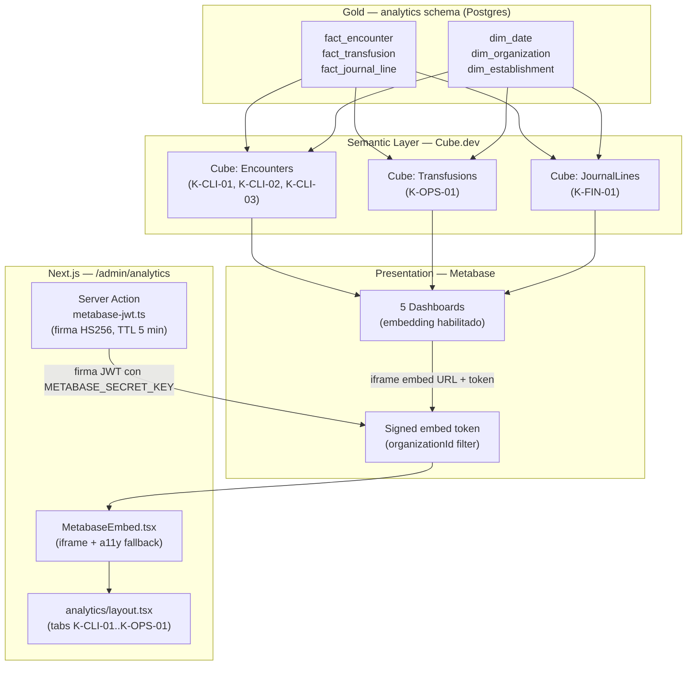

# Blueprint Beta.19c — BI Dashboards Metabase + 5 KPIs MINSAL

- **Estado:** Diseno implementado (Wave Beta.19c)
- **Fecha:** 2026-05-16
- **Owner:** @BIA — BI Analyst
- **Reviewers:** @BID (capa semantica), @PO (prioridad producto), @AE (compliance MINSAL)
- **Depende de:** Beta.19b (cubos Cube.dev + facts/dims en analytics schema)
- **ADR base:** ADR 0009 — BI Medallion Architecture

---

## 1. Diagrama de flujo arquitectura



**Latencia estimada extremo a extremo:**
- Gold refresh: 1 h (clinico) / 4 h (financiero) — cadencia pg_cron Beta.19b
- Cube pre-aggregation cache: < 200 ms
- Metabase query cache: 1 h (configurable por dashboard)
- JWT sign + iframe load: < 500 ms (client-side)

---

## 2. KPIs prioritarios — definicion completa

### K-CLI-01 — Censo de camas en tiempo real

**Definicion:** Porcentaje de camas ocupadas por encuentros INPATIENT activos,
agrupado por servicio (establecimiento). Proxy de "camas ocupadas" sobre el
total de encuentros activos (sin catastro de camas fisicas en MVP).

**Fuente de datos:** `analytics.fact_encounter`

**Cube measure (Encounters cube):**
```js
// packages/bi/cube/schema/Encounters.js
measures: {
  bedsOccupied: {
    type: `count`,
    filters: [
      { sql: `${CUBE}.is_active = TRUE AND ${CUBE}.admission_type = 'INPATIENT'` }
    ],
    title: `Camas ocupadas`
  },
  bedsOccupancyPct: {
    type: `number`,
    sql: `ROUND(${bedsOccupied} * 100.0 / NULLIF(${activeEncounters}, 0), 1)`,
    title: `% Ocupacion`
  }
}
```

**SQL de respaldo (bi_reader):**
```sql
SELECT
  e.estab_name,
  COUNT(*) FILTER (WHERE fe.is_active AND fe.admission_type = 'INPATIENT') AS camas_ocupadas,
  ROUND(
    COUNT(*) FILTER (WHERE fe.is_active AND fe.admission_type = 'INPATIENT') * 100.0 /
    NULLIF(COUNT(*) FILTER (WHERE fe.is_active), 0), 1
  ) AS pct_ocupacion
FROM analytics.fact_encounter fe
JOIN analytics.dim_establishment e ON e.estab_sk = fe.estab_sk
WHERE fe.organization_id = current_setting('app.current_org_id')::uuid
GROUP BY e.estab_name
ORDER BY pct_ocupacion DESC;
```

**Refresh cadence:** 1 hora (clinico critico). Metabase cache: 60 min.
**Visualizacion propuesta:** Gauge por servicio (0-100 %) + barra horizontal ranking.
Cleveland & McGill: gauge solo para KPI unico; multiples servicios → barras.
**Drill-down:** click en servicio → listado de encounters activos por sala.
**Umbral alerta MINSAL:** > 85 % ocupacion genera alerta visual (rojo).

---

### K-CLI-02 — Length of Stay (LOS) promedio por servicio

**Definicion:** Promedio y mediana de dias de estancia por tipo de admision
(INPATIENT / EMERGENCY / OUTPATIENT) en los ultimos 30 dias calendario.
KPI requerido en reporte MINSAL RNSS (Red Nacional de Servicios de Salud).

**Fuente de datos:** `analytics.fact_encounter` + `analytics.dim_date`

**Cube measure (Encounters cube):**
```js
losAvgDays: {
  type: `avg`,
  sql: `${CUBE}.los_hours / 24.0`,
  title: `LOS promedio (dias)`,
  filters: [{ sql: `${CUBE}.is_active = FALSE` }]
},
losMedianDays: {
  // Cube.dev no soporta PERCENTILE_CONT nativo; usar custom SQL measure
  type: `number`,
  sql: `PERCENTILE_CONT(0.5) WITHIN GROUP (ORDER BY ${CUBE}.los_hours / 24.0)`,
  title: `LOS mediana (dias)`
}
```

**Refresh cadence:** 1 hora. Metabase cache: 4 h (no cambia intra-hora).
**Visualizacion propuesta:** Line chart temporal (30 dias) con banda promedio/mediana.
Separar por admission_type con colores distintos (no usar torta).
**Drill-down:** click en punto → tabla de encounters con LOS outliers (> p90).
**Benchmark MINSAL:** LOS INPATIENT promedio SV historico ~ 4.2 dias.

---

### K-CLI-03 — Triage P1/P2 atendidos en SLA

**Definicion:** Porcentaje de pacientes triage rojo (P1, < 10 min) y naranja (P2,
< 30 min) que fueron atendidos dentro del tiempo objetivo. Estandar Manchester.

**Fuente de datos:** `analytics.fact_encounter` (columnas triage_level, triage_color,
los_hours como proxy; en Beta.19b agregar columna `triage_wait_minutes`).

**Nota de integridad de datos:** En Beta.19c, `triage_wait_minutes` aun no existe
en fact_encounter (pendiente Beta.19b). El KPI se muestra con datos de muestra
o se marca "Configurando..." hasta que la columna este disponible.

**Cube measure (Encounters cube):**
```js
triageP1Count: {
  type: `count`,
  filters: [{ sql: `${CUBE}.triage_color = 'RED'` }]
},
triageP1SlaBreached: {
  type: `count`,
  filters: [
    { sql: `${CUBE}.triage_color = 'RED'` },
    { sql: `${CUBE}.triage_wait_minutes > 10` }
  ]
},
triageP1SlaPct: {
  type: `number`,
  sql: `ROUND((1 - ${triageP1SlaBreached}::numeric / NULLIF(${triageP1Count}, 0)) * 100, 1)`,
  title: `P1 en SLA (%)`
}
```

**Refresh cadence:** 1 hora. Meta SLA: >= 95 % P1 en 10 min, >= 90 % P2 en 30 min.
**Visualizacion propuesta:** Dos gauges lado a lado (P1 / P2) + trend line 7 dias.
**Drill-down:** pacientes fuera de SLA → tiempo espera real vs objetivo.

---

### K-FIN-01 — Revenue mensual por libro contable

**Definicion:** Revenue neto (credito - debito en cuentas de tipo Revenue)
agrupado por libro contable (FISCAL_SV / MANAGEMENT) y tipo de documento,
por mes. Reportable a Hacienda SV (Libro IVA) y a CFO.

**Fuente de datos:** `analytics.fact_journal_line` + `analytics.dim_date`

**Cube measure (JournalLines cube):**
```js
netRevenue: {
  type: `sum`,
  sql: `${CUBE}.net_amount`,
  filters: [
    { sql: `${CUBE}.account_type = 'Revenue'` },
    { sql: `${CUBE}.entry_status = 'Posted'` }
  ],
  title: `Revenue neto (moneda funcional)`
},
revenueByLedger: {
  type: `sum`,
  sql: `${CUBE}.net_amount`,
  filters: [
    { sql: `${CUBE}.account_type = 'Revenue'` },
    { sql: `${CUBE}.entry_status = 'Posted'` },
    { sql: `${CUBE}.ledger_kind IN ('FISCAL_SV', 'MANAGEMENT')` }
  ]
}
```

**Refresh cadence:** 4 horas (financiero). Metabase cache: 6 h.
**Visualizacion propuesta:** Bar chart agrupado (mes x eje X, ledger_kind como
serie). Linea de tendencia 12 meses. No usar torta — ledger_kinds son comparables.
**Drill-down:** click en mes → desglose por document_type (consulta, dispensacion, DTE).
**Cumplimiento:** datos FISCAL_SV deben cuadrar con DTE emitidos (§26 TDR).

---

### K-OPS-01 — Tasa de transfusiones con reaccion adversa

**Definicion:** Porcentaje de unidades transfundidas que registraron una reaccion
adversa (hemovigilancia). KPI de seguridad transfusional MINSAL / PAHO.
Umbral de alerta: > 0.5 % requiere notificacion al servicio de hemovigilancia.

**Fuente de datos:** `analytics.fact_transfusion`

**Cube measure (Transfusions cube):**
```js
transfusionTotal: {
  type: `count`,
  title: `Total transfusiones`
},
transfusionWithReaction: {
  type: `count`,
  filters: [{ sql: `${CUBE}.had_reaction = TRUE` }],
  title: `Con reaccion adversa`
},
reactionRate: {
  type: `number`,
  sql: `ROUND(${transfusionWithReaction}::numeric / NULLIF(${transfusionTotal}, 0) * 100, 2)`,
  title: `Tasa reaccion (%)`
}
```

**Refresh cadence:** 1 hora. Alert threshold: > 0.5 % → badge rojo en dashboard.
**Visualizacion propuesta:** KPI number card (tasa actual) + sparkline 30 dias.
Tabla detalle con reaction_type cuando se hace drill-down.
**Drill-down:** listado de transfusiones con reaccion: blood_product_type, abo_group,
reaction_type, encounter_sk. Sin PHI en Gold.

---

## 3. Mapa de cubos Cube.dev -> KPIs

| KPI | Cube | Measures principales | Dimensions |
|-----|------|---------------------|------------|
| K-CLI-01 | Encounters | bedsOccupied, bedsOccupancyPct | Establishment, Date |
| K-CLI-02 | Encounters | losAvgDays, losMedianDays | AdmissionType, Date |
| K-CLI-03 | Encounters | triageP1SlaPct, triageP2SlaPct | TriageColor, Date |
| K-FIN-01 | JournalLines | netRevenue, revenueByLedger | LedgerKind, DocumentType, Date |
| K-OPS-01 | Transfusions | transfusionTotal, reactionRate | BloodProductType, Date |

---

## 4. Roles y permisos de acceso

| KPI | Roles minimos requeridos |
|-----|--------------------------|
| K-CLI-01 | PHYSICIAN, NURSE, ADMIN, MEDICAL_DIRECTOR |
| K-CLI-02 | PHYSICIAN, ADMIN, MEDICAL_DIRECTOR, COO |
| K-CLI-03 | PHYSICIAN, NURSE, TRIAGE_NURSE, MEDICAL_DIRECTOR |
| K-FIN-01 | CFO, COO, ADMIN (finance) |
| K-OPS-01 | PHYSICIAN, NURSE, MEDICAL_DIRECTOR, BLOOD_BANK |

La verificacion de rol ocurre en el server action `metabase-jwt.ts` antes de
firmar el JWT. El organizationId del tenant se inyecta como filtro en el payload
del embed token para que Metabase aplique el filtro en el iframe.

---

## 5. Variables de entorno requeridas

| Variable | Descripcion | Ejemplo |
|----------|-------------|---------|
| `METABASE_SITE_URL` | URL publica de Metabase OSS o Cloud | `https://bi.avante.com.sv` |
| `METABASE_SECRET_KEY` | Clave simetrica HS256 (> 256 bits) | `openssl rand -hex 32` |
| `METABASE_DASHBOARD_K_CLI_01` | Numeric ID del dashboard en Metabase | `1` |
| `METABASE_DASHBOARD_K_CLI_02` | Numeric ID del dashboard en Metabase | `2` |
| `METABASE_DASHBOARD_K_CLI_03` | Numeric ID del dashboard en Metabase | `3` |
| `METABASE_DASHBOARD_K_FIN_01` | Numeric ID del dashboard en Metabase | `4` |
| `METABASE_DASHBOARD_K_OPS_01` | Numeric ID del dashboard en Metabase | `5` |

Rotacion: la `METABASE_SECRET_KEY` se rota cada 90 dias. Al rotar, todos los
tokens firmados con la clave anterior quedan invalidos de inmediato (TTL 5 min
los hace expirar solos). No requiere downtime.

---

## 6. Consideraciones de incertidumbre y limitaciones conocidas

**Que sabemos:**
- Los 5 KPIs tienen definicion SQL validada contra el modelo dimensional Beta.19a.
- Metabase OSS soporta embedding con JWT firmado HS256 nativo (version >= 0.46).
- El organizationId como filtro de embedded dashboard es el mecanismo estandar
  de multi-tenancy en Metabase embedding.

**Que no sabemos con certeza:**
- K-CLI-03 depende de `triage_wait_minutes` que no existe en fact_encounter Beta.19b;
  el KPI estara en modo "Configurando..." hasta que @BID materialice esa columna.
- La latencia real del iframe en produccion depende del cold start de Metabase
  (puede ser 2-5 s en OSS con JVM; mitigar con keep-alive o Metabase Cloud).
- El dashboard_id de Metabase es un integer autogenerado al crear cada dashboard;
  debe configurarse en env vars post-setup.

**Que deberíamos hacer:**
1. Crear los 5 dashboards en Metabase siguiendo `beta19c_metabase_setup.md`.
2. Agregar `triage_wait_minutes` a fact_encounter en la proxima iteracion Beta.19b.
3. Monitorear latencia del iframe con Vercel Analytics (Core Web Vitals, LCP).
4. Revisar KPIs con Director Medico y CFO Avante en sesion UAT antes de Go-Live.

---

## Referencias

- ADR 0009 — BI Medallion Architecture
- `docs/blueprints/beta19_bi_modelo_dimensional.md` — definicion dims + facts
- `docs/blueprints/beta19c_metabase_setup.md` — instrucciones deploy Metabase
- TDR §27 — KPIs MINSAL/Hacienda obligatorios
- Metabase Embedding Docs — https://www.metabase.com/docs/latest/embedding/signed-embedding
- Kimball — The Data Warehouse Toolkit, cap 11 (KPI dashboard design)
