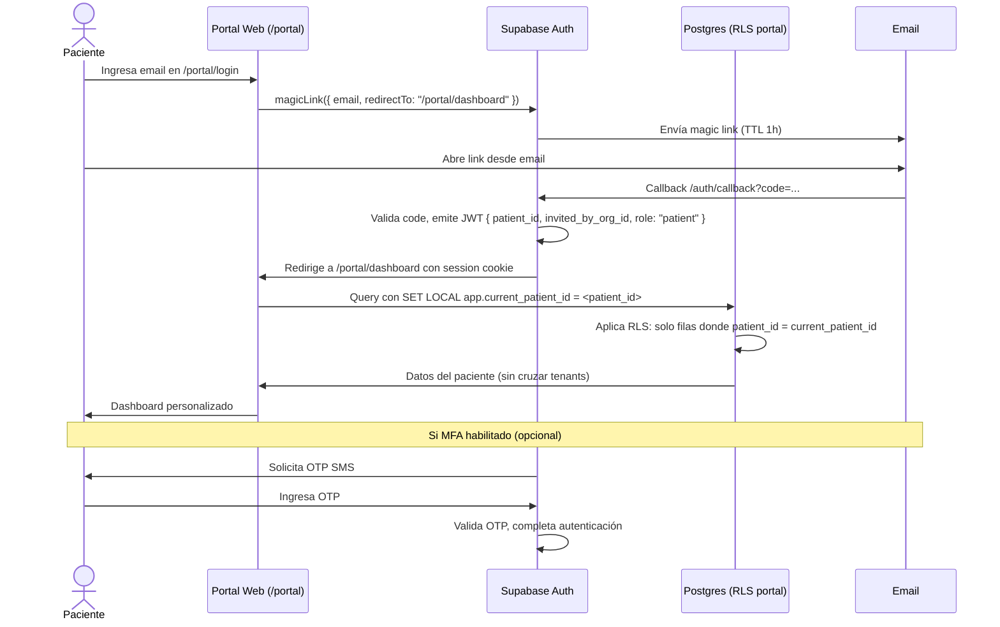

# Blueprint Beta.20 — Portal del Paciente (Fase 7 TDR §28)

**Owner:** @PO — Chief Product Officer, Inversiones Avante
**Stream:** Beta.20 Portal del Paciente
**Fecha:** 2026-05-16
**Estado:** Borrador v0.1 — pendiente aprobación @AE + Edwin Martinez
**Referencia regulatoria:** TDR §28 (Integraciones e Interoperabilidad), §6.3 (Auditoría), §6.4 (Protección de Datos), §14 (HCE), LEPINA, Ley de Protección de Datos Personales SV (D.39/2024)

---

## 1. Resumen Ejecutivo

### ¿Qué es?

El Portal del Paciente es la interfaz de autoservicio digital que permite al paciente (o su tutor legal autorizado) acceder a su propia información clínica almacenada en el HIS Avante: citas programadas, resultados de laboratorio, historia clínica resumida, esquema de vacunación, recetas activas, imágenes de diagnóstico disponibles para descarga, y la gestión de sus consentimientos de privacidad. Técnicamente es un módulo separado del HIS interno, accesible en rutas `/portal/*`, con un flujo de autenticación propio (passwordless email + MFA opcional) y una capa RLS adicional donde el `patient_id` se deriva del JWT emitido por Supabase Auth — nunca del cookie de organización interna.

### ¿Por qué ahora?

El TDR §6.3 establece que el paciente o su representante puede solicitar el log de quién accedió a su expediente. El TDR §6.4 vincula el acceso entre organizaciones del grupo al consentimiento explícito del paciente. El §14.5 requiere el registro y disposición del esquema de vacunación (PAI El Salvador). El §17 dispone que los resultados de laboratorio lleguen al portal cuando esté habilitado. El §18.5 requiere compartición de imágenes de diagnóstico con el paciente vía portal, con marca de agua y consentimiento. El incumplimiento bloquea el cierre formal G8: sin portal, el HIS no puede declararse "entregado" según el TDR.

### Riesgo de no hacerlo

Sin Portal del Paciente, Inversiones Avante no cumple con las disposiciones del TDR §6.4 (consentimiento entre organizaciones), expone al grupo al riesgo regulatorio frente a la Ley de Protección de Datos Personales SV (D.39/2024) por no proveer al titular acceso a sus propios datos, impide el cierre formal G8 del proyecto, y pierde la oportunidad de diferenciación competitiva: los pacientes que acceden activamente a su historial reportan mayor adherencia al tratamiento, menor no-show y mayor NPS hacia el prestador.

---

## 2. Stakeholders

| Stakeholder | Interés principal | Influencia | Riesgo si no se involucra |
|---|---|---|---|
| **Paciente adulto** | Acceder a su información, cancelar citas, ver resultados sin ir al hospital | ALTA (usuario final) | Baja adopción, tickets de soporte altos |
| **Tutor legal / representante** | Gestionar expediente de menor o incapaz (LEPINA) | ALTA | Reclamos legales, incumplimiento LEPINA |
| **Médico tratante** | Que el paciente llegue mejor informado; que los consentimientos otorgados en portal sean válidos y auditables | MEDIA | Desconfianza en el canal; consentimientos duplicados en papel |
| **MINSAL El Salvador** | Que el portal respete la normativa de acceso a HCE y el PAI; que los datos de menores tengan protección reforzada | ALTA (regulador) | Multa, suspensión de habilitación del establecimiento |
| **Inversiones Avante (negocio)** | Diferenciación competitiva, reducción de costos de call-center, G8 cerrado | ALTA | No cierre del proyecto, riesgo reputacional |
| **Equipo de Soporte TI** | Portal estable con alertas claras; runbook para incidentes de acceso | MEDIA | Soporte manual excesivo, SLOs en riesgo |

---

## 3. Casos de Uso Priorizados (Top 8)

Priorización WSJF (valor de negocio / urgencia regulatoria / riesgo operacional vs. tamaño técnico):

| # | Caso de uso | WSJF | Regulatorio | Épica |
|---|---|---|---|---|
| 1 | **Ver y cancelar citas** (TDR §10 — agendamiento) | 9 | Referido en TDR §10 como función del portal | E2 |
| 2 | **Ver resultados de laboratorio** (TDR §17.6) | 9 | Explícito: "resultados al portal del paciente" | E2 |
| 3 | **Otorgar/revocar consentimientos de privacidad** (TDR §6.4, D.39/2024) | 8 | Obligatorio para compartición entre orgs | E3 |
| 4 | **Ver historia clínica resumen** (TDR §14) | 8 | Implícito en acceso a HCE (§6.3) | E2 |
| 5 | **Login passwordless + MFA** (seguridad base) | 8 | D.39/2024 Art. 5 — datos sensibles requieren autenticación reforzada | E1 |
| 6 | **Ver esquema de vacunación (PAI)** (TDR §14.5) | 7 | Explícito en TDR §14.5 | E2 |
| 7 | **Descargar reportes / imágenes** (TDR §18.5) | 7 | "Compartición con paciente vía portal con consentimiento" | E2 |
| 8 | **Inbox del paciente / comunicaciones del establecimiento** | 6 | Implícito en TDR §28 (mensajería) | E4 |

---

## 4. Restricciones Regulatorias

### 4.1 Ley de Protección de Datos Personales SV (D.39/2024)

- Art. 5.k: los datos de salud son categoría especial (datos sensibles). Requieren medidas de seguridad reforzadas: cifrado (ya aplicado en capas 1+2+3 — ver `docs/14_encryption_strategy.md`), control de acceso estricto, auditoría de cada acceso.
- Art. 13: el titular tiene derecho a acceder a sus propios datos en formato legible. El portal es el mecanismo de cumplimiento.
- Art. 14: derecho de rectificación — el paciente puede señalar errores, pero NO puede editarlos directamente (requiere intermediación clínica). El portal debe proveer un flujo de solicitud de corrección, no edición directa.
- Art. 15: derecho de supresión — aplica solo para datos no necesarios para la atención clínica. El portal provee el formulario; el DPO decide.

### 4.2 LEPINA (Ley de Protección Integral de la Niñez y Adolescencia)

- Art. 22: el expediente de un menor de 18 años requiere autorización de padre, madre o tutor legal para que terceros accedan.
- En el portal: un menor NO puede autoregistrarse. El tutor legal (verificado por DUI + relación familiar) actúa como representante.
- Menores de 14 años: el tutor gestiona todo. Entre 14 y 17 años: el menor puede ver su expediente (excepto datos ginecológicos/salud sexual si el médico los protege) y el tutor también tiene acceso.

### 4.3 MINSAL — Acceso a HCE

- La normativa MINSAL no prohíbe el acceso del paciente a su HCE; de hecho, la Ley General de Salud lo reconoce como derecho.
- El portal debe mostrar ÚNICAMENTE los registros del establecimiento que presta el acceso (el tenant del JWT). Acceso multi-org requiere consentimiento explícito (TDR §6.4).
- Los datos de ITS, salud mental, VIH y violencia intrafamiliar tienen protección reforzada: requieren configuración explícita del médico para habilitarlos en el portal (default: ocultos).

### 4.4 Cifrado y seguridad de datos en el portal

Referencia: `docs/14_encryption_strategy.md`.

- Las columnas cifradas (`PatientIdentifier.value`, `PatientPhone.value`, `PatientEmail.value`, `PatientAllergy.notes`, `Encounter.notes`) son transparentemente descifradas para el backend mediante pgsodium TCE.
- El portal NO debe enviar estos datos al cliente más allá de lo necesario para la vista. No se cachean en localStorage ni en cookies del cliente.
- Los archivos descargables (PDFs de resultados, imágenes de diagnóstico) deben tener marca de agua con el DUI/nombre del paciente y la fecha de descarga.

---

## 5. Arquitectura Propuesta (Alto Nivel)

### 5.1 Separación de rutas

```
apps/web/src/app/
  (admin)/          # HIS interno — requiere cookie his.org + his.estab
  (auth)/           # Login del personal
  (clinical)/       # Módulos clínicos internos
  (portal)/         # NUEVO — Portal del paciente
    layout.tsx      # Layout independiente del admin HIS
    page.tsx        # Landing portal (login o dashboard)
    login/
    dashboard/
    citas/
    resultados/
    historia/
    vacunacion/
    recetas/
    documentos/
    consentimientos/
    comunicaciones/
    perfil/
```

### 5.2 Autenticación separada

El personal interno usa Supabase Auth con email+password + MFA TOTP. El paciente usa:

- **Passwordless email** (magic link de Supabase Auth) — sin contraseña que el paciente deba recordar.
- **MFA opcional** — SMS OTP para pacientes que así lo configuren (requiere decisión §6 sobre costo de SMS).
- El JWT del paciente incluye claim `patient_id` (no `organization_id` + `establishment_id`). La RLS del portal usa `auth.jwt() ->> 'patient_id'` como predicado base.
- No existe cookie `his.org` en el portal. El tenant se resuelve por el establecimiento que invitó al paciente (campo `invited_by_org_id` en `PortalAccount`).

### 5.3 RLS del portal — capa adicional

Los routers tRPC del portal NO usan `withTenantContext` estándar (que usa el cookie de org). Usan `withPatientContext`:

```ts
// Concepto — implementación real es decisión de @AS
const withPatientContext = (prisma, patientJwt, callback) => {
  // SET LOCAL app.current_patient_id = <patient_id from JWT>
  // SET LOCAL ROLE authenticated
  // Política RLS: patient puede leer sus propios datos
}
```

La política RLS en cada tabla relevante agrega:

```sql
-- Solo el propio paciente (vía portal) puede leer su fila
USING (patient_id = current_setting('app.current_patient_id')::uuid)
```

Esta capa es adicional y no reemplaza la RLS multi-tenant existente para el HIS interno.

---

## 6. Diagrama de Flujo de Autenticación del Portal



---

## 7. Dependencias Upstream

| Dependencia | Estado | Propietario | Riesgo |
|---|---|---|---|
| **MFA / Supabase Auth** | Existente (Beta.15 completado) | @AS/@SRE | Bajo — solo extender para flujo paciente |
| **PatientConsent** (tabla y router) | Existente (schema.prisma) | @DBA | Medio — necesita UI de portal |
| **LabResult / LabOrder** | Existente (routers LIS — Beta.3) | @Dev | Bajo — endpoint read-only para paciente |
| **Appointment / Agenda** | Existente (schema.prisma §10) | @Dev | Medio — falta endpoint cancelación por paciente |
| **VaccinationRecord** | Existente en HCE (§14.5) | @Dev | Medio — necesita endpoint read-only |
| **Prescription / MedicationOrder** | Existente (routers farmacia Beta.2) | @Dev | Bajo — read-only para paciente |
| **ImagingStudy** | Existente (routers RIS Beta.9) | @Dev | Alto — acceso a DICOM/PDF requiere signed URL con TTL |
| **Notification (inbox Beta.15)** | Completado Beta.15 | @Dev | Bajo — reusar el motor, configurar canal PATIENT |
| **Verificación de identidad documental** | NO EXISTE | @AT | Alto — bloquea onboarding; requiere decisión §8 trade-off |
| **`PortalAccount` (tabla nueva)** | NO EXISTE | @DBA | Alto — tabla que vincula email paciente → patient_id |

---

## 8. Fuera de Alcance Beta.20

- Telemedicina con video (TDR §3.4 lo excluye explícitamente).
- Aplicación móvil nativa (iOS/Android).
- Acceso FHIR directamente desde el portal (es para integraciones B2B).
- Edición directa de datos clínicos por el paciente.
- Portal en nawat (diferido — TDR §28 como opcional).
- Integración con wearables del paciente (diferido a Beta.21+).

---

**Fin del blueprint Beta.20.**
